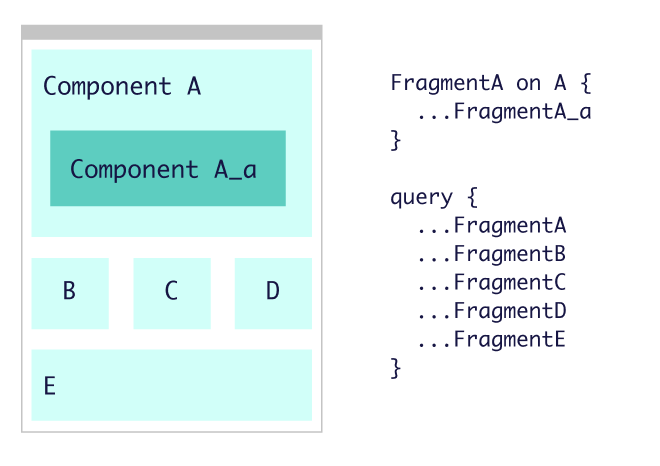

# Render as you fetch incremental GraphQL fragments

これは [GraphQL Advent Calendar 2020](https://qiita.com/advent-calendar/2020/graphql) の 24 日目の記事です。

## はじめに

前回の defer/stream の記事は途中で力尽きてしまったため、クライアント側の処理についてはあまり多くを書けなかったので、この投稿で続きを書いていこうと思う。
アドカレの担当を途中で 2 つに増やしたから記事を分けようとかそういうセコいあれではないよ！

クライアント側の処理、それも React 限定の話だ。 `@defer` / `@stream` の「サーバーからちょっとずつデータが届けられる」という特性と、React の Suspense for data fetch の関係を考えてみたい。

なお、 `@defer` や `@stream` と毎回ディレクティブ名で言及するのが面倒なので、こちらについては Incremental delivery と呼ぶことにする。

## Collocation

Incremental delivery や Suspense for data fetch の話をする前に、くどいようだけど GraphQL のコロケーションについて触れておきたい。

僕は GraphQL の コロケーションという考え方が本当に好きで「GraphQL でクライアントサイドのアプリケーションを書くのであれば絶対に採用すべき」と考えている。コロケーションが何なのか、という話は他のところでも何度か書いているんだけど、今回はこの投稿の主要なテーマであるのであらためて触れておく。

GraphQL が RESTish な API と本質的に異なっているのは、GraphQL は Demand driven なデータの取得方法であるという点だ。Demand driven、すなわち「データを必要とする側がレスポンスの型を宣言する」ということだ。この点だけをいみると、むしろ SQL に近い。 SQL と違うのは `SELECT * FROM HOGE` のような、「全部まるっとよこせ」というやり方が構文のレベルで許容されていない点。

よく「GraphQL はクライアントが自由にレスポンスの形式を指定できて便利」と言われる。確かにそのとおりだと思うが、世の中に責任の伴わない自由など存在しない。
ここでいう責任とは「クエリを必要十分に保つこと」だ。必要なフィールドを書き忘れたら、それは機能障害だ。不必要なフィールドを書いたら over-fetching となり、サーバーリソースや帯域の無駄遣いになる。
GraphQL を採用する言うことは、フロントエンドがこれらに対する責任を負うということだ。

では GraphQL のクエリが、その画面にとって必要十分であり続けるためにはどうすればいいだろう。画面が複数のコンポーネントの階層から構成される場合、どのフィールドが必要になるかを知っているのは、ページのルートではなく、末端である個々のコンポーネントだ。それぞれのコンポーネントがクエリの断片として必要になるフィールドを管理しておき、それらを子から親に集約させながらルートとなるコンポーネントで一つのクエリを組み立てるようにすればいい。これが GraphQL におけるコロケーションの基本的な考え方だ。



`FragmentA` がどのようなセレクションを行うかは、A というコンポーネントが責任を持つべき事柄であるし、A のコンポーネントにさらに A-a がネストされている場合、A-a に必要なフィールドは `FragmentA-a` に管理を任せればよい。

## Collocation と Incremental delivery

さて、ここまでは良いだろうか。これを読んでいる貴方が GraphQL と React を使ってアプリケーションを作っているけどコロケーションはしていない、ということであれば、こんな記事を読んでいる場合ではないので、今すぐにこの画面を閉じて Fragment を切り出す作業に取り掛かって欲しい。ここから先の話はその作業が完了してから読めばいい（別に読まなくたっていい）。

ここからが本題だ。

コロケーション、すなわち GraphQL の Fragment の仕組みは「アプリケーションの保守性」のためのものだ。一方で GraphQL とコロケーションが犠牲にしていたものの一つがユーザビリティで、コロケーションによってクエリを単一にまとめ上げたはいいが、結果として「単一のクエリが到着するまで画面がまったく描画されない」という状況を生み出してしまう。
そこで `@defer` や `@stream` という仕組みを使って、「ちょっとずつクエリの結果をクライアントに送信し、クライアントはちょっとずつ画面を描画する」という解決を図ろうとしているわけだ。

[前回の投稿](https://quramy.medium.com/incremental-data-delivery-with-graphql-defer-and-stream-d779b5e38833) のおさらいも兼ねるが、 `@defer` はフラグメントに付与することで、そのフラグメントのレスポンスの取得を後回しにするものだ。 `@stream` はリストの要素に付与する。

`@defer` を使ったクエリの例は下記のようになる。

```graphql
fragment ProductPriceFragment on Product {
  specialPrice # 計算がちょっと重たいので defer したい
}

query ProductDetailQuery {
  product(id: 100) {
    id
    name
    ...ProductPriceFragment @defer
  }
}
```

`@defer` は `@skip` などとは違い、フィールドには直接付与できないため、ここでは `ProductPriceFragment` というフラグメントを用意している。

ここで丁度フラグメントが出てきたので、コロケーションと組み合わせて実装してみたとしよう。

Apollo Client を使っているのであれば下記のような感じになるだろうか。ちなみに Apollo Client は `@defer` が実装されているわけではないため、下のコードを書いても動かないので、飽くまでイメージだ。

```js
export ProductPriceFragment = gql`
  fragment ProductPriceFragment on Product {
    specialPrice
  }
`;

const ProductPrice = ({ product }) => (
  <div>Special Price: {product.specialPrice}</div>
);

export default ProductPrice;
```

上記の `ProductPrice` というコンポーネントがフラグメントを export しており、それをクエリを使う側のコンポーネントで利用する。

```js
import ProductPrice, { ProductPriceFragment } from "./ProductPrice";

const query = gql`
  ${ProductPriceFragment}

  query ProductDetailQuery {
    product(id: 100) {
      id
      name
      ...ProductPriceFragment @defer
    }
  }
`;

const ProductDetail = () => {
  const { data, isLoading } = useQuery(query);
  if (isLoading) return <div>loading...</div>;
  return (
    <div>
      <span>{data.product.name}</span>
      <ProductPrice product={data.product} />
    </div>
  );
};
```

### `@defer` をつければいいというものではない

サーバーが `@defer` に対応していれば、 `ProductDetailQuery` というクエリに対して、次のように分割された応答が返却されるはずだ。

```js
// レスポンス1
{
  "data": {
    "product": {
      "id": 100,
      "name": "とても良い商品"
    }
  },
  "hasNext": true
}

// レスポンス2
{
  "path": ["product"],
  "data": {
    "specialPrice": 1000
  },
  "hasNext": false
}
```

このあたりで、上記の React コンポーネントのコードに疑問が湧いてくる。`const { data, isLoading } = useQuery(query);` の部分だ。

- 問題その 1: `レスポンス1` だけが到着した時点では `isLoading` は true なのか false なのか
- 問題その 2: `レスポンス2` が完了したときの `data` の値はどうなっているべきか。 `ProductDetailQuery` の完全な結果となる JSON になるのか？

問題その 1 について、Incremental delivery を実現しようとしているわけだから、`useQuery` のローディング状態は「完了したかどうか」だけでは足りない。「今どのフラグメントが到着していて、どのフラグメントを待っているのか」という情報が必要になるはずだ。

上記の例では、 defer された Fragment の値、すなわち `specialPrice` の存在を見ることで、この Fragment が取得中かどうかを判断できそうだが、「値の有無」と「値を取得している最中かどうか」は本質的に別のものごとであり、これを混ぜて扱うのは悪手だ。

GraphQL クライアント側で、 クエリの結果データの中に「Fragment が取得中かどうか」を示すメタデータを突っ込んでもらうような対応が必要になるだろう。下記の `__loading` というフィールドのようなイメージだ。

```js
// レスポンス1に対応するdata
"product": {
  "id": 100,
  "name": "とても良い商品",
  __loading: true
}

// レスポンス2に対応するdata
"product": {
  "id": 100,
  "name": "とても良い商品",
  "specialPrice": 1000,
  __loading: false
}
```

上記のレスポンス例に書いたように、`useQuery` の結果データ全体がレスポンス到着の都度に書き換わっていくとすると、これは「問題その 2」の答えになっているわけだけど、レスポンスが到着する度に `ProductDetail` 配下全体の再レンダリングが発生する。上記のクエリの例はとてもシンプルなのでさして問題にならないだろうが、 `useQuery` をしているコンポーネントは画面のトップレベルのコンポーネントになるし、クライアント側の使い勝手を向上させる目的で Incremental delivery を導入しているのに、その結果としてパフォーマンスを劣化させてしまったら本末転倒だ。

細かく書いてきたが、 **`@defer` はクエリにディレクティブを付与するだけで済む話ではない** ということが伝わっただろうか。

## Render as you fetch

一旦立ち止まって状況を整理してみよう。

- コロケーション: React コンポーネントと GraphQL Fragment を一緒に配置することで、画面のパーツとその描画に必要なデータを宣言的に管理する
- `@defer`: クエリが完全に到着するのを待ちたくないので、データを断片に分割してちょっとずつサーバーから送信する

ここまではよかった。問題は「クライアントでちょっとずつ画面を描画する」ということを React でやろうと思ったら一筋縄ではいかなくなってきた、という点にある。

先程の例では、末端のコンポーネントで必要となる「Fragment のデータが到着したかどうが」という非同期処理の状態を、`useQuery` している階層で管理しようとして、結果複雑怪奇なことになってしまっていた。

フラグメントは末端のコンポーネントに対応するのだから、その非同期の状態についても、末端のコンポーネントで完結してくれれば、もっとシンプルになるはずだ。

これはまさに [React の Suspense for data fetch のドキュメント](https://ja.reactjs.org/docs/concurrent-mode-suspense.html) で言われている render-as-you-fetch というパターンだ。

というよりも、GraphQL の `@defer` は Suspense によるデータ取得の仕組みを学ぶのに格好の材料だと思う。

先程のコロケーションされた React コンポーネントの例を書き換えてみる。

```js
export ProductPriceFragment = gql`
  fragment ProductPriceFragment on Product {
    specialPrice
  }
`;

const ProductPrice = ({ fragmentKey }) => {
  // このコンポーネントは自分自身が defer されているかどうかを意識することはない。
  // フラグメントが到着していなければ useFrgament は Promise を throw するかもしれないが、
  // そのハンドリングは、このコンポーネントを使う側が意識すればよい
  const { product } = useFragment(ProductPriceFragment, fragmentKey);
  return (
    <div>Special Price: {product.specialPrice}</div>
  );
}

export default ProductPrice;
```

```js
import ProductPrice, { ProductPriceFragment } from "./ProductPrice";

const query = gql`
  ${ProductPriceFragment}

  query ProductDetailQuery {
    product(id: 100) {
      id
      name
      ...ProductPriceFragment @defer
    }
  }
`;

const ProductDetail = () => {
  // クエリ全体のローディングも自分自身では気にしないようにする
  const { data, queryId } = useQuery(query);
  return (
    <div>
      <span>{data.product.name}</span>

      {/* deferされた部分の非同期制御は、ここのSuspenseが管理する */}
      <Suspense fallback={<Loading />}>
        <ProductPrice fragmentKey={[queryId, "product"]} />
      </Suspense>
    </div>
  );
};

const Page = () => {
  return (
    <Suspense fallback={<Loading />}>
      <ProductDetail />
    </Suspense>
  );
};
```

「Fragment のデータが到着しているかどうか」と「Fragment が到着した場合の再描画範囲」という問題を下記のように解決できる。

- そのデータを必要とするコンポーネントが Promise を throw する
- 利用する側（Fragment に`@defer` を指示した側）が非同期の境界を `<Suspense>` を使うことで宣言する

こうすることで、`レスポンス1` が返ってきていて `レスポンス2` が未到着の状態では `<ProductPrice>` の描画が保留され、程よい範囲に `<Loading>` を表示できる。 `レスポンス2` 到着時の描画範囲も必要十分だ。

### Fragment の要求方法と Apollo と Relay

ところで、上記の書き換え例ではフラグメントに対応するコンポーネントから非同期処理を throw できるように `useFragment` という カスタムフックを登場させた。

- データがないとき: Promise を throw される（描画は中断される）
- データがあるとき: 自分のフラグメントに対応するデータが return される

後者は Redux における `useSelector` のようなイメージだ。GraphQL クライアントライブラリにデータのキーを渡したら、ストアからデータ本体が返ってくるという意味は似たようなものだ。キーを構成するために以下あたりが使えるだろう。

- GraphQL クライアントが発行したオペレーションの一意識別子
- クエリレスポンスから Fragment のデータにあくせすするための情報。たとえば defer されたペイロードの `path` 値や `label` 値

Apollo Client には `useQuery` はあっても `useFragment` というフックは現状存在しないが、強いていうのであれば Apollo Client の `readFragment` が一番イメージに近い。

Relay Experimental（いつまでこの呼び方が通用するかは不明。すくなくとも 2020 年末時点では experimental）にはまさに `useFragment` という名前のフックが存在している。Relay Experimental は Concurrent mode とセットで使う前提で作られており、Relay の `useFragment` には「Fragment のデータが未取得の場合に Promise を throw する」という挙動も備わっている。

https://relay.dev/docs/en/experimental/api-reference#usefragment

今回のメインは Suspense の話だし、最初から Relay ベースに話を進めてもよかったのだけど、以下の理由諸々を考えた結果、Apollo Client 風のコードでの説明としてみた。

- GraphQL + React の文脈では、Relay よりも Apollo Client の方がユーザーが多い（npm の DL 数ベースだと 10 倍近く差がある）。僕自身、Production での経験は Apollo Client しかない。
- 既存の非同期の扱いと GraphQL の Incremental delivery のギャップについて書く上で、Apollo の方が都合が良かった
- Relay Compiler が上記でいうところの `fragmentKey` の部分を隠蔽化してしまっていて、ソースコードを提示しただけだとやっぱり何が起こっているかわかりにくい

一応断っておくと、Relay のドキュメントにも `@defer` や `@stream` のことはまだ何も書いてないので、これらのディレクティブと `useFragment` の組み合わせについては、僕が当て推量で書いているだけだ。とはいえ `useFragment` 自体の説明に以下のようにあるし、まぁ間違ってないと思うけど。

> The component will suspend if any data for that specific fragment is missing, and the data is currently being fetched by a parent query.

今回、`@defer` というディレクティブに端を発して調べているうちに、結局 Concurrent mode や Relay の実装に行き着いたのだが、調べれば調べるほど上手く噛み合っている仕組みだな、と感じる。うがった言い方をすると「結局全部 Facebook じゃん」ともいう。

Suspense for data fetch についても、[React のドキュメント](https://ja.reactjs.org/docs/concurrent-mode-suspense.html#what-is-suspense-exactly)で以下のように書かれているし、 Relay と密接に連携していることがわかる。

> Facebook では、Relay と新しい Suspense 連携機能を利用しています。Apollo のような他のライブラリも似たような連携機能が提供できることを期待しています。

皮肉なのか本心なのかはさておき、「期待されている」Apollo の方はまだ不透明さが拭えない。 [Suspense 対応の issue](https://github.com/apollographql/apollo-feature-requests/issues/162) はあるものの、この中では `@defer` などのディレクティブへの言及がなく、 [ロードマップ](https://github.com/apollographql/apollo-client/blob/main/ROADMAP.md#35) に `@defer` と `@stream` 対応に記載があるものの、ロードマップからはいつ Concurrent mode への対応がおこなわれるかは見て取れない。

Suspense への対応具合をもってして「Apollo を捨てて Relay 使おうぜ！」という結論にしたいわけではない。コロケーションとの親和性は今でいう Relay Classic のころから Relay の方が先を行っていて、とてもよくできた仕組みだと思うけど、現実としては Apollo の方が使われているし、単純に GraphQL のクライアントという意味では Apollo の方が使いやすかった（最近、React 前提になってちょっと微妙とは思うものの）。

今回、`@defer` やらを追いかけて、Relay の仕組みや「Relay なしで GraphQL を React に処理させたらどうすればいいのか」を考えることで、React の非同期処理に対する理解が進んだと感じている。

`@defer` / `@stream` はデータ取得にまつわるウォーターフォールの負を解消するための仕組みで、これによって従来はサーバーサイドのリゾルバに隠蔽されていたウォーターフォールを、クライアントからより細かい解像度で見ることができるようになった。React でこれを取り扱うには Concurrent mode と render-as-you-fetch がうってつけなわけだ。

先日発表されて一部界隈を賑わせている React Server Components も、「ウォーターフォールがどこにいるのか」という視線で見ると面白い。僕自身、まだ React Server Components を全然把握できてないんだけど、[Dan Abramov の動画](https://youtu.be/TQQPAU21ZUw?t=630)を見ると、クライアントからサーバーにウォーターフォールを持っていくことで、fetch-on-render で発生していた負を解消する話になっていた。動画では Relay や GraphQL については詳細に触れてはいなかったが、Relay も Server Components を「データフェッチに対するウォータフォールの負をどのように解消するか」という話なので、対比して考えてみるのもよいかもしれない。

Server Components の話を出してしまったついでに、いま気になっていることをちょっとだけ書いておくと、Dan Abramov の動画では「GraphQL / Relay ではない別のソリューション」的なニュアンスで Server Components が紹介されていたようにみえるけど、react-server-dom-relay っていうパッケージが生まれてたりもするので、併用するパターンもありそう。使い方は全然わからないけど、relay-example あたりにそのうち demo が公開されるんじゃいないかしら。

## おわりに

`@defer` や `@stream` というディレクティブと Incremental delivery について、クライアントサイドから見た諸々を書いてきた。前回と同様、ダラダラと色々書いてしまったけど、内容をまとめておくと下記のとおり。

- `@defer` や `@stream` をコロケーションと組み合わせるためには、各コンポーネント側で「データを待つ」という要求ができる仕組みと合わせて検討した方がよい
- React の場合は Suspense for data fetch が最適
- Suspense 対応の進み具合は Relay が Apollo Client よりも先行している
- React の非同期処理を考えるには Relay や GraphQL の Incremental delivery はとてもよい題材
