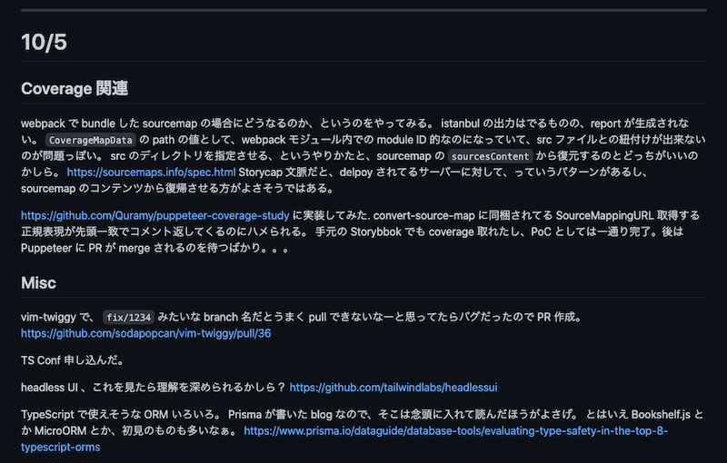

# 2020 年の振り返り

## 1-3 月

2019 年末から引き続き、1 月中はまだ無職状態（正確には稼働少なめでフリーランス）だったので、空いた時間で ts-graphql-plugin をガリガリ書いていた。新しい職場に join したのは 2 月からで、こっちでも GraphQL の使うことが見えてたってのもある。

ts-graphql-plugin については下記参照のこと。

https://quramy.medium.com/typescript-%E3%81%A7-graphql-client-%E3%82%92%E4%BE%BF%E5%88%A9%E3%81%AB%E9%96%8B%E7%99%BA%E3%81%99%E3%82%8B%E3%81%9F%E3%82%81%E3%81%AE%E3%83%84%E3%83%BC%E3%83%AB%E3%82%92%E4%BD%9C%E3%81%A3%E3%81%A6%E3%81%84%E3%82%8B%E8%A9%B1-b66dd2fc1579

TS Conf JP のセッションでも、この OSS をネタに話す予定で資料などを書いていた。

ただ、開催直前に新型コロナの影響で TS Conf JP が中止になってしまったため、資料は完全にお蔵入り状態になってしまった。供養の意味もこめて資料のリンクだけ貼っておく。

https://speakerdeck.com/quramy/extends-developer-experience

3 月中旬ころからフルリモート勤務に移行。

## 4-6 月

コロナでの古リモートで通勤時間が消滅したこともあって、割合読書に時間割いてて、前々から読もうと思っていた「ローマ人の物語」を全巻読破したり、など。

技術的な本でいうと、「プログラミング言語の基礎概念」を読み直して、演習問題を全問解いたりしていた。動機は「型推論ってどういうことだ？」というのを基礎的な部分から知りたかったため。この本の問題解いてると、自分がインタープリターになった気持ちになってくるので楽しい。

https://www.amazon.co.jp/%E3%83%97%E3%83%AD%E3%82%B0%E3%83%A9%E3%83%9F%E3%83%B3%E3%82%B0%E8%A8%80%E8%AA%9E%E3%81%AE%E5%9F%BA%E7%A4%8E%E6%A6%82%E5%BF%B5-%E3%83%A9%E3%82%A4%E3%83%96%E3%83%A9%E3%83%AA%E6%83%85%E5%A0%B1%E5%AD%A6%E3%82%B3%E3%82%A2%E3%83%BB%E3%83%86%E3%82%AD%E3%82%B9%E3%83%88-%E4%BA%94%E5%8D%81%E5%B5%90-%E6%B7%B3/dp/4781912850

TAPL 本も購入はしたのだけど、こっちは結局全然読めていない。

https://www.amazon.co.jp/%E5%9E%8B%E3%82%B7%E3%82%B9%E3%83%86%E3%83%A0%E5%85%A5%E9%96%80-%E2%88%92%E3%83%97%E3%83%AD%E3%82%B0%E3%83%A9%E3%83%9F%E3%83%B3%E3%82%B0%E8%A8%80%E8%AA%9E%E3%81%A8%E5%9E%8B%E3%81%AE%E7%90%86%E8%AB%96%E2%88%92-Benjamin-C-Pierce/dp/4274069117

TAPL 読めなかった理由の 1 つが、仕事での担当案件が 5 月中で切り替わり、リモートで浮いた通勤時間など吹き飛ばすレベルで忙しくなったため。

業務の話なので、ここでは詳細には触れないけど、寝ても覚めても仕事状態だった。

## 7-9 月

結局 8 月中旬くらいまで多忙状態で、平常運転に戻ったのは 9 月ころから。

再び落ち着いた状態でのリモート勤務ができるようになったのを機に、9 末頃から技術的なアウトプットのやり方を変えてみることにした。アウトプット、というと語弊があるかも。その日にやったことや調べたことを Markdown にして保存しているだけだ。

今までは Twitter や Slack の分報チャネルに書きなぐっていたような内容でしかないけど、どちらも後から見直すには不向きだし。もしかしたら、この中身をそのまま blog 的なところに上げるかもしれないけど、「記事を書くぞ！」みたいなテンションで書いてるわけじゃないので、他人に見せるモチベーションもあまりないのよなー。

お陰でというかなんというか、Twitter 見たり Slack 見たりする時間は相対的に減った気がするけど、こういうの書いてるときって誰かとコミュニケーション取りたい気持ちではないし、ただ自分の頭にあることを言語化しておきたいだけなので、今のやり方の方が性にあってる。

## 10-12 月

上述したとおり、この期間は全部メモに残っているので、割と詳細に振り返ることができる。自分で読み返しつつ、トピックをサマリ的にまとめると下記のような感じ。

- a11y に興味を持ち出す
- GraphQL 関連を再び調べだす。Relay Experimental 方面のコード読むことが多い
- 「実践 Rust 入門」を読みながら写経していた（これはまだ途中）
- TS Conf 2020 をオンライン視聴する
- Chrome Dev Summit をオンライン視聴する
- etc...

a11y を意識するようになった、というのについては、夏に仕事でやった案件もある程度関係している。案件的には Next.js でアプリケーションのフロントを作っていた、というだけの割とどこにでもあるような話なんだけど、リリース後にアクセシビリティ観点で見直すべき点が多いことに気付かされた、というのが大きい。いわゆる form を React でどう組むと良いのか、みたいなことを色々考えてた。

アドカレの 1 個目で Puppeteer と AOM 的な話を書いたのも、実は a11y にちょうど興味が向いていたせい、というのもある。

GraphQL 熱が再燃したのは、幾つか要因が複合的に重なったせいだと思う。

- [The Guild](https://the-guild.dev/) のメンバーとやりとりする機会に恵まれた
- アドカレでなんかネタ用意しないといけなかった
- Relay Experimental が色々と進めていて、React Concurrent Mode と合わせると、今学んでおくのが丁度良さそう

そんなこともあって、最近は Relay と Apollo Client を比較することが多いんだけど、どっちもどっちなところがあるので、自分でクライアント実装しようかなぁという欲望が鎌首もたげてきているのは確か。

## 総括

まぁこれは僕だけじゃないだろうけど、コロナに振り回された、としか言いようのない一年だった。

このまとめ投稿書いてて気づいたんだけど、今年は登壇らしい登壇って一回もできてなくて、それに関してはかなり残念な気持ち。ちょっとした LT っぽいやつでは喋ってなくもないけど、それを含めたって 3 回くらいしか喋ってない。

CFP 募集するようなカンファレンス・勉強会がめっきり減ってしまったというのもそうだけど、「何か勉強会参加する -> そこで別の勉強会があることを知る -> 参加申し込む」というループが途切れちゃってるのもつらい。やっぱり LT や登壇に申し込んで自分から追い込みかけるようにしないと、いつまで立ってもダラダラしてしまう性なので、来年は発信する場を意識的に探さないとなー。

コロナといえば、今年はフルリモートで休日も家に引きこもってることが多かったので、本当に出費が減った。家計簿で去年の出費と比較してみたんだけど、優に 100 万円以上支出が減っててちょっとした衝撃を受けた。飲み会とか旅行代が全然発生してないからなんだけど、他の人もそんなもんなのかな？
