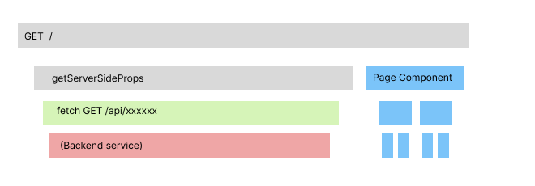
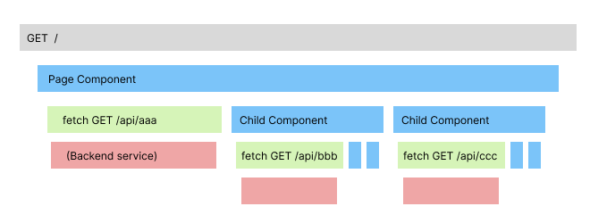

# React Server Components と GraphQL のアナロジー

Next.js の App Router が安定版となり、React Server Components (以下 RSC) が実プロダクトで利用できるようになってきた。

実際、今年はやれどこそこのプロダクトが App Router を採用しただのやっぱり捨てだのといった話題が尽きなかったように思う。

かくいう自分自身も、今年は App Router の案件に取り組んで RSC と格闘する日々を送っていた。

その過程で、こんなようなことを考えるようになったので、今回はこの辺りの話を書き残しておこうと思う（何回か X に同じ旨の POST は上げていたけど、一回もちゃんとまとめてなかったので）。

https://x.com/Quramy/status/1738136293966856518?s=20

RSC がない頃の、別の言い方をすると `getServerSideProps` を使っていた頃の、Next.js におけるアプリケーションの設計は、トラディショナルな MVC にかなり近しい。
ここでいう MVC は、Spring MVC + Thymeleaf や Rails + slim のような、サーバサイドのテンプレートエンジンで画面を構築する方式のこと。

- フレームワークが HTTP Request を受け付けて Controller を起動
- Controller は Model を実行し、 View から参照可能なオブジェクトを用意し、対応する View を指定
- フレームワークが 指定された View を起動
- View は Controller から渡されたオブジェクトを参照して HTML を構築
- フレームワークは View の結果を HTTP Response として返す

`getServerSideProps` の場合もおよそ同じであった。

- Next.js が HTTP Request を受け付けて `getServerSideProps` を起動
- `getServerSideProps` は バックエンドの API を実行して、View から参照可能な Props を用意する
- Next.js は `getServerSideProps` の対となる Page Component を起動
- Page Component は `getServerSideProps` から渡された Props を元に React Element を構築
- Next.js が React Element から HTML の HTTP Response を返す (CSR の場合、Next.js の Router が 現在の Route を差し替える)

この動きを Flame Graph っぽく図示すると、以下のようになる（緑: `fetch`, 赤: バックエンド API, 青: React Component Tree)


データフェッチに SWR や Tanstack Query を使っているような場合も大体一緒で、ページ相当の Component がマウントされたときに API を `fetch` してページの描画に必要な情報を取得していると思う。

Page Component が単一の jsx/tsx ファイルに収まるのは、まぁ Getting Started の中だけの話であって、現実においてはプロダクトの持つ IA や デザインシステムの役割毎に何種類もの Component を経由して初めて画面が成立する。
素朴に上記の MVC を実装したら、Component のてっぺんから末端まで `getServerSideProps` で受け取った Props を伝播させることになる。よく「バケツリレー」と揶揄されるやつ。逆にバックエンドにしたって、「ページで必要だから」という理由で API レスポンスを設計するような考え方になりがちだ。

念の為に断っておくけど、バックエンドエンジニアが画面を意識するのが気に食わないわけじゃない。「親が末端のことを気にする」という考え方が、翻って Fat Controller のようなスパゲティコードを生み出し、保守性を下げていく構造であることに辟易しているのだ。

無秩序な Fat Controller がもたらした苦しみについては、何年も前に別の場で発表したことがあるのでリンクを置いておく。

https://speakerdeck.com/quramy/bffs-cosmos-in-folio-sec-at-uit?slide=26

上記の資料でも書いているけど、求めているものは 「Component の描画に必要なデータは Component 自身が要求する」という構造だ。

少し話が逸れるけど、CSS については 「Component と CSS は対として自己完結した管理をすべき」はもう何年も前から当たり前として認知されていると思う。これと同じように、データ取得についても中央集権ではなく自律分散させたいのだ。

RSC における「Server Component がネイティブに非同期処理を行ってよい」が、自律分散な データ取得を求める身にとって福音となるのは当然の帰結だ。Component が個々にデータ収録を行うので、バックエンド呼び出しを行いながら React のレンダリングも同時に動いていく。Render as you fetch というやつ。



こうしておけば、子 Component 部分の再利用性も確保できるし、「やっぱりこの部分表示してても売上に繋がらないから捨てよう」となったときの Disposability も高い。

こうなってくると、バックエンド API に求めるものは「ページを描画するための全情報を返す API」ではなく「Component を描画するための情報を返す API」になってくる。冒頭に貼った X の投稿はこれを意図したものである。

今までだって、許されるのであればページのてっぺんではなく、末端となる Component から fetch を飛ばしたかったが、ブラウザからインターネットを跨いで実行しようものなら、とんでもないレイテンシになるので避けていただけのことだ。
同じネットワーク内のすぐそこに、バックエンドの API であったり RDB がいる環境では、Node.js 内の SC から見た遅延なぞ高が知れているのだから、気にせずに実行すればいいのだ。

これについては @koichk さんの投稿にある図がわかりやすいので、引用しておく。

https://x.com/koichik/status/1738200094191784102?s=20

## GraphQL と Relay

ところで RSC とは別のアプローチで「自律分散なデータ取得」を頑張って実現していたフレームワークがある。GraphQL + Relay だ。

もう 7 年以上前になるが、自分が初めて Relay と出会った頃の資料をリンクしておく。

https://quramy.github.io/graph-api-note/#/21

7 年も前なので、React には hooks が無かったし、 Relay の JavaScript API も今とは大きく違う。ただ、 Relay の思想は原初から変わっていない。
上の図のように、「Component が必要とするデータの断片 (これを GraphQL の用語で Fragment と呼ぶ) をセットで管理しろ」というものだ。
Component と Fragment を同じ(co) 場所(location)で管理するため、 Fragment Colocation と呼ばれる。

Relay (GraphQL) の場合、Fragment をかき集めて完成する Query がインターネットを飛び越える。
どんなに Component (すなわち Fragment) 階層が深くなろうと、ページを描画するために必要な HTTP Request は基本的に一発で済むようになっている。

GraphQL Server (BFF) が、Query を受け付けたあとは、Resolver が再帰的に呼び出されて Fragment の末端までデータ取得が行われる。

Resolver が再帰的にデータを作り出していく挙動というのは、RSC においてネストした SC が次々に描画されていく様子とかなり似ていると思っているので、長くなってしまうがコードで説明していく。GraphQL 興味ない、という人は読み飛ばしてくれて構わないです。

GraphQL の例では毎度おなじみのブログ投稿サービスの Schema を例にする。

```gql
type Post {
  id: ID!
  title: String!
  author: User
}

type User {
  id: ID!
  name: String!
  email: String!
}

type Query {
  popularPosts: [Post!]!
}
```

この Schema を TypeScript で実装すると次のようになる。

```ts
import { createSchema } from "graphql-yoga";

// backend service clients
import { getPopularPosts, getUserById } from "@/services";

export const resolvers = {
  User: {},
  Post: {
    author: async ({ authorId }) => {
      return await getUserById(authorId);
    },
  },
  Query: {
    popularPosts: async () => {
      return await getPopularPosts();
    },
  },
};

const schema = createSchema({ resolvers });
```

ここで `getPopularPosts` と `getUserById` はそれぞれ、バックエンド API の呼び出しを行う関数という意味。型定義だけ書き下すと、以下のようになっていればそれでよい。

```ts
declare function getPopularPosts(): Promise<
  { id: string; title: string; authorId: string }[]
>;

declare function getUserById(id: string): Promise<null | {
  id: string;
  name: string;
  email: string;
}>;
```

GraphQL Resolver の特徴は「末端のことは末端の Resolver に任せる」という点にある。上記の例でいうと、`Query.popularPosts` Resolver は末端側である `Post.author`(User) のフィールドを直接解決しない。

`Post.author` Resolver が、親 Resolver から受け取った user id を使って、自分自身で User 情報を解決している。ここも「自律分散なデータ取得」だ。

この Resolver の設計原則については @mtsmfm さんの「孫煩悩アンチパターン」という言葉が好きなので紹介しておく。

https://qiita.com/mtsmfm/items/efa6c023bfc3d4c4df9e

画面側に話を移すと、Page Component と User Component に分割されているのであれば、Fragment Colocation すると、クエリは以下のようになる。

```gql
query Page_pupulerPostsQuery {
  popularPosts {
    title
    author {
      ...User_userFragment
    }
  }
}

fragment User_userFragment on User {
  name
  email
}
```

末端側の User Component について、Relay の場合のコードを書き出すとこんな感じ。`useFagment` の中で、User Component が必要とするデータを直接要求できているところがポイント。

```tsx
import { useFragment } from "react-relay";

export default function User({ userKey }: { userKey: User_userFragment$key }) {
  const user = useFragment(
    graphql`
      fragment User_userFragment on User {
        name
        email
      }
    `,
    userkey
  );
  if (!user) return null;

  const { name, email } = user;

  return (
    <div>
      <p>{name}</p>
      <p>{email}</p>
    </div>
  );
}
```

昔は `useFragment` の代わりに `Relay.createContainer` という HoC だったりしたけれど、Relay は原初から一貫して Fragment を一級市民として扱っていた。

## RSC

一方で、同じ Page Component と User Component について、RSC で表現すると次のようになる。

```tsx
/* app/popularPosts/page.tsx */

import { getPopularPosts } from "@/services";
import User from "./User";

export default async function Posts() {
  const posts = await getPopularPosts();

  return (
    <ol>
      {posts.map((post) => (
        <li key={post.id}>
          <h3>{post.title}</h3>
          <User userId={post.authorId} />
        </li>
      ))}
    </ol>
  );
}
```

```tsx
/* app/popularPosts/User.tsx */
import { getUserById } from "@/services";

export async default function User({ userId }: { userId: string }) {
  const user = getUserById(userId);
  if (!user) return null;

  const { name, email } = user;

  return (
    <div>
      <p>{name}</p>
      <p>{email}</p>
    </div>
  );
}
```

繰り返しになるけど、「コンポーネントは自身の描画に必要な情報は自分自身で取得する」だ。今までは Relay と GraphQL Resolver を使って実現できたことが、RSC によって React だけで実現できるようになっている。
GraphQL Resolver の特性である「再帰的に呼び出されていく」は、そっくりそのまま Async Component の呼び出し関係として引き継がれている。

## GraphQL の知識を活かせ

じゃぁ GraphQL の知識が無駄になったかというと、まったくそんなことはない。「Aync Component は GraphQL Resolver のようなものである」 ということは、GraphQL Resolver で身につけた知識が転用可能であるのだから。

一例を上げると、実は上記の例で挙げた GraphQL Schema の実装は N + 1 を起こすようになっていて、[Data Loader Pattern](https://github.com/graphql/dataloader) で回避するのが一般的である。
Data Loader は Resolver で 1 + N を 1 + 1 に落とし込む仕組みなのだけど、そっくり同じことが Server Components でも適用可能だ。実際の適用例は Gist に書いてあるので、興味があれば参照してください。

https://gist.github.com/Quramy/7b9036f236b2ac2fdac0a2d0f4f49172

Data Fetching を 分散させる利点は他にもある。Async Component を `React.Suspense` で囲むように呼び出せば、フレームワーク(e.g. Next.js) が Streaming に対応していれば、先に描画できた分をとっととエンドユーザーに見せることができる。このようなパフォーマンスのチューニングについても、 `getServerSideProps` で全てのデータの解決を待ってから画面を描画するようなアプローチの場合に成立しようがない。

まぁこれも GraphQL + Relay でも同じことができるようになっていて、`@defer` ディレクティブというものが存在する（ただし、2023.12 現在でも `@defer` は GraphQL Spec 上は RFC のままなので、RSC に追い越されてしまった感はある)。
Relay/GraphQL と Suspense の関係は 3 年前に記事を書いてるので、そちらを参照のこと。

https://medium.com/@quramy/render-as-you-fetch-incremental-graphql-fragments-70e643edd61e

## Observability

N + 1 やパフォーマンスの話を上でしたけど、僕自身が GraphQL Server をやってきて一番重要と思っていることは、個別のテクニックではなく、「想像するな計測しろ」ということだ。
他のバックエンドサービスと通信が発生するような GraphQL Gateway を運用すると、クエリのどこにボトルネックがあるのかを見つけようと思ったら、何かしらの Distributed Trace は必須といってよい。
実際、「Data Loader 仕込んだつもりがちゃんと動いてなくて Slow gql Query となってたことを APM から見つけた」なんてことはザラにある。

同じことが RSC でも言えるはずで、個々の SC から細かく バックエンドと通信が発生するのを是とするのであれば、何かしらの APM 基盤の導入は必須だと思う。
また、APM というのは導入しておしまい、というものではない。何かあったら、いや、何もなくても普段から Trace や Profile を見る習慣というのも大事にしていきたいものである。

## おわりに

例によって、連々と色々なことを書いてしまった。

要するに言いたいのは、RSC を新しく始めるのであれば、「コンポーネントは自身の描画に必要な情報は自分自身で取得する」に留意して欲しいということ。
