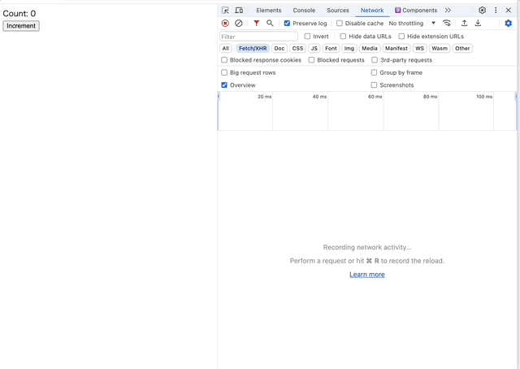

# Server Actions の同時実行制御と State について

2024 年 5 月現在だと Next.js のドキュメントには明示的な記載がないが、「同時に実行可能な Server Action は常に１つだけ」という件について。

実は自分もこれをちゃんと認識しておらず、先日会社の先輩に教わって初めて知った。

Next.js の場合、App Router (Router Reducer) によって、Server Action のキューイングが行われるようになっている。

このキューイングの挙動を考慮すると、以下のような呼び出し方は危ういコードとなる。

```tsx
"use client";

import { useState } from "react";
import { increment } from "./actions";

export default function Page() {
  const [count, updateCount] = useState(0);

  return (
    <form action={() => increment(count).then(updateCount)}>
      Count: {count}
      <nav>
        <button>Increment</button>
      </nav>
    </form>
  );
}
```

`useState` で管理している値を引数として実行しているわけだけど、問題は上記のボタンを連打した場合。

Server Action 側の実行時間をかさ増しておくとわかりやすい。

```ts
"use server";

import { setTimeout } from "node:timers/promises";

export async function increment(count: number) {
  await setTimeout(500);
  return count + 1;
}
```


上図のとおり、ボタンを連打すると Server Action の実行回数と `useState` で管理している値にズレが生じていく。これは Server Action がキューイングされた時点(= クリックしているタイミング) における `count` 値が利用されてしまうため。

状態の更新をサーバーにやらせたい、というのであれば `useActionState`(旧 `useFormState`) を使うと安全。

```tsx
"use client";

import { useActionState } from "react";
import { increment } from "./actions";

export default function Page() {
  const [count, formAction] = useActionState(increment, 0);

  return (
    <form action={formAction}>
      Count: {count}
      <nav>
        <button>Increment</button>
      </nav>
    </form>
  );
}
```

Server Action の呼び出しが直列化されるのは先ほどと同様だが、 `useActionState` の場合は直前の state 値がきちんと Server Action に伝わるようになっている。



`useActionState` の第一引数にわたす関数のシグネチャは `(prevState: State, data: FormData) => Promise<State>` であり、「現在の状態とパラメータをもらって次の状態を返す」という意味では `useReducer` と一緒。
`useActionState` と `useReducer` の最大の違いは、Reduce 関数が非同期である点だ。

冒頭で「同時に実行可能な Server Action は常に１つだけ」と書いたが、Reduce 関数が非同期であることを許容するのであれば、実行時に直列化する仕組みがないと破綻してしまうため、この意味でも自然な要請と言える。

`"use server"` な関数の呼び出しを担っているのは Next.js であるが、React 側でも `"use server"` ディレクティブ説明のページにこの件が書いてある。

https://react.dev/reference/rsc/use-server#caveats

> Accordingly, frameworks implementing Server Actions typically process one action at a time

## 画面の楽観更新

ところで、大概のフォームではそもそも Submit が複数キューイングされても嬉しくはないため、`useTransition` や `useFormStatus` から Action が実行中であるかどうかを見ておき、`<button disabled={pending}>` のようにしておけば十分と思う。

この「実行中はボタンを押させない」の挙動が微妙になる例として、 X など SNS によくある「いいね」ボタンのような類が考えられる（実際、自分も誤ってファボしてしまった場合は、即時にもう一度ファボボタンをタップしてキャンセルしている）。

このようなケースで利用されるのが楽観的更新(サーバーの実行結果をまたずに UI に想定される更新結果を描画しておく) というパターン。

さきほどの例に楽観的更新を仕込むと以下のようになる。

```tsx
"use client";

import { useActionState, useOptimistic } from "react";
import { increment } from "./actions";

export default function Page() {
  const [count, dispatch] = useActionState(increment, 0);
  const [optimisticCount, updateOptimisticCount] = useOptimistic(
    count,
    (optimisticCount) => optimisticCount + 1
  );

  const formAction = async () => {
    updateOptimisticCount(null);
    await dispatch();
  };

  return (
    <form action={formAction}>
      Count: {optimisticCount}
      <nav>
        <button>Increment</button>
      </nav>
    </form>
  );
}
```


`useOptimistic` も Reduce 関数を受け取るのは `useReducer` と同じであるが、Action が実行中のときだけ別の状態を作成可能。

## まとめ

`useActionState` は サーバーサイドバリデーションの文脈で紹介されることが多いけど、Redux の頃から馴染み深い「State とパラメータを食って次の State を返す」というループに、サーバー(非同期処理)を巻き込めるようになったと捉えることもできると思う。

フレームワーク側が Server Action を直列化するというのは、レースコンディションなどの悩みから解放してもらえるメリットがある一方、実行可能な Server Action に制約が掛かっていると考えることもできる。
実際、現時点(14.3-canary.78) の Next.js では Route に対して同時実行可能な Action は１つまでとなっている模様。

https://github.com/vercel/next.js/issues/64396

`useOptimistic` で一定 UX をカバーすることはできるものの、無闇矢鱈に Server Action を発行するような画面を作ってしまった場合、このブロッキキングに引っかかることになる。
無闇矢鱈というのは、例えばちょっとした追加のデータ取得用途で Server Action を使うようなパターンをイメージしている。
というか、この件についても https://react.dev/reference/rsc/use-server#caveats に書いてある。

> Server Actions are designed for mutations that update server-side state; they are not recommended for data fetching

Server Action に限った話ではないけど、API の用法用量は適切に守りましょう。
