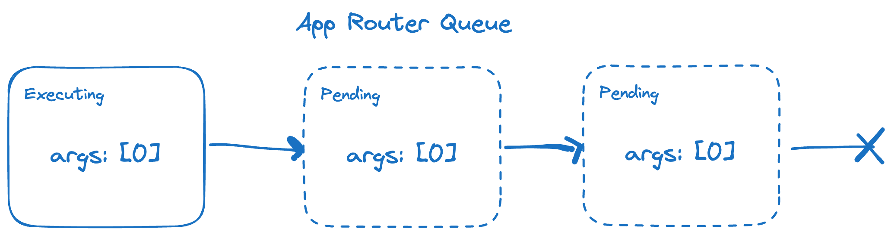
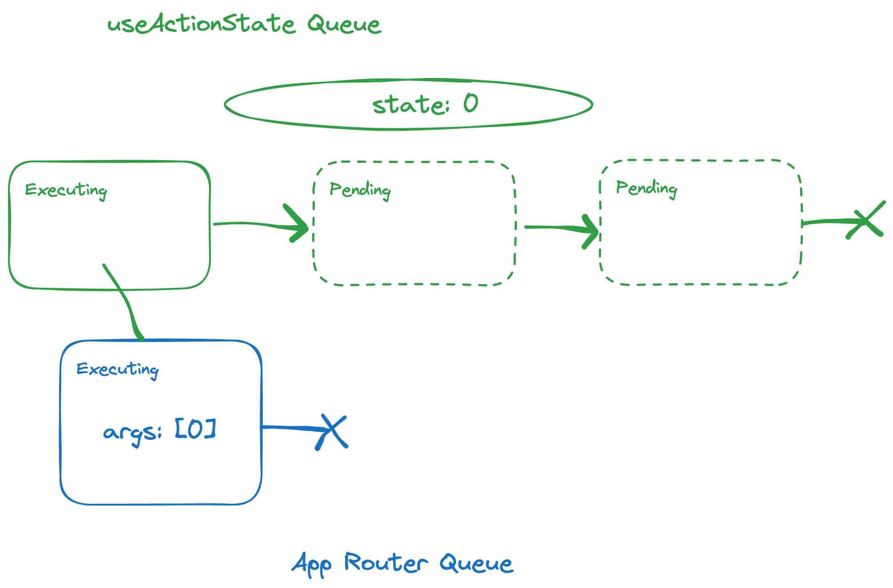
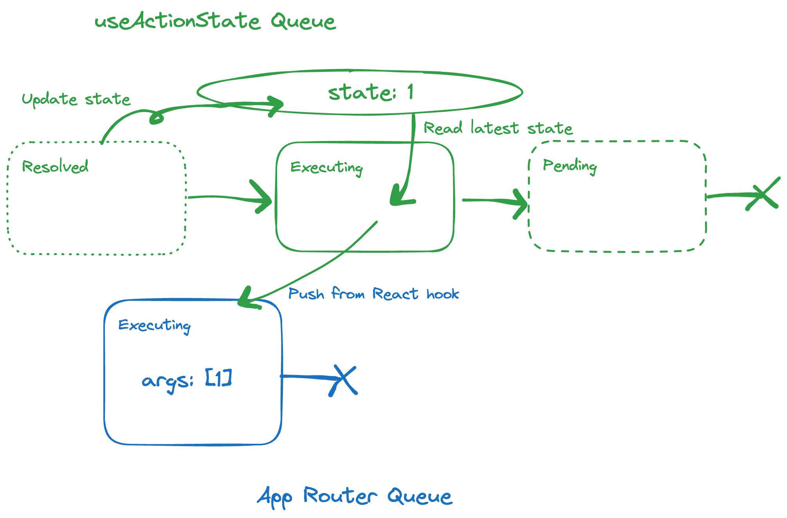

# Server Actions の同時実行制御と State について

2024 年 5 月現在だと Next.js のドキュメントには明示的な記載がないが、「同時に実行可能な Server Action は常に１つだけ」という件について。

実は自分もこれをちゃんと認識しておらず、先日会社の先輩に教わって初めて知ったので、試したことなどを書き残しておく。

Next.js の場合、App Router (Router Reducer) によって、Server Action の実行が直列化 (キューイング) されるようになっている。

このキューイングの挙動を考慮すると、以下のような呼び出し方は危ういコードとなる。

```tsx
"use client";

import { useState } from "react";
import { increment } from "./actions";

export default function Page() {
  const [count, updateCount] = useState(0);

  return (
    <form action={() => increment(count).then(updateCount)}>
      Count: {count}
      <nav>
        <button>Increment</button>
      </nav>
    </form>
  );
}
```

`useState` で管理している値を引数として実行する例であるため、JavaScript off にしたときに動かないとかはあるが、今回のエントリで本題としたいのは上記のボタンを連打した場合について。

Server Action 側の実行時間をかさ増しておくとわかりやすい。

```ts
"use server";

import { setTimeout } from "node:timers/promises";

export async function increment(count: number) {
  await setTimeout(500);
  return count + 1;
}
```


上図のとおり、ボタンを連打すると Server Action の実行回数と `useState` で管理している値にズレが生じていく。これは Server Action がキューイングされた時点(= クリックしているタイミング) における `count` 値が利用されてしまうため。

状態の更新をサーバーにやらせたい、というのであれば `useActionState`(旧 `useFormState`) を使うと安全。

```tsx
"use client";

import { useActionState } from "react";
import { increment } from "./actions";

export default function Page() {
  const [count, formAction] = useActionState(increment, 0);

  return (
    <form action={formAction}>
      Count: {count}
      <nav>
        <button>Increment</button>
      </nav>
    </form>
  );
}
```


`useState` を利用していた場合とは異なり、 `useActionState` の場合は直前の state の値が正しく Server Action に伝わるようになっている。なぜ？というのが気になる人はエントリの末尾に実装の解説を書いたので、そちらを参照のこと。

`useActionState` の第一引数にわたす関数のシグネチャは `(prevState: State, data: FormData) => Promise<State>` であり、「現在の状態とパラメータをもらって次の状態を返す」という意味では `useReducer` と一緒。
`useActionState` と `useReducer` の最大の違いは、Reduce 関数が Promise を返している点だ。

冒頭で「同時に実行可能な Server Action は常に１つだけ」と書いたが、Reduce 関数が非同期であることを許容するのであれば、実行時に直列化する仕組みがないと破綻してしまうため、この意味でも自然な要請と言える。

## 画面の楽観更新

ところで、大概のフォームではそもそも Submit が複数キューイングされても嬉しくはないため、`useTransition` や `useFormStatus` から Action が実行中であるかどうかを見ておき、`<button disabled={pending}>` のようにしておけば十分と思う。

この「実行中はボタンを押させない」の挙動が微妙になる例として、 X など SNS によくある「いいね」ボタンのような類が考えられる（実際、自分も誤ってファボしてしまった場合は、即時にもう一度ファボボタンをタップしてキャンセルしている）。

このようなケースで利用されるのが楽観的更新(サーバーの実行結果をまたずに UI に想定される更新結果を描画しておく) というパターン。

さきほどの例に楽観的更新を仕込むと以下のようになる。

```tsx
"use client";

import { useActionState, useOptimistic } from "react";
import { increment } from "./actions";

export default function Page() {
  const [count, dispatch] = useActionState(increment, 0);
  const [optimisticCount, updateOptimisticCount] = useOptimistic(
    count,
    (currentCount) => currentCount + 1
  );

  const formAction = async () => {
    updateOptimisticCount(null);
    await dispatch();
  };

  return (
    <form action={formAction}>
      Count: {optimisticCount}
      <nav>
        <button>Increment</button>
      </nav>
    </form>
  );
}
```


Action が実行中でなければ、 `optimisticCount` は Action State である `count` と同じ値となるが、Action 完了前のタイミングでは 第二引数で渡した関数が返した値となる。
hook 関数のシグネチャとしては `useReducer` や `useActionState` と似ているが、 `useOptimistic` は引数順序が (値, 関数) なので間違えて TypeScript に怒られがち (僕だけ？) 。

上記の例 (`formAction` 部分) では単純に楽観更新と Server Action の実行を両方行なうだけとしているが、ここを凝れば「連打できるのは N 回まで」なども実現できる。

## まとめ

`useActionState` は サーバーサイドバリデーションの文脈で紹介されることが多いけど、Redux の頃から馴染み深い「State とパラメータを食って次の State を返す」というループに、サーバー(非同期処理)を巻き込めるようになったと捉えることもできると思う[^1]。

フレームワーク側が Server Action を直列化するというのは、レースコンディションなどの悩みから解放してもらえるメリットがある一方、実行可能な Server Action に制約が掛かっていると考えることもできる。
実際、現時点(15.0.0-rc.0) の Next.js では複数の Server Action を import していたとしても、同時実行可能な Action は１つまでとなっている模様[^2]。

`useOptimistic` で一定 UX をカバーすることはできるものの、無闇矢鱈に複数の Server Action を実行するような画面を作ってしまった場合、このブロッキキングに引っかかることになる。
無闇矢鱈というのは、例えばちょっとした追加のデータ取得用途で Server Action を使うようなパターンをイメージしている。
この件については、実は同時実行制御の件と併せて https://react.dev/reference/rsc/use-server#caveats で言及されている。

> Server Actions are designed for mutations that update server-side state; they are not recommended for data fetching.
> Accordingly, frameworks implementing Server Actions typically process one action at a time and do not have a way to cache the return value.

Server Action に限った話ではないけど、API の用法用量は適切に守りましょう。

## おまけ: Next.js のキューと React のキュー

`useState` を利用した例と `useActionState` を利用した例のどちらにおいても Server Action が直列に実行されるという点では一緒であるが、直列化されるまでの流れは両者で異なるので、調べた内容を残しておく。

- `useState` の場合: Next.js が直列化
- `useActionState` の場合: 主に React が直列化

まず、最初の例である `useState` を使っていたパターンについて。

冒頭でも書いたが、このケースでは非同期処理を直列化して実行する主体は Next.js である。

App Router 全体の Reducing の一貫として、非同期タスクがキューに追加されることで直列実行が実現される。

なお、フレームワークのコード上はタスクも `action` と呼ばれるが、あまりにも紛らわしいのでキューに詰まっている個々の処理は一旦「タスク」と呼ぶことにする。

既に実行中の非同期タスクが存在している時にキューへのタスク追加を行っているのは以下のあたり。

https://github.com/vercel/next.js/blob/v15.0.0-rc.0/packages/next/src/shared/lib/router/action-queue.ts#L181-L186

```ts
// The queue is not empty, so add the action to the end of the queue
// It will be started by runRemainingActions after the previous action finishes
if (actionQueue.last !== null) {
  actionQueue.last.next = newAction;
}
actionQueue.last = newAction;
```

ここで `newAction` タスクのペイロードはキューイング時点での `count` state 値となるため、Server Action は複数回同じ引数で実行されていた。

`useState` で管理している `count` 値が 0 の状態で 3 回クリックされた状況を想定とすると、App Router のキューは以下のようになっている。



続いて `useActionState` を利用した場合について。

こちらについても 最終的には Next.js の App Router キューへタスク追加されるが、先んじて `useActionState` が管理するキューが登場する。
ボタン連打したときに、React 側のキューへの追加が行われるのは以下のあたり。

https://github.com/facebook/react/blob/ee5c19493086fdeb32057e16d1e3414370242307/packages/react-reconciler/src/ReactFiberHooks.js#L1999-L2005

```js
// There's already an action running. Add to the queue.
const first = last.next;
const newLast: ActionStateQueueNode<P> = {
  payload,
  next: first,
};
actionQueue.pending = last.next = newLast;
```

`useActionState` が管理しているタスクの実行時に App Router 側のキューに Server Action 実行のタスク実体が作られるイメージとなる。



上の図も Server Action 実行中にさらに 2 回クリックしたような状況を想定しているのだけど、Pending なタスクについてはこの時点では紐づく App Router 側のタスク(Server Action 実行) は作成されない。

また `useActionState` hook 管理のキューは、キュー自体が state 値を参照する構造となっており、実行中の非同期処理が完了したときに、その結果で state を更新してから次の非同期処理を実行するようになっている。
今回のケースだと「次の非同期処理」が App Router 側キューへのタスク作成とそれに紐づく Server Action の実行ということになり、結果として Server Action 側には都度最新の State が伝わることになる。

以下コードが state の更新箇所であり、 `finishRunningActionStateAction` の中で Pending しているタスクを実行している。

https://github.com/facebook/react/blob/ee5c19493086fdeb32057e16d1e3414370242307/packages/react-reconciler/src/ReactFiberHooks.js#L2044-L2061

```js
// Attach a listener to read the return state of the action. As soon as
// this resolves, we can run the next action in the sequence.
thenable.then(
  (nextState: Awaited<S>) => {
    actionQueue.state = nextState;
    finishRunningActionStateAction(
      actionQueue,
      (setPendingState: any),
      (setState: any)
    );
  },
  () => {
    // 略
  }
);
```

先程の図の続きとして書くのであれば以下のようなイメージ。



今回のサンプルの場合は、下段である App Router 側のキューは高々１タスクまでとなるが、 `useActionState` hook を複数利用した場合はその限りではない。

長々と書いてきたけど、要するに「 `useActionState` hook それ自体もキューを管理しており、Server Action 実行タスクをメタフレームワークに依頼するタイミングが制御されている」ということ。

[^1]: JavaScript ではないけれど、ASP.NET や JavaEE(JSF) のようなフレームワークに存在していた View State と呼ばれる仕組みと `useActionState` は類似点が多く、これらを経験した身からすると、マインドモデルとしてもしっくりくる
[^2]: issue は https://github.com/vercel/next.js/issues/64396 . Parallel Routes の場合などは確認していないけど、おそらく Page.tsx の数は関係ないんだと思う
