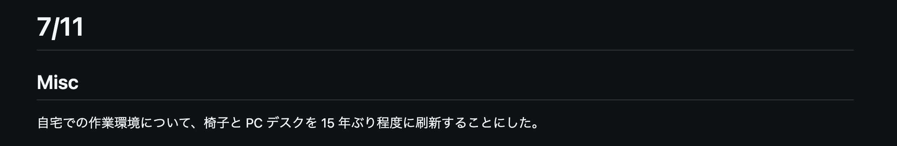

# til(Today I Learned) を 4 年間続けてみて

2020/9/28 から til (Today I Learned) を GitHub 上に記録するようになった。
飽き性の自分にとっては珍しく、4 年間根付いた習慣となった。せっかくなので振り返ってみる。

## 記述する内容に制限を設けない

"Today I Learned" と呼んでいるものの、実際の記述内容として「学んだこと」に限っているわけでもない。
エンジニアリングに関係していれば何書いてもよい、くらいの気持ちであるため、半分くらいは「今日やったこと」になる。

- 他人の技術 Blog
- その日覚えたちょっとした Tips
- 勉強会やカンファレンスの視聴メモ
- 気にかけている OSS の Release Note
- 自分でメンテしている OSS のメンテ時のメモ
- etc...

たとえば、以下は直近に Prisma v5.22.0 がリリースされた際の覚書。


各月ごとに 1 markdown ファイルを用意し、h1 で日にち、h2 にトピックを書いている。上図のキャプチャに相当する箇所だと以下のような書き味である。

```md
# 9/25

## Prisma で意図せぬ undefined を禁止する

https://github.com/prisma/prisma/releases/tag/5.20.0 にて、 `strictUndefinedChecks` という Preview Feature が入った。

<!-- 以下略 -->
```

上記は、記述内容としてはまともな部類で、しょーもないことを書いている日も多い。



これは 2023.7 月に残っていた記録なんだけど、今使っている机と椅子を買った、ということを書いているだけである（確かこの週に腰を壊したせいで、ちゃんとした作業環境を用意しようと一念発起したんだと思う）。

何を言いたいかというと、他人に見てもらう意図があるわけではないため、本当にどうでもいいようなことも気軽に書き残せるのが利点である。

## 夜に書いて朝にコミット

「丸 4 年」と冒頭に書いたが、実際に til の記述がある日数を測ってみたところ 821 日分であった。土日や休暇中は自分が PC を開かないため、記載がないことを考えると、まぁ妥当な数値だ。

記述する時間帯は、お仕事が終わって、夕ご飯食べた後〜就寝前となることが多め。

これまた計測してみたのだが、平均すると一日辺り 40 行程度記述していた。

Commit & Push は翌朝に PC を開いたタイミングで行うことが多いが、時間に余裕がある場合は、朝の時間で前日に書いた内容を見返して追記することもある。

## 「自分で書く」ことのメリット

一度自分の言葉で書くという手順を踏む分、記憶に定着しやすい。
もちろん、何ヶ月か経つと詳細は忘れるが「そういえば、こんなことを til に書いたよな」という緩いインデックスは自分の脳内に残る。

書いてるときの気持ちとしては自分の知識の整理の意味が強く、他人に見せようとは思っていないが、何かの拍子に til に記載したトピックについての話になったときに、すっと関係する情報を提示できることもある。
手元で `git grep` するか、GitHub の検索すれば、(なにせ自分で書いた内容なので) 数ヶ月経っていても大体見つけることができる。

til を習慣化する以前は、学んだ内容が Twitter / はてなブックマーク / 社内の Slack のどこに書いたか思い出せなくなり、日が経ってからの検索がとても面倒だったが、それが一元化されているのは自分にとって大きい。

## おわりに

「毎日何か書く」を習慣化しておくメリットは確実にあると思う。
やり方については、自分は Markdown + GitHub を選択しているが、Scrapbox や しずかなインターネット など個々人で自分がやりやすいものを選べばよい。
