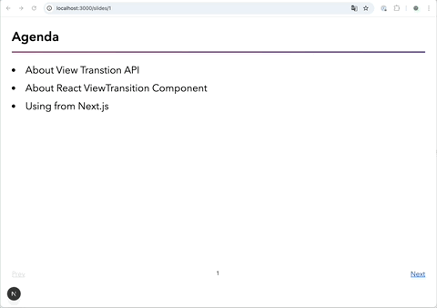

# Next.js における View Transition と transition-type

先日リリースされた Next.js v16.2 で Link Component に `transitionTypes` という新しい prop が追加された。これを使うと宣言的にページ遷移時の View Transition を指定できる。

https://nextjs.org/blog/next-16-2#transitiontypes-prop-for-nextlink

Transition Type の使い所については、次の画像のようなスライドアプリケーションのようなものを想像すると分かりやすいと思う。
"Prev" の場合と "Next" の場合で、アニメーションの向きを逆にしたいというのは自然な要件のはずだ。



上図におけるスライド部分を囲んでいる Layout は以下のようになっている。
ここで、ViewTransition Component の `default` prop にオブジェクトを指定している箇所が要点。

```tsx
/* app/slides/layout.tsx */

import { ViewTransition, type ReactNode } from "react";
import * as styles from "./layout.module.css";
import { Pagenator } from "./pagenator";
import { size } from "./[page]/slideContents";

export default function SlideLayout({
  children,
}: {
  readonly children: ReactNode;
}) {
  return (
    <main className={styles.main}>
      <ViewTransition
        default={{
          default: "none",
          "navigation-back": styles.slideRight,
          "navigation-forward": styles.slideLeft,
        }}
      >
        {children}
      </ViewTransition>
      <Pagenator min={1} max={size} />
    </main>
  );
}
```

View Transition アニメーション種別に対して、key を付与する形となっており、ここでは次の意味を持たせている。

- navigation-back: 領域を右方向へスライドさせるアニメーション
- navigation-forward: 領域を左方向へスライドさせるアニメーション

ViewTransition Component の `default` (`enter` や `exit` などのも props も同様) prop に渡したオブジェクトの値部分は CSS クラス名である。したがって CSS 側でこのクラス名を `::view-transition-new` などの擬似要素のセレクタとして利用することで、「"navigation-back" タイプの View Transition には slide-left keyframes アニメーションを適用する」というような、複数のアニメーションを View Transition で使い分けることができる。

```css
::view-transition-new(.slideLeft) {
  animation: slide-left 0.5s both;
}
::view-transition-new(.slideRight) {
  animation: slide-right 0.5s both;
}
```

上記の `.slideLeft` や `.slideRight` のような View Transition Class は View Transition 発動時に React が自動でコミットする。どのアニメーションを利用したいかをアプリケーションから React に伝えるために、登場するのが今回の Next Link に追加された `transitionTypes` prop である。

```tsx
<Link href={`/slides/${current + 1}`} transitionTypes={["navigation-forward"]}>
  Next page
</Link>
```

内部的には React の `addTransitionType` API が使われているので、上記は次と同じような処理が実行されるイメージである。

```tsx
startTransition(() => {
  addTransitionType("navigation-forward");
  router.push(`/slides/${current + 1}`);
});
```

v16.1 以前の Next.js では、Link Component から View Transition の種類を指定するには `onNavigate` Callback prop を利用する方法があった。しかし、この方法は Server Component では直接書けないという制約があった。今回の `transitionTypes` prop の追加により、宣言的に指定できるようになった。
