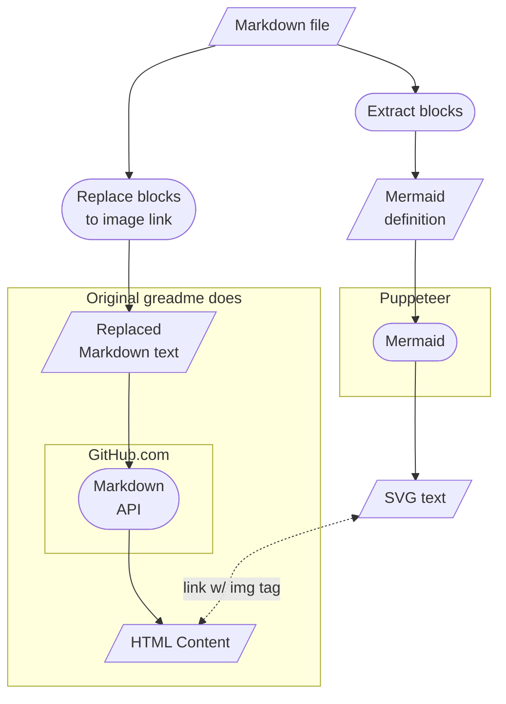
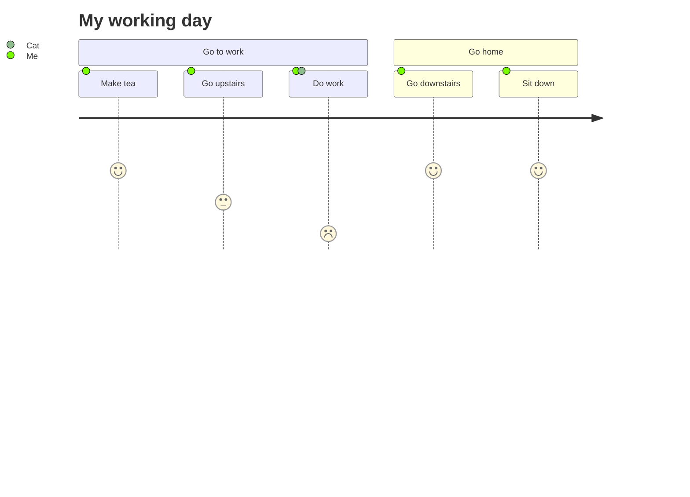

# 12/1

## Storybook

SB の RSC 対応 issue で、直近数日に動きがあった。

https://github.com/storybookjs/storybook/issues/21540#issuecomment-1833840698

以下のような Decorator で Async Component を含む Story をラップすればよい」という内容。

```jsx
import { Decorator } from "@storybook/react";
import { Suspense } from "react";

export const WithSuspense: Decorator = (Story) => {
  return (
    <Suspense>
      <Story />
    </Suspense>
  );
};
```

試しに手元の `@storybook/react` の v7.5.3 で試したところ、ちゃんと描画される。

```tsx
import { Suspense } from 'react'
import type { Meta, StoryObj } from '@storybook/react'

async function MyAsyncComponent() {
  const res = await fetch('/iframe.html')
  return (
    <div>
      <p>Fetch status: {res.status}</p>
    </div>
  )
}

const meta = {
  title: 'components/MyAsyncComponent',
  component: MyAsyncComponent,
  args: {},
  decorators: [
    (Story) => (
      <Suspense fallback={<div>Load story...</div>}>
        <Story />
      </Suspense>
    ),
  ],
} satisfies Meta

export default meta

type Story = StoryObj<typeof MyAsyncComponent>

export const Default = {} satisfies Story
```

「非同期コンポーネントが許容されるのは SC のみ」と理解していたので、なぜにこれで動くのかさっぱりわからん..
というよりも、CC でも非同期コンポーネントが許容されるのであれば、 `use()` を持ち出す必要も無いことになるし。

https://react.dev/blog/2023/03/22/react-labs-what-we-have-been-working-on-march-2023#:~:text=we%20introduced%20async%20/%20await%20as%20the%20primary%20way%20to%20do%20data%20fetching%20from%20Server%20Components

---

# 12/6

## Storybook

先日に書いた Suspense Decorator の件があれよあれよという間に時期リリース向けのブランチに取り込まれていた。

> 以下のような Decorator で Async Component を含む Story をラップすればよい」という内容。

https://github.com/storybookjs/storybook/pull/25091

どうにもモヤつくので、以前書いた RSC のテストの記事に追記. https://quramy.medium.com/react-server-component-%E3%81%AE%E3%83%86%E3%82%B9%E3%83%88%E3%81%A8-container-presentation-separation-7da455d66576

`experimentalNextRSC` フラグは `@storybook/react` v8 で入りそうだが、これとは別に v8 で Storybook 側の Next.js サポートの下限が v13.5 まで上がっているので注意。

https://github.com/storybookjs/storybook/pull/25017

## StyleX

ついに公開された

https://stylexjs.com/

## CSS

CSS Text Module level 4 における `word-break: auto-phrase` や `text-autospace` の解説:

https://developer.chrome.com/blog/css-i18n-features?hl=ja

Chrome は BudouX というテキスト処理系を利用することで実現するとのこと。

BudouX については https://b-risk.jp/blog/2021/12/budoux/ もわかりやすかった。

---

# 12/7

## Prisma

https://github.com/prisma/prisma/releases/tag/5.7.0 にて `relationJoins` Preview Feature が利用可能に。

`include` などで Relation 跨いだ Model をクエリするときに、PostgresDB や CockroachDB ではネイティブ SQL の `JOIN` が利用されるようになる。

また、 v5.7.0 では `nativeDistinct` という Feature Flag も追加されている。名称そのまま。

## GraphQL

Semantic Non Null 周りをアドカレの記事にした。

https://quramy.medium.com/graphql-%E3%81%AE-semantic-non-null-type-rfc-%E3%81%AB%E3%81%A4%E3%81%84%E3%81%A6-49fb18a06afb

---

# 12/8

## Parser

再帰下降パーザで incomplete 性をどう扱えばいいのかを正しく知りたいため、文献探し。

以下のスレッドからリンクを辿っていくのが良さそう。

- https://stackoverflow.com/questions/12416903/any-references-for-parsing-incomplete-or-incorrect-code
- https://www.reddit.com/r/Compilers/comments/p1f2ps/recursive_descent_parsers_with_good_error_recovery

[Efficient and Comfortable Error Recovery in Recursive Descent Parsers](https://www.cocolab.com/products/cocktail/doc.pdf/ell.pdf) が良さそう？

## Misc

たまたま TL に流れてきた https://twitter.com/schwer_metall/status/1731992791528456653 飛んだ PDF があまりにも面白くて読みふけってしまった。

[日本の IT は何故弱いか](https://shayashiyasugi.com/wwwshayashijp/myfailures.pdf) という稿で、[イノベーション政策の科学: SBIR の評価と未来産業の創造](https://www.amazon.co.jp/%E3%82%A4%E3%83%8E%E3%83%99%E3%83%BC%E3%82%B7%E3%83%A7%E3%83%B3%E6%94%BF%E7%AD%96%E3%81%AE%E7%A7%91%E5%AD%A6-SBIR%E3%81%AE%E8%A9%95%E4%BE%A1%E3%81%A8%E6%9C%AA%E6%9D%A5%E7%94%A3%E6%A5%AD%E3%81%AE%E5%89%B5%E9%80%A0-%E5%B1%B1%E5%8F%A3-%E6%A0%84%E4%B8%80/dp/413046115X/ref=sr_1_1?ie=UTF8&qid=1429026553&sr=8-1&keywords=%E5%B1%B1%E5%8F%A3%E6%A0%84%E4%B8%80) 書籍にて 9 章として所収された論文の草稿にあたる。

稿末に以下の結言が登場する。

> もし、日本の IT の弱さ、IT 人材の不足の問題を変えたいというのならば、それは日本社会そのものを変えるしかない。

この結論に至る過程において、「IT のスペシャリストを専門的に育成するような機関を設けたところで、それを受容する社会や引いてはその社会を生み出す精神がなければ、意味がない」という旨のことが書いてあった。

2015 年に出版されているので、書いてある内容は 2010 年代前半くらいまでの内容、ということになるのだろうか（ Map Reduce や Hadoop などのタームが出てくるあたり、なんとなくその当時の時勢を感じる）。

マクロな話なので、自身の卑近な例で解釈するのは間違っているかもしれないが、この稿が書かれた当時に「育成された」側であった自分は、社会に受け入れてもらえているんだろうか？と考え込んでしまった。
社会自体が変容していないのであれば、自分が「受容されている」と感じていたとしても、それはただコンフォートゾーンに留まっているだけかもしれない。

---

# 12/11

## UIT × Bonfire Front-end Meetup

[UIT × Bonfire Front-end Meetup #1](https://uit.connpass.com/event/300284/) に参加してきた。

### 社内ツールから生まれた OSS "ts-remove-unused" によるフロントエンド開発の効率化と品質の向上

- https://github.com/line/ts-remove-unused の話
- export されているが、import されていない statement を削除する

### ヤフーのユーザー 5,400 万人から"同意"を得るための技術

- SWAT チーム: 全社横断で技術支援を行っているエンジニアチーム
- ヤフーでプライバシーポリシーを刷新する必要があった
- SDK はモーダル版/フルスクリーン版の 2 パターンある (それぞれ Responsive)
- Platform は iOS, Android, web の 3 種 (発表は web 版に携わった方)
- 影響ユーザーは 5,400 万人(ヤフーの MAU ベース)
- 工夫した点:
  - 初期から非機能要件定義
  - 他部署へのレビュー依頼
  - Docs / Debugger の拡充
- それでも不具合が多数発生
  - 本文がスクロールできない
  - 同意するボタンの活性化不備
  - etc...

### 管理画面向け UI コンポーネントの設計 - 我々に必要なのは Bootstrap だったのか

- Web Components を提供しようとしている
- Line 公式アカウントの管理画面がターゲット (Browser web と Webview)
  - 700 Kloc 程度のサイズ (Vue 中心)
  - Bootstrap 4 をカスタマイズしたものを UI ライブラリとして利用している
    - CSS Monkey Patch の嵐
  - Tailwind に移行を試みた
    - Bootstrap とクラス名が重複する
    - Tailwind だけで Bootstrap レイヤになるわけではない
  - (別の文脈で) Vue 2 -> Vue 3 の移行や、React 製のアプリケーションへの輸出も背景にある
  - Web Components の利用を検討
- Web Components への懸念に対して
  - F/W: LitElement を利用
    - Cons: Mixin 関連で TypeScript との相性が悪い
  - UI State 管理は Zag.js を使っている
  - 各 F/W ラッパについて: custom-elements-manifest という仕組みを利用
  - SSR できない問題: そもそもターゲットが SSR してない。今後の Declarative Shadow DOM 周りの動きに期待

### リニューアルで学んだ通説の捉え方

- SP 版 Yahoo! メールを技術刷新した
- Front は jQuery から Redux (+ Redux AsyncThunk) に移行
  - backend: PHP が標準言語から準標準言語にランクダウンした
- 見た目上は大きな変化なし(2 年前に UI のリニューアルを行っているため)
- prj kickoff から release まで 3 年と 8 ヶ月...!
  - どちらかというと他 prj 都合でのリソース不足が原因
- リニューアル前後で
  - perf 上がった (なんで？
  - 自動テスト書く習慣ついた

---

# 12/12

## Parser

- https://eyalkalderon.com/blog/nom-error-recovery
- https://supunsetunga.medium.com/writing-a-parser-syntax-error-handling-b71b67a8ac66

## CSS

`:hover` をホバー有効なデバイスにのみ限定させる:

```css
@media (hover: hover) {
  button:hover {
    opacity: 0.8;
  }
}
```

---

# 12/14

## Mermaid

[以前](202209.md#921) に書いた `@mermaid-js/mermaid-cli` を使う方法だと「Markdown をそのままプレビューする」というユースケースには不向きだった。

思い立って、greadme を fork して、こいつの express 中から mermaid-cli のコードをぶっ叩いて Mermaid ブロックを含む Markdown もプレビューできるようにした。

https://github.com/Quramy/greadmerm

折角なので、早速作った greadmerm でプレビューしながら、HTML パイプラインを図示してみた。



今回は mermaid-cli から import できる `renderMermaid` という関数をそのまま利用している都合上、Puppeteer が必須になってしまうが、jsdom とかで代替できたら良さそうと思ったけど、https://github.com/mermaid-js/mermaid/issues/559 を見る感じ、簡単ではなさそう？

---

# 12/15

## JavaScript

https://github.com/tc39/proposal-math-sum という Proposal の存在を知った。直近で Stage 1 になった仕様。

何かしらの数値配列を足し合わせるときに、 `numList.reduce(s => s + num, 0)` だと数値誤差が拡大していってしまうが、 `Math.sum(...numList)` とすることで、誤差の拡大を防ぐ、という代物。

https://ja.wikipedia.org/wiki/%E3%82%AB%E3%83%8F%E3%83%B3%E3%81%AE%E5%8A%A0%E7%AE%97%E3%82%A2%E3%83%AB%E3%82%B4%E3%83%AA%E3%82%BA%E3%83%A0

---

# 12/18

## Google Tag Manager

https://developers.google.com/tag-platform/tag-manager/datalayer#reset

```js
dataLayer.push({ event: "HOGE", my_param: "FUGA" });
dataLayer.push({ event: "PIYO" });
```

のように、Data Layer にイベントを積んでいくと、過去に設定した `my_param` も直近の Data Model として保持されている状態となる。

`reset` を `push` の内部から呼び出すと、Data Layer 内部の Modal に格納された値を消し飛ばすことができる。 Function this の利用であることに注意。

```js
dataLayer.push(function reset() {
  this.reset();
});
```

---

# 12/19

## feTS

The Guild の OpenAPI TypeScript client の https://the-guild.dev/openapi/fets を味見してみた。

「OpenAPI のドキュメントから型をそのまま引っこ抜く」という結構な力技。

試しに `api.github.com` の OpenAPI Doc (https://github.com/github/rest-api-description/blob/main/descriptions/api.github.com/api.github.com.json) を食わせてみたが、TS の Language Server に掛かる負荷がやばい。
GitHub API のボリュームだと、JSON 化した OAS のファイルが 300KLoc を超えるため、実用には厳しい印象。

一方で仕事でのアプリケーションにおける OAS について、試しに JSON で吐き出してみたが、こちらは 3KLocs 程度のサイズであった。この程度のサイズであれば、Language Server への負荷も高が知れている。

## Playwright

Playwright で Custom Matcher を作ろうとしてみたものの、Custom Matcher から 現在の TestInfo にアクセスする術がない。

```ts
import { expect } from "@playwright/test";

expect.extend({
  toMatchMyCondition(receiver: any, ...args: any[]) {
    // how to access currentTestInfo ?
  },
});
```

Playwright 組み込みの `.toMatchSnapshot` も似たようなことをする必要があるが、これは内部ユーティリティの関数(実体はただの Singleton) を利用しているだけだった。

https://github.com/microsoft/playwright/blob/main/packages/playwright/src/matchers/toMatchSnapshot.ts#L20

外部から `currentTestInfo()` 相当をやろうとすると、例えば以下のような方法になるが、結局のこのファイルを worker に読ませる方法(Jest でいうところの `setupAfterEnv` 相当) がないため、テストケースから import するしかない。

```ts
/* global_setup.ts */

let _testInfo;
test.beforeEach(async ({}, _, testInfo) => {
  _testInfo = testInfo;
});
export function currentTestInfo() {
  return _testInfo;
}
```

Playwright config から `beforeEach` / `afterEach` にアクセスできるようにしたいという Issue は一年程前から Open されているが、特に動きなさそう。

- https://github.com/microsoft/playwright/issues/19766
- https://playwright.dev/docs/test-fixtures#automatic-fixtures

上記、このメモ書いた直後に同僚に以下から `currentTestInfo` 相当ができることを聞いたため解決:

```ts
import PlaywrightTest from "@playwright/test";

const currentInfo = PlaywrightTest.info();
```

---

# 12/20

## greadmerm

手元で利用していたら、2 箇所不具合があったので fix.

一つは、本家の greadme でも起こる問題だけど、location hash に URI Encoded な値が出てきた場合のハンドリングが甘い、という問題。

もう一つは、Mermaid の Rendering 関連の話で、以下のような User Journey Diagram を描画しようとしたときに、SVG が `height` 属性を最初から有した状態でできあがるため、greadmerm で height を付与すると XML 違反扱いされてしまうという問題だった。


