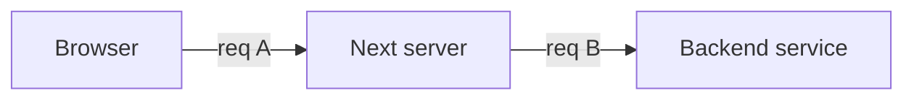
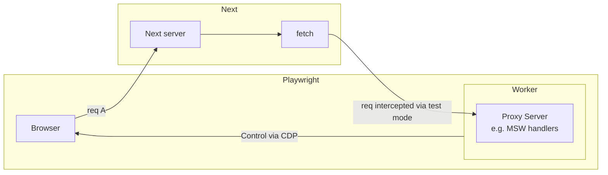

# 1/9

## SWR

swr と Tanstack Query の違い

https://www.ai-shift.co.jp/techblog/3680

個人的には以下が一番衝撃。。。

> SWR では TanStack Query のようにキャッシュの生存期間を設定するオプションはありません。基本的にキャッシュの自動再検証は以下のタイミングで行われます。（これらのオプションは TanStack Query にも共通します。）

## Prisma

Prisma で検索や挿入をする際に、戻り値の SELECT を確実に指定するように強制するような ESLint のプラグインってないのかしら。

React の Taint API と同じ文脈であるが、 `findUser` で取得した JSON がうっかり Client Component に渡ると、User Table の全ての列が RSC Payload に乗ることになる。

```ts
export async function findUser(id: string) {
  return await prisma.user.findUnique({
    where: {
      id,
    },
  });
}
```

```tsx
"use client";

export function User({ user: { name } }: { user: { name: string } }) {
  return <div>{name}</div>;
}
```

上記の例であれば、それこそ React の Taint を使えば防御はできるが、そもそもが `taint` の利用を忘れたら意味がないので、別の防御手段も考えておきたい。

```ts
export async function findUser(id: string) {
  const user = await prisma.user.findUnique({
    id,
  });
  taint("Don't pass this object to clinet component", user);
  return user;
}
```

Prisma の API 実行時点で SELECT する対象を明示するようにできれば、事故防止になるんじゃないか？という発想。

```ts
export async function findUser(id: string) {
  return await prisma.user.findUnique({
    select: { name: true },
    where: {
      id,
    },
  });
}
```

適当に "prisma eslint plugin" などで検索してみたが、それっぽいものは見つからず。

## Accounts.js

The Guild の Blog を巡回している最中に見つけた。

https://the-guild.dev/blog/accounts.js-1.0-rc

Alt Passport 的な感じのライブラリかしら？

## Misc

2 週間程度休んでいたので、今日から仕事はじめ。

---

# 1/10

## prisma-fabbrica

昨年末に起票された https://github.com/Quramy/prisma-fabbrica/issues/244 について、やはり Transient Attributes と似た機能を要求されているように思える。

Transient attr と呼ぶべきか、Contextual Parameters と呼ぶべきかはさておき、「Factory 側から参照できる任意の変数を定義したい」ということなのかな。
型定義が複雑になるだろうから、要望があるまでは考えないようにしていたけど、正面から向き合うべきときが気たのかもしれぬ。

---

# 1/11

## prisma-fabbrica

昨日に引き続き、https://github.com/Quramy/prisma-fabbrica/issues/244 について。

任意の引数を与えるための関数シグネチャとして、以下を考えていた。

```ts
type Context = {
  hoge: boolean;
};

const UserFactory = defineUserFactory<Context>({
  defaultData: async (_, { hoge }) => {
    return {
      someRelated: await OtherFactory.build({ hoge }),
    };
  },
});

await UserFactory.create({ hoge: true });
```

これを実現するための型定義がそんなに簡単ではないことに気づく。

```ts
// AS-IS
declare function defineUserFactory<TOptions extends UserFactoryDefineOptions>(
  options: TOptions
): UserFactoryInterface<TOptions>;

// Invalid type declaration because required type parameter TOptions isn't allowed after optional type parameter TContext
declare function defineUserFactory<
  TContext = {},
  TOptions extends UserFactoryDefineOptions
>(options: TOptions): UserFactoryInterface<TContext, TOptions>;

// The following is valid declaration. But defineUserFactory<Context> means "Set `Context` as type parameter `TOptions`(not `TContext`)".
declare function defineUserFactory<
  TOptions extends UserFactoryDefineOptions,
  TContext = {}
>(options: TOptions): UserFactoryInterface<TContext, TOptions>;

// If signature was overloaded and TContext was set as required, developer couldn't call defineUserFactory<Context> because lacking `TOption`.
declare function defineUserFactory<
  TContext,
  TOptions extends UserFactoryDefineOptions
>(options: TOptions): UserFactoryInterface<TContext, TOptions>;
declare function defineUserFactory<TOptions extends UserFactoryDefineOptions>(
  options: TOptions
): UserFactoryInterface<{}, TOptions>;

// The following signature is valid, but trait keys are infered as `never`.
declare function defineUserFactory<
  TContext,
  TOptions extends UserFactoryDefineOptions = UserFactoryDefineOptions
>(options: TOptions): UserFactoryInterface<TContext, TOptions>;
declare function defineUserFactory<TOptions extends UserFactoryDefineOptions>(
  options: TOptions
): UserFactoryInterface<{}, TOptions>;
```

https://github.com/Quramy/prisma-fabbrica/issues/252 に清書したが、デフォの Context 値から推論させることも考えたが、これはこれで HOF に頼らざるを得ないあたりが悩ましい。

---

# 1/12

## SWR

SWR における `mutate()` は Revalidate の意味もあるのか。。

https://swr.vercel.app/docs/mutation#revalidation

## prisma-fabbrica

一旦脳死で作れる callback の方だけ実装着手。

https://github.com/Quramy/prisma-fabbrica/pull/254

ただ、parameter の方も無いと旨味少ない気がするので、Release はしばらくせずに寝かせておくか。

---

# 1/15

## TypeScript

昨年末に少し調べていた`NoInfer` intrinsic type が merge されていた.

https://github.com/microsoft/TypeScript/pull/56794

## prisma-fabbrica

Callback や Parameters の件とは別件。以下の issue に対応。

https://github.com/Quramy/prisma-fabbrica/issues/246

複数 schema なんていう発想が自分には無かったから安易に Singleton 使っていたけど、やっぱり良くないんだな、と思う。

---

# 1/17

## React

https://github.com/BetterTyped/react-zoom-pan-pinch#readme

---

# 1/23

## Misc

- https://shujisado.com/open-source-definition-commentary/

---

# 1/24

## typed-css-modules

https://github.com/Quramy/typed-css-modules/pull/277 を merge

## Next.js

Nginx の http proxy module に `proxy_buffering` という機能があり、これが Streaming Response を一定溜め込んでしまうらしい。

https://nginx.org/en/docs/http/ngx_http_proxy_module.html#proxy_buffering

これが効いてしまうと、「Proxy が Response を送り返しているが Nginx で堰き止められる」という状況になってしまうため、Next.js では無効化することが推奨される。

Nginx Conf 側で設定するのであれば以下のようになるし、

```nginx
location / {
    proxy_pass       http://localhost:3000;
    proxy_set_header Host      $host;
    proxy_set_header X-Real-IP $remote_addr;
    proxy_cache      off;
    proxy_buffering  off;
}
```

[Next.js Docs](https://nextjs.org/docs/app/building-your-application/deploying#streaming-and-suspense) にあるように [X-Accell-Buffering](https://www.nginx.com/resources/wiki/start/topics/examples/x-accel/#x-accel-buffering) ヘッダを指定することも可。

k8s ingress の場合、class に何を指定するかで変わってきそうではあるが、 EKS + ingress-alb だとバッファリングされるかどうかの都合はどうなっているんだろう？雑に調べてみたがわからず。。。

---

# 1/26

## Next.js

先日にあった https://findy.connpass.com/event/306714/ のイベントを受けてなのか、X で Remix 上げ( Next.js 下げ)っぽくなっている件が社内で話題に挙がった。

特に 「App Router を諦めた」という文脈では、以下の２つ。

- https://speakerdeck.com/takonda/migration-from-next-app-router-to-remix
- https://speakerdeck.com/izumin5210/findy-2024-01-24

一休の資料にある「継続的アップデートが大変」というのはわかる。
というか、これは App Router に限った話ではないが、Next.js については、Patch Update であっても Renovate PR を簡単に merge できない。

この辺りの温度感については、 Angular やってたころの信頼感と比べると、Next.js はホントにまだまだだな、、という印象。

一方で [9 ページ目](https://speakerdeck.com/takonda/migration-from-next-app-router-to-remix?slide=9) に出てくる「モーダルの戻る進むを 自前の `history.pushState`で頑張る」という下りについては違和感があった。
Parallel / Intercepting Routes で作っておいてから、一発目の SSR で頑張れば「共有されても困る画面なので」の要件は実現できたのでは？と思う。
というか、Route を別にしておかないと、親ページにモーダルの CC のバンドルを全て突っ込むことになるので、`history.pushState` で頑張るのは初手で選ぶ選択肢じゃない。
まぁ更新系操作を発動させるモーダルを Parallel Routes で作ったら作ったで、SA との相性の悪さを踏んでしまった可能性があるので、やっぱり App Router を諦める方向に行ったかもしれないが。

---

# 1/29

## Storycap

@wadackel が新しく Playwright ベースの Storybook Screenshot Capturer を作成しようとしている。

https://github.com/wadackel/storycap-testrun

---

# 1/30

## Next.js

先週に同僚と会話していたときに気になっていた Experimental Test Proxy について。

https://github.com/vercel/next.js/blob/canary/packages/next/src/experimental/testmode/playwright/README.md

[mugi さんの素振りメモ](https://zenn.dev/mugi/scraps/dbcc69324a4856#comment-a98cf7d0ee7780) や [この機能が実装された際の PR](https://github.com/vercel/next.js/pull/52520/files) のコードを読んで、ようやく何が行われているかを理解した。

まず、README にある以下のコードがどこをスタブしているかであるが、

```ts
import { test, expect } from "next/experimental/testmode/playwright";

test("/product/shoe", async ({ page, next }) => {
  next.onFetch((request) => {
    if (request.url === "http://my-db/product/shoe") {
      return new Response(
        JSON.stringify({
          title: "A shoe",
        }),
        {
          headers: {
            "Content-Type": "application/json",
          },
        }
      );
    }
    return "abort";
  });

  await page.goto("/product/shoe");

  await expect(page.locator("body")).toHaveText(/Shoe/);
});
```

スタブしているのは下記の図でいうところの `req B` の方であって、 `req A` の Browser - Next server ではない。Request URL の例に `my-db` と入ってるのはこれを強調する意図なんだと思う。



Next Server からの Backend に対する Request を Playwright spec からスタブできるのは普通に考えるとかなり奇妙だが、以下のようにしてこの仕組みを実現している。

1. Playwright Worker でテストのライフサイクルに合わせて Node.js の HTTP Server を上げ下げする処理を挟み込む. 起点は[ここ](https://github.com/vercel/next.js/pull/52520/files#diff-982c0504b99af83e32cf001613d735d68ae1c4de4903f3531a1a9ed5a944ee20R21)
1. Playwright Page Fixture で Browser - Next server に `Next-Test-Proxy-Port` Header に 1.で上げた Server の Port 番号を付与するようにする. [この辺](https://github.com/vercel/next.js/pull/52520/files#diff-9740a7e0ba5c6854db44d0a1b7197e4ca3276cb840a2e29258fabed5e1861195R47-R51)
1. Next Server 側は `--experimental-test-proxy` が付与されたときに、Next.js の `fetch` をインターセプトする. [ここの interceptTestApis](https://github.com/vercel/next.js/pull/52520/files#diff-c49c4767e6ed8627e6e1b8f96b141ee13246153f5e9142e1da03450c8e81e96fR228) という関数が実体.
   - インターセプトされた `fetch` は本来の Backend Service ではなく、リクエストの `Next-Test-Proxy-Port` Header Port にプロキシする

このようにして Next server からの fetch が Playwright Worker 上の HTTP Server に流れ込むようになる。



Experimental Text Mode では Request ハンドラとして MSW も選択できることになっているが(ただし v1 系)、Node.js + MSW で想像する `msw/node` などは一切でてこない。

---

# 1/30

## prisma-fabbrica

Prisma 自体の Minor verup PR がコケていた。DMMF が返す構造体が全体的に `readonly` 化されるように変わったため。
まぁ DMMF 自体は internal な代物なので、返却値の型が Sub type 化されても「これは BC だ！」と騒げないから致し方なし。

DMMF の型を引数として受けている箇所に片っ端から `readonly` 付けて解決。

## Next.js

自分ではめっきり使わないけど、`Script` Component は基本的に `async` 、という挙動に自身がなかったので調べ直した。

最初は `<script async>` と Next.js が明示的に指定するようなコードになっているのかと思っていたけど、そういう意味ではなく、HTML Parse 後に DOM 操作で `<script>` を挿入した場合には、`async: false` で初期化される (https://html.spec.whatwg.org/multipage/scripting.html#script-force-async)

## Misc

Thoughtworks が書いた、オンボーディングの重要性と参考指標などについての記事

https://martinfowler.com/articles/bottlenecks-of-scaleups/06-onboarding.html

自分が受け入れる側に回ったとして、一番怖いのはやっぱりこの部分か。。

> A typical situation is that the startup likely has a team of “old hands” that have found a way to work, have their own idiosyncrasies, and there is a history to every decision. The team is dogmatic in its approaches and shoots down the new ideas of the newcomer. This leaves the new hire feeling unempowered, and not appreciated.

自分も含めてだけど、「古参」に新人を萎縮させたい気持ちなんてこれっぽっちもないはずで、その悪意のなさが危ういんよな。

メトリクス的な部分では、下記(特に上３つ) は参考になりそう。

> there are some quantitative measures (mentioned in the signs section) that are useful.
>
> (skip)
>
> - Time to first commit to production
> - When does an employee go on-call by themselves
> - Time to 10th valuable commit
> - First customer interview for a product manager
> - First validated experiment by a designer

`on-call` ってどういう意味だろ？「コール対応」と言われると Pager Duty から障害通知来た、みたいな状況を想像しちゃうけど、訳として合ってるんだろうか？
