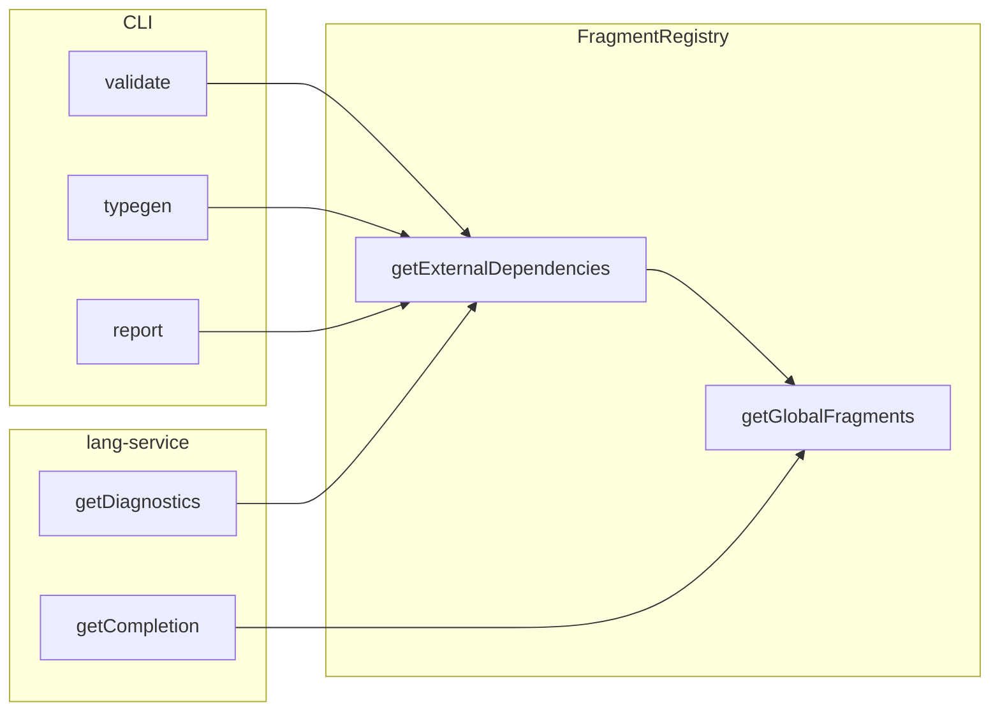
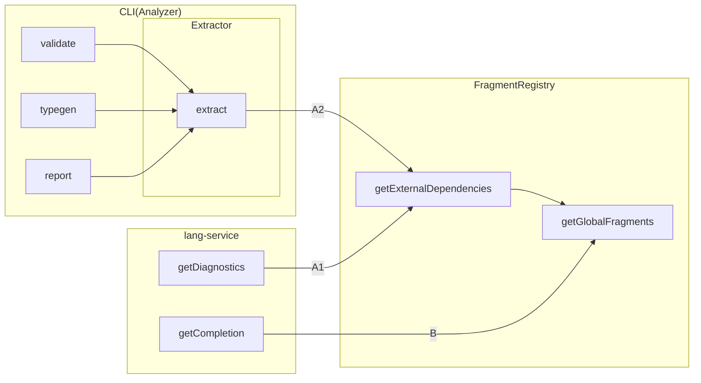

# 3/1

## zakki の見出し再考

何の気なしに、このレポジトリの memo の数を調べてみようと思い、以下のコマンドを実行した。

```sh
find docs/memo | xargs grep "^## "
```

上記の行数を取ったら、1,340 だった。

数は正直どうでもよくて、このコマンドの出力が以下のようになっていて、見出しとしての役割をあまり果たしていない気がしてきた。

```
:
docs/memo/202308.md:## CSS
docs/memo/202308.md:## Misc
docs/memo/202308.md:## CSS
docs/memo/202308.md:## Misc
docs/memo/202308.md:## CSS
docs/memo/202308.md:## Stylelint
docs/memo/202308.md:## Vim
docs/memo/202308.md:## CSS
docs/memo/202308.md:## VSC
docs/memo/202308.md:## recast
docs/memo/202308.md:## GraphQL Tokyo
docs/memo/202308.md:## Web Assembly
docs/memo/202308.md:## Misc
docs/memo/202308.md:## Performance
docs/memo/202308.md:## Web
docs/memo/202308.md:## Next.js
docs/memo/202209.md:## Unix
docs/memo/202209.md:## Jest
:
```

気になりだして、2020 年 9 月分から、再度見出しをつけ直し始めたものの、中々の重労働。1,300 あるので、それはそうなんだけど。

400 個見直すのに、2 時間程度使っている気がする。

## reg-cli / reg-suit と polyfill.io

自分にはあまり関係のない話と思っていた polyfill.io の件、reg-cli の UI Report で使っていたことを唐突に思い出して、修正した。

その過程で @bokuweb さんと Secure by default の考え方について色々と話す。

https://yosuke-furukawa.hatenablog.com/entry/2023/01/12/160406 の話もしたり。

> Node.js はエコシステムが既にあります。このエコシステムを壊すことはできないため、既に存在する機能に対してオプトインする（後から付け加える）形で導入する必要があります。(この点、 Deno などの後発は Secure By Default としてデフォルトからセキュア側に倒す事もできる設計になっていますし、Deno は実際にそうなっています。)

## TypeScript の `DocumentRegistry` 再考

DocumentRegistry は Language Service に対して、 Source File の供給を担う抽象化層。
Language Service が ts の Project に対して 1:1 になるのに対して、DocumentRegistry は Project に対して多対一の関係。

```ts
const documentRegistry = ts.createDocumentRegistry();
const languageService = ts.createLanguageService(
  languageServiceHost,
  documentRegistry
);
```

主なイベント (Language Service 側から利用されるメソッド) は acquire, update, release の 3 種.

- acquire: ファイル名を key にして、Source の AST を返却する. Language Service がファイルを要求するときに動作する
- update: ファイル名を key にして AST の update を行う。裏側では Incremental Parse が動作する？
- release: DocumentRegistry からファイルを破棄する際に呼び出される？ファイルシステムから対象ファイルを削除したことを Language Service が検知した場合に利用する？

---

# 3/4

## img-diff-js のレポジトリメンテナンス

放置気味だった img-diff-js のメンテを行う。

- yarn v1 剥がし
- CI の Node.js 最新化
- renovate の auto merge 有効化
- dependencies upgrade
- performance テスト廃止 (別の npm package と性能比較していたが、古すぎて参考にならなくなっていたため)
- Codecov 追加

## zakki の見出し再考

2021.04, 2021.05 分の h2 見出しを見直した。

## PicoML に CodeCov 導入

折角なので入れてみた。 93% 。これもテスト一杯書いたなぁ。。

---

# 3/5

## Sentry と CodeCov

たまたま、CodeCov と Setnry の UI の両方を眺める機会があって気づいたけど、 CodeCov っていつの間にか Sentry 傘下に入った？

## ts-graphql-plugin の Global Fragment Registry

Language Service の Auto Completion / Diagnostics どちらも、対象となるオペレーションを解析させる時点で「グローバルにどのような Fragment が定義されているか」が判明している状態でないとならない。

そこで、以下の方針で Fragment Map を取り扱うことを考える。

1. `ts.DocumentRegistry` にて、Script File の Open や Update を見張っておき、投機的に Fragment の map を準備しておく
1. 解析時は、事前に準備済の Fragment Map を参照する

特に 2. について、最初は graphql-language-service の `getFragmentDependencies` を使って力技気味に実装することを考えていたが、`getAutocompleteSuggestions`, `getDiagnostics` ともに、オプショナルな引数として `FragmentDefinitionNode[]` を受け取るようになっていたので、これを用いることで実装の目処が立ってきた。

```ts
const externalFragments: FragmentDenitionNode[] = fragmentDefenitionNodes;

getDiagnostics(queryDocument, schema, undefined, undefined, externalFragments);
```

ただ、細かく不都合が出てきていて、上記における解析対象の `queryDocument` が以下の Source 上の Document であったとして、この `MyFragment` の定義は `externalFragments` に含めてはいけないようになっていた。

```tsx
const MyFragment = gql`
  fragment MyFragment on User {
    name
  }
`;
```

一旦、Language Service 側が一通り動作するところまで仕上げた。

https://github.com/Quramy/ts-graphql-plugin/pull/1209

---

# 3/6

## ts-graphql-plugin の Global Fragment Registry

昨日からの続き。

Language Service 側を一通り作ったつもりでいたものの、 `DocumentRegistry` を利用する部分でミスっていることに気づく。

> 1. `ts.DocumentRegistry` にて、Script File の Open や Update を見張っておき、投機的に Fragment の map を準備しておく

`DocumentRegistry` に何かしらの処理を挟み込みたければ、正攻法としては以下のように `ts.DocumentRegistry` を実装したクラスを用意したうえで、 `ts.createLanguageService` の第２引数に渡す形となる。

```ts
class CustomDocumentRegistry implements ts.DocumentRegistry {
  private _delegate = ts.createDocumentRegistry();

  acquireDocumentWithKey(
    ...args: Paramenters<ts.DocumentRegistry["acquireDocumentWithKey"]>
  ) {
    // 自前の通知処理
    return this._delegate.acquireDocumentWithKey(...args);
  }

  updateDocumentWithKey(
    ...args: Paramenters<ts.DocumentRegistry["updateDocumentWithKey"]>
  ) {
    // 自前の通知処理
    return this._delegate.updateDocumentWithKey(...args);
  }

  // 以下略
}

const documentRegistry = new CustomDocumentRegistry();
const languageService = ts.createLanguageService(
  languageServiceHost,
  documentRegistry
);
```

実際、昨日の時点では上記のように実装して Source File の変更検知を挟み込んでいた。

しかし、Language Service Plugin が「lang service を受け取って lang service を返却する関数」であることを考えると、Plugin の中で `ts.createLanguageService` を実行してしまうのが駄目。
tsconfig の `compilerOptions.plugins` の順序にも依存するだろうが、すでに他の Plugin が Language Service をプロキシしている場合に、そのプロキシがいなかったことになってしまう。

このため、 `ts.createLanguageService` を Plugin から実行するわけにはいかず、翻って `DocumentRegistry` を乗っ取る方法を別に用意する必要があった。

TypeScript 本家のソースを読み直していたところ、 `ts.server.Project` type が内部的に `documentRegistry` フィールドを持っていたので、これを使うことにする。

```ts
function createPluginLanguageService(
  info: ts.server.PluginCreateInfo
): ts.LanguageService {
  const originalDocumentRegistry = (info.project as any)
    .documentRegistry as ts.DocumentRegistry;

  originalDocumentRegistry.acquireDocumentWithKey = new Proxy(
    originalDocumentRegistry.acquireDocumentWithKey,
    {
      apply: (delegate, thisArg, args) => {
        // 自前の通知処理
        return delegate.apply(thisArg, args);
      },
    }
  );
}
```

# 3/7

## msw と TypeScript

ts-graphql-plugin への ts 5.4 update renovate PR にて気付いたのだが、msw がなぜか TypeScript に対して Peer Dependency で version を縛っていた。

```
npm ERR! Conflicting peer dependency: typescript@5.3.3
npm ERR! node_modules/typescript
npm ERR!   peerOptional typescript@">= 4.7.x <= 5.3.x" from msw@2.2.2
npm ERR!   node_modules/msw
npm ERR!     dev msw@"2.2.2" from the root project
npm ERR!
```

https://github.com/mswjs/msw/blob/f805d349c6b9faf55c1201c51b4e7fcb29f79fe5/decisions/typescript-versioning.md になぜ TypeScript の version を明記しているかが記載されていた。

## ts-graphql-plugin の Global Fragment Registry

CLI 側への対応をしようにも、Language Service 側にちょこちょこ不具合を見つけてしまい、中々思うように進捗が出せない。

特に Diagnostic が鬼門。 `getDiagnostics` を利用するときは、以下のように `externalFragments` を渡す形となる。

```ts
getDiagnostics(queryDocument, schema, undefined, undefined, externalFragments);
```

GraphQL Language Service の側が、 `externalFragments` の中に閉じて発生する問題を拾ってきてしまう。

```ts
const dependentFragment = gql`
  fragment DependentFragment on Query {
    __typename
    notExistingField # 存在しないフィールド
  }
`;

const query = gql`
  query MyQuery {
    ...DependentFragment
  }
`;
```

上記のファイルに対して、TypeScript のエラーを問い合わせたとして、 `MyQuery` のエラーとして `notExistingField` の問題を報告してほしくない。

GraphQL Language Service は内部的に以下のような Document に展開した上で `getDiagnostics` を計算しているようで、この結果として `const query = ...` の Template String Literal に含まれるはずのない範囲のエラーが報告されるようになってしまう。

```gql
query MyQuery {
  ...DependentFragment
}
fragment DependentFragment on Query {
  __typename
  notExistingField # 存在しないフィールド
}
```

ts-graphql-plugin としては元々は以下のように Template Span を使って依存する Fragment を指定させていて、このときも同じように `notExistingField` のエラーを無視する必要があったのだが、その近辺のロジックが甘かった模様。

```ts
const dependentFragment = gql`
  fragment DependentFragment on Query {
    __typename
    notExistingField # 存在しないフィールド
  }
`;

const query = gql`
  query MyQuery {
    ...DependentFragment
  }
  ${dependentFragment}
`;
```

GraphQL Language Service 側がソースコードの位置を表現する際に用いる位置情報は TypeScript でいう Location 型に相当していて、Language Service で扱うには使い勝手が悪いためにいわゆる position (= テキストにおける先頭からの文字位置) に変換して扱うようにしていた。

```ts
interface IPosition {
  line: number;
  character: number;
}
```

問題は、この変換ロジックが内部的な Document 展開のことを考慮していなかったために起きる。検査対象の Document は以下のような 3 行のものなのに、

```
1  query MyQuery {
2    ...DependentFragment
3  }
```

`getDiagnostics` が「6 行目にエラーがあるよ」と報告してくることになるのだが、さらに location 2 position 変換で 6 行目という溢れた位置を「元々の Document の最終文字位置」として返してしまっていた。

```
1  query MyQuery {
2    ...DependentFragment
3  }
4  fragment DependentFragment on Query {
5    __typename
6    notExistingField # 存在しないフィールド
7  }
```

変換ロジック側で、テキストに存在しない Location を Position に変換しようとしたらエラーを投げるように改修。

---

# 3/8

## msw と TypeScript

> ts-graphql-plugin への ts 5.4 update renovate PR にて気付いたのだが、msw がなぜか TypeScript に対して Peer Dependency で version を縛っていた。

昨日、上記のように書いたばかりであったが、タイムリーに msw 側に Peer 上限撤廃の PR が merge されて、v2.2.3 では ts 5.4 を使えるようになっていた。

https://github.com/mswjs/msw/pull/2077

## Flex Box と `text-overflow: ellipsis` 問題

Flex Item で `ellipsis` が上手く使えない問題の件。

```
+---------------+---------+
|               |         |
| Looong text...|  fixed  |
|               |         |
+---------------+---------+
```

上記のようなレイアウトを実現しようとして、以下のような CSS を書いたとする。

```html
<div class="container">
  <div class="left">
    <div class="truncated">Looong text text</div>
  </div>
  <div class="right">Fixed</div>
</div>
```

```css
.container {
  display: flex;
}

.left {
  flex: auto;
}

.right {
  flex: 0 0 100px;
}

.truncated {
  overflow: hidden;
  white-space: nowrap;
  text-overflow: ellipsis;
}
```

こうしたとしても、`ellipsis` は期待通りには動作せず、以下のように `div.truncated` が伸長してしまう。

```
+-----------------------+---------+
|                       |         |
| Looong text text text |  fixed  |
|                       |         |
+-----------------------+---------+
```

割とよくある問題なので、至るところに解決方法は載っている。

https://css-tricks.com/flexbox-truncated-text/

```css
.left {
  flex: auto;
  min-width: 0; /* 追加 */
}
```

なぜ `min-width` を明示的に指定すると解消するか、という理由については https://bugzilla.mozilla.org/show_bug.cgi?id=1108514#c5 で述べられていた。

> As I recall, the reason "min-width:auto" exists is the following:
>
> (0) General principle: flexbox should _default_ to avoiding overflow / clipped content, for best results (and to behave gracefully in scenarios that web developers don't anticipate).
>
> (1) To that end: it's useful for "flex-shrink" to default to something nonzero, so that if authors design their pages with flexbox and don't consider small devices, then their flex items will be able to to shrink (where shrinking is possible) by default, instead of overflowing. Hence, flex-shrink defaults to "1", not "0", so that flex items will shrink if necessary.
>
> (2) BUT, we can't default to letting things shrink to be _zero-sized_ -- that would also cause overflow/truncated content, violating the principle that we're trying to achieve with (1). Essentially, we want to allow flex items to shrink until their children start overflowing, and then not shrink any further (by default).

Flex Item はデフォルトで伸長・収縮可能であるようになっているべき( Flex というくらいなのでそれはそう)だが、0 まで伸縮してしまうと「要素をなるべく見せるように」という原則に反するため、Overflow しない範囲までしか伸縮しないように暗黙的な min-width があるとのこと。

## ts-graphql-plugin の Global Fragment Registry

ここ 3~4 日間、ts-graphql-plugin を触っているが、いまいち Fragment Registry の Signature や実装が定まらない。

一旦 webpack (Custom Transformer) のことを忘れて CLI と Language Service のことだけを考えると、以下のようになっているはず。



- `validate`, `getDiagnostics`: 検査対象の Document に対する External Fragments が必要
- `getCompletion`: Fragment Nodes の集合だけあれば十分
- `typegen`: Document に対する External Fragments が必要
  - 可能であれば、External Fragments に対する型は Type Alias Import としたい
- `report`: Document に対する External Fragments が必要
  - manifest には、External Fragments が結合された Document の文字列が必要
  - markdown には「このオペレーションはこういう External Fragments を使っているよ」を表示したい

結局、CLI 側は全て External Fragments に頼ることになるから、Extractor に寄せるのが正解？



CLI 側の `getExternalFragments` の要件を考えると、以下の Signature のイメージかしら。

```ts
interface FragmentRegistry {
  getExternalFragments(documentAst: DocumentNode): {
    fragmentName: string;
    node: FragmentDefinitionNode;
    fileName: string;
  }[];
}
```

一方で Language Service 側に必要な Signature は上とは少し異なる。

```ts
interface FragmentRegistry {
  getGlobalFragments(): FragmentDefinitionNode[];
  getExternalFragments(documentText: string): FragmentDefinitionNode[];
}
```

Language Service 側はパフォーマンスに対して機敏になるので、Cache 機構がそれなりに必要になる一方、CLI 側は Fragment に対するトレーサビリティ重視となるし、まずは別の class で実装することを考えた方が筋が良さそうな気がしてきた。

例えば 以下の `fragmentMain` の Template String を編集している最中、というシナリオを考える。
このとき `getExternalFragments` は SVC Version 0-2 の間で同一の結果を返す。

```ts
/* main.ts: svc version: 0 */
const fragmentMain = gql`
  fragment FragmentMain on Query {
    ...FragmentA
    ...FragmentB
  }
`;
```

```ts
/* main.ts: svc version: 1 */
const fragmentMain = gql`
  fragment FragmentMain on Query {
    __t
    ...FragmentA
    ...FragmentB
  }
`;
```

```ts
/* main.ts: svc version: 2 */
const fragmentMain = gql`
  fragment FragmentMain on Query {
    __typename
    ...FragmentA
    ...FragmentB
  }
`;
```

`getExternalFragments` の引数が Document のテキスト情報だけだと「同じ箇所を連続で編集している」というコンテキストを保持できないため、追加引数として付随情報が必要そう。

Language Service 側が知っていて且つこのコンテキストの表現に使えそうな値、ということだと Source File Name と Template Node の start position のペアか？

```ts
declare function getExternalFragments(
  documentText: string,
  fileName: string,
  startPosition
): FragmentDefinitionNode[];
```

`fileName` x `startPosition` を key とした `getExternalFragments` の Cache を持っていたとして、この Cache が利用可能である条件は、以下のようなる？(漏れている気もする)

- 1. `documentText` が valid syntax である, すなわち `parse` の呼び出しは必要
- 2. `documentText` に登場する Fragment Definition, Fragment Spread の種類が前回と同一
- 3. ~~前回時点と、Fragment Registry に登録された Fragment に変更がない(ただし自身の分は除く)~~ 前回時点における External Fragments が、今回の呼び出しまでの間に変更されていない
  - これ、どうやるのがいいんだろ？ Fragment Registry の Mutate で version を加算しておきながら、変更のあった Fragment Name を保持するような構造？

---

# 3/11

## ts-graphql-plugin の Global Fragment Registry

`getExternalFragments` の Cache 周りに手をつけるも茨の道感がすごい。

---

# 3/12

## Storybook と addon-storyshots の Migrate

Storybook v8 がリリースされたため、おしごとで利用している SB について Deprecated となっている `@storybook/addon-storyshots` を引き剥がした。

https://storybook.js.org/docs/writing-tests/storyshots-migration-guide#jest に記載されているのと殆ど同じだったが、RTL の場合は非同期待ち部分を `act` で囲んでおくとよい。

```ts
/* before */

stories.forEach(({ name, story }) => {
  // Instead of not running the test, you can create logic to skip it, flagging it accordingly in the test results.
  const testFn = story.parameters.storyshots?.skip ? test.skip : test;

  testFn(name, async () => {
    const mounted = render(story());

    // Ensures a consistent snapshot by waiting for the component to render by adding a delay of 1 ms before taking the snapshot.
    await new Promise((resolve) => setTimeout(resolve, 1));

    expect(mounted.container).toMatchSnapshot();
  });
});
```

```ts
/* after */

stories.forEach(({ name, story }) => {
  // Instead of not running the test, you can create logic to skip it, flagging it accordingly in the test results.
  const testFn = story.parameters.storyshots?.skip ? test.skip : test;

  testFn(name, async () => {
    const mounted = render(story());

    // Ensures a consistent snapshot by waiting for the component to render by adding a delay of 1 ms before taking the snapshot.
    await act(() => new Promise((resolve) => setTimeout(resolve, 1))); // act で囲んでおく

    expect(mounted.container).toMatchSnapshot();
  });
});
```

最初は test-runner まで持っていくこともちらっと考えたが、元が jest ベースの Storyshots であったし、ますは挙動があまり変わらないように jest + RTL のみとした。

## ts-graphql-plugin の Global Fragment Registry

Fragment Registry 本体が膨らみすぎていたため、以下に分割した:

- 外部に Fragment Definition Node の集合を供給する class: `FragmentRegistry`
- 内部で Fragment Definition Node 実体や重複を管理する class: `DefinitionFileStore`

主に `DefinitionFileStore` の実装とテストに取り組む。

ファイル名を key にした Map と、Fragment 名を key にした Map で 二重に状態を管理する上に、「重複定義された Fragment」と「全体で名前がユニークな Fragment」の間を行き来する構造のため、通常のテストとは別に不変条件を考えてアサートを仕込むようにした。

- 重複 Fragment 定義 map と ユニーク Fragment 定義 map の両方に同一の key が存在することはない
- ファイル名 を key とした Map の value は、重複定義 Fragment map か ユニーク定義 Fragment map のどちらかに必ず含まれる
- etc

`DefinitionFileStore` は `FragmentRegistry` が所有する関係となるが、管理する実体の型としてもはや GraphQL の AST であることを気にする必要がなくなった。

```ts
type DefinitionFileStoreEntry<T = unknown> = {
  name: string;
  node: T;
  fileName: string;
};
```

このおかげで、テストコードで逐一 `fragment FragmentA on Query { __typename }` のようなリテラルを大量に書かずに済む。

## prisma-fabbrica のバグ対応

https://github.com/Quramy/prisma-fabbrica/issues/281

以前に色気だしていわゆる Branded Type の代わりに Symbol を使うように変えていた箇所があったのだけど、トランスパイル不可能なコードを吐いてしまっていた。

```ts
const key = Symbol("KEY");
export const obj = {
  [key]: "value",
};
```

TypeScript のセマンティクス的には問題ないが、 `tsc` でダウンパイルするとエラーとなってしまう状況だった。

---

# 3/13

## Prisma の Edge Function 対応

Prisma の Edge Function 対応が v5.11 で刷新されている.
Neon / PlanetScale 限定ではあるものの、 Prisma Accelerate (= Proxy) 無しに Cloudflare workers や Vercel Edge から TCP で通信できるようになったとのこと.

https://www.prisma.io/blog/prisma-orm-support-for-edge-functions-is-now-in-preview

## ts-graphql-plugin の Global Fragment Registry

何日か前に以下のようにメモしていたが、結局 markdown report で一々結合した Fragment が external なのか、その Template String 自体で定義されたものなのかを明示する必然性を感じなくなった。
Template Reference Resolver で解決して出力した report でも特にそこの表示を分けるようなことはしていなかったため。

`FragmentRegistry` のリファクタを終えて、ようやく CLI 側の実装に戻ってこれた。

> - `typegen`: Document に対する External Fragments が必要
>   - 可能であれば、External Fragments に対する型は Type Alias Import としたい
> - `report`: Document に対する External Fragments が必要
>   - manifest には、External Fragments が結合された Document の文字列が必要
>   - markdown には「このオペレーションはこういう External Fragments を使っているよ」を表示したい

結果的に CLI 側でも `FragmentDefinitionNode[]` または `Map<string, FragmentDefinitionNode>` を供給すれば事足りてしまったので、あっさり実装できた。

後は Global Fragment の一意性に対するエラー表示周りをやれば merge できるかな。
一意性のエラーに関連して、 Fragment を定義した Template String 自体がコピーされてしまうと、全ての Fragment が Duplicated 扱いとなってしまう。

実際、手元にあった graphql-code-generator ベースのプロジェクトで確認してみたが、typescript-react-apollo の Plugin が `gql` タグが付与された Template String をそのまま自動生成コードに貼り付けてしまう実装となっていた。

これを考えると「特定のファイルは ts-graphql-plugin の解析対象から除外する」という処置が必要となる。 tsconfig の `exclude` オプションと同じようなイメージなので、Language Service Host 辺りに glob ライクなマッチャーが生えてるだろ、と思って探してみたが、外から呼び出せるような代物では無かった。

https://github.com/microsoft/TypeScript/blob/c1f0f7cb58b12232d5e9de3e7560376e8a70ce56/src/compiler/commandLineParser.ts#L3801

picomatch などを入れれば似たようなことはできるものの、結局 TypeScript 側のワイルドカードとは仕様が異なり、逆に picomatch ですらオーバースペックとなってしまう。そもそも graphql-language-service 以外の Runtime Dependencies 増やしたくないし。

今回は「除外対象として指定できるのはディレクトリ名またはファイル名だけ」という位置づけにして終わらせることにした。

## graphql-code-generator と `graphql` 関数

元々の発端が GraphQL Code Generator 利用のプロジェクトでも ts-graphql-plugin が動作するようにしたい、というところもあり、念の為に素振りをして生成物などを確認しておいた。

特に想定を超えるようなところは無し。

```ts
import { graphql } from "@/gql";

const document = graphql(`
  query MyQuery {
    id
  }
`);
```

`graphql` 関数の実体はオーバーロードで実装されていた。

---

# 3/14

## ts-graphql-plugin の Global Fragment Registry

一週間前に書いた以下のパターンを CLI 側ですっかり忘れていた。

> GraphQL Language Service の側が、 `externalFragments` の中に閉じて発生する問題を拾ってきてしまう。

PR を merge する前にもう一度 全体の diff を眺めている最中に「そういえば position <-> location 変換器に修正いれたなー」を思い出したことを切欠に「あれ、CLI で同じパターンのハンドリングしたっけ？」と気付いた。

同じような try ~ catch を仕込んでテストケースを追加する程度の修正なのだけど、ここの本質は「エディタ(Language Service) と CLI で報告する内容の一貫性が必要である」ということが現実のコードと乖離しだしてしまっていることだ。

元々は graphql-languagse-service が提供している Diagnostics 取得に移譲して、それぞれの呼び出し元のフォーマットに変換するだけのレイヤであったはずが、独自のエラー解釈だったり、事後処理や例外ハンドリングが肥大化してきて一貫性を保つのが難しくなってきている。

---

# 3/15

## Storycap の Storybook v8 対応

あー、やらねーとなーと思っていたら @indigolain さんが PR 作ってくれた。

https://github.com/reg-viz/storycap/pull/855

この PR をちゃんと見るまで知らなかったんだけど、SB v8 で `@storybook/addons` が廃止されて、`@storybook/manager-api` を使わないといけないようになっていた。

https://github.com/storybookjs/storybook/blob/next/MIGRATION.md#70-addon-authors-changes

## ts-graphql-plugin の graphql-codegen 対応

ようやく Global fragment registry の対応に区切りをつけて main ブランチにマージした。最終的に 41 commits, 2,524 add / 241 delete となったので、かなり巨大 PR だ。

https://github.com/Quramy/ts-graphql-plugin/pull/1209

続いて、以下のような「特定の名前の関数呼び出しにおける第一引数を GraphQL Document として扱えるようにする」という対応を行う。

```ts
import { graphql } from "./gql";

const appQuery = graphql(`
  query AppQuery {
    __typename
  }
`);
```

正直全然簡単で、 Visitor で利用する述語が以下のようになるので、これを各解析器に仕込むように変更するだけ。

```ts
if (
  ts.isCallExpression(node) &&
  ts.isIdentifier(node.expression) &&
  node.arguments[0] &&
  ts.isTemplateLiteral(node.arguments[0]) &&
  node.expression.escapedText === tagName
) {
  return node.arguments[0];
}
```

https://github.com/Quramy/ts-graphql-plugin/pull/1226

これで基本的な部分はできたことになったので、後回しにしていた webpack transformer 部分も後追いで対応を入れる。
Analyzer に移譲しているので、External Fragments の取得コードなどは CLI における `typegen` や `report` と同じ機構に頼るだけ。

Custom Transformer についても、落ち着いて考えたら大したことはなかった。

graphql-codegen を利用した example も追加し、ようやく v3.1.0 としてリリースできた。

https://github.com/Quramy/ts-graphql-plugin/releases/tag/v3.1.0

2/29 に思い立って作業しだしたのでかれこれ２週間かかったのか。

---

# 3/19

## JavaScript の Shadow Realm Proposal

https://github.com/tc39/proposal-shadowrealm を少しだけ読んだ。

## Storycap が Vite で上手く動作しない件

先日公開した Storycap v4.3.0 に関連して以下の Issue 報告が。

https://github.com/reg-viz/storycap/issues/856

Vite で `build-storybook` したときに、以下の import 文の先でバンドルが正しく生成されない、という問題。

```js
import { withScreenshot } from "storycap";
```

https://github.com/reg-viz/storycap/pull/855 にて、以下のような Differential Load を仕込んでいた箇所が上手く解決できていない。

```ts
let makeDecorator;
try {
  makeDecorator = require("@storybook/addons").makeDecorator;
} catch {}
try {
  makeDecorator = require("@storybook/preview-api").makeDecorator;
} catch {}
```

https://github.com/reg-viz/storycap/blob/v4.3.0/packages/storycap/src/client/with-screenshot.ts#L3-L8

webpack の場合、ある程度 `require` を static に解決してくれるので、上記は問題なく動作するが、 Vite (おそらく Rollup) だとこのハックが使えないのだと思う。

```js
import { withScreenshot } "storycap";
```

```js
import { withScreenshot } "storycap/legacy-addon";
```

## ts-graphql-plugin に定義ジャンプを追加

https://github.com/Quramy/ts-graphql-plugin/pull/1248

Global Fragment Registry だよりに取得する方は簡単に書けた。

ずっと `getDefinitionAtPosition` の Language Service Method だと思っていたけど、 VSCode で挙動を確認したら、 `getDefinitionAndBoundSpan` という Method が利用されていた。戻り値としては `definitions` だけでなく、参照元の `textSpan` が追加されている程度の違いにしか見えないんだけど、何でメソッド増えていたんだろう？

---

# 3/26

## Storycap が Vite で上手く動作しない件

再び @indigolain さんに Fix PR を作ってもらった。

https://github.com/reg-viz/storycap/pull/857

Rollup (より正確には `@rollup/plugin-commonjs` plugin) にて、import / require が 混在しているファイルについて require を無視してしまう、というのが問題であったため、これを修正してもらい、一旦問題のファイルについて、 Import statement を使わずに全て `require` にすることで Differential Require を実現している。

しかし、Rollup の内部実装に強く依存する方法であるし、やはり hacky な手法であることは否めないため、Storycap の次の Major Version で Storybook v6 以下のサポートを切り落とすのも実施することを相談した。

```js
try {
  makeDecorator = require("@storybook/addons").makeDecorator;
} catch {}
```

## Storycap からレガシーな Storybook のサポートを落とす

https://github.com/reg-viz/storycap/pull/862 で対応。

直近で頭を悩ませていた `@storybook/addons` or `@storybook/preview-api` については、Preview API が SB v7 以降からであれば存在するため、SB <= 6 以下を切り捨てることにした。

## jest-prisma と Pg における Transaction 中でエラーとなった場合の扱いについて

https://github.com/Quramy/jest-prisma/issues/141 に @hokaccha さんから報告を貰った。

```txt
current transaction is aborted commands ignored until end of transaction block
```

jest-prisma が貼るトランザクション中にて、一位制約違反などをおこした後に別のクエリを発行しようとすると、PostgreSQL がクエリを停止するというもの。

正直、jest-prisma のレイヤで何か対策が打てるとは思えなかったが、Nested Transaction で テストコード側に workaround を記述する方法は思いついたため、Issue で連携。

https://github.com/Quramy/jest-prisma-repro-141/pull/1

---

# 3/27

## Storybook の Module Mocking における方向性について

https://github.com/storybookjs/storybook/discussions/26640 にて、package.json での Conditional Imports を利用する提案がなされていた。

直接はこの件と関係ないのだけど、RSC って Conditional Import で識別されるの？

## Storycap が Vite で上手く動作しない件

v4.3.1 で workaround が書けたと思っていたが、結局 `require` を使っている箇所が正しく動作していない模様。

https://github.com/reg-viz/storycap/issues/856#issuecomment-2022117300

## ts-graphql-plugin に定義ジャンプを追加

Interpolation 板の Go to definition まで対応するのがやはり億劫であったため、Global Fragment Registry 有効時限定の機能である旨を README に注記した上で v3.2.0 を出した。

Global Fragment, graphql-codegen や Relay 特有と思っていたが、Apollo Client でも同様なことができることを今更ながら知った。

```ts
import { ApolloClient, gql, InMemoryCache } from "@apollo/client";
import { createFragmentRegistry } from "@apollo/client/cache";

const client = new ApolloClient({
  uri: "http://localhost:4000/graphql",
  cache: new InMemoryCache({
    fragments: createFragmentRegistry(gql`
      fragment ItemFragment on Item {
        id
        text
      }
    `),
  }),
});
```

https://www.apollographql.com/docs/react/data/fragments#registering-named-fragments-using-createfragmentregistry

## Apollo Client 3.8 以降の API の使い分け

すごく久しぶり Apollo Client を触った。本来の目的は久しぶりに `useFragment` の使い心地を確認したかったためだったが、

`useSuspenseQuery` 以外にも Query 系の hook が多く、いまいち使い分けがわからん。

`useBackgroundQuery`, `useReadQuery`, `useLoadableQuery`, `useFragment` おそらく、Operation の発火と Suspend がひっついているものと分離されているものと、単純に Store の内容の変更検知を行うものが混ざっているのだと思うが。。。

## Style 属性ベースの Zero Runtime CSS in JS である Tokenami

https://github.com/tokenami/tokenami というライブラリの存在を知った。

知った経緯は MUI の Zero Runtime CSS Issue のコメントを読んでいたところ、このライブラリへの言及があったため。

https://github.com/mui/material-ui/issues/38137#issuecomment-2005453911

特徴としては、Tailwind ライクな Utility First な思想をベースとしつつ、Style 属性への Property で Utility 値を表現するようになっている。

Style 属性へのインジェクトは、下記のように Tokenami が提供する `css` 関数を利用する形。

```jsx
import { css } from "@tokenami/css";

function Page() {
  return (
    <h1 style={css({ "--margin-top": 0, "--margin-bottom": 5 })}>
      Hello, World!
    </h1>
  );
}
```

基本、CSS Property 名の先頭に `--` プレフィクスを付与するだけで利用できるため、Tailwind よりも習熟が容易であるとのこと。

この `css` 関数は Runtime 時にもそのまま評価される。Tokenami が提供している CLI は JSX をトラバースして、必要な Property を抜き取るのみ。ここは PandaCSS と似ている。
