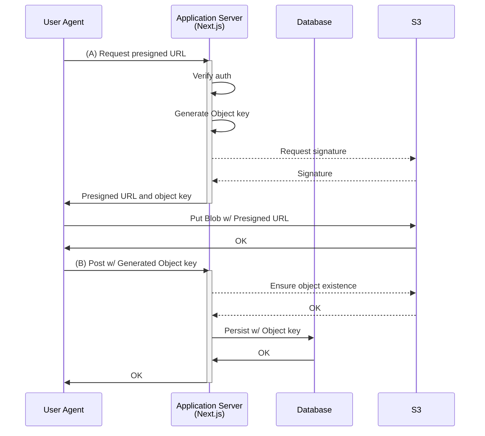
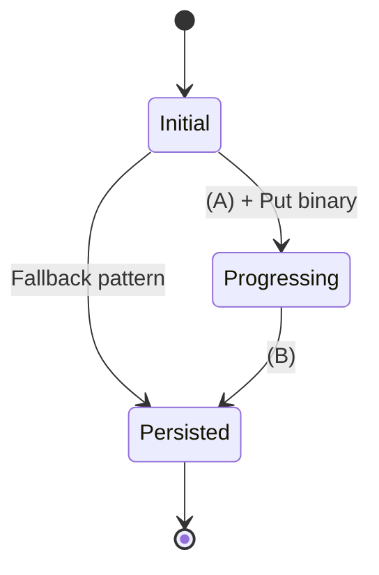

# 5/2

## reg-suit のメンテと GCP

自分のクレカ更新したときに Google の課金情報を更新するのを忘れていたせいで、抱えている GCP Project のいくつかが停止されていた。
このせいで、reg-suit の開発用に使っている GCS にアクセスできなくなり、CI が全落ちしていて reg-suit の Deploy に支障をきたしていたため、アカウントを正常化して Fail していたいくつかの PR を re-run した。

---

# 5/7

## Excalidraw

いわゆる Miro のような UI を OSS として切り出したパッケージ。

https://docs.excalidraw.com/

Canvas にアクセスする コアな部分は [Rough.js](https://roughjs.com) を利用していて、エディタ部分などを React で実装している。

---

# 5/8

## microCMS と fetch failed

Node.js で miscro-cms-sdk 使っている箇所で `Network Error. Details: TypeError: fetch failed` だけのログが Error Tracking されていて先に進めなくなる問題。
大方 `getaddrinfo` で DNS が詰まったとかその手の問題だとは思うのだけど、裏を取ろうにも caused by が一切表示されないのは困る。

https://github.com/microcmsio/microcms-js-sdk/issues/82

## Colocated fragment stub

Apollo Client もしくは graphql-codegen で `useFragment` している Component のテストを考えると「`makeFragmentData` に食わせるスタブデータをどう作成・管理していくか」というネタに行き着く。

「データは Component と対で管理する」が大原則なわけだから、スタブデータも Component のディレクトリに配置したいし、`useFragment` がネストしているのであれば、Query が Compose されるのと同じように、スタブデータも Composition したい。

以前に、自前で スタブデータ用の factory を自前で作って Compose するような構成を採用したことがある。

```ts
// components/ChildComponent/stub.ts

import type { DocumentType } from "~/gql";
import type { childFragmentDocument } from ".";

export const getChildFragmentData = () => {
  const data = {
    // データ
  } satisfies DocumentType<childFragmentDocument>;
  return data;
};
```

```tsx
// components/ChildComponent/index.stories.tsx

import type { Meta, StoryObj } from "@storybook/react";
import { ChildComponent } from ".";
import { getChildFragmentData } from "./stub";

const meta = {
  title: "ChildComponent",
  component: ChildComponent,
} satisfies Meta;

type Story = StoryObj<typeof meta>;

export const Default = {
  args: {
    data: getChildFragmentData(),
  },
} satisfies Story;
```

```ts
// components/ParentComponent/stub.ts

import type { DocumentType } from "~/gql";
import { getChildFragmentData } from "~/components/ChildComponent/stub";
import type { parentFragmentDocument } from ".";

export const getParentFragmentData = () => {
  const childFragmentData = getChildFragmentData();
  const data = {
    child: childFragmentData,
    // データ
  } satisfies DocumentType<parentFragmentDocument>;
};
```

```tsx
// components/ChildComponent/index.stories.tsx

import type { Meta, StoryObj } from "@storybook/react";
import { ChildComponent } from ".";
import { getParentFragmentData } from "./stub";

const meta = {
  title: "ParentComponent",
  component: ParentComponent,
} satisfies Meta;

type Story = StoryObj<typeof meta>;

export const Default = {
  args: {
    data: getParentFragmentData(),
  },
} satisfies Story;
```

上記における stub.ts の部分が自前の factory であり、 https://www.mizdra.net/entry/2023/09/28/174037 における以下に相当している。

> ダミーレスポンスを作成する補助関数 (factory みたいなやつ) を自作している人が多いんじゃないかと思います。

mizdra さんと自分でスタンスが異なるところがあるとすると、mizdra さんは GraphQL の Type(Schema) に対する factory を考えて、自分は Fragment(Operation) に対する factory を考えているという点。

ただ、Fragment は Type を特化した型でしかないので、Type Factory のヘルパがあれば自分のユースケースは原理的には満たせるはずだけど、いずれにせよ触って確かめてみたほうがいいだろうな。

---

# 5/10

## TypeScript 5.5 の `--isolated-declarations` と JSR

TypeScript 5.5 の --isolated-declarations について、https://devblogs.microsoft.com/typescript/announcing-typescript-5-5-beta/#isolated-declarations を読んだときは「なんでこんな話出てきたんだろ？」という気持ちだったけど、https://jsr.io/docs/about-slow-types やここからリンクされている https://github.com/jsr-io/jsr/issues/444#issuecomment-2079772908 を読んで腹落ちしてきた。

確かに JSR では 如何に高速に d.ts を出力するかというテーマが効いてくるので、型定義を分散して処理できるというのが重視されてくる。

`--isolated-declarations` が推奨かというと、少なくとも TypeScript サイドとしては中立的なスタンス。

> We also feel it is worth calling out that isolatedDeclarations should be adopted on a case-by-case basis. There are some developer ergonomics that are lost when using isolatedDeclarations

---

# 5/13

## Excalidraw のコードを読む

https://github.com/excalidraw/excalidraw

- 要素の描画周り:
  - https://github.com/excalidraw/excalidraw/blob/master/packages/excalidraw/renderer/renderElement.ts
    - renderElement という関数が実体か
    - https://github.com/excalidraw/excalidraw/blob/273ba803d96322a7a2fff61d684ac8dc77fcb636/packages/excalidraw/renderer/staticScene.ts#L386 から呼び出されている
      - Static Scene と Interactive Scene とやらに大別される
      - これらは描画される canvas が異なる
      - Static は 楕円や矩形などの elements
      - Interactive はオブジェクト選択時の四角形などのこと
    - 実際に要素を描画しているのは https://github.com/excalidraw/excalidraw/blob/273ba803d96322a7a2fff61d684ac8dc77fcb636/packages/excalidraw/renderer/renderElement.ts#L290 あたり
      - https://roughjs.com/ を利用している
- ツールなどの状態管理
  - AppState に集約されている
    - https://github.com/excalidraw/excalidraw/blob/273ba803d96322a7a2fff61d684ac8dc77fcb636/packages/excalidraw/types.ts#L221
    - `updateData` を経由するが、 https://github.com/excalidraw/excalidraw/blob/273ba803d96322a7a2fff61d684ac8dc77fcb636/packages/excalidraw/actions/manager.tsx#L157-L168 により perform が呼び出されるだけ
    - この場合は https://github.com/excalidraw/excalidraw/blob/273ba803d96322a7a2fff61d684ac8dc77fcb636/packages/excalidraw/actions/actionProperties.tsx#L298-L315 が実体ということになる。
    - AppState の変更だけでなく、elements の更新も行われる
  - 例: オブジェクトの背景色: `currentItemBackgroundColor` が LayerUI から更新される流れ:
    - https://github.com/excalidraw/excalidraw/blob/273ba803d96322a7a2fff61d684ac8dc77fcb636/packages/excalidraw/actions/actionProperties.tsx#L331
      - https://github.com/excalidraw/excalidraw/blob/273ba803d96322a7a2fff61d684ac8dc77fcb636/packages/excalidraw/components/ColorPicker/ColorPicker.tsx#L251
- Undo/Redo まわり
  - Undo の場合、対応している action はここ: https://github.com/excalidraw/excalidraw/blob/273ba803d96322a7a2fff61d684ac8dc77fcb636/packages/excalidraw/actions/actionHistory.tsx#L53-L60
  - ロジックは https://github.com/excalidraw/excalidraw/blob/master/packages/excalidraw/history.ts
- https://github.com/excalidraw/excalidraw/blob/master/packages/excalidraw/components/App.tsx がやばい
  - canvas の pointer down handler だけでこれ。。。https://github.com/excalidraw/excalidraw/blob/273ba803d96322a7a2fff61d684ac8dc77fcb636/packages/excalidraw/components/App.tsx#L5666-L5973

---

# 5/14

## CSS の `light-dark` function

https://webkit.org/blog/15383/webkit-features-in-safari-17-5/ を眺めている過程で知った。

https://developer.mozilla.org/en-US/docs/Web/CSS/color_value/light-dark

以下のように、Color Scheme に対応した値を書けるということらしい。

```css
:root {
  color-scheme: light dark;
  --background: light-dark(black, white);
  --text: light-dark(white, darkslategray);
}
body {
  background: var(--background);
  color: var(--text);
}
```

---

# 5/15

## MinIO の Docker Compose

```yaml
version: "3"
services:
  minio:
    image: minio/minio:latest
    ports:
      - 9000:9000
      - 9001:9001
    volumes:
      - ./.data/minio/data:/export
      - ./.data/minio/config:/root/.minio
    environment:
      MINIO_ROOT_USER: minio
      MINIO_ROOT_PASSWORD: minio123
    command: server /export --console-address ":9001"
  createbuckets:
    image: minio/mc
    depends_on:
      - minio
    entrypoint: >
      /bin/sh -c "
      until (/usr/bin/mc config host add myminio http://minio:9000 minio minio123) do echo '...waiting...' && sleep 1; done;
      /usr/bin/mc mb myminio/mybucket;
      /usr/bin/mc policy download myminio/mybucket;
      exit 0;
      "
```

## iPhone/iPad での input 要素からのカメラアクセスと画像フォーマット

タブレットからカメラを起動して画像をアップロードするような Web アプリについて、カメラで撮影された画像の回転ってどう扱われるんだっけ？というのが気になったので調べた。

雑に MDN の https://developer.mozilla.org/ja/docs/Web/HTML/Element/input/file に手持ちの iPad からアクセスして確認してみる。

結果は以下:

- サイトを landscape で開いた状態でカメラ起動, portrait となるように回転してから撮影: portrait の画像として認識される
- サイトを portrait で開いた状態でカメラ起動, portrait となるように回転してから撮影: landscape の画像として認識される

https://medium.com/wassa/handle-image-rotation-on-mobile-266b7bd5a1e6 には、EXIF が利用されると書いてある。
この記事は結構古いため、iOS における写真の形式は JPEG だったころと思うが、現在の HEIF 形式でも基本的にはメタデータは EXIF に保存されているとのこと。

これは今更ながら初めて知ったのだけど、デバイス上は HEIF であったとしても、Safari で ファイル選択した瞬間に JPEG に変換されている模様。

https://qiita.com/noboru_i/items/c7a1cb5200ea1ddda751

ただ、この挙動についての webkit なり Apple なりの仕様らしき文書は見つけることができなかった。

EXIF の扱いという意味では、アップロード後に別形式に変換書ける(webp とか PNG とか) に EXIF の情報を正しく扱っていれば基本的には問題無さそう。

試しに iPad で撮影した portrait な画像を sharp で webp にしてみたところ、ものの見事に 90 度傾いてしまったが、引数無しの `rotate` を挟むことで、EXIF の向きに従ってアウトプットしてくれた。

```js
import sharp from "sharp";

const resizeWidth = 200;

async function resizeBuffer(inputBuffer: Buffer) {
  const outputBuffer = await sharp(inputBuffer)
    .rotate() // これ
    .resize(resizeWidth)
    .webp();
  return outputBuffer;
}
```

> Rotate the output image by either an explicit angle or auto-orient based on the EXIF Orientation tag.

https://sharp.pixelplumbing.com/api-operation#rotate

ブラウザでアップロードする前に選択したファイルを Preview する場合は Canvas を利用することになるため、こちらでもリサイズ時の挙動を確認してみた。
以下のコードを Chrome と iPad Safari で確認してみたが、こちらは特に回転方向を気にせずとも EXIF 通りの向きで描画される。

```js
const resizeWidth = 200;

document
  .querySelector("input[type='file']")
  .addEventListener("change", async (event) => {
    const file = event.target.files[0];
    const canvas = document.querySelector("canvas");
    const context = canvas.getContext("2d");
    const image = await createImageBitmap(file, {
      resizeWidth,
      resizeQuality: "high",
    });
    context.drawImage(image, 0, 0);
    canvas.width = image.width;
    canvas.height = image.height;
    image.close();
  });
```

なお、mac Chrome から HEIF ファイルを選択してみると、sharp / `createImageBitmap` ともに動作しない（もちろん mac 上では Preview アプリで表示可能な画像)。
sharp については https://github.com/libvips/libvips を突っ込めば decode できるらしいが、こちらは未検証。

---

# 5/16

## Server Action と ファイルアップロード と Progressive Enhancement

昨日の画像アップロードの件に引きずられて、SA で画像アップロードするパターンを考えていた。

ストレージに S3 を選択しているのであれば、方式としては定番の Presigned URL と Direct Uploading の併用パターン。



図における (A), (B) 部分が SA となるわけで、この２つを `"use server"` な関数として用意する。

ただ実行するだけであれば、以下で十分。

```tsx
"use client";

function UploadForm() {
  return (
    <form
      onSubmit={async (e) => {
        e.preventDefault();

        const { url, objectKey } = await getPresignedURLAction(); // (A)

        await fetch(url, { body: selectedFile });

        await postAction({ objectKey }); // (B)
      }}
    >
      ...
      <input type="file" />
      ...
    </form>
  );
}
```

他のフィールドを埋めさせている間にバイナリ送信を済ませておくのであれば、以下のようなパターンもある。

```tsx
"use client";

function UploadForm() {
  const [generatedId, setGeneratedId] = useState(null);
  return (
    <form
      onSubmit={async (e) => {
        e.preventDefault();

        await postAction({ objectKey: generatedId }); // (B)
      }}
    >
      ...
      <input
        type="file"
        onChange={async () => {
          const { url, objectKey } = await getPresignedURLAction(); // (A)

          await fetch(url, { body: selectedFile });

          setGeneratedId(objectKey);
        }}
      />
    </form>
  );
}
```

PE のことを考え出すともう少し複雑になってくる。

以下のように form action として設定したいわけだが、JavaScript を前提としないので `fetch` 部分を残すわけにはいかない。

```tsx
"use client";

function UploadForm() {
  const [generatedId, setGeneratedId] = useState(null);
  return (
    <form formAction={postAction}>
      ...
      <input
        type="file"
        onChange={async () => {
          const { url, objectKey } = await getPresignedURLAction();

          await fetch(url, { body: selectedFile });

          setGeneratedId(objectKey);
        }}
      />
      ...
    </form>
  );
}
```

Blob ごと SA に送りつけて、バイナリ転送は Next.js -> S3 の経路に委ねることになる。

```tsx
"use client";

function UploadForm() {
  return (
    <form formAction={postActionWithBinay}>
      ...
      <input name="file" type="file" />
      ...
    </form>
  );
}
```

幸い、SA は自動的に `multipart/form-data` となるため、Encode Type 周りで困ることはないのだけど。

JavaScript の有無に応じてバイナリ送信方法が切り替わるようにすると、とりあえず動くという意味では以下のようになった。
`useState` と `useActionState` で状態が分散されていて可読性が低いのが気に食わない。

```tsx
"use client";

import { useState, useEffect, Fragment, type ChangeEvent } from "react";
import { useFormState as useActionState } from "react-dom";

import { getPresignedUrlForUpload, createImage } from "./actions";
import { FileInput } from "./FileInput";

export function UploadForm() {
  const [{ errorMessages, latestUploadedObjectId }, createImageAction] =
    useActionState(createImage, {
      succeeded: true,
      latestUploadedObjectId: undefined,
      errorMessages: [],
    });

  const [generatedId, setGeneratedId] = useState<string | null>(null);

  const handleFileChange = async (event: ChangeEvent<HTMLInputElement>) => {
    if (event.target.files?.length !== 1) return;
    const body = event.target.files[0];
    const { objectId, presignedURL } = await getPresignedUrlForUpload();
    await fetch(presignedURL, { method: "PUT", body });
    setGeneratedId(objectId);
  };

  useEffect(() => {
    setGeneratedId(null);
  }, [latestUploadedObjectId]);

  return (
    <form action={createImageAction}>
      {errorMessages.length > 0 && (
        <div role="alert">
          {errorMessages.map((msg) => (
            <p>{msg}</p>
          ))}
        </div>
      )}
      <Fragment key={latestUploadedObjectId ?? "initial"}>
        <FileInput
          name={generatedId ? undefined : "imageFile"}
          thumbnailWidth={200}
          onChange={handleFileChange}
        />
        {generatedId && (
          <input type="hidden" name="generatedId" value={generatedId} />
        )}
      </Fragment>
      <nav>
        <button type="submit" disabled={!generatedId}>
          Submit
        </button>
      </nav>
    </form>
  );
}
```

対応する SA は以下のようになる。
Form の `generatedId` 有無に応じて、S3 へのバイナリ送信(非 JS 送信時)か存在確認を行うかを振り分けてから、DB への書き込みを行なう。

```ts
"use server";

export async function createImage(
  prevState: CreateImageState,
  formData: FormData
): Promise<CreateImageState> {
  const generatedId = formData.get("generatedId") as string | null;

  let objectId: string;
  if (!generatedId) {
    const imageFile = formData.get("imageFile") as File | null;
    if (!imageFile || !imageFile.size) {
      return {
        ...prevState,
        succeeded: false,
        errorMessages: ["Select file."],
      };
    }

    objectId = uuid.generate();
    await putObjectToS3(objectId, imageFile);
  } else {
    const existence = await ensureObjectExistence(generatedId);
    if (!existence) {
      return {
        ...prevState,
        succeeded: false,
        errorMessages: ["Something went wrong."],
      };
    }
    objectId = generatedId;
  }

  await primsa.image.create({
    data: {
      objectId,
    },
  });

  revalidatePath("/naive");

  return {
    succeeded: true,
    latestUploadedObjectId: objectId,
    errorMessages: [],
  };
}
```

「画像をアップロードして、DB に(そのファイルパスを)永続化する」という処理としてみると、この処理の中には「バイナリ保存されたが永続化されていない」(下図における `Progresssing`) という状態は存在しない。
一方でブラウザから直接ストレージ(S3) を意識するパターン(元々考えていたのはこっち)の場合、Client が ストレージと DB の両方を明確に意識しているので、`Progressing` は遷移の過程として意識するべき状態となる。



脳内の状態遷移図は上記のようになっているが、クライアント側のコードが実際はそうなっていない（そうは見えない)ところにモヤ付きがあるんだと思う。
単一のステートマシンを考えているのに、 `useActionState` と `useState` (及び hidden input) に管理箇所が散在しているのが気分悪い。

SC や SA がクラシックな MPA 型のフレームワークへの復興のように捉えると、"Fallback pattern" と書いた側のやり方をベースラインとして考えた方がよいんだろうか？

---

# 5/20

## React Compiler の実現方式とか

https://react.dev/learn/react-compiler#usage-with-nextjs を見ると、React Compiler は Turbopack でも動作すると記載されている。

確かに、`experimental.reactCompiler` を true にした状態で、`next --turbo` した状態でも Compiler 側で Memo が呼び出されているのが見て取れた。

Turbopack って Babel Plugin 使えるんだっけというのがギモン。
https://turbo.build/pack/docs/features/javascript#babel には Turbopack では Babel Support してないと書いてあったから違和感覚えたけど、https://nextjs.org/docs/app/api-reference/next-config-js/turbo#supported-loaders の方には babel-loader も対応していると書いてあるから、まぁこれが動いているということなのかな。。

ちなみに React 側のコードの起点はここ: https://github.com/facebook/react/tree/main/compiler/packages/babel-plugin-react-compiler

---

# 5/21

## web.dev と Google IO

### Web Platform Status

caniuse の後継的な存在。

https://webstatus.dev/

### Screen wake lock

https://web.dev/blog/screen-wake-lock-supported-in-all-browsers?hl=en

Wake Lock API が 全ブラウザで利用可能になった(Newly Available) という話。

Wake Lock API 自体は https://developer.mozilla.org/en-US/docs/Web/API/WakeLock に説明が記載されている。

レシピアプリや地図アプリのような、「ユーザーが画面に触れない時間が一定続くことが想定されるが、その間にデバイスがスリープされてしまうと困る」というコンテキストで有用。
UA に対して、スリープさせないように依頼することができる.(無論、デバイスのリソース状況などによって OS 側から reject される可能性もある)

---

# 5/22

## Playwright のベストプラクティス

https://playwright.dev/docs/best-practices というページが公開されていた。

ざっと目を透しただけだけど、そんなに深いことは書いていないイメージ。
(Flaky はこうやって対処していけ、とかそういうノウハウを期待したけど、そういうものではなかった)

## React の Server Action と同時実行制御

https://twitter.com/tomus_sherman/status/1792945548548256231

> Server Actions are designed for mutations that update server-side state; they are not recommended for data fetching. Accordingly, frameworks implementing Server Actions typically process one action at a time and do not have a way to cache the return value.

https://react.dev/reference/rsc/use-server#caveats

実際に自分で試してみたところ、Next.js では確かに直列化されて実行されていた。

直列化の対象は多分、「その画面から読み込んでいる action すべて」と思われる。ある画面から、複数の Server Function を利用していたとしても、同時に実行(POST) できるのは、どれか一個だけ、ということ。

---

# 5/23

## Prisma と React Native

Expo で Prisma 使えるようになるという記事が公開されてた。

https://www.prisma.io/blog/bringing-prisma-orm-to-react-native-and-expo

React Native で Prisma ってどういうこっちゃと思ったけど、Android アプリからローカルの sqlite 操作するような話の流れということか。

## Next.js v15 Release Candidate

https://nextjs.org/blog/next-15-rc

キャッシュ周りのデフォルト挙動が色々変わった。元々デフォルトで動作していたものが Opt-in に切り替わった、という話なので、大半の Cache 切ってた側からすると「ああ、そうですが」という感想になってしまうが、 Router Cache についてはいちいち Revalidate しないとダメだったこともあるので、むしろ楽になるかも。

`next/after` については完全に知らなかった。一瞬、「これ使えば SSR 時の jotai atom family の掃除できるか？」と思ったけど、あれは Client Component だから無関係だわ。

RSC の一連の処理が全部終わったタイミングで実行したいのって何があるかなぁ。ありそうなところでいうと、分散トレースで Active Span になにか書き込むとかか...?
Span のクローズ自体を Next.js の otel 連携機能だったり dd-trace がやってくれてるからあんまり自分でどうこう、とはならないしなぁ。

---

# 5/24

## React の Server Action と同時実行制御

一昨日の時点から、Next.js / react-dom 双方のコードを読んでようやく、どうやって `useActionState` が安全に動くのかを実現しているのかを理解できた。
「Fiber 側で管理しているキューの Action が App Router のキューに Push している」という構造が飲み込めてしまえば、複数の 複数種の Action が混在されて実行依頼された場合にどう動くのかも、正しく想像できるようになれた。

最初、なぜか「Queue の中に Queue が作られる」という妙なことを勝手に想像してしまって訳がわからなくなったけど、`node_modules/next` の中のコードに printf デバック仕込んでログの順番読んでる内に納得できた。
非同期制御や排他制御系のコード、ブレークポイント打っちゃうと途端に意味なくなるのでしんどい。

## swc / acorn で同じトランスパイルロジックを実装する例

swc plugin (というよりは Rust における JS AST analysis の作法とか) が気になっていたが、t_wada さんに 新生 power-assert の話を聞いたので、勉強材料として良さそう。

- https://github.com/twada/power-assert-monorepo/tree/main/packages/transpiler-core : estree (acorn) 版
- https://github.com/twada/power-assert-monorepo/tree/main/packages/swc-plugin-power-assert: swc 版

また、esbulid や Rollup におけるラッパも同じモノレポにあるとのことなので、この辺りの Plugin の作り方を知りたくなったときにも参考にできそう。

なんか面白い Transformation の題材ないかなぁ。。

---

# 5/28

## 非同期 Client Component 利用時の警告例外

[@dai_shi さんと React コアチームのやり取りにて](https://x.com/rickhanlonii/status/1794339035621790100)にて、「Async Component は Client で動かせるかどうか」という趣旨のものがあった。

React コアチームの返答としては、以下の警告(例外) が Throw されるからダメだよ、というもの。

> async/await is not yet supported in Client Components, only 'Server Components. This error is often caused by accidentally "adding `'use client'` to a module that was originally written " for the server.

Async Component を Client で動作させるという意味では、Storybook v8 の `experimentalRSC` フラグもこのパターンに該当するため、「実は console にこの警告が出ているのか？」について試してみたが、予想を裏切って何も警告は表示されなかった。
むしろ、 `experimentalRSC: false` にして初めて警告が表示された。

気になって React のコードを覗いてみたが、件の例外は以下で Throw されていることがわかる:

https://github.com/facebook/react/blob/ea6e05912aa43a0bbfbee381752caa1817a41a86/packages/react-reconciler/src/ReactFiberThenable.js#L174-L194

> This root has suspended repeatedly in the shell without making any progress (i.e. committing something).
> This is highly suggestive of an infinite ping loop, often caused by an accidental Async Client Component.
>
> During a transition, we can suspend the work loop until the promise to resolve, but this is a sync render, so that's not an option.
> We also can't show a fallback, because none was provided. So our last resort is to throw an error.

このコード中では、上記のようにコメントされている。

`experimentalRSC` の実体は 非同期 Component を `<Suspense>` で囲む Decorator を自動で追加しているだけ、という挙動を考慮すると、 Transition 中であれば、Suspend すれば解決できる、という書き方だけど、Root が Transition である保証がないから Suspend まではしてないよ、ということなのかな？

---

# 5/30

## Amplify における Runtime 環境の管理

とある Amplify(Compute Hosting あり) なアプリケーションで、少し困ったことが起こった。

経緯(表面的に起こっていたこと):

- 2024.05.25 から突如、Sentry の通知に `TypeError: request.headers.split is not a function` という Issue が流れ出す
  - 本番に相当する Branch への push は特に行っておらず、いわゆる「何もしてないのに壊れた」という状況
- 該当スタックトレースには Sentry SDK 自体が含まれていた. Google 検索すると以下の issue と PR に辿り着く:
  - https://github.com/getsentry/sentry-javascript/issues/10936
  - https://github.com/getsentry/sentry-javascript/pull/10938
- アプリケーションの lockfile を見ると、当該 PR release 前の Sentry SDK を利用していた. ひとまず stg 環境で Sentry SDK の upgrade を行い、様子見

> 何もしてないのに壊れた

最初、なぜこうなってしまったのかが説明できずに頭を悩ませていたが、それこそ Sentry の events を見たら、 Node.js のランタイム version が v20.13.1 に切り替わっていたことが分かる。

Amplify 上では Lambda (のはず. 実のところこれも本当なのか？は分かってない) のランタイムを直接指定するようなことはしていおらず、AWS 側が Lambda の Node.js Runtime を Upgrade したことがトリガーであったと推測している。

一番よろしくないのは、ランタイムバージョンが build 成果物に対して pin されていない、という点。
`node: v20.x` のような指定なのは Lambda では割と当たり前ではあるものの、つい Fargate や EKS のように、Container に Runtime まで焼き付けたアーキテクチャに慣れていたせいでこれに思い至らなかった。
恐らく、Lambda + Node.js でこれを堅く運用したいのであれば、それこそ Container を使う形式にするなりを選択するのだろう。
とはいえ、Amplify にそんな選択肢はないと思うが。

以下にビルド時に依存パッケージを変更する方法が記載されていて、Node.js が変更できると書いてあるが、これは飽くまで Build 時の話。

https://docs.aws.amazon.com/ja_jp/amplify/latest/userguide/custom-build-image.html#setup-live-update

実際に試してみたが、Deploy された後の CW Logs で `process.version` を確認しても自分が指定した値にはならない( Lambda であると考えたらそう簡単に pinning できる方が不自然ではあるので、想定通りではあった)

また、このアプリケーションは Next.js によるもので、且つ Static / Revalidate あり というパターンであるため、ビルド時にもデプロイ後のランタイムでも HTML/JSON/RSC Payload の生成が動く。
このため、ビルドとランタイムで違う JavaScript ランタイムが動作してしまうのはよろしくない。

結局、Amplify で Node.js のアプリケーションを動かすのはやめておけ、といういつもの結論にはなってしまうが、今回は Cold Start が速い遅いといった類の話ではなかった。

それはそうと、Node.js と Sentry SDK の version が揃っていなかったことが直接原因ではあるのだが、Sentry SDK のコードを見ると、[Node.js の Diagnostics Channel](https://nodejs.org/api/diagnostics_channel.html) を利用していることが分かる。

https://github.com/getsentry/sentry-javascript/blob/7.116.0/packages/node/src/integrations/undici/index.ts#L36

たとえば `"undici:request:create"` というイベントにおける利用方法は以下の通り。

https://github.com/nodejs/undici/blob/c346b66287c873f3c81a71b3cedd2bb222c4bb8b/docs/docs/api/DiagnosticsChannel.md#undicirequestcreate

```js
import diagnosticsChannel from "diagnostics_channel";

diagnosticsChannel.channel("undici:request:create").subscribe(({ request }) => {
  console.log("origin", request.origin);
  console.log("completed", request.completed);
  console.log("method", request.method);
  console.log("path", request.path);
  console.log("headers"); // array of strings, e.g: ['foo', 'bar']
  request.addHeader("hello", "world");
  console.log("headers", request.headers); // e.g. ['foo', 'bar', 'hello', 'world']
});
```

https://github.com/getsentry/sentry-javascript/pull/10938 の時点では Sentry SDK もこの Channel を使っており、上記スニペットの `request` というコールバック引数について、undici 側の型が変更されていることになる。

```ts
type Request = {
  headers: string;
};
```

```ts
type Request = {
  headers: string | string[];
};
```

Undici の Diagnostics Channel サポート自体が Experimental なのでそれが免罪符なのかもしれないが、これを予告無しにやるのはどうなんだ？という気がしてきた。

最初は「どうせ `globalThis.fetch` を無理くりパッチあてるようなマネしてたんでしょ」と思っていたが、Node.js の Tracing に関連するライブラリを Diagnostics Channel で実装することはなんの問題もないように思える。
要するに「Sentry が巻き込まれた側なんじゃないの？」という気持ちになってきた。

まぁどちらに非があったかは自分にとっては本質ではなく、Node.js + Node Modules の組み合わせを固定できないことが自体が問題なんだけどもね。

## Stale While Revalidate とマインドモデル

上記の Amplify でのエラーとも関わるのだけど、ISR を採用している場合の「Node.js でエラーが起きているのは分かったけど、それって Client にどう影響してるの？」を正しく理解するところでも骨が折れた。

これが Dynamic (SSR) なアプリケーションであれば「500 エラー画面ですね。以上」で話が終わるのだけど、そうでもないのがまた話をややこしくする。

`getStaticProps` や App Router Full Route Cache も `cache-control: stale-while-revalidate=31536000` 的な挙動を示すため、まずは存在する Stale なファイルの内容を返却してから Generate Procedure が動作する。

このため、実際に起きていた事象としては「一生更新されないサイト」という状態。
そもそも強い整合性を求めていないからこそ ISR を採用しているのだし、Amplify 程度の雑インフラが許容されているんだろうけど、この「一定の時間で結果整合性があればよい」という SLO の考え方に至って、SQS や Google Cloud pubsub 的な非同期処理を連想した。

実際、Node.js では Rails における Sidekiq のような基盤なぞなくとも、以下のようにタスクのスケジューリングだけ行なうことは可能だし、ISR も突き詰めればこれと同じ様なことをしているのだと思う。

```js
app.get("/", (ctx) => {
  myAsyncTask();

  // Don't wait for async task
  return ctx.res.json({ ok: true });
});
```

いままで、いちいち「ISR (Stale While Revalidate) むずい〜」などと言っていたが、結果整合を非同期ジョブで担保すればよい、というアプリケーションなんて今までも何度もやっているわけで、その気持で向き合えばいいと思ってきた。

## React.js v19 新機能紹介記事

uhyo さんがどこかで話していたスライドが X の TL で目に入った。Action 周りを重点的に取り上げている構成で、「Action とは非同期トランジションである」といった React 公式のタームがきちんと紹介されていた。

https://speakerdeck.com/uhyo/react-19wogai-nian-karali-jie-suru?slide=49 で先日書いた Server Action が Serial Execute される、という記事にも言及してもらっていた。確かにタイミング的にはちょうどよかったのか。

---

# 5/31

## Module Declaration の標準化とは何なのか

社内の共有会で TC39 における Module Harmony と呼ばれる活動の概略？を聞いた。

https://docs.google.com/presentation/d/1mZrAHHimtM_z_8fM9L3DUXFz5bjlJPxx8VrwsC68hmk/edit#slide=id.p

上記資料での p20 あたりに、 "Module declarations" という仕様について言及がある。

```js
module mod1 { ... }
```

TypeScript には昔から Module Declaration Syntax が存在しおり、以下のように記述することができてしまうため、この仕様が標準化された場合に何が起こってしまうんだろう？が気になった。

```ts
module mod1 {
  export function fn() {
    return "hoge";
  }
}
```

https://github.com/tc39/proposal-module-declarations

> The need for bundlers to entirely virtualize ES module semantics adds a lot of complexity to their implementation, and this cost increases over time, with new module features such as top-level await. It also has a cost in terms of runtime performance, as engines need to work through the virtualized code, and they cannot see the previous module structure.

```js
// mod1.js

export function fn() {
  return "hoge";
}

// app.js
import { fn } from "./mod1.js";

console.log(fn());
```

上記のような２ファイル構成のアプリケーションがあったとして、バンドラがやることはこれを結合して１つのファイルにする。現状だと以下のような生成物をイメージする

```js
// dist/bundle.js

function __mod1_fn() {
  return "hoge";
}

console.log(__mod1_fn());
```

ただ、 `mod1.js` が Top Level Await を利用していたらどうなる？のようなことをバンドラ側がいちいち考慮しないといけないし、モジュールの単位における実行時の最適化も図れないよね、というのが Module Declaration Proposal の趣旨だと思われる。

バンドラのための仕様、という風に考えると、実行系がモジュール定義を解釈できる構文があれば、以下のようなファイルを扱えるということになる。

```js
// dist/bundle.js

module __mod1 {
  function fn() {
    return "hoge";
  }
}

import { fn } from __mod1;

console.log(fn());
```

これであれば、バンドラ側の負荷も減るよね、というのが Proposal 側の主張している利点と思われる。
バンドラは Module Specifier として記載されたファイルパス事に、Module Declaration でラップして結合していくようなイメージ。

TypeScript や SWC がどうなるのか？という意味では多分 2 通り考えられる。

1. ES Valid な範疇においては、Module Declarations に対して何もトランスパイルを行わない(Module Declaration Statement はそのまま返してしまう)
2. 今まで通り、即時関数実行式にダウンパイルする

1 については、まぁそういうオプションが tsconfig に追加されるんだと思う。
Module Declaration Statement そのものは現時点での TypeScript に存在しているので、基本はこれが使われるはず。

Import Statement については (たしか) Module Specifier に String Literal しか渡せないことを Type Check レベルで評価していた記憶(非 String Literal な Specifier も AST の構築までは行えたはず。うろ覚え)
ここに 非 String Literal な Specifier の指定を許容できるか、というところまで常にサポートするのかはよくわからん。

というか tsconfig で指定するとすると、既存の `verbatimModuleSyntax` というオプションと誤解が生じそうだ。 `verbatimModuleDeclarationSyntax` みたいのが爆誕するのかしら？

TypeScript から見たときに「Module Declaration Syntax をそのまま保存する」を行った場合に生じる懸念としては、以下がありそう:

- Lexical Scope: TypeScript における Module はただの IIFE でしかないため、同じ ts ファイルのトップレベルで記載された Lexical Scope にアクセスできてしまう. [Proposal の Semantics](https://github.com/tc39/proposal-module-declarations?tab=readme-ov-file#semantics) には "There is no shared scope" とあるので、この意味で TypeScript の Module は Invalid になりうる
- Declaration Merging: TypeScript における Module (Namespace) は Merge 可能であるため、重複定義を許容している. TC39 Proposal では明言されていないけど、まぁ普通に考えたら 1 Identifier に対して 1 Declare なんじゃないかしら。

となると、ES Native な Module Declaration を TypeScript がサポートすると、既存よりも Type Check を厳しするのは必須。
となると `verbatimModuleSyntax` と同じ様に非 ES な記述との混在を厳しくチェックしてくるため、CJS との総合運用が難しくなる、というのと同じようなことになるかも。

ここまで妄想してから TypeScript の Repository 確認したが、とっくの昔に廃止提案が出ていた...

https://github.com/microsoft/TypeScript/issues/5182://github.com/microsoft/TypeScript/issues/51825

まぁ `namespace` の方は生き残るから妥当だわな。

---

# 6/20

## Relay の `@refetchable`

https://relay.dev/docs/next/glossary/#refetchable

Query の一部を再取得するときに利用するやつ。 Apollo Client って似たようなことできるんかな？

## typed-css-modules が 1k star に

もう 8年も前になるのか。今だに一定使われるとは思わなんだ。
