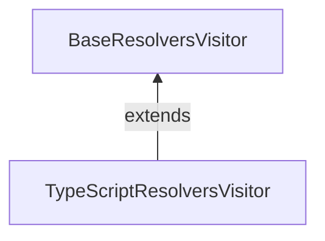

# 10/1

## GraphQL Codegen と `@semanticNonNull`

[昨日](https://github.com/Quramy/zakki/blob/main/docs/memo/202409.md#graphql-codegen-%E3%81%A8-semanticnonnull) の続き。

> いや、spec のコードだったり、Snapshot は大量に見つかるんだけど、肝心の `Maybe` でラップしている箇所が見当たらない。

適当な grep 作戦は微妙だったので、素直に Visitor 周りから追いかけていくことにした。

typescript-resolvers plugin の Visitor はクラス継承となっていて、下記の構造:



- https://github.com/dotansimha/graphql-code-generator/blob/3f4f5466ff168ad822b9a00d83d3779078e6d8c4/packages/plugins/typescript/resolvers/src/visitor.ts
- https://github.com/dotansimha/graphql-code-generator/blob/3f4f5466ff168ad822b9a00d83d3779078e6d8c4/packages/plugins/other/visitor-plugin-common/src/base-resolvers-visitor.ts

Directive がつくのは Field Definition Node であるため、 `FieldDefinition` callback ぽいものを検索する:

https://github.com/dotansimha/graphql-code-generator/blob/3f4f5466ff168ad822b9a00d83d3779078e6d8c4/packages/plugins/other/visitor-plugin-common/src/base-resolvers-visitor.ts#L1404

ref: https://astexplorer.net/#/gist/aa81c0b8fbde0bd68e386fdced5862dc/5c952a37572b8fa4f8bb41d1c01f3ff875921221

```ts
/* https://github.com/dotansimha/graphql-code-generator/blob/3f4f5466ff168ad822b9a00d83d3779078e6d8c4/packages/plugins/other/visitor-plugin-common/src/base-resolvers-visitor.ts#L1491C1-L1496 */

return indent(
  `${signature.name}${signature.modifier}: ${
    signature.type
  }<${signature.genericTypes.join(", ")}>${this.getPunctuation(
    declarationKind
  )}`
);
```

`signature.genericTypes` Resolver Type に食わせる Type Parameters を保持していそうなのが見て取れたので、`genericType[0]` の型を変更するように PR 作成.

「`Maybe` を削る」という機能が `NonNullType` 向けに `TypeScriptResolversVisitor` に載っていたので、これを `BaseResolversVisitor` 側から呼び出すような方向の変更になってしまった。

https://github.com/dotansimha/graphql-code-generator/pull/10159

Protected じゃなくて Abstruct でも良かった気もしてきたが、元のコードもあんまり綺麗とは思えないし、まぁいっか。。。
そもそも Review されるのかが怪しいし。

## Remix + graphql-yoga

なんとなく Remix を触りだしてみた。

GraphQL の SPA なサンプルをシュッと用意するのに、以前は CRA + React Router ベースな環境でやっていたわけだけど、これの代替にしたい。
Client Loader を使えば Apollo の `createQueryPreloader` と組み合わせられそうだし。

とりあえず以下を読みつつ、Yoga と接続するところまで。

https://remix.run/docs/en/main/guides/resource-routes

`loader`(GET) や `action` (POST) が Next.js でいうところの Route Handler に相当する。
WHATWG fetch が喋れればよいので、 `yoga.fetch` を使えば簡単に adapt できる

https://the-guild.dev/graphql/yoga-server/docs/integrations/z-other-environments

```ts
/* src/routes/api.graphql.ts */

const yoga = createYoga({
  schema,
  graphqlEndpoint: "/api/grahql",
});

export async function loader({ request }: LoaderFunctionArgs) {
  return await yoga.fetch(request, {});
}

export async function action({ request }: ActionFunctionArgs) {
  switch (request.method) {
    case "POST": {
      return await yoga.fetch(request, {});
    }
    default: {
      return new Response("Not found", { status: 404 });
    }
  }
}
```

## void(0) と Vite

https://voidzero.dev/posts/announcing-voidzero-inc

Evan You が Vite 周り(Rolldown や Oxc を含めたツールチェイン) をやっていくために資金調達して会社設立した。
調達資金は 4.6M$ とのことだが、そもそも Vite だけでお金稼ぐのは無理な気がするんだが、どうするんだ？

Rome のことを思い出したけど、Rome も会社としては 3 年程度で資金ショートしてたっぽいのよなぁ。。

- https://www.publickey1.jp/blog/23/javascriptromebiome.html
- https://www.publickey1.jp/blog/21/javascriptromerome_tools_inc.html

## ViteConf 2024

https://viteconf.org/

JST だと 10/3 の 23:00~ から。気になるセッションは以下あたり:

- Oxc and Rolldown (Boshen Chen)
- The Evolution of Rollup
- Qwik - Behind The Magic (Shai Reznik)
- How Vite Made Remix Better

深夜〜早朝だし、まぁ多分アーカイブ待ちになるとは思うけど。

当たり前だけど、Next.js 関連の Speaker は一切おらず、代わりに主要な UI フレームワークから人募りました感がすごいなー。Vite 連合 v.s. Versel 的な。

---

# 10/2

## Codemod と AST

Codemod の手法について、Jiachi さんと Darkholme さんが会話していたのを観測した:

https://x.com/huozhi/status/1840894796266717454

- https://github.com/unjs/magicast
- https://ast-grep.github.io/guide/api-usage/js-api.html

## Next.js Static Exports と Pages Router v.s. App Router

とある筋から Static Exports 要件が振ってきたので気になってきた。

ぱっと思いつく範囲でいうと、以下辺りか？

- 基本全部 CC 扱いで考える
- 完全に Static であれば、Layout なども使える ( `export const dynamic = "error"` を Root Layout に書けば縛れる)
- Router API が異なる
  - `roouter.events` が無いので、文字列 throw して Routing cancel するハックが使えない

と思ったけど、Dynamic Route な時点で Not Static として認識されるので、 `src/app/hoge/[slug]/page.tsx` を作ること自体が厳しいな。

Static Exports といいつつ、 nginx で 適当に rewrite すればいいかと思ってたけど、この辺りは Pages Router と全然違うのね。

```
server {
  location /hoge {
      rewrite ^/hoge/(.*)$ /hoge/[slug].html break;
  }
}
```

`generateStaticParams` で酷い中身を返せば、`[slug].html` の出力はできるんだけど、こんな馬鹿らしいことすべきじゃないしね。

```ts
export async function generateStaticParams() {
  return [{ slug: "[slug]" }];
}
```

## Apollo Client と Vite の相性の悪さ

https://stackoverflow.com/questions/78413741/remix-vite-unable-to-import-from-apollo-client-into-tsx-files-issue

https://github.com/apollographql/apollo-feature-requests/issues/287

## Remix の `JsonifyObject` 問題

> Client Loader を使えば Apollo の `createQueryPreloader` と組み合わせられそうだし。

サンプルとして手を動かしてみた。

```tsx
export async function clientLoader() {
  const apolloClient = getSingletonApolloClient();
  return createQueryPreloader(apolloClient)(query);
}

export default function Posts() {
  const queryRef = useLoaderData<typeof clientLoader>();
  const { data } = useReadQuery(queryRef); // typeof data is unknown ...

  // return;
}
```

動くには動くんだけど、 `data` の型が推論されない。
`useLoaderData<LoaderFn>()` が、単純な `Awaited<ReturnType<LoaderFn>>` ではないせい。非 JSON Value でも一定 Serialize してくれる、ということなんだろうが、 Client Loader の文脈だとどうでもいいんだよな。。

割と有名な問題らしい。

https://tech.codeconnect.co.jp/posts/remix-jsonifyobject/

`createQueryPreloader` で作成するのって、要するに `Promise<QueryResult>` だけど、Remix 側はそのまま保存してくれてるんだよな...?

## React Dev Tool で SC / CC が見れそう

https://x.com/sebastienlorber/status/1841406068976427239

---

# 10/3

## Apollo Client with Remix

Client Side Routing で Render as you fetch にするのはできた。

https://github.com/Quramy/remix-apollo-example

SSR も Try してみるかー、と思って手を出したが、一筋縄ではいかなかった。

なんとなく予想はしていたが、 Loader で Query Reference を作っても、Server Side Renderer に渡る過程で Serialize される。
Loader の用途が、CSR 時にも Next.js における gSP のように呼び出されることを考えると、 SSR / CSR 問わず `userLoaderData` の結果は `JsonifyObject` になる。

ref: https://github.com/apollographql/apollo-client/blob/main/src/react/internal/cache/QueryReference.ts#L204

loader function で Schema execute して JSON を作ったとして、その先がややこしい。

- SSR でのみ、data から fulfilled な QueryRef を作成する
- Hydrate 時に AC の cache に乗るように、事前に Provider Cache の中身を教え込む

前者を簡単に実現する Static Function が Apollo から提供されていれば話が早かったのだが、そんな都合の良いものも無いため、 `useReadQuery` を拡張して、Query Reference がただの JSON の場合にそちらにフォールバックするようにした。 React Hooks としては大分危ういのだけど、とりあえず実装はできた。

```ts
import type { QueryRef } from "@apollo/client/index.js";

import {
  useReadQuery as useOriginalReadQuery,
  type UseReadQueryResult,
} from "@apollo/client/react/hooks/useReadQuery.js";

export function useReadQuery<TData>(
  queryRef: QueryRef<TData>
): UseReadQueryResult<TData> {
  return (
    "toPromise" in queryRef ? useOriginalReadQuery(queryRef) : queryRef
  ) as any;
}
```

いずれにせよ、素振りしてみると SSR と CSR 両立させるのが如何に大変か、身に沁みて実感する。

## GraphQL Server の自分用の雛形

元々は jest-prisma, prisma-fabbrica の Example Repo として用意した https://github.com/Quramy/prisma-yoga-example であるが、ここ数日 Relay や Apollo の素振りをする上で、「適当なフロントを組み込む上で楽ができる GraphQL Server」として役に立ってくれたので、それぞれの素振りの中で気付いた部分をバックポート気味に反映した。

- Next.js や Remix のような FW と組み合わせやすくする目的で `src` 直下のソースを `src/server/graphql` にお引越し
  - Route Handler や Resource Route と接続を考慮して yoga と Node.js Http Server を分離
- Realy の Server としても使えるように Node Interface Impl とした
- GQL Codegen の config ts 化

## Next.js の Open Telemetry

Next.js w/ dd-trace で APM を眺めているときにいつも不満に思っているのが、Component の Rendering に要する Span が計装されていないことだ。
Latency のドミナントは大概 fetch か DB に来るので、この部分は dd-trace が掛かっているが、地味に React の Render にも時間が持っていかれている。
50msec 程度になっていることもざらにあり、Client Component が同期関数であることを考慮すると、Render の task がキューイングされまくると、そのプロセスに割りあたった後続の Request の Latency に跳ねる。

たまたま OTel 側の docs を読んでいたら、 `render route` という Span が Export されていてテンションが上がったので試してみた。

https://nextjs.org/docs/app/building-your-application/optimizing/open-telemetry#render-route-pages-nextroute

素直に `@vercel/otel` を instrumentation.ts に設置する。
標準の `0.0.0.0:4318` export するように設定されるので、適当な Collector があれば可視化できる。

Next.js のドキュメントからは https://github.com/vercel/opentelemetry-collector-dev-setup の Repo にリンクされていたが、opentelemetry-collector の最新に Collector の Config が追従してないので立ち上がらないわ、config 修正して立ち上げても collector に刺さってる様子がない。
Jaeger を触ったのは初めてだが、OTel の Debug にはちょっと使いづらい。image も重たいし。。。

結局、別の可視化方法として、https://github.com/ymtdzzz/otel-tui を選択。こちらは何の問題もなく動いた。 tui 正義。

Pages Router で gSSP な Page Component 作ってためしたところ、ちゃんと `render route` Span となってくれる。
どうやって計測しているんだろう？ Next.js Server の Router にベタっと書いてあるのかしら？

## Remix Link Prefetch と Client Loader

Remix with Apollo Client Suspense の Example を組んでから気付いたが、Client Loader で Query Ref を作るのだと、正直あんまり旨味なくないか？という気がしてきた。

確かに Render as you fetch にはなっているが、折角なら `<Link prefetch="intent" to={href} />` の時点でデータ取得を開始したい。
Server Loader であれば、期待通りにホバー時に Prefetch されるが、Client Loader の場合は `prefetch` 属性に何を書こうと、Navigation 発生してから Call される。

以下のように動作する `<LinkWithPreloadQuery />` みたいなコンポーネント作れないかなぁ。。。

1. 遷移元の画面にいる内に Query Ref を記憶しておく
1. (Navigation)
1. Client Loader で記憶した Query Ref を取り出す. 存在しなければ新たに Query Ref 発行

普通に作れた。

---

# 10/4

## Chrome で Stacking Context の debug

Devtool で "Layer" タブを有効化するだけ。知らなかったーー。

## Vite conf の動画

未編集だと思うが、既に見れるようになってた。

https://www.youtube.com/watch?v=mWK3Y_1kmaM

一度ストリーム中断したら、そのままアーカイブとして見れるようになる、的な感じなのかな。

## Remix で Custom Server

[Remix Docs](https://remix.run/docs/en/main/discussion/introduction#http-handler-and-adapters) に記載されている方法だけだと、あまり上手くいかない。

```js
/* server.js */

import express from "express";
import remix from "@remix-run/express";

const app = express();

app.all(
  "*",
  createRequestHandler({
    build: await import("./build/server/index.js"),
  })
);

app.listen(port, () => {
  console.log(`Listening on http://localhost:${port}`);
});
```

まず、`createRequestHandler` は SSR のリクエストのみに対応したハンドラであるため、サブリソースはハンドルされない。要するに `express.static` 案件。

まぁ、それは `app.use(express.static('./build/client'))` すればよい。

そもそも Custom Server を持ち出しているのは 例えば Loader Function に Context を渡したいなどの特殊ケースであるが、この場合は Production Mode だけだと意味がない。

自前で Vite Server を立ち上げ、SSR と Client Bundle 用の Middleware を取り出して Express に渡す必要がある。

https://vite.dev/guide/api-javascript.html#vitedevserver

```js
/* server.js */

import { dirname, resolve } from "node:path";
import { fileURLToPath } from "node:url";
import express from "express";
import remix from "@remix-run/express";

const __dirname = dirname(fileURLToPath(import.meta.url));

async function createDevServer() {
  const vite = await import("vite");
  return vite.createServer({
    root: __dirname,
    configFile: resolve(__dirname, "./vite.config.ts"),
    server: {
      middlewareMode: true,
      hmr: { host: "localhost", port: 10001 },
    },
  });
}

function handleIgnoredAssets(req, res, next) {
  const ignoreAssets = ["/service-worker.js"];

  if (ignoreAssets.includes(req.path)) {
    return res.status(404).end();
  }
  next();
}

const mode = process.env.NODE_ENV;
const port = process.env.PORT ?? (mode === "production" ? 3000 : 5173);

const app = express();

const devServer = mode !== "production" ? await createDevServer() : undefined;

const handleClientAssets = devServer
  ? devServer.middlewares
  : express.static(resolve(__dirname, "./build/client"));

const handleSSR = remix.createRequestHandler({
  build: devServer
    ? () => devServer.ssrLoadModule("virtual:remix/server-build")
    : await import("./build/server/index.js"),
});

app.all("*", handleClientAssets, handleIgnoredAssets, handleSSR);

app.listen(port, () => {
  console.log(`Listening on http://localhost:${port}`);
});
```

一度やり方を知ってしまえばどうということは無いが、ドキュメントにもう少ししっかり書いておいて欲しい。[Manual Dev Server](https://remix.run/docs/en/main/guides/manual-mode) というページは用意されていたので、最初はこれを読めばいいのか？と思ったが、Vite 版ではなく Classic Compiler 時代の遺物であり役に立たないどころかノイズでしかない。

---

# 10/5

## Remix Apollo で SSR

昨日の SSR 対応は、 Loader Function で Yoga を直接実行して得られたデータを `useLoaderData` で受け取って Route で Render するだけのナイーブな代物。
このままだと致命的で、 `useFragment` のような Apollo Cache と Integrate された Hooks が動かないことになる。

Loader で得たデータは以下に伝播させないと、Apollo Client を用いたアプリケーションとしては使い物にならない。

- Server-Side Render における Apollo Client Cache にわたす
- Client Hydrate 時に Data Hydrate させる

まずは SSR 時の Apollo Client Cache に Loader Data を受け渡すところから。

Loader で利用した Server 用の Apollo Client を Root Renderer で再利用できればよい。
最初、`entry.server` モジュールでなんとかならないか、と思ったが、アプリケーション側に Remix Server の 生 Request Handler が露出している箇所が見当たらず、Loader Function と Renderer で同一のコンテキストを参照できるポイントが見つからない。

Custom Server にしてしまえば ALS でこれを実現できるので、今回は割り切って Remix CLI からイジェクトする選択をとった。

```js
/* server.mjs */

const handleSSR = remix.createRequestHandler({
  build: await import("./build/server/index.js"),
});

const contextStorage = new AsyncLocalStorage();

app.all("*", (req, res, next) => {
  contextStorage.run(new ApolloClient(), () => handleSSR(req, res, next));
});
```

上記のままだと `contextStorage` が Vite SSR バンドルの外部であるため、Loader や Renderer から Apollo Client にアクセスできない。

Express 側と Vite SSR Bundle の内外でのやりとりは `globalThis` を介するようにして、store 値はただの Map にする。 Map に対する操作は SSR バンドル内側のモジュールが個別に行うようにすればよい。

```js
const contextStorage = new AsyncLocalStorage();
globalThis.__getRequestLocalStorage__ = () => contextStorage.getStore();

app.all("*", (req, res, next) => {
  contextStorage.run(new Map(), () => handleSSR(req, res, next));
});
```

次いで、Request Local Scope に Factory 値を保持できるようにしておく。

```ts
/* src/app/lib/requestContext.ts */

function getMap(): Map<unknown, unknown> {
  const map = (globalThis as any).__getRequestLocalStorage__?.();
  if (!map) {
    throw new Error("Not inside request local scope.");
  }
  return map as Map<unknown, unknown>;
}

export function getContextValue<T>(key: unknown): T | undefined {
  return getMap().get(key) as T | undefined;
}

export function setContextValue<T>(key: unknown, value: T): void {
  getMap().set(key, value);
}

export function cache<T extends () => any, V extends ReturnType<T>>(
  fn: T
): () => V {
  return () => {
    const cachedValue = getContextValue<V>(fn);
    if (cachedValue) return cachedValue;
    const value = fn();
    setContextValue(fn, value);
    return value;
  };
}
```

`cache` 関数は RSC における `import { cache } from "react"` のシグネチャを参考にしている（引数付きで使うつもりがなかったので、大分機能が制限されているが)。

```ts
export const getServerApolloClient = cache(() => new ApolloClient());
```

こうして作った `getServerApolloClient` を Loader と Render で使うようにすればよい。

```ts
async function loader() {
  return await getServerApolloClient().query({ query });
}
```

上記の `loader` が完了した段階で Dehydrate するためのデータは Apollo Client に格納されていることになる。以下のように `ApolloClient#extract` と `ApolloCache#restore` を呼ぶユーティリティを用意する。

```ts
const globalKey = "__serialized_apollo_cache__";

export function SerializedApolloCache({
  client,
}: {
  readonly client: ApolloClient<unknown>;
}) {
  const serialized = JSON.stringify(client.extract());
  return (
    <script
      suppressHydrationWarning
      type="module"
      id="SERIALIZED_APOLLO_CACHE"
      dangerouslySetInnerHTML={{
        __html: `if (!window.${globalKey}) window.${globalKey} = ${serialized};`,
      }}
    />
  );
}

export class HydratedMemoryCache extends InMemoryCache {
  constructor(config?: InMemoryCacheConfig) {
    const hydratedData = (window as any)[globalKey] ?? {};
    super(config);
    this.restore(hydratedData);
  }
}
```

`SerializedApolloCache` を Root Route Layout に差しておけば、SSR 時に `<script>` タグとして描画されて、Hydration の際に `getClientApolloClient` で 上記の `HydratedMemoryCache` を使いブラウザ用の Apollo Client を初期化することで Cache Data がハイドレートされた状態で CSR を開始できる。

```tsx
export function Layout({ children }: { children: React.ReactNode }) {
  return (
    <html lang="en">
      <body>
        {children}
        <ScrollRestoration />
        <SerializedApolloCache
          client={
            typeof document === "undefined"
              ? getServerApolloClient()
              : getClientApolloClient()
          }
        />
        <Scripts />
      </body>
    </html>
  );
}
```

---

# 10/9

## Next.js と `intercept.ts`

https://github.com/vercel/next.js/pull/70961

Next.js Middleware では、Node.js API の呼び出しに制限があったが、その制約を受けない拡張ポイントとして、検討されている。

PR Description に貼ってあった example そのままだが、 `notAuthorized()` (これは多分別途そういう関数を作ると思われ) が出てきているので、「Node.js の API (たとえば io-redis の呼び出しなど) を実行して、未認可だから 401 ページ返すね」のようなことを丸っとできる、ということになる(現状だと、これと同じことをするには、各 page.tsx の先頭で認可チェックの共通関数を呼び出すくらいしか手立てが無かったはず)。

```ts
export default async function intercept(request: NextRequest): Promise<void> {
  // Interceptor logic...

  // Control flow options:
  redirect("/login");
  // or
  notFound();
  // or
  notAuthorized(); // coming soon!
  // or
  throw new Error("Custom error message");
}
```

Middleware だと Stateless Session (JWT とか) で Expire 確認するくらいのことしかできないので、DB セッションとの相性が微妙だったことを考えると、期待できそう。
(というよりも、元々 Next.js が Middleware を打ち出したときは Express の Middleware 相当を想像していただけに残念な気持ちになったことを思い出した)。

---

# 10/10

## React Router v7

一週間前に React Router v7 のプレリリース版が出てたのを今更知った。 Vite Conf にあわせてたのか？

https://twitter.com/remix_run/status/1841926034868077009

https://reactrouter.com/dev/guides/upgrading/remix に Remix からの移行ガイドも書いてあるし、今やってる Apollo のヤツも React Router v7 に書き換えよかな。

## TypeScript 5.7 beta

https://devblogs.microsoft.com/typescript/announcing-typescript-5-7-beta/

- Import 識別子の書き換え... ( `from "./hoge.ts"` が `from "./hoge.js"` に)
  - https://zenn.dev/uhyo/articles/rewrite-relative-import-extensions-read-before-use
- `Promise.withResolvers` のサポート入った

## Remix で 404 ハンドリング

https://remix.run/docs/en/main/guides/not-found

Client Loader で Promise を返却していると、 Loader 中で `throw new Response(null, { status: 404 })` とはできなくなるため、 React Rendering から Error を throw しつつ、Router Error とは別物として Error Boundary で補足させる形になった。

```tsx
<RootErrorBoundary>
  <Suspense>
    {/* throw Promise or NotFoundError */}
    <QueryComponent />
  </Suspense>
</RootErrorBoundary>
```

React らしいといえばそれまでなんだけど、Remix の組み込み Error Boundary が `componentDidCatch` で `console.error` で出力してくるため、ただの大域脱出の目的でしかないのに devtool が汚れて見えるのが少し不満。。。

## StyleX v0.8.0

https://stylexjs.com/blog/v0.8.0

---

# 10/11

## StyleX と Rollup Plugin

https://stylexjs.com/blog/v0.8.0#using-lightningcss-for-post-processing にて、 StyleX で Post-process (最終的に吐き出す CSS を整形する手前という意味では Pre-process) に `lightningcss` を使うようにしている。`lightningcss` は Rollup Plugin で有効化されているとのこと。

PR でいうと、 https://github.com/facebook/stylex/pull/691 のことかな。

元々なにかの Post Process があったというわけではなく、この PR で追加 Post Process が追加されている。
StyleX の Rollup plugin に `lightningcssOptions` が渡せるようになっている。

```js
/* rollup.config.js */

import stylexPlugin from "@stylexjs/rollup-plugin";

const config = {
  plugins: [
    stylexPlugin({
      lightningcssOptions: { minify: true },
      // Other styleX plugin options...
    }),
  ],
};

export default config;
```

それにしても、まぁ lightningcss は別に良いんだけど、Babel 依存はなんとかならんのかねぇ。。。

## Bluesky meetup Vol.3 視聴メモ

https://428lab.connpass.com/event/331611/

Bluesky というよりも、Dan Abramov が来るというのを目当てに。

### Dan Abramov のセッション

以下 YouTube Live 視聴時 :memo:

- Bluesky の紹介
  - ユーザー名がドメイン. e.g. `@danabra.mov`
  - Custom Feed Algorithm
- Theme: Web without walls
  - ユーザーと SNS プロダクトの関係性
  - 昔の web
    - HTML を作成し、サーバーに置いて公開, サーバーはどうにかして調達, etc,,,, 要するに色々やらねばならないことがあった
  - 例えば GitHub では、レポジトリに対してドメインが発行される (いわゆる GitHub IO ページ)
    - 実際に誰がホスティングしているかは重要ではなく、自分を示すドメインがそこを向いていることが大事
    - 別の人のドメインとつなぐには、HTML でリンクがあればよい
  - 訪問履歴的なものがあったとして:
    - 訪れたときに、コメントが残せる
    - Facebook の個人ページに行き、コメントを残すのもこれ
  - Twitter と Facebook で相互にリンクしていたとして、
    - ある日 Twitter のドメインが X に変わる
  - Dan Abramov が Twitter の(最初の) アカウントを潰したときの話
    - Tweet Dat を Json としてダウンロード
  - データが消えるとはどういうことか:
    - (急に JavaScript の話になった?)
    - Component が state を保持している話.
      - Lift state up.
        - ブラウザのタブを跨いだら？ -> Local Storage まで Lift する？
        - PC を跨いだたら? PC がある日壊れたら, local storage も吹っ飛ぶ -> サーバーにおく
  - ある日製品が無くなったら？
    - 開発者目線ではどうこうできる話ではない
    - ユーザーにとっては？ 自分が書いたデータがある日急に無くなったことになる
    - データの持ち主は、サービス(サーバー) ではなく、ユーザーのはず
  - Bluesky は原初の web と同じく「自分のサーバーに自分のデータを保存する」マインド
    - e.g. 他人の投稿につけた fav は、自分のサーバーに、「私は A さんの投稿に Like をつけた」というように保持されている
- Recap:
  - 自分のサーバーに自分のデータがあった
  - SNS によって、「自分のサーバー」ではなく、SNS 製品が自分のデータを保持するようになった
  - 製品ではなく、個人を表すレイヤーが必要
  - Bluesky はこのレイヤがデータを購読するためのバックエンド。Blusky は必要なデータをクロールしてキャッシュするリレーサービス
    - リレーは OSS
  - https://atproto.com

## From Remix to react-router v7

https://reactrouter.com/dev/guides/upgrading/remix に従うだけ。特に苦も無く終わってしまった。

https://github.com/Quramy/remix-apollo-example/pull/8/files

React Router として触るのはすごく久しぶりなので、`npx react-router build` とか `npx react-router dev` みたいな CLI があるの、新鮮というか違和感というか。

## tsimp の Maintainer 問題

https://github.com/tapjs/tsimp/issues/29 を再度見に行ったら gfx さんが メンテナに名乗りを上げてた。

`@isaacs` 自身は現状 tsimp に時間を割くような余裕がない、というコメントからの流れ。
