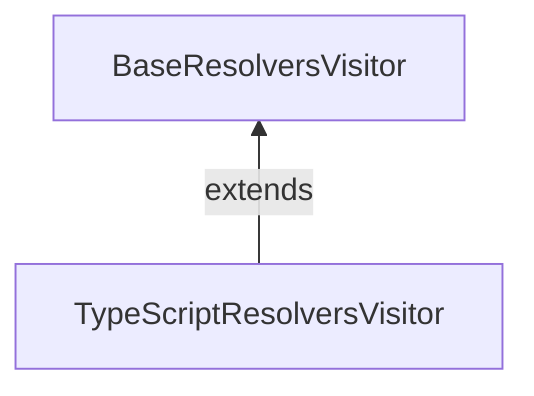

# 10/1

## GraphQL Codegen と `@semanticNonNull`

[昨日](https://github.com/Quramy/zakki/blob/main/docs/memo/202409.md#graphql-codegen-%E3%81%A8-semanticnonnull) の続き。

> いや、spec のコードだったり、Snapshot は大量に見つかるんだけど、肝心の `Maybe` でラップしている箇所が見当たらない。

適当な grep 作戦は微妙だったので、素直に Visitor 周りから追いかけていくことにした。

typescript-resolvers plugin の Visitor はクラス継承となっていて、下記の構造:



- https://github.com/dotansimha/graphql-code-generator/blob/3f4f5466ff168ad822b9a00d83d3779078e6d8c4/packages/plugins/typescript/resolvers/src/visitor.ts
- https://github.com/dotansimha/graphql-code-generator/blob/3f4f5466ff168ad822b9a00d83d3779078e6d8c4/packages/plugins/other/visitor-plugin-common/src/base-resolvers-visitor.ts

Directive がつくのは Field Definition Node であるため、 `FieldDefinition` callback ぽいものを検索する:

https://github.com/dotansimha/graphql-code-generator/blob/3f4f5466ff168ad822b9a00d83d3779078e6d8c4/packages/plugins/other/visitor-plugin-common/src/base-resolvers-visitor.ts#L1404

ref: https://astexplorer.net/#/gist/aa81c0b8fbde0bd68e386fdced5862dc/5c952a37572b8fa4f8bb41d1c01f3ff875921221

```ts
/* https://github.com/dotansimha/graphql-code-generator/blob/3f4f5466ff168ad822b9a00d83d3779078e6d8c4/packages/plugins/other/visitor-plugin-common/src/base-resolvers-visitor.ts#L1491C1-L1496 */

return indent(
  `${signature.name}${signature.modifier}: ${
    signature.type
  }<${signature.genericTypes.join(", ")}>${this.getPunctuation(
    declarationKind
  )}`
);
```

`signature.genericTypes` Resolver Type に食わせる Type Parameters を保持していそうなのが見て取れたので、`genericType[0]` の型を変更するように PR 作成.

「`Maybe` を削る」という機能が `NonNullType` 向けに `TypeScriptResolversVisitor` に載っていたので、これを `BaseResolversVisitor` 側から呼び出すような方向の変更になってしまった。

https://github.com/dotansimha/graphql-code-generator/pull/10159

Protected じゃなくて Abstruct でも良かった気もしてきたが、元のコードもあんまり綺麗とは思えないし、まぁいっか。。。
そもそも Review されるのかが怪しいし。

## Remix + graphql-yoga

なんとなく Remix を触りだしてみた。

GraphQL の SPA なサンプルをシュッと用意するのに、以前は CRA + React Router ベースな環境でやっていたわけだけど、これの代替にしたい。
Client Loader を使えば Apollo の `createQueryPreloader` と組み合わせられそうだし。

とりあえず以下を読みつつ、Yoga と接続するところまで。

https://remix.run/docs/en/main/guides/resource-routes

`loader`(GET) や `action` (POST) が Next.js でいうところの Route Handler に相当する。
WHATWG fetch が喋れればよいので、 `yoga.fetch` を使えば簡単に adapt できる

https://the-guild.dev/graphql/yoga-server/docs/integrations/z-other-environments

```ts
/* src/routes/api.graphql.ts */

const yoga = createYoga({
  schema,
  graphqlEndpoint: "/api/grahql",
});

export async function loader({ request }: LoaderFunctionArgs) {
  return await yoga.fetch(request, {});
}

export async function action({ request }: ActionFunctionArgs) {
  switch (request.method) {
    case "POST": {
      return await yoga.fetch(request, {});
    }
    default: {
      return new Response("Not found", { status: 404 });
    }
  }
}
```

## void(0) と Vite

https://voidzero.dev/posts/announcing-voidzero-inc

Evan You が Vite 周り(Rolldown や Oxc を含めたツールチェイン) をやっていくために資金調達して会社設立した。
調達資金は 4.6M$ とのことだが、そもそも Vite だけでお金稼ぐのは無理な気がするんだが、どうするんだ？

Rome のことを思い出したけど、Rome も会社としては 3 年程度で資金ショートしてたっぽいのよなぁ。。

- https://www.publickey1.jp/blog/23/javascriptromebiome.html
- https://www.publickey1.jp/blog/21/javascriptromerome_tools_inc.html

## ViteConf 2024

https://viteconf.org/

JST だと 10/3 の 23:00~ から。気になるセッションは以下あたり:

- Oxc and Rolldown (Boshen Chen)
- The Evolution of Rollup
- Qwik - Behind The Magic (Shai Reznik)
- How Vite Made Remix Better

深夜〜早朝だし、まぁ多分アーカイブ待ちになるとは思うけど。

当たり前だけど、Next.js 関連の Speaker は一切おらず、代わりに主要な UI フレームワークから人募りました感がすごいなー。Vite 連合 v.s. Versel 的な。

---

# 10/2

## Codemod と AST

Codemod の手法について、Jiachi さんと Darkholme さんが会話していたのを観測した:

https://x.com/huozhi/status/1840894796266717454

- https://github.com/unjs/magicast
- https://ast-grep.github.io/guide/api-usage/js-api.html

## Next.js Static Exports と Pages Router v.s. App Router

とある筋から Static Exports 要件が振ってきたので気になってきた。

ぱっと思いつく範囲でいうと、以下辺りか？

- 基本全部 CC 扱いで考える
- 完全に Static であれば、Layout なども使える ( `export const dynamic = "error"` を Root Layout に書けば縛れる)
- Router API が異なる
  - `roouter.events` が無いので、文字列 throw して Routing cancel するハックが使えない

と思ったけど、Dynamic Route な時点で Not Static として認識されるので、 `src/app/hoge/[slug]/page.tsx` を作ること自体が厳しいな。

Static Exports といいつつ、 nginx で 適当に rewrite すればいいかと思ってたけど、この辺りは Pages Router と全然違うのね。

```
server {
  location /hoge {
      rewrite ^/hoge/(.*)$ /hoge/[slug].html break;
  }
}
```

`generateStaticParams` で酷い中身を返せば、`[slug].html` の出力はできるんだけど、こんな馬鹿らしいことすべきじゃないしね。

```ts
export async function generateStaticParams() {
  return [{ slug: "[slug]" }];
}
```

## Apollo Client と Vite の相性の悪さ

https://stackoverflow.com/questions/78413741/remix-vite-unable-to-import-from-apollo-client-into-tsx-files-issue

https://github.com/apollographql/apollo-feature-requests/issues/287

## Remix の `JsonifyObject` 問題

> Client Loader を使えば Apollo の `createQueryPreloader` と組み合わせられそうだし。

サンプルとして手を動かしてみた。

```tsx
export async function clientLoader() {
  const apolloClient = getSingletonApolloClient();
  return createQueryPreloader(apolloClient)(query);
}

export default function Posts() {
  const queryRef = useLoaderData<typeof clientLoader>();
  const { data } = useReadQuery(queryRef); // typeof data is unknown ...

  // return;
}
```

動くには動くんだけど、 `data` の型が推論されない。
`useLoaderData<LoaderFn>()` が、単純な `Awaited<ReturnType<LoaderFn>>` ではないせい。非 JSON Value でも一定 Serialize してくれる、ということなんだろうが、 Client Loader の文脈だとどうでもいいんだよな。。

割と有名な問題らしい。

https://tech.codeconnect.co.jp/posts/remix-jsonifyobject/

`createQueryPreloader` で作成するのって、要するに `Promise<QueryResult>` だけど、Remix 側はそのまま保存してくれてるんだよな...?

## React Dev Tool で SC / CC が見れそう

https://x.com/sebastienlorber/status/1841406068976427239

---

# 10/3

## Apollo Client with Remix

Client Side Routing で Render as you fetch にするのはできた。

https://github.com/Quramy/remix-apollo-example

SSR も Try してみるかー、と思って手を出したが、一筋縄ではいかなかった。

なんとなく予想はしていたが、 Loader で Query Reference を作っても、Server Side Renderer に渡る過程で Serialize される。
Loader の用途が、CSR 時にも Next.js における gSP のように呼び出されることを考えると、 SSR / CSR 問わず `userLoaderData` の結果は `JsonifyObject` になる。

ref: https://github.com/apollographql/apollo-client/blob/main/src/react/internal/cache/QueryReference.ts#L204

loader function で Schema execute して JSON を作ったとして、その先がややこしい。

- SSR でのみ、data から fulfilled な QueryRef を作成する
- Hydrate 時に AC の cache に乗るように、事前に Provider Cache の中身を教え込む

前者を簡単に実現する Static Function が Apollo から提供されていれば話が早かったのだが、そんな都合の良いものも無いため、 `useReadQuery` を拡張して、Query Reference がただの JSON の場合にそちらにフォールバックするようにした。 React Hooks としては大分危ういのだけど、とりあえず実装はできた。

```ts
import type { QueryRef } from "@apollo/client/index.js";

import {
  useReadQuery as useOriginalReadQuery,
  type UseReadQueryResult,
} from "@apollo/client/react/hooks/useReadQuery.js";

export function useReadQuery<TData>(
  queryRef: QueryRef<TData>
): UseReadQueryResult<TData> {
  return (
    "toPromise" in queryRef ? useOriginalReadQuery(queryRef) : queryRef
  ) as any;
}
```

いずれにせよ、素振りしてみると SSR と CSR 両立させるのが如何に大変か、身に沁みて実感する。
