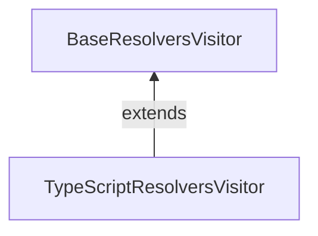

# 10/1

## GraphQL Codegen と `@semanticNonNull`

[昨日](https://github.com/Quramy/zakki/blob/main/docs/memo/202409.md#graphql-codegen-%E3%81%A8-semanticnonnull) の続き。

> いや、spec のコードだったり、Snapshot は大量に見つかるんだけど、肝心の `Maybe` でラップしている箇所が見当たらない。

適当な grep 作戦は微妙だったので、素直に Visitor 周りから追いかけていくことにした。

typescript-resolvers plugin の Visitor はクラス継承となっていて、下記の構造:



- https://github.com/dotansimha/graphql-code-generator/blob/3f4f5466ff168ad822b9a00d83d3779078e6d8c4/packages/plugins/typescript/resolvers/src/visitor.ts
- https://github.com/dotansimha/graphql-code-generator/blob/3f4f5466ff168ad822b9a00d83d3779078e6d8c4/packages/plugins/other/visitor-plugin-common/src/base-resolvers-visitor.ts

Directive がつくのは Field Definition Node であるため、 `FieldDefinition` callback ぽいものを検索する:

https://github.com/dotansimha/graphql-code-generator/blob/3f4f5466ff168ad822b9a00d83d3779078e6d8c4/packages/plugins/other/visitor-plugin-common/src/base-resolvers-visitor.ts#L1404

ref: https://astexplorer.net/#/gist/aa81c0b8fbde0bd68e386fdced5862dc/5c952a37572b8fa4f8bb41d1c01f3ff875921221

```ts
/* https://github.com/dotansimha/graphql-code-generator/blob/3f4f5466ff168ad822b9a00d83d3779078e6d8c4/packages/plugins/other/visitor-plugin-common/src/base-resolvers-visitor.ts#L1491C1-L1496 */

return indent(
  `${signature.name}${signature.modifier}: ${
    signature.type
  }<${signature.genericTypes.join(", ")}>${this.getPunctuation(
    declarationKind
  )}`
);
```

`signature.genericTypes` Resolver Type に食わせる Type Parameters を保持していそうなのが見て取れたので、`genericType[0]` の型を変更するように PR 作成.

「`Maybe` を削る」という機能が `NonNullType` 向けに `TypeScriptResolversVisitor` に載っていたので、これを `BaseResolversVisitor` 側から呼び出すような方向の変更になってしまった。

https://github.com/dotansimha/graphql-code-generator/pull/10159

Protected じゃなくて Abstruct でも良かった気もしてきたが、元のコードもあんまり綺麗とは思えないし、まぁいっか。。。
そもそも Review されるのかが怪しいし。

## Remix + graphql-yoga

なんとなく Remix を触りだしてみた。

GraphQL の SPA なサンプルをシュッと用意するのに、以前は CRA + React Router ベースな環境でやっていたわけだけど、これの代替にしたい。
Client Loader を使えば Apollo の `createQueryPreloader` と組み合わせられそうだし。

とりあえず以下を読みつつ、Yoga と接続するところまで。

https://remix.run/docs/en/main/guides/resource-routes

`loader`(GET) や `action` (POST) が Next.js でいうところの Route Handler に相当する。
WHATWG fetch が喋れればよいので、 `yoga.fetch` を使えば簡単に adapt できる

https://the-guild.dev/graphql/yoga-server/docs/integrations/z-other-environments

```ts
/* src/routes/api.graphql.ts */

const yoga = createYoga({
  schema,
  graphqlEndpoint: "/api/grahql",
});

export async function loader({ request }: LoaderFunctionArgs) {
  return await yoga.fetch(request, {});
}

export async function action({ request }: ActionFunctionArgs) {
  switch (request.method) {
    case "POST": {
      return await yoga.fetch(request, {});
    }
    default: {
      return new Response("Not found", { status: 404 });
    }
  }
}
```

## void(0) と Vite

https://voidzero.dev/posts/announcing-voidzero-inc

Evan You が Vite 周り(Rolldown や Oxc を含めたツールチェイン) をやっていくために資金調達して会社設立した。
調達資金は 4.6M$ とのことだが、そもそも Vite だけでお金稼ぐのは無理な気がするんだが、どうするんだ？

Rome のことを思い出したけど、Rome も会社としては 3 年程度で資金ショートしてたっぽいのよなぁ。。

- https://www.publickey1.jp/blog/23/javascriptromebiome.html
- https://www.publickey1.jp/blog/21/javascriptromerome_tools_inc.html

## ViteConf 2024

https://viteconf.org/

JST だと 10/3 の 23:00~ から。気になるセッションは以下あたり:

- Oxc and Rolldown (Boshen Chen)
- The Evolution of Rollup
- Qwik - Behind The Magic (Shai Reznik)
- How Vite Made Remix Better

深夜〜早朝だし、まぁ多分アーカイブ待ちになるとは思うけど。

当たり前だけど、Next.js 関連の Speaker は一切おらず、代わりに主要な UI フレームワークから人募りました感がすごいなー。Vite 連合 v.s. Versel 的な。
