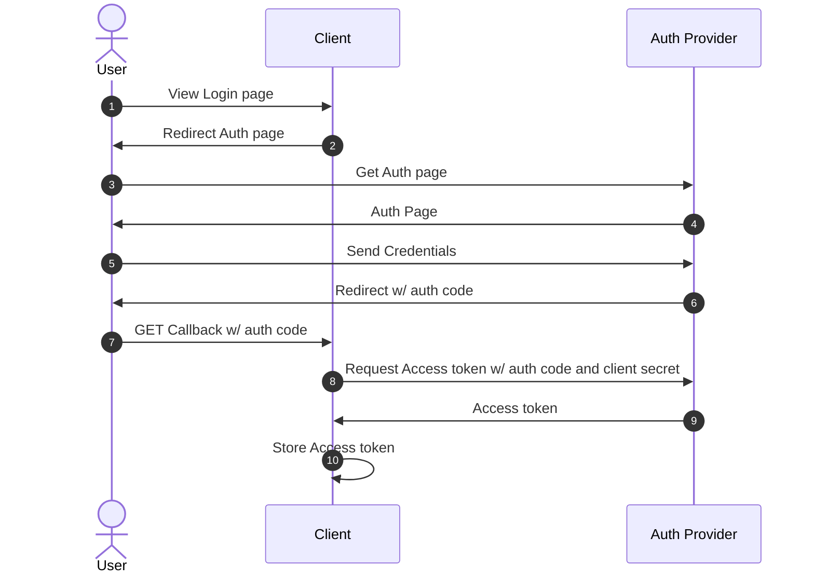
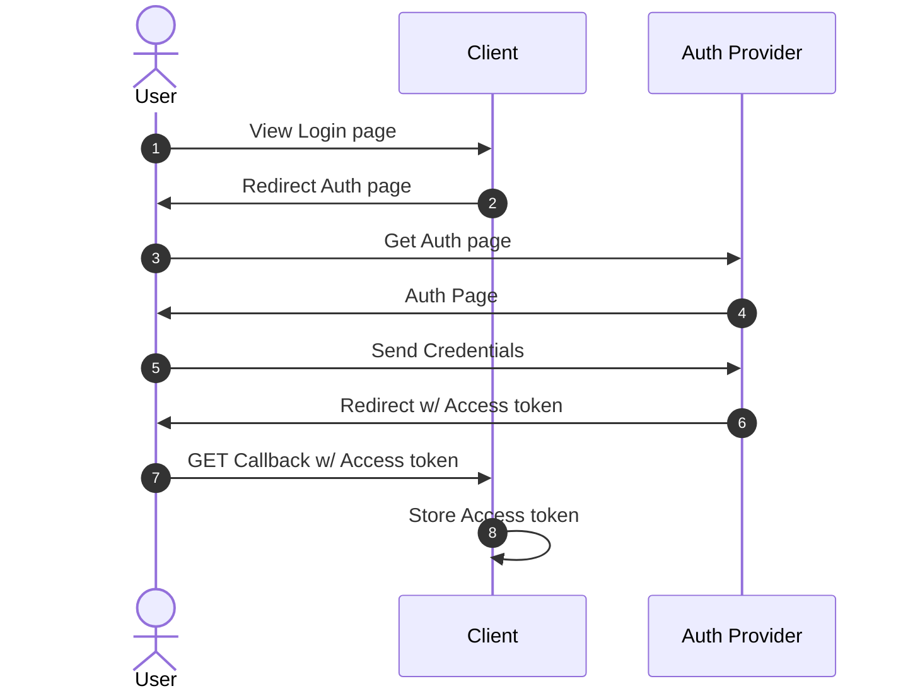
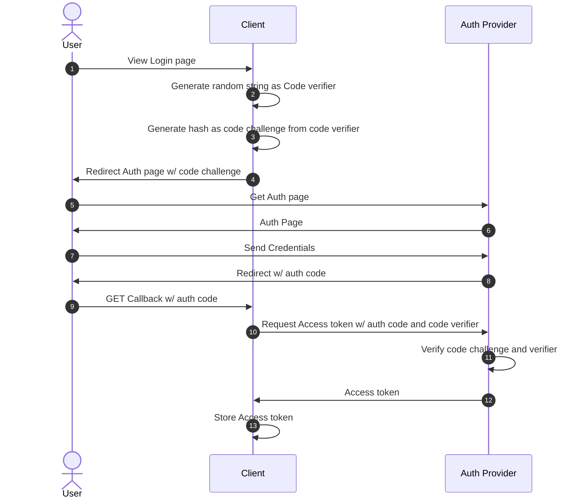

# 11/1

## Change Data Capture

DB の同期を取るような文脈で CDC という略語があることを知った。

## Netlify と OpenNext

https://www.netlify.com/blog/netlify-joins-opennext

## RSC Payload と `AsyncIterable`や `ReadableStream`

React 側では https://github.com/facebook/react/pull/28847 で RSC ペイロードに `ReadableStream` と `AsyncIterable` を渡せるようになっている。
この PR の Merge タイミングが 2024.04.17 なので、 React v19 RC には乗っているのだと思う。

Next.js の v15 Stable に伴って、この機能も使えるようになったことになる。

Next.js の 14.x 系 Stable は React 19 を取り込まなかったからなのか、v14.2.16 などで試すと以下のエラーメッセージが出る。

```
Only plain objects can be passed to Client Components from Server Components. Objects with symbol properties like Symbol.asyncIterator are not supported.
```

これ、利用する機会あるんかなー。

`AsyncIterator` 使えるということは、ちょっとずつ SC を generate するようなことが原理的にはできそうだけど、React のコードとしてそれってどう書けばいいんだ？

sebmarkbage が PR Description で書いている以下部分もよくわからんし。

> AsyncIterables can also be returned as children of Server Components and then they're conceptually the same as fragment arrays/iterables. They can't actually be used as children in Fizz/Fiber but there's a separate plan for that.

## Web Stream API

RSC Payload に Readable Stream が使える、というのに付随して、そもそも Web Stream API ってなんだっけ、、、となった。

そういえば Web 標準に Stream があるらしい、というのは聞いてたけど、触ったことが一回も無かった。

とりあえず、Node.js で Web Stream をゴニョゴニョする話については、結構前に `@yosuke_furukawa` 会長が発表していたので、これを読む。

https://speakerdeck.com/yosuke_furukawa/whatwg-stream-falsehua

---

# 11/6

## Next.js と i18n

おしごとで i18n 対応が発生しそうな気配を察したので、軽く下調べ。

https://www.npmjs.com/package/i18next というライブラリの趨勢が強そうなので、まずはこいつを素振りする。

Next.js に組み込むには https://github.com/i18next/next-i18next というアダプタがあるにはあるのだが、こいつは完全に Pages Router 専用らしい。

App Router については https://locize.com/blog/next-app-dir-i18n/ で方法が紹介されている。

掻い摘んで書くと、

- SC と CC で `useTransalation` を別物として定義する
  - SC 用: react-i18next の `useTransalation` に Signature を似せた async 関数
  - CC 用: react-i18next が提供する `useTransalation` hook を少しラップして SSR 対応を入れたバージョン

いずれも、以下のような感じで使わせる想定。

```tsx
// SC の場合

import { useTranslation } from "@/lib/i18n";

export async function AwesomeComponent({ lng }: { lng: string }) {
  const { t } = await useTranslation(lng, "awesome-component");
  return (
    <>
      <h1>{t("title")}</h1>
    </>
  );
}

// CC の場合
("use client");

import { useTranslation } from "@/lib/i18n/client";

export async function AwesomeComponent({ lng }: { lng: string }) {
  const { t } = useTranslation(lng, "awesome-component");
  return (
    <>
      <h1>{t("title")}</h1>
    </>
  );
}
```

https://github.com/i18next/next-app-dir-i18next-example-ts に完品のコードがあったので、これを真似しつつやってみた。

https://github.com/Quramy/next-js-i18n-example

ほぼ locize の Blog 通りではあるが、言語ごとのリソースを Collocate するように変更してみた。

```
src/app
├── [lng]
│   ├── _components
│   │   └── Footer
│   │       ├── index.locale.en.json
│   │       ├── index.locale.ja.json
│   │       └── index.tsx
│   ├── globals.css
│   ├── layout.tsx
│   ├── page.locale.en.json
│   ├── page.locale.ja.json
│   ├── page.tsx
│   └── second-page
│       ├── page.locale.en.json
│       ├── page.locale.ja.json
│       └── page.tsx
└── i18n
    ├── client.ts
    ├── index.ts
    └── settings.ts
```

---

# 11/7

## i18next の Resource Collocation

https://github.com/i18next/i18next-resources-to-backend で Dynamic Import で Resource を取れるようになったはいいが、CC から使っている場合に Dynamic Import に対応する webpack require 取得が大量に発生してしまいそうな気がする。

Collocate した Resource を Route ごとに Composite できないと、Routing したときのパフォーマンス劣化しそう。Relay Compiler のようなものが必要になってしまう。

折り合いつけるとすると、`components` や 各 Feature 毎程度で Resource のファイルを分割しつつ、そこから参照するようなことにしかできないのかなぁ。。

## Event Source API が意外と便利ではないという話

https://zenn.dev/teramotodaiki/scraps/f016ed832d6f0d によると、以下とのこと。

> WHATWG の spec には書かれていないようなのですが（？）、EventSource では GET 以外のメソッドでリクエストを送れないんですよね。HTTP メソッドを指定するオプションがないようです。詳しいことは僕にもよく分かりません。

OpenAI API のような、今までの対話をガッと送りつけるような API の場合に、GET に縛られるのはつらそうである。

これ以外にも、接続断の場合の再送要求が発生するというのも、昨今の LLM 系と組み合わせるには都合が悪そう。

## tsimp と TypeScript 5.6 問題が解決していた

https://github.com/tapjs/tsimp/issues/29

---

# 11/8

## Ollama

ローカルで LLM API を利用したアプリケーションを組むのに使えそう。

https://github.com/ollama/ollama

---

# 11/12

## `ReadableStream` と `AsyncIterable`

WHATWG の spec だと、 `ReadableStream` は Async Iterable であることが規定されているが、
https://streams.spec.whatwg.org/#rs-asynciterator

Safari だと駄目。

https://caniuse.com/mdn-api_readablestream_--asynciterator

以下のような polyfill を当てるなりする必要がある。

```ts
ReadableStream.prototype[Symbol.asyncIterator] = async function* () {
  const reader = this.getReader();
  try {
    while (true) {
      const { done, value } = await reader.read();
      if (done) return;
      yield value;
    }
  } finally {
    reader.releaseLock();
  }
};
```

ref: https://stackoverflow.com/questions/76700924/ts2504-type-readablestreamuint8array-must-have-a-symbol-asynciterator

---

# 11/13

## Next.js Route Handlers が Streaming に対応していない件

今日も今日とて、text/event-stream 周りのお勉強。

Vercel AI SDK の Document を読んでいたところ、Next.js Pages Router で AI SDK を使う際に、Pages Router の API Routes ではなく、App Router の Route Handlers でサンプルが書かれていた。

https://sdk.vercel.ai/docs/getting-started/nextjs-pages-router#create-a-route-handler

```
src/
  app/
    api/
      chat/
        route.ts
  pages/
    chat.tsx
```

API Routes or Route Handlers の違いについて、今まではシグネチャが Node.js 寄りなのか、Web Standard 寄りなのか程度にしか思っていなかったが、Route Handlers の方がストリームのサポートの意味で優れている、という理由があるとのこと。

> As long as you are on Next.js 13+, you can use Route Handlers (using the App Router) alongside the Pages Router. This is recommended to enable you to use the Web APIs interface/signature and to better support streaming.

というよりも https://github.com/vercel/next.js/discussions/67026 を読むと、そもそも API Routes ではストリームがサポートされていないとある。

別に何が何でも API Routes で event-stream をやりたいわけじゃないのでいいのだが、気になったので自分でも試してみた。

まずは比較用に Next.js を廃して Node.js の `http.ServerResponse#write` でチャンクを書き込むパターン。

```js
/* server.mjs */

import { setTimeout } from "node:timers/promises";
import express from "express";

const app = express();

app.post("/api/express-stream", async (req, res) => {
  await setTimeout(300);

  res.writeHead(200, {
    "transfer-encoding": "chunked",
    "content-type": "text/event-stream",
    "access-control-allow-origin": "*",
  });

  const encoder = new TextEncoder();

  for (let i = 0; i < 10; i++) {
    res.write(encoder.encode(`data: ${JSON.stringify({ count: i })}\n\n`));
    await setTimeout(100);
  }

  res.end();
});

app.listen(4000, () => {
  console.log("server started");
});
```

ブラウザから以下の `fetch` 呼び出しを行う:

```ts
const res = await fetch("http://localhost:4000/api/express-stream", {
  method: "POST",
});

if (!res.ok) return;
const body = res.body;
if (!body) return;
const reader = body.getReader();
const decoder = new TextDecoder("utf8");
while (true) {
  const { value, done } = await reader.read();
  if (done) break;
  const chunk = decoder.decode(value, { stream: true });
  console.log(chunk);
}
```

Devtool の Event Stream は以下のようになる。期待通り、約 100 msec 毎に Time が打刻される。

| Type    | Data          | Time         |
| :------ | :------------ | :----------- |
| message | `{"count":0}` | 20:01:19.241 |
| message | `{"count":1}` | 20:01:19.665 |
| message | `{"count":2}` | 20:01:19.766 |
| message | `{"count":3}` | 20:01:19.877 |
| message | `{"count":4}` | 20:01:19.972 |
| message | `{"count":5}` | 20:01:20.075 |
| message | `{"count":6}` | 20:01:20.175 |
| message | `{"count":7}` | 20:01:20.277 |
| message | `{"count":8}` | 20:01:20.383 |
| message | `{"count":9}` | 20:01:20.484 |

続いて、件の API Routes 版。ハンドラの中身は先程の Express のハンドラと同一コード。

```ts
/* src/pages/api/api-routes-stream.ts */

export default async function handler(
  req: NextApiRequest,
  res: NextApiResponse<unknown>
) {
  if (req.method !== "POST") {
    return res.status(404).end();
  }

  await setTimeout(300);

  res.writeHead(200, {
    "transfer-encoding": "chunked",
    "content-type": "text/event-stream",
  });

  const encoder = new TextEncoder();

  for (let i = 0; i < 10; i++) {
    res.write(encoder.encode(`data: ${JSON.stringify({ count: i })}\n\n`));
    await setTimeout(100);
  }

  res.end();
}
```

同じように Devtool で打刻された時刻を確認すると、先程の Express の場合とは異なり、すべて同一時刻となる。

| Type    | Data          | Time         |
| :------ | :------------ | :----------- |
| message | `{"count":0}` | 20:10:43.680 |
| message | `{"count":1}` | 20:10:43.680 |
| message | `{"count":2}` | 20:10:43.680 |
| message | `{"count":3}` | 20:10:43.680 |
| message | `{"count":4}` | 20:10:43.680 |
| message | `{"count":5}` | 20:10:43.680 |
| message | `{"count":6}` | 20:10:43.680 |
| message | `{"count":7}` | 20:10:43.680 |
| message | `{"count":8}` | 20:10:43.680 |
| message | `{"count":9}` | 20:10:43.680 |

確かに Next.js サーバー側で Outgoing Message の中身がバッファされて、end されたタイミングで吐き出すように手が入っているとしか思えない動き。Next.js のコード読んでみたけど、どの辺でここの処理してるかは追えず。

---

# 11/14

## Bluesky のアカウント作った

`@quramy.bsky.social` でアカウントだけ取得した。 Threads のときは id 取られてたが、bsky では問題なし。
特になにか運用するつもりも現状は無く id 押さえておくだけの意図。

## Next.js の React Update

直近の React RC 取り込みで React 本体側の以下が Next.js にマージされていた:

https://github.com/vercel/next.js/pull/72768

- Boomer fetch 再々トライ: https://github.com/facebook/react/pull/31452
- react-server の README 追加: https://github.com/facebook/react/pull/31464

また、Boomer fetch 問題については元 Issue に解説コメントも付いていた。

ref: https://github.com/facebook/react/issues/29898#issuecomment-2477449973

---

# 11/15

## Advent Calendar 2024

そういえばもうアドカレの季節だなと思い、Qiita のアドカレを軽く覗いたが、明らかに昔と比べて過疎っているように思う。
例えば 2020 年だと React のアドカレはその 2 まで作成されて 42 記事投稿されていたけど、2023 年ではカレンダー数１つという状況だ。
もちろん Qiita が Zenn にユーザー喰われたというのもあるとは思うが。

自分の会社でも最後にアドカレが作られたのは 2022 年で、それ以降は作られなくなった。

去年までは GraphQL くらいは参加するようにしてたけど、なんか無理にネタひねり出してまで書きたいことも無いし、アドカレ文化自体が下火になってきたのを考えるともうやめてとくかという気持ち。

## RSC と Client Centric / Server Centric

https://expo.dev/blog/universal-react-server-components-developer-preview にて React Native における RSC 利用が Preview できるようになった。

ここで紹介されているのは、CC たる React Native 側のコードから、Server Function を経由し、Server Function 側で SC を Render して CC へ返すアプローチ。

SC / CC の Composition であるが、その起点が CC であるところが特徴的。

Next.js で表現すると以下のようなイメージ。

```ts
"use server";

export async function renderProfile() {
  const profile = await getUser();

  return <p>name: {profile.name} </p>;
}
```

```ts
"use client";

import { Suspense } from "react";
import { renderProfile } from "./profile";

export default function Home() {
  return <Suspense fallback={"loading..."}>{renderProfile()}</Suspense>;
}
```

ちなみにこのコードを Next.js で動かすと SSR 中に以下のエラーが出力されるようになっている。

```
Error: Server Functions cannot be called during initial render. This would create a fetch waterfall. Try to use a Server Component to pass data to Client Components instead.
```

何を気にしたのかというと、Expo が例示したコードが Boomer Fetching 大好き勢にとってとても魅力的に見えるかもしれない、ということ。

Client Component を起点として 部分的に SC を注入するというのは react-router v7 が計画している Loader fn の RSC 対応と似たものがあるが、Expo の例はそれよりも数段自由度が高い。

この自由度の高さを持ち込まれると、以下のようなことをすぐやられてしまう気がしている。

```ts
"use client";

function Page() {
  return (
    <Suspense>
      {renderA()}
      {renderB()}
      {renderC()}
    </Suspense>
  );
}
```

https://bobaekang.com/blog/two-ways-to-the-two-reacts/ に TanStack Start と RSC についての言及が少しあり、TanStack Start は SC や Server Function をオプトインとして扱う想定の模様。

「どこ(= Server or Client) で何が行われているのか」をきちんと理解さえすれば、Remix だろうと Next.js だろうと TanStack だろうと、ちゃんとしたものは作れると思うんだけど、Boomer Fetch の Issue のときの騒動を考えると、よく理解もしないまま「とりあえず動いてるからヨシ」てきな場当たり Component が自分が思っているよりも全然多いんじゃないかという懸念がある。残念ななことに、大抵の場合において良貨は悪貨に駆逐されるんよなぁ。。

---

# 11/18

## Vercel AI SDK の Suspense 波動拳問題を理解する

現状、 Vercel AI SDK においては、RSC SDK の利用を推奨していない。

ref: https://sdk.vercel.ai/docs/ai-sdk-rsc/migrating-to-ui

RSC SDK の問題点がいくつか上記で列挙されているのだが、そのうちの１つに以下の項目がある。

> Many suspense boundaries can lead to crashes (https://github.com/vercel/ai/issues/2843).

この 2843 Issue で言われてることは、RSC SDK の Streaming Component が、以下のような 大量の Suspense 境界を作り、ひいてはこの階層が深すぎる場合に Maximum Call Stack エラーを誘引するというもの。

```html
<Suspense>
  <Suspense>
    <Suspense>
      <Suspense>
        <Suspense>
          <Suspense>
            <Suspense> ... </Suspense>
          </Suspense>
        </Suspense>
      </Suspense>
    </Suspense>
  </Suspense>
</Suspense>
```

React 18 (i.e. Next.js v14) の場合だと、上記のような Suspense 波動拳は不可避な気がする。

例えば以下のように JSX Element を生み出すような Async Generator があり、これを次々と描画したい、という要件を考えてみる。

```tsx
import { setTimeout } from "node:timers/promises";

import { type JSX, Suspense } from "react";

async function* genItem() {
  yield <li>hoge</li>;

  await setTimeout(200);
  yield <li>fuga</li>;

  await setTimeout(200);
  yield <li>piyo</li>;
}

export default function Home() {
  return (
    <ol>
      <Suspense>
        <StreamList iterable={genItem()} />
      </Suspense>
    </ol>
  );
}
```

Next.js 14 の場合、多分だけど、以下のように再帰的に Suspense を突っ込んでいく SC を用意するしかないはずで、これが件の Issue にある Suspense Hell になるんではなかろうか。

```tsx
function Inner({ iterator }: { iterator: AsyncIterator<JSX.Element> }) {
  return (
    <Suspense fallback={"..."}>
      {iterator.next().then(({ done, value }) =>
        done ? null : (
          <>
            {value}
            <Inner iterator={iterator} />
          </>
        )
      )}
    </Suspense>
  );
}

async function StreamList({
  iterable,
}: {
  iterable: AsyncIterable<JSX.Element>;
}) {
  const iterator = iterable[Symbol.asyncIterator]();
  return <Inner iterator={iterator} />;
}
```

ところで、 List Item を yield する Generator、GraphQL でいうところの `@stream` Directive が実現したかったことと全く一緒なはず。
`<li>` のような要素であれば、全体の件数はたかが知れているだろうし、まぁ `<Suspense>` が件数分入れ子になったところで、別に構わない気もする。

ただ、対象が LLM となるとそうも行かないんだろうな。

React v19 で Flight に直接 `AsyncIterable` や `ReadableStream` を流し込めれば、Suspense を使わなくても CC で Iteration のハンドリングができるようにはなるので、この問題は解決できそう。

とはいえ、Flight で Stream が流し込めたところで、そのキャンセルとかちゃんとできるのか？という問題は別途残りそうではあるけども。

---

# 11/19

## OAuth2 の Implicit Flow とか

何回もやっている気がするが、また忘れている。。。

まずは通常の Authorization Code Flow から.



8 番で Token Exchange する際に Client Secret を使っていて、ここがバックチャンネル前提。

Client Secret を隠蔽できない場合、ただ 認可コードと Access Token を交換しているだけに成り下がり、であれば Auth Provider 側から認可コードの代わりに直接 Access Token 返してしまうのが Implicit Flow:



Authorization Code Flow と比較して、Implicit Flow では Auth Provider 側では Access Token 発行を依頼した Client の認証ができていないことになる。
Client の身元を暗黙的に信頼している、ということで Implicit なんかな。多分。

Implicit Flow はセキュリティ的にも望ましいフローとは言えないということで、改善したのが Authorization Code with PKCE. OAuth 徹底入門の 10.4 に詳細あり。



---

# 11/20

## WASM 2.0 の Component Model について

[Wasm Component Model に対するもやもや](https://zenn.dev/tanishiking/articles/2024-11-idea-wasm-component) という記事がたまたま TL に流れてきた。

> Explainer と CanonicalABI をじっくり読んで[11][12]みて思ったのだが、いろんなやりたいことをまとめた一つの proposal になっている（実際 interface-types と module-linking は少なくとも Component Model に融合されている）。

Interface や Canonical ABI, Linking の話、大分前の知識で止まってしまっていて、結局 Spec がどう落ち着いたのか、全然知らない。

時間が空いたらまた追いかけて、あわよくば pico-ml で何かしら実装試したりしたい。

---

# 11/21

## Playwright の Aria Assertion

https://github.com/microsoft/playwright/releases/tag/v1.49.0 にて、Aria Snapshots という機能が追加された。

https://playwright.dev/docs/aria-snapshots

Page や Locator 配下の AOM Tree を YAML 形式にしたものが Aria Snapshot.

```yml
# Aria Snapshot Example

- banner:
    - heading /Playwright enables reliable/ [level=1]
    - link "Get started"
    - link "Star microsoft/playwright on GitHub"
- main:
    - img "Browsers (Chromium, Firefox, WebKit)"
    - heading "Any browser • Any platform • One API"
```

Role, Accessible Name, Attribute で構成される。

正直、HTML String の Snapshot テストは Fragile 且つ 可読性が低すぎでほぼ役に立たないし、 a11y という文脈だと Visual Testing は完全に不向き。

以下の棲み分けで組めば、比較的 人間が認知しやすい構造を保ったまま Snapshot ベースのテストをうまく回せそう。

- VRT: CSS Styling
- Aria Snapshot: HTML Semantics

---

# 11/22

## State of JavaScript 2024 Survey 開始

https://survey.devographics.com/en-US/survey/state-of-js/2024

## React と `useSyncExternalStore` と Docs

社内のフロントエンド勉強会にて、`useSyncExternalStore` の正しい使い方の話題になった。

https://www.nico.fyi/blog/be-careful-with-usesyncexternalstore の記事が https://thisweekinreact.com/newsletter/210 で取り上げられていたことが切欠.

この Blog 記事で書かれているのは、 `useSyncExternalStore` と Re-render のタイミングについてが主要なテーマではあるが、あまり上手い方法ではないらしい。

自分も細部を理解できている自信がないが、「ちゃんと Docs を読めばわかることを、Docs を読まずにやってしまっている」とのこと。

ref: https://ja.react.dev/reference/react/useSyncExternalStore

自分も、「なんとなく Hooks 使ってるけど、実は理解を間違っていた」みたいな経験が全然あるし、サンプルコードは読むけど、注意書きまで読んでないことが多いので耳が痛い

---

# 11/25

## React Markdown と `plugins` や `components` Property

おしごとにて、以下の UX 要件とぶち当たった:

- GFM な Markdown を描画したい (= table がほしい)
- table が横に長くなる場合、テーブルのみ scrollable にしたい

remark ecosystem でこれどうやるんだろう？となり、軽く調査。

前者については、React Markdown 利用時に、GFM 用の remark plugin 噛ませるだけで問題ない

https://github.com/remarkjs/react-markdown?tab=readme-ov-file#use-a-plugin

Scroll Container は CSS だけでは厳しいはず。

```html
<!-- これより下層が React Markdown の世界 -->
<div class="scrollContainer markdownContainer">
  <p>text text</p>
  <table>
    <!-- この table のみ scroll -->
    <thead />
    <tbody />
  </table>
</div>
```

Scroll Container を組むときの基本構造は以下のようになるが、上記のように、`<table>` の直上の親が Markdown Container になった場合、「それ単品でスクロール」というのはできなくなってしまう。

```css
.scrollContainer:has(> table) {
  max-width: 100%;
  overflow-x: scroll;
}

table {
  whitespace: nowrap;
}
```

DOM が以下の階層になってないとダメ、ということ。

```html
<!-- これより下層が React Markdown の世界 -->
<div class="markdownContainer">
  <p>text text</p>
  <div class="scrollContainer">
    <table>
      <!-- この table のみ scroll -->
      <thead />
      <tbody />
    </table>
  </div>
</div>
```

これどうやるんだ？と思ったが、「特定の要素名に反応する Callback」というありがたい拡張ポイントが React Markdown 側に用意されていた。

ref: https://github.com/remarkjs/react-markdown?tab=readme-ov-file#appendix-b-components

```tsx
const plugins = [remarkGfm];

const overrides = {
  table: (props) => {
    const { node, ...rest } = props;
    return (
      <div className="scrollContainer">
        <table {...rest} />
      </div>
    );
  },
};

export function Markdown({ content }) {
  return (
    <ReactMarkdown components={overrides} plugins={plugins}>
      {content}
    </ReactMarkdown>
  );
}
```
