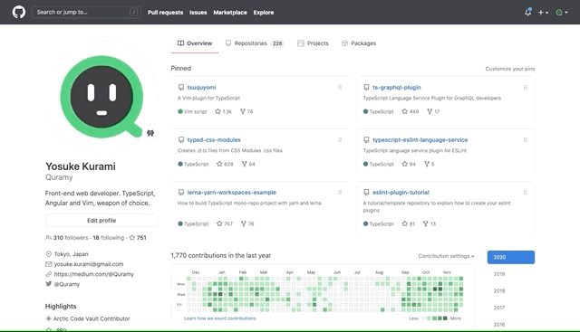

# Puppeteer と ARIA Handler

久しぶりに Puppeteer の話。

先日、社内の技術共有会で https://github.com/puppeteer/recorder という npm パッケージの話が挙がったのだけど、ここで登場する ARIA Handler という機能が面白い内容だったため、それを書いていこうと思う。

https://developers.google.com/web/updates/2020/11/puppetaria で触れられている内容と重複する部分も多いため、先に参考として挙げておく。

また、Puppeteer の Undocumented な機能であったり、CDP の Experimental な機能への言及となるため、その点は承知した上で読んでもらえると。

## Puppeteer Recorder

`@puppeteer/recorder` 自体は名前の通り、Headless Chrome ラッパである Puppeteer を使って Chromium での操作を記録し、記録内容を再実行可能な JavaScript コードとして吐き出だすためのツールだ。

下記のように CLI として起動すると、Puppeteer が起動するので、ポチポチ操作を行うだけでよい。

```sh
$ npx @puppeteer/recorder https://github.com/Quramy --output recorded.js
```

例として、次の GIF のような操作をしたとしよう。Web ページの操作なら何でも構わないが、ここでは GitHub の画面操作を題材にしてみた。



1. https://github.com/Quramy を開く
1. "ts-graphql-plugin" というレポジトリのリンクを選択する
1. 検索ボックスに "addon" と入力し、レポジトリ内検索を行う

この操作を行うと、`@puppeteer/recorder` は以下のスクリプトを出力する。

```js
const {
  open,
  click,
  type,
  submit,
  expect,
  scrollToBottom
} = require("@puppeteer/recorder");
open("https://github.com/Quramy", {}, async page => {
  await click("aria/ts-graphql-plugin");
  expect(page.url()).resolves.toBe(
    "https://github.com/Quramy/ts-graphql-plugin"
  );
  await click("aria/Search");
  await type('aria/Search[role="textbox"]', "addon");
  await click("aria/Search addon in this repository");
  expect(page.url()).resolves.toBe(
    "https://github.com/Quramy/ts-graphql-plugin/search?q=addon"
  );
});
```

実のところ、このスクリプトを実行させても、（僕が試した今日現在では）全然まっとうに動かないし、expect の中身間違ってるわ、ちゃんと navigation を wait できてねーわではっきり言って使い物にならない。現状でこの CLI の利用はこれっぽちもお勧めできないし、ただオートメーションを記録したいだけであれば、Katalon のようなツール使ったほうがいいと思う。

## ARIA Handler と Accessible Name/Role クエリ

ここからが本題。今回の主役は recorder そのものではなく、recorder が出力する「要素の特定方法」だ。例えば下記の行：

```js
await click("aria/ts-graphql-plugin");
```

この行における `click` 関数は `@puppeteer/recorder` が export しているものだけど、やっていることは Puppeteer を生で使った場合の下記と一緒だ。

```js
const handler = await page.waitForSelector("aria/ts-graphql-plugin");
await handler.click();
```

注目して欲しいのは、クリック対象の要素を選択するセレクタの文字列 `'aria/ts-graphql-plugin'` という部分。

Puppeteer では、ハンドラというコンポーネントが要素選択を担うことになっている。デフォルトのハンドラは CSS クエリを使ったハンドラだが、 `page.$('<カスタムハンドラ名>/<クエリ文字列>')` のように書くと、カスタムハンドラを利用できる。
上記の `aria/` は Puppeteer v5.4 で登録された、Puppeteer のビルトインカスタムハンドラだ。特に正式名称があるわけではないのだけど、このエントリ内では ARIA Handler と呼ぶことにする。

`aria`という名前の通り、このハンドラは ARIA 情報に基づいた要素の特定手段を提供する。

先程の `page.waitForSelector("aria/ts-graphql-plugin")` であれば、「名前が"ts-graphql-plugin"である要素」という意味のセレクタになる。

CSS セレクタの`page.waitForSelector("[name='ts-graphql-plugin']")` とは意味が違う。ここでいう「名前が」とは、Accessible Name として、ということだ。`page.waitForSelector("aria/ts-graphql-plugin")` がマッチする要素の例は、例えば下記だ。

```html


<a href="./ts-graphql-plugin">ts-graphql-plugin</a>
```

もっと複雑な例はいくらでも考えられるし、 [Accessible Name の仕様](https://www.w3.org/TR/accname-1.1/#mapping_additional_nd_te)を見れば、同じことを DOM の API だけで実現するのがどれだけ面倒かが想像つくと思う。

また、ARIA Handler では `'aria/Search[role="textbox"]'` のように、名前の後ろに `[role=<ロール名>]` を与えることで、Role で絞り込むことも可能。この例であれば「Search という名前の textbox」という意味になる。

今日時点では ARIA Handler が受け付けるクエリは Accessible Name と Role のみで、他の属性を使うことはできないが、Puppeteer 本体でもまだ Undocumented な部分だし、後述するが、対応する CDP メソッドも実験的扱いなため、利用可能な属性やクエリ構文自体が今後拡張されていくことは十分あると思う。

## セマンティックなクエリのもたらす価値

重要なのは、今回の Accessible Name によるクエリが要素を特定する方法として CSS セレクタに比べて、よりセマンティックである、という点だ。

E2E や RPA の文脈でしばしば課題として挙がるのが、セレクタの保守性だ。

昨今は CSS クラス名は自動生成されていたりすることも多く、ビルドをし直したら CSS クラス名が変わってしまって以前マッチしたセレクタが動かなくなることはザラだろう。また、BEM のような予測可能なクラス名のルールを使っていたとしても、E2E スクリプトが内部の実装に強く依存してしまう点は一緒だ。

このような課題については、Page Object を設けて、シナリオ本体から内部実装が暴露している箇所を隠蔽する、などのアプローチで解決を図ることが多いが、テストコード全体が冗長になるし「その Page Object クラスに定義されたメソッド名にどういう意味があるのか」は、Page Object 実装者の手に委ねられることになるため、完全に課題を解消できているかと言われると疑問符がつくところ。

E2E における操作対象要素の特定方法（ロケーティング）については、[なぜ E2E テストで id を使うべきではないのか - Autify blog](https://blog.autify.com/ja/why-id-should-not-be-used) に種々のセレクタの良し悪しについて詳細が紹介されていて、その中で下記のように書いてある。

> E2E テストにおいては、 振る舞いこそが正義 で、振る舞いが変わった時にこそ追従すべきと考えられます。そのため、 id や class といった内部的な要素に依拠するのではなく、要素の持つ意味や振る舞いに着目してロケーティングするのが最も自然です。
> （中略）
> 文言をロケータに使うメリットは、先に述べたように 要素内のテキストが変更されたときにテストが失敗する点です。要素の外部的な振る舞いを保護できるとも言い換えられます。

この考え方に則ると、Accessible Name や Role のような ARIA 情報を用いたクエリというのは、まさに「外部から見た振る舞いによる要素の特定手段」になり得る存在だ。
画面内の文言を利用するという意味では、従来でも XPath で DOM の text node の内容を引っ掛ける程度のことはできるが、「支援技術から見てセマンティックな情報」というのは、それよりも数段強い。

今回、このエントリで（現時点では使い物になるとは思えない） `@puppeteer/recorder` の出力を取り上げたのも、ARIA Handler を利用したセレクタが CSS セレクタでの E2E スクリプトよりも可読性や保守性の点で優れていることが目に見えてわかりやすいからだ。

```js
await click("aria/ts-graphql-plugin");
await type('aria/Search[role="textbox"]', "addon");
await click("aria/Search addon in this repository");
```

ところで、`@puppeteer/recorder` の実装を軽く眺めてみると、「ARIA Handler クエリが構築できない場合、CSS クエリに fallback する」というようになっていたのだけれど、むしろ逆ですらいいと思う。「セマンティックなクエリが書けなければ、それはリリースする価値がない」ということだ。

```html
<! -- 何かしらのformの一部 -->
<input id="agreement_chkbox" type="checkbox" />
<label>同意しました</label>
```

例えば上記の HTML に対して、CSS クエリと ARIA Handler クエリの両方を書いてみたとする。

```js
page.$("#agreement_chkbox").click(); // 動作する
page.$("aria/同意しました").click(); // 意図と異なった動作になる
```

上記の HTML は label と checkbox の紐付けが抜けているため、 label 部分をクリックしたところで、 `#agreement_chkbox` の状態は変わらない。E2E を記述する上で、CSS クエリの利用を禁止すれば、`for` 属性が抜けていることに気づく切欠になるかもしれない。

真に Accessible なアプリケーションとは、自動テストや RPA から見ても Accessible であるべきだし、テストの記述がアプリケーションの a11y 向上に繋がると捉えることもできるのではないだろうか。

## ARIA Handler と CDP と AOM

少し実装の話にも触れておこう。

ARIA Handler や `@puppeteer/recorder` を支えているのは、 CDP(Chrome Devtool Protocol)の `Accessibility.getPartialAXTree` と `Accessibility.queryAXTree` だ。Chromium の master に merge されたのが 2020 年 10 月頭あたりなので、割と新しめのメソッド。

例えばレコーディング機能を自分で実装するには、次のようにすればよい。

1. `DOMDebugger.setEventListenerBreakpoint` で click や key down を監視し、event 発生時に target node の Remote ID を取得
1. 取得した node の ID をキーにして`Accessibility.getPartialAXTree` から Accessibility Tree の Node を取得
1. Node に含まれる Accessibility Name, Role を元に ARIA Handler 用のクエリを構築

ARIA Handler から実行するとき（Replay 時）は、 `Accessibility.queryAXTree` に取得した Accessibility Name や Role 情報を渡せば Puppeteer ではお馴染みの Element Handle が取得できるので、あとは `await handle.click()` のように利用するだけ。

CDP のコードを軽く読んでみたが、 `Accessibility.getPartialAXTree` は AOM(Accessibility Object Model)で策定が進められている最中の `window.getComputedAccessibleNode` 関数の実体とほぼ一緒。
要するに blink に実装されている Accessibility Tree がもっている情報（AXNode）を返却している（blink が管理している AXNode は、Role が ARIA に準拠していないなどの若干の差異があるが、そこは CDP の層で吸収されてる模様）。現状では `getComputedAccessibleNode` は blink の feature flag を有効にしないと使えないが、安定して使えるようになれば CDP に頼らずとも下記のようなコードで同じことが実現できそう。

```js
window.addEventListner("click", async event => {
  const axNode = await getComputedAccessibleNode(event.target);
  console.log(`page.$('aria/${axNode.name}[role="${axNode.role}"]')`);
});
```

## 要素の一意性

Accessible Name と Role だけでクエリを構築することを考えると、Recorder のようなツールを作る上で問題になりそうな点として「それが page 内で unique である保証がない」が挙げられる。

実際、例えば GitHub のどこかのページを開いて Accessibility Tree を開いてみればわかるが、`aria/@Quramy[role="link"]` というクエリに該当する要素は何回も出てくる。操作対象が登場する文脈を固定してからでないと、このようなクエリが意図通りに動かないはずだ。

今回紹介した CDP の `Accessibility.queryAXTree` は、ページ全体だけでなく、特定の node 配下を検索対象にすることはできる（Puppeteer 側からみたら特定の Element Handle に対して selector を実行するのと同義）。

```js
const context = await page.$("aria/〇〇セクション");
await context.$('aria/続きを読む[role="link"]').click();
```

上記みたいな感じで、Element Handle を介して文脈を表現することはできそうなんだけど、いざ Recorder みたいなツールを作ることを考えたときに「『文脈を特定する』とはどういう操作なのか？」という壁にぶち当たりそう。

## おわりに

このエントリでは Puppeteer の ARIA Handler を中心に、ARIA 情報を用いたクエリがブラウザ自動化にもたらす恩恵について書いてきた。
本文中でも触れたように、`@puppeteer/recorder` というパッケージや、CDP の実装はまだまだ Experimental なため、「明日から本番投入！」という温度感ではないけれど、「ARIA が E2E の基盤技術になっていく」世界には心躍るものがある。
また、a11y 関連の対応はとかく後手に回りがち（これは自分への戒めも含めて）になってしまうことが多いと思うが、「保守性の高い E2E を書こうと思ったら気づいたら a11y も向上した！」といった開発体験に繋げられたら最高だと思う。
