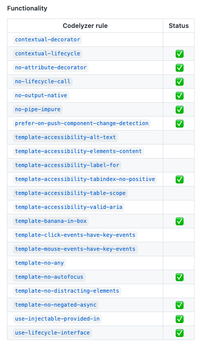
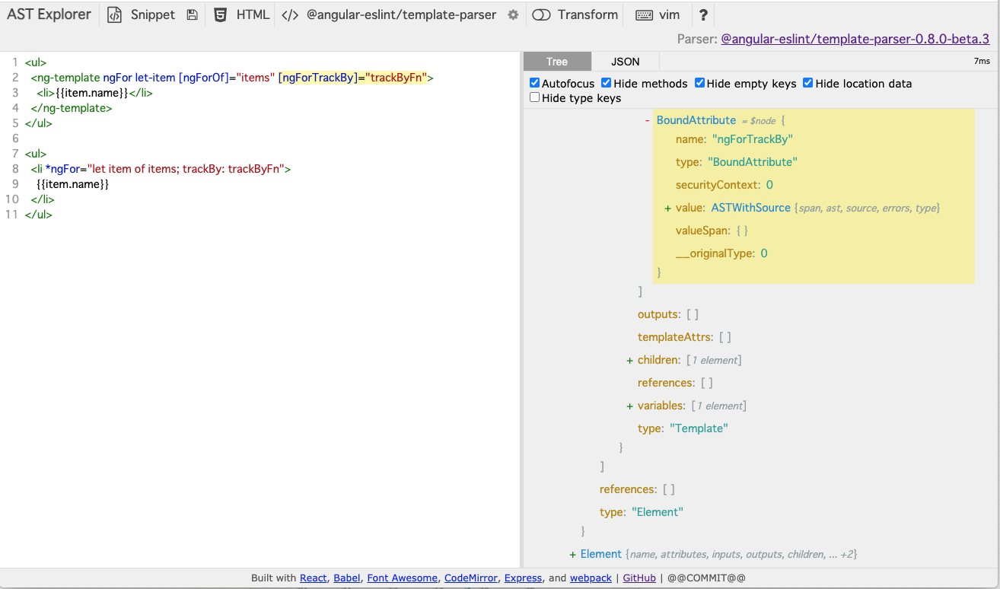

# angular-eslint

これは [Angular Advent Calendar 2020](https://qiita.com/advent-calendar/2020/angular) 8 日目の記事です。

## Angular と Linter

[Angular: ESLint サポートの現状 2020 Autumn](https://blog.lacolaco.net/2020/11/angular-state-of-linting-2020/) にあるように、Angular CLI v12 から TSLint が deprecated 扱いになる。

TSLint とともに使われてきた Codelyzer で提供されてきた Rule については、今後は [angular-eslint](https://github.com/angular-eslint/angular-eslint) が提供していくことになる。実際、多くの Codelyzer ルールが angular-eslint に移植済みだ。



一方でこの移行済みチェックリストを眺めていると、`template-` prefix から始まる、すなわち HTML テンプレートを相手にしたルールは空白が多いことに気づく。

「移行の上で何かしらのハードルが存在するのだろうか？」と思い、適当に一個 Codelyzer の rule を ESLint 化してみることにする。

対象に選んだのは [template-use-track-by-function](http://codelyzer.com/rules/template-use-track-by-function/) というルール。「`*ngFor` を使うときに、`trackBy` 関数の指定を強制する」というやつ。

## ESLint の rule 開発

ESLint のルールを作る上で必須となるのが、「対象となるコードがどのような AST で展開されるか」を理解することだ。

angular-eslint の場合、2 種類の parser に頼っている。

- `@typescript-eslint/parser`
- `@angular-eslint/template-parser`

前者は TypeScripter にとっては最早お馴染みとなっていて、TypeScript 本体の parser が返す `ts.SourceFile` の AST を ESTree 形式に変換して ESLint から利用できるようするためのもの（正確に言うと、ESTree への変換は、より下位の `@typescript-eslint/estree` が担当している）。

Angular の HTML テンプレートを ESTree に変換するのが、後者の `@angular-eslint/template-parser` だ。 `@angualr/compiler` の `parseTemplate` が HTML テンプレート文字列が AST を返してくれるので、これを ESTree 形式に変換している。

まずは、この `@angular-eslint/template-parser` が返す ESTree を可視化する手立てを作らねばならない。ということで、AST Explorer に parser を追加する PR を用意した。

https://github.com/fkling/astexplorer/pull/553

下図のような感じ（https://quramy.github.io/astexplorer/ でも試せるようにしてある）



## HTML AST と esquery

さて、今回 Codelyzer から移植しようと思った `template-use-track-by-function` というルールは、`ngFor` を対象にしているわけだけど、これは ng-template に対して、ngFor のディレクティブを当てるか、`*ngFor` としてテンプレート構文を利用するかで二通りの書き方がある。

```html
<ng-template
  ngFor
  let-item
  [ngForOf]="items"
  [ngForTrackBy]="trackByFn"
></ng-template>

<li *ngFor="let item of items; trackBy: trackByFn" />
```

触ってみてわかったけど、 `*ngFor` で書いておいても、`<ng-template>` で書いた場合と同じく、「`ngForOf` は biding attribute で、その expression は`items` である」という意味の AST Node が得られた。テンプレート構文(`*`のことね）の解釈まで `@angular/compiler` が済ませていることになる。AST のレベルで解釈が済まされている、ってことは `*` の部分、Angular にとってはマクロのように考えているのかもね。

さておき、これで ESLint のルールから参照すべき AST の構造が大体見えてきた。

`ngForOf` というバインディングで node を引っ掛けるには、 `BoundAttribute[name="ngForOf"]` という esquery を書けばよい。

https://github.com/estools/esquery は ESLint でも利用されているライブラリで、AST に対して、CSS セレクタのようにクエリが書ける、という代物。
「ある程度までクエリで対象の AST node を絞り込んでから、細かい処理を node に対する条件処理として書いていく」というのが ESLint のルールを書く基本。

今回僕が実装したルールでは、ng-template の場合と `*ngFor` の場合でエラーの報告の仕方が若干ことなる仕様だったため、

- `BoundAttribute.templateAtts[name="ngForOf"]`
- `BoundAttribute.inputs[name="ngForOf"]`

で処理を分けるように書くことにした。

## 仕上げ

ban 対象とする AST の構造がわかってしまえば、あとはこちらのものだ。

Codelyzer 本家の GitHub に移植元のルールに対するテスコードが用意されているので、それを angular-eslint 側で再現していく。もともと Codelyzer からの移植を強く意識していたからか、同じようにテストコードが書けるように細かいヘルパーが用意されており、作業しやすい。

最終的に完成した PR はこちら。

https://github.com/angular-eslint/angular-eslint/pull/211

## おわりに

今回のエントリは、「移行の上で何かしらのハードルが存在するのだろうか？」に端を発して、自分で Codelyzer の template 系ルールを angular-eslint に移植するのをやってみたわけだが、大枠の所感としては下記。

- そもそも template HTML の AST がわからない -> AST Explorer で見れるようにすれば問題ない
- ルールの実装しやすさ -> esquery が利用できるなど、むしろ angular-eslint 上で実装する方が、ツールが揃っていてやりやすい

まだ幾つか未実装の Codelyzer ルールがあるので、PR チャンスと思ってトライしてみたらどうだろう？

以前、[ESLint の plugin 開発チュートリアル](https://github.com/Quramy/eslint-plugin-tutorial/blob/master/guide/README.ja.md)というものを書いたことがあるので、こちらも参考にしてほしい。AST Explorer や esquery といった基本的な登場人物について、使い方を触れてあるので。
