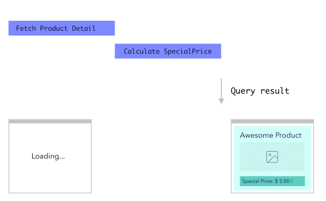
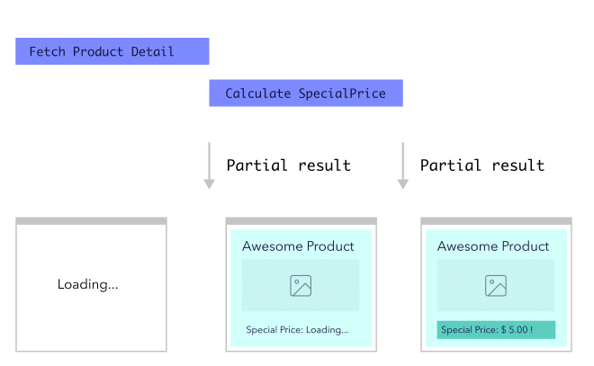
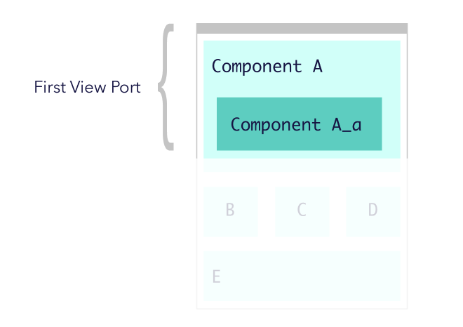

# State of `@defer` and `@stream`

これは [GraphQL Advent Calendar 2020](https://qiita.com/advent-calendar/2020/graphql) 16 日目の記事です。

このエントリでは、GraphQL の `@defer` と `@stream` というディレクティブについて書いていく。色々書いていたら割と長くなってしまったが、内容は下記のとおり。

- このディレクティブの登場背景
- ディレクティブの Spec
- graphql-js を用いた実装

## `@defer` / `@stream` とは何か

`@defer` と `@stream` は共にデータの取得方法を制御するためのディレクティブだ。名前が示すとおり、クエリ全体から特定の箇所の読み込みを遅延させたり、ストリーミングさせることができる。2020 年末現在、GraphQL spec としては Stage 2（草案段階）であり、参照実装である graphql-js にも実装が存在している。

GraphQL 生みの親である Lee Byron が [React Europe 2016](https://www.youtube.com/watch?v=ViXL0YQnioU&feature=youtu.be&t=9m4s) で言及したのが初出（のはず）。その後、Facebook Relay が独自にカスタムディレクティブとして独自実装していたものをベースとして、GraphQL Spec での仕様策定が進んでいる（ただし Spec の Champion は Relay とは別のところの人）。

## 解決しようとしている課題

ディレクティブの詳細に入る前に、GraphQL を使ったアプリケーションが直面しやすい性能上の問題について触れておく。

GraphQL の魅力の 1 つは、クライアントが自由にレスポンスの形を指定し、関連するリソースを少ないリクエスト回数で取得できることだ。
特にコロケーションと組み合わせることで、「画面描画に必要十分なレスポンスに相当するクエリ」を保守性を保ったまま構築できる。

通信回数を削減させることを考えると、1 つの画面に 1 つのクエリという状態が GraphQL アプリケーションの理想とも言える。


ここで注意が必要となるのが「画面描画に必要十分な」という表現だ。クライアントは、GraphQL クエリの結果が到着しないと画面の描画を行えない。

例えば次のような例を考えて欲しい。

EC サイトを運用しようとしてるとしよう。次のような商品詳細ページを考えてみて欲しい。

- 商品名や商品画像、定価といった基本的な属性の他に、商品の特別価格を表示する必要がある。特別価格の決定要因には展開中のキャンペーンやユーザーが保持しているクーポンなどがあり、計算コストが高い。

```graphql
query ProductDetailQuery {
  product(id: 100) {
    id
    name
    imageURL
    specialPrice # 計算が大変
  }
}
```


素朴に実装すると、特別価格（`specialPrice`）の取得を待っている間、ユーザーには商品に関する情報が一切表示されない。ローディングが終わらないので、別の画面に行ってしまったら最悪だ。折角ユーザーのために値引きしていても、コンバージョンレートを下げることになってしまう。



それであれば、特別価格の取得は後回しにして、商品の基本属性だけを先に描画した方が良いだろう。



別の例を考えてみよう。

- この EC サイトのトップページは、現在おこなっているキャンペーン、商品カテゴリのリスト、ユーザーにおすすめの商品のリストを表示するものとする

とくにスマートフォンユーザーにとって、ファーストビューにこれらのコンテンツがすべて収まるだろうか？大半のコンテンツはスクロールしないと見えないのでは？コンテンツのデータ取得すべてを待ってから画面を描画するというのは、Core Web Vitals の 1 つである LCP(Largest Contentful Paint) を悪化させる要因となる。



やはりファーストビュー部分だけを先に描画しておき、それ以外のコンテンツはプレースホルダコンテンツで代替しておいて、遅延取得するようにしたくなるはずだ。

２つの例を挙げたが、どちらも「すべてのデータの到着を待つことよりも、クライアントの描画を優先したい」という状況だ。

実際にこのようなケースでパフォーマンスチューニングを行う場合、GraphQL のクエリを分割して対応しているのではないだろうか。

```graphql
query ProductDetailQuery {
  product(id: 100) {
    id
    name
    imageUrl
  }
}

# パフォーマンス観点でクエリを分けました！
query ProductDetailLazyQuery {
  product(id: 100) {
    id
    specialPrice
  }
}
```

論理構造的には 1 つのクエリで十分だったところを複数に分割すると、コードの見通しが悪くなるし、後から他のエンジニアが見てもわかるようにコメントやドキュメント化しておかないとまた統合されてしまう可能性もある。
またバックエンドでは、商品詳細の取得処理が複数回に分断されるため、元のコードよりもオーバーヘッドが増大してしまっている。

クエリのうち、一部部分を選択的に遅延読み込みさせる仕組みがあれば、このようなクエリ分割処理をせずにすむ。これを目的に策定されているのが `@defer` と `@stream` だ。

## Spec

ここからはディレクティブの仕様に話を移そう。一点補足だが、以下に書く内容は [GraphQL Spec](https://github.com/graphql/graphql-spec/blob/master/rfcs/DeferStream.md) で提案されているものである。というのも、 `@defer` / `@stream` は Facebook Relay が独自に実装していたものがあり、Spec に提出された案も基本的に Relay の実装を元にしているのだが、現在は細かい点で差異があるためだ。

### `@defer`

`@defer` は特定のフラグメントについて、結果取得を遅延させる。 `@skip` や `@include` とは違い、フィールドには付与できない。

```graphql
fragment ProductLazyFragment on Product {
  specialPrice
}

query ProductDetailQuery {
  product(id: 100) {
    id
    name
    ...ProductDetailLazyQuery @defer
  }
}
```

```graphql
query ProductDetailQuery {
  product(id: 100) {
    id
    name
    ... on Product @defer {
      specialPrice
    }
  }
}
```

`@defer(if: false)` のように、`if` という input で制御が可能なのは `@skip` などと同等だ。また、 `@defer(label: "hogehoge")` とすることで、遅延取得対象にラベルを付与できる。

### `@stream`

`@stream` はリスト型のフィールドについて、データの取得を段階的に行えるようにするためのディレクティブである。以下のように利用する。

```graphql
query ProductsQuery {
  products(first: 50) {
    nodes @stream(initialCount: 10) {
      id
      name
    }
  }
}
```

`if` と `label` という input は`@defer` と共通だが、`@stream` は `initialCount` という必須パラメータがあり、ここで指定した個数までは初回の取得結果に含まれる。

## 1 Request / Multiple Response

GraphQL サーバーは、必ずしも `@defer` と `@stream` を実装する必要はない。実装していない場合、 `@defer` や `@stream` のディレクティブは完全に無視されて、これまで通りすべてのデータの完成を待ってからクライアントに届ければいいだけだ。

これらのディレクティブを実装する場合、サーバー側は 1 つのリクエストから複数のペイロードをレスポンスとして返却することになる。サーバー側で利用する言語ごとに実装パターンは異なるだろうが、たとえば ReactiveX のようなストリーム型のフレームワークや、コルーチンやジェネレータを利用することになるはず。

以下のクエリに対する応答を例に説明する。

```graphql
query ProductDetailQuery {
  product(id: 100) {
    id
    name
    ... on Product @defer {
      specialPrice
    }
  }
}
```

```js
// 1st payload
{ "data": { "product": { "id": 100, "name": "とても良い商品" } }, "hasNext": true }

// 2nd payload
{ "path": ["product"], "data": { "specialPrice": 2000 }, "hasNext": false }
```

1 つめのペイロードは、これまでの GraphQL クエリ実行結果のレスポンスと殆ど一緒だが、一点違いとして、 `hasNext: true` として、未取得のデータが残っていることを示す項目が追加されている。

2 つめのペイロードが `@defer` されたフラグメントに対応する。 `path: ["product"]` という部分が「どこにパッチを当てたらよいか」を表している。この形式は GraphQL の実行エラーを示すときに出てくる `path` と同じパターンだ。上記の例の場合、2 つめのペイロードをもって全体が完成するため、 `hasNext` は `false` となる。

`@stream` の場合も同様だ。 `path` に含まれる値が配列のインデックス値になる。

これらをまとめて TypeScript の型定義風に書くと、以下のように表すことができる。

```ts
type AsyncExecutionResult = {
  data: any; // データ本体
  hasNext: boolean; // 最後かどうか
  path?: (string | number)[]; // 2つめ以降のペイロードの場合、パッチを当てるべき場所情報
  label?: string; // リクエスト時に label パラメータを付与した場合に、その値が詰められる
};
```

## graphql-js

GraphQL Spec の参照実装である graphql-js には v15.4.0 で `@defer` と `@stream` が実装されている。ただし、2020 年 12 月現在では `npm graphql@v^15.4.0` とするだけでは利用できず、 `experimental-stream-defer` をバージョンに付与してインストールする必要がある。

```sh
npm i graphql@v15.4.0-experimental-stream-defer.1
```

現状の実装では、この 2 つのディレクティブが有効であるようなリクエストを受け取った場合、`asyncIterable` なオブジェクトを解決するようになっている。戻り値の型が変わっている、すなわち破壊的変更なため、正式な対応は v16 以降になるのだろうか。

```ts
declare function graphql(
  ...args
): Promise<AsyncIterableIterator<any> | ExecutionResult<any, any>>;
```

実際の挙動を確認してみよう。

ここでは次の SDL で表現されるスキーマを対象にしてみる。「`specialPrice` という項目の算出は他の項目に比べて時間が掛かる」という状況を想定している。また、 `@stream` の挙動も確認したいので、 `Query.products` をリスト型項目としてある。スキーマの実装自体はさして面白みがないので割愛するが、興味がある人は[サンプルレポジトリのソースコード](https://github.com/Quramy/graphql-streaming-example/blob/main/src/schema/schema.ts)からどうぞ。

```graphql
type Product {
  id: ID!
  name: String!
  price: Int!
  specialPrice: Int ## 計算に時間がかかる
}

type Query {
  products(first: Int!): [Product]
}
```

上記のスキーマに対して、 `graphql` メソッドで次のクエリを実行する。戻り値が `asyncIterable` な場合は、`for await of` 構文で結果を表示するように切り替えておく。

```ts
import { graphql, AsyncExecutionResult, ExecutionPatchResult } from "graphql";
import { schema } from "./schema";

function isAsyncIterable(x: any): x is AsyncIterableIterator<any> {
  return x != null && typeof x === "object" && x[Symbol.asyncIterator];
}

function isPatch(x: AsyncExecutionResult): x is ExecutionPatchResult {
  return "path" in x && Array.isArray(x.path);
}

async function main() {
  const result = await graphql({
    source: `
      query ProductsQuery {
        products(first: 4) @stream(initialCount: 1, label: "stream") {
          id
          name
          price
          ... on Product @defer(label: "specialPrice") {
            specialPrice
          }
        }
      }
    `,
    schema
  });
  if (isAsyncIterable(result)) {
    for await (const payload of result) {
      if (!isPatch(payload)) {
        console.log(payload.data, payload.hasNext);
      } else {
        console.log(payload.path, payload.label, payload.data, payload.hasNext);
      }
    }
  } else {
    console.log(result.data);
  }
}

main();
```

結果は次のようになる。遅延取得がわかりやすいように、 defer, stream を付与している項目については、スキーマの実装側で数百ミリ秒程度の遅延を行うようにしてある。

[](https://asciinema.org/a/379210)

`@defer` / `@stream` については、この「1 リクエストに対して、複数レスポンスが返ってくる（かもしれない）」という挙動を押さえておけば問題ない。ここから先の話なんて言ってしまえばおまけみたいなものだ。

## Transport (Server-Side)

Spec が規定するのは、あくまでリクエストとレスポンスの形式までであり、それらが実際にどのようなネットワークプロトコルの上でやりとりされるかは GraphQL の仕様の範疇ではない。

サーバーから複数のペイロードが push できるもの、というと、選択肢になり得るのは下記あたりだろう。

- HTTP 1.1 の chunked transfer
- Web Socket
- Server Sent Event
- HTTP/3 の server side push

[Spec の Champion である robrichard が express-graphql に出している PR](https://github.com/graphql/express-graphql/pull/726) を見ると、まずは HTTP 1.1 の`Transfer-Encoding: chunked` + `Content-Type: multipart/mixed` で実現しようとしいる模様。[graphql-helix](https://github.com/contrawork/graphql-helix) もこれにならっている。

`mulripart/mixed` は Email の添付ファイルとかで用いられているやつ（昔の Twitter の user stream API も確か同じやりかたで streaming を実装していたような記憶）。

この投稿を書いている時点では express-graphql に上述の PR 726 が merge されていなかったので、自分で `multipart/mixed` を書いてみた（参考: [RFC 2046 MIME: 5.1. Multipart Media Type](https://tools.ietf.org/html/rfc2046#section-5.1)）。

```ts
const BOUNDARY = "-";

const result = await execute({
  schema,
  document,
  variableValues: variables ?? {}
});
if (isAsyncIterable(result)) {
  res.writeHead(200, {
    "Content-Type": `multipart/mixed; charset=UTF-8; boundary="${BOUNDARY}"`,
    "Transfer-Encoding": "chunked"
  });
  for await (const payloadObj of result) {
    const payloadBody = JSON.stringify(payloadObj);
    // prettier-ignore
    const multipart = CRLF
                    + CRLF
                    + `--${BOUNDARY}` + CRLF
                    + 'Content-Type: application/json; charset=UTF-8' + CRLF
                    + `Content-Length: ${payloadBody.length}` + CRLF
                    + CRLF
                    + payloadBody;
    res.write(multipart);
  }
  res.write(CRLF + `--${BOUNDARY}--` + CRLF);
  res.end();
} else {
  res.json(result).end();
}
```

## Transport (Client-Side)

クライアント側も `multipart/mixed` なレスポンスについて、[`ReadableStream` を開いて、ペイロードを一つずつ yield するような generator](https://github.com/Quramy/graphql-streaming-example/blob/main/src/frontend/network/multipart-http-client.ts)を準備しておく。

クライアントライブラリ側でも、サーバー側の実装に合わせて適切なトランスポートを実装しておく必要があるということだ。自分で `multipart/mixed` のストリーム変換を書くのが面倒であれば、 https://www.npmjs.com/package/meros あたりを利用するのがよさそう。

トランスポートが出来てしまえば、もはや `grahpql-js` をそのまま実行していたときと変わらない。サンプルの仕上げとして、最後に `patchData` という関数を用意し、generate されるペイロードを単一のクエリ結果に統合するようにする。

```ts
type Path = readonly (string | number)[];

function patchData(base: any, path: Path, patch: any) {
  if (path.length === 0) return base;
  let parent = base;
  const fragments = path.slice(0, path.length - 1);
  const lastIndex = path[path.length - 1]!;
  for (const fragment of fragments) {
    parent = parent[fragment];
  }
  const target = parent[lastIndex];
  parent[lastIndex] = { ...target, ...patch };
  return base;
}

async function* graphql({
  query,
  variables
}: {
  query: string;
  variables?: any;
}) {
  const client = new HttpGraphQLClient({ url: "/graphql" });
  const result = await client.graphql({ query, variables });
  if (isAsyncIterable(result)) {
    let data: any = {};
    for await (const payload of result) {
      console.log(payload);
      if (!isPatch(payload)) {
        data = payload.data;
      } else {
        data = patchData(data, payload.path!, payload.data);
      }
      yield data;
    }
  } else {
    console.log(result);
    yield result;
  }
}

async function main(enableStream = true) {
  document.querySelector("#out > pre")?.remove();
  const query = `
    fragment ProductDetail on Product {
      specialPrice
    }
    query ProductsQuery($enableStream: Boolean!) {
      products(first: 4) @stream(initialCount: 1, if: $enableStream) {
        id
        name
        price
        ...ProductDetail @defer(if: $enableStream)
      }
    }
  `;
  for await (const queryResult of graphql({
    query,
    variables: { enableStream }
  })) {
    render(queryResult);
  }
}
```

これで、クエリ結果が段階的に描画されるように実装することができる。今回は画面側は DOM に直接 `JSON.stringify` した結果を書き込むだけのシンプルな実装に留めた。これをブラウザで実行すると、下図のようになる。


## `@defer` / `@stream` の使い所

この 2 つのディレクティブは、何か新しい機能を実装するためのものというよりは、性能向上のためのものだ。

とくに、ウォーターフォール（N + 1）が発生してしまう箇所に適用させると効果が高いはず。

バックエンドがモノリシックな RDB の場合は、[GraphQL::Batch](https://github.com/Shopify/graphql-batch)や[DataLoader](https://github.com/graphql/dataloader)あたりを利用すれば N+1 を減らすことができるが、複数のマイクロサービスに跨ってしまうケースについては、一定の効果が見込めるのではないだろうか。

いずれにせよ、闇雲に使うようなものではなく、フロントエンドとバックエンドのパフォーマンスを可視化する手立てを整えるのが先決。

## ライブラリの状況

主要な GraphQL クライアントライブラリの `@defer` / `@stream` への対応状況は下記のとおり。

- Apollo Client: v3.5 のマイルストンで対応を表明している
- Relay: Undocumented ながら実装はされている。ただし、現状の Spec と細部が多少ことなる( `hasNext` や `initialCount` など）

サーバー側についても、graphql-ruby や sangria, Juniper などメジャーなライブラリの issue や PR を覗いてみたが、ポツポツ issue が立ち始めている程度なので、実際に広く利用できるようになるのはまだまだ先という印象。

どうしても早く使いたい、というのであれば、以下の構成になるのだろうか。

- サーバー: express-graphql or graphql-helix (Node.js)
- クライアント: Relay（https://github.com/facebook/relay/pull/3121 の merge を待ったほうがよい）

## サマリ

- `@defer` / `@stream` は GraphQL アプリケーションのパフォーマンス改善を行うためのもの
- 「データ取得がウォーターフォールになってしまう箇所」に適用することで効果が見込める
- Relay の実装をベースに GraphQL Spec で策定が進んでいてる。2020 年 12 月現在 Stage 2
- graphql-js には experimental チャネルから利用可能だが、ライブラリの対応状況はまだまだ
- express-graphal では `Content-Type: multipart/mixed`, `Transfer-Encoding: chunked` を使って HTTP 1.1 トランスポートを実装している
- サンプルの実装は https://github.com/Quramy/graphql-streaming-example に置いてある

## `hasNext: true`

特にクライアント側の処理について、もう少し踏み込んだ内容を書いていきたいのだけど、正直力付きてきているので、今回のエントリはここまでにする。

今回はアドカレの期日に間に合わせる方が優先だし、そもそもこの投稿は `@defer` についての記事なのだから、書くのが大変な部分は別のペイロードにして届けることにして何の問題があるのだろう。

## 参考リンク

- History:
  - https://www.youtube.com/watch?v=ViXL0YQnioU&feature=youtu.be&t=9m4s : Lee Bylon の動画(React Europe 2016)
  - https://www.youtube.com/watch?v=WxPtYJRjLL0&feature=youtu.be&t=696 : Facebook Relay での活用事例 in F8 2019
  - https://www.youtube.com/watch?v=icv_Pq06aOY : この RFC の Champion である Rob Richard のによる GraphQL Summit 2020 での講演動画
- Blog:
  - https://www.apollographql.com/blog/introducing-defer-in-apollo-server-f6797c4e9d6e/ : Apollo Server (2018 の blog だが、いまだ実装されていない
  - https://foundation.graphql.org/news/2020/12/08/improving-latency-with-defer-and-stream-directives/ : GraphQL Foundation の blog
  - https://kazekyo.com/posts/20201005 : 日本語解説記事
- Reference Implementation:
  - https://github.com/graphql/graphql-js/pull/2319
- Server Implementations:
  - https://github.com/graphql/express-graphql/pull/583 : express-graphql に defer と stream をサポート
  - https://github.com/graphql/express-graphql/pull/726 : 上記の PR の続き
  - https://github.com/contrawork/graphql-helix : 軽量なサーバーサイド GraphQL ライブラリ。 express や koa と組み合わせて利用可能。
- Apollo Client:
  - https://github.com/apollographql/apollo-client/blob/main/ROADMAP.md#35 で予定されている
- Relay:
  - https://github.com/facebook/relay/pull/3121 : Relay の defer/stream 実装を Spec RFC と合わせる PR
  - https://relay.dev/docs/en/experimental/a-guided-tour-of-relay#incremental-data-delivery : ドキュメントはおそらくこれ。思いっきり `TODO` って書いてあるけど、セクションのタイトルと位置と PR の名前から考えてここしかない
  - https://github.com/facebook/relay/blob/master/packages/relay-runtime/store/RelayModernQueryExecutor.js#L314-L319 : deferred な response を解釈する部分
  - https://github.com/facebook/relay/blob/master/packages/relay-runtime/store/__tests__/RelayModernEnvironment-ExecuteWithDefer-test.js : Relay runtime store のテストコード
  - https://github.com/facebook/relay/blob/master/packages/relay-compiler/transforms/__tests__/__snapshots__/DeferStreamTransform-test.js.snap : Relay compiler の defer, stream に対する transform
- Juniper:
  - https://github.com/graphql-rust/juniper/issues/734
- RFC:
  - [HTTP 1.1 Transfer Encoding](https://tools.ietf.org/html/rfc7230#section-3.3.1)
  - [MIME Media Types](https://tools.ietf.org/html/rfc2046)
