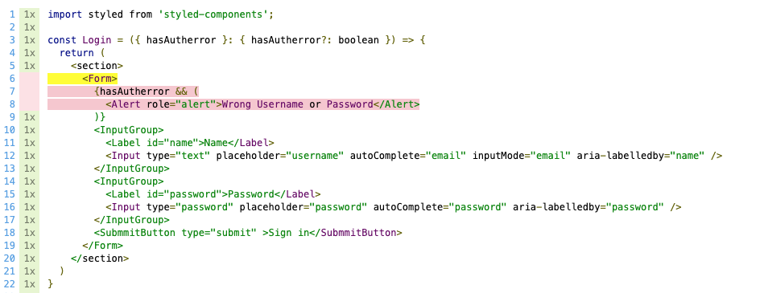
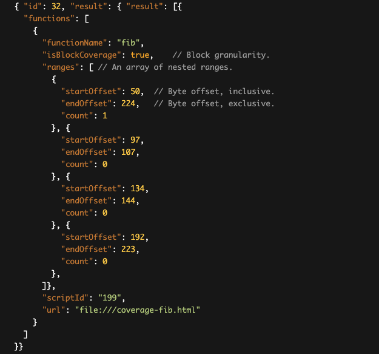

# Puppeteer と Coverage の話

これは [Recruit Engineers Advent Calendar 2020](https://adventar.org/calendars/5166) の 23 日目の記事です。

アドカレの 1 日目も Puppeteer の話を書いてたのだけど、別にその続きとかではまったくなくて、少し前に Puppeteer のカバレッジ関連でドハマリしたのでそれを書こうと思う。

## 背景

他のところで散々書いてきているので、軽く触れる程度にしておくが、 https://github.com/reg-viz/storycap というツールの開発・メンテをしている。Puppeteer で Storybook をクローリングして各 Story を PNG 画像にする、ただそれだけの CLI だ。

このツールは画像ベースの回帰テストを自動化する目的で作られていて、日々の業務でも reg-suit や reg-cli などのツールと組み合わせて使っており、自分自身世話になっているツールの 1 つだ。

自動テストの一環としてStorycapを使っている関係上、Storybookをコンポーネントガイドのためというだけでなく、自動テストのためのツールとしても捉えていてる。各 story はそれぞれがテストケースだ。

幸いにも、僕の周りでは「コンポーネントを用意したら合わせてStorybookも用意する」という文化が醸成されていて、それはとても良いことなんだけど、やはり日々エンハンスをやっていると「テストが実行されていないパス」というのが生まれてくる。下図のようなイメージだ。



このように、実行された・されていないがカバレッジとして可視化されていれば、どこに問題があるのかがすぐ分かる。上図の場合、 `<Alert>` という コンポーネントを描画する分岐が実行されていないため、ある日だれかがこのコンポーネントの CSS をいじっても、見た目の差分に気づかないままリリースしてしまう可能性がある。また、 `hasAutherror: true` の場合のケースを追加すればいいことも一目瞭然だ。

実のところ、Storyshots を使えば、jest の枠組みに乗れるので、カバレッジはそれで採れちゃうんだけど、Storyshots をセットアップするのもそこそこ手間が掛かることもあるし、それであれば Storycap に直接カバレッジ取得機能をもたせて、CI で Storycap を実行したときに、実際に Puppeteer で描画されたかどうかを記録したいのだ。

上述のサンプル画像も実際に Puppeteer 経由で取得したカバレッジのキャプチャだ。
ただ、Storycap で取得したわけではなく、別途「Storybook のカバレッジを取得するだけの CLI」というのを作り、それを実行している。

https://github.com/Quramy/storycov

なぜ Storycap に統合していないのかについては後述する。

## Puppeteer から Coverage を取得する

カバレッジの取得自体、Puppeteer から CDP を使って V8 のカバレッジを取ってしまえばいい。

ただ、昨今のフロントエンド開発においてで、何の変換処理もせずに手で書いた.js ファイルがそのままブラウザで実行されている、ということはないだろう。Alt JS のトランスパイルや難読化処理、モジュールバンドラによる結合などが絡み合って.js ファイルとソースマップを出力するようになっていると思う。

開発者から見て意味のある内容にするために、以下のような処理を加えて上げる必要がある。

1. Puppeteer (CDP) で V8 のカバレッジを取得（これは生成された.js ファイルについてのカバレッジ）
2. カバレッジの対象コードについて、ソースマップを取得
3. カバレッジにソースマップを適用させて、ソースコード（.tsx ファイルなど）におけるカバレッジに変換する

2 のソースマップの取得はどうということはない。 https://www.npmjs.com/package/convert-source-map に生の.js ファイルにユーティリティが揃っている。
インラインソースマップであれば、カバレッジの結果に含まれる.js スクリプトの結果そのものからソースマップが取得できるし、.js.map ファイルが別のファイルとなっている場合でもスクリプト末尾の `sourceMappingURL` の対象を fetch すればいいだけだ。

3 のカバレッジ変換処理については、 https://github.com/istanbuljs/v8-to-istanbul を使えばよい。これは Node.js 界のカバレッジ兄貴こと Benjamin Coe さんがメインで作っている npm パッケージ。c8 も内部でこれを利用していて、適切にソースマップを与えればそれも加味して Istanbul 形式のカバレッジに変換してくれる優れもの。ひとたび Istanbul Coverage になってしまえば、任意の Istanbul Reporter で好きな形式に変換できるため取り回しもしやすい。また、 https://www.npmjs.com/package/istanbul-lib-coverage を使えば、jest など別の CLI で取得したカバレッジと結合することだってできる。

実際のコードは結構長くなるのでここでは割愛するが、webpack などでバンドルされたファイルについて Puppeteer でカバレッジを取得するためにやることはこれだけだ（念の為、実際の処理部分のリンクも貼っておく https://github.com/Quramy/storycov/blob/main/src/index.ts ）。

## ドハマリポイント

実のところ、Puppeteer からのカバレッジ復元作業で一番ハマったのはまさかの「1. Puppeteer (CDP) で V8 のカバレッジを取得」の部分だった。
最初全く気づかなかったのだけど、Puppeteer の `page.coverage.stopJSCoverage` が返すオブジェクトは V8 の Precise Coverage の出力と微妙に異なる。

Puppeteer のソースを読めば一目瞭然で、 https://github.com/puppeteer/puppeteer/blob/v5.5.0/src/common/Coverage.ts#L273 で、V8 が取得したデータを独自の関数に通して加工しているのだ。

CDP(Chrome Devtool Protocol) は https://chromedevtools.github.io/devtools-protocol/tot/Profiler/#method-stopPreciseCoverage に従って、生の V8 Precise Coverage を返却してくれていて、これは下図のような `ranges` を出力する。



https://v8.dev/blog/javascript-code-coverage より引用

この `ranges` の要素は、JavaScript の AST における Statement や Expression の位置と対応しているのだけど、Puppeteer は「連続した複数の Range をまとめる」という処理をしてしまう。
トランスパイルなどの変換処理が存在しない世界であればまだ許せるが、質が悪いのは以下のようなケース。

```
// トランスパイラによって自動挿入された関数
function __generated__() {
  // なにか
}
function() myFunction {
  __generated__(); // トランスパイラによって挿入されたstatement
  doSomething();
}
```

- V8 の出力: `__generated__` の関数 body と `myFunction` の関数 body についての range がそれぞれ出力される
- Puppeteer の加工後 `__generated__` の最初から `myFunction` の終了までが 1 つの range として扱われる

後者の range は source map を適用させようとすると「トランスパイル前のソースコードに range の始点が対応付かないが、終点側は対応が付く」という矛盾した状態になってしまう。
もしかしたら、このような複雑な intersection も考慮して v8-to-istanbul の側で対応できるのかもしれないが、どう考えても Puppeteer 側で妙な結合処理をせずに、CDP の出力をそのまま返してくれればいいだけの話だ。

その旨を Puppeteer 側に PR として出しているのだけど、まだ merge はされてない（というか放置されてる気がする）

https://github.com/puppeteer/puppeteer/pull/6454

Storycap にカバレッジ対応を追加していない理由も、この問題に起因していて、要するに「Puppeteer の `page.coverage` からソースマップを加味してカバレッジを復帰することはできない」からだ。Puppeteer の page インスタンスから、 `page._client` にアクセスしてしまえば CDP のセッションを取ることはできるから最悪できるといえばできるんだけど（上述した storycov はこの技を使っている）、あまりやりたい手段ではない。

ちなみに Playwright だとこういう問題は起きないので、上述した v8-to-istanbul との合わせ技が普通に使える。
