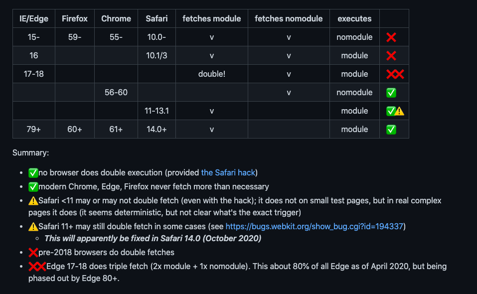

# Front-End Performance Checklist 2021 の Build Optimization を読む

https://www.smashingmagazine.com/2021/01/front-end-performance-2021-free-pdf-checklist/#build-optimizations

## 28. Have we defined our priorities?

ページが必要とするアセットを列挙して、それぞれのアセットがどのグループに属するかを洗い出すべし。

- _core_ : レガシーブラウザでも動作させる必要のあるコアコンテンツ。全員がアクセス可能である。
- _enhanced_ : よりリッチな体験。ブラウザ毎に異なってもよい部分。
- _extra_: 必須ではないコンテンツ。web font など、遅延読み込み可能なもの

[過去に Smashing Magazine 自体が行ったパフォーマンス改善](https://www.smashingmagazine.com/2014/09/improving-smashing-magazine-performance-case-study/) も参考のこと。

core > enhanced > extra の順で最適化をする。

## 29. Do you use native JavaScript modules in production?

core 向けと enhanced 向けに提供モジュールを分ける。

テクニックとしては、`<script type="module">` を使った Differential Serviing パターンを使う。

core(レガシーブラウザ): トランスパイル済み, polyfill 込
enhanced(モダンブラウザ): トランスパイル無し（もしくは downlevel が小さい）, polyfill 無

ただし、一部のブラウザではこの hack が逆効果に働くことがある。 https://gist.github.com/jakub-g/5fc11af85a061ca29cc84892f1059fec



(Chromium Edge, iOS Safari 14 にパッチがあたったので、double fetch 問題は発生しなさそう)

`module/nomodule` の feature detection だけでは足りないことがある。Chrome が搭載されている安価な Android 端末などに、enhanced な機能が必要か？という話。

将来的に、Client Hint Header でデバイスメモリを見つつ、これも serve する js ファイルの判断基準に加えたらよいのでは。

## 30. Are you using tree-shaking, scope hoisting and code-splitting?

- Tree Shaking: Code Elimination のテクニック
- Scope Hoisting: ある種の inline 展開でコード量を削減するテクニック

Note: webpack 4 時点ではどちらも production mode ではデフォルトで有効化されているので、あんまり気にする必要ない

### Code Splitting

SPA の場合、bootstrap のスピードを上げることは重要。FW 毎に色々なテクニックがあるから、それを参照すべし。

Note: Angular のテクニックとして紹介されているのは、https://github.com/mgechev/angular-performance-checklist/blob/master/README.ja-JP.md#%E3%83%AA%E3%82%BD%E3%83%BC%E3%82%B9%E3%81%AE%E9%81%85%E5%BB%B6%E8%AA%AD%E3%81%BF%E8%BE%BC%E3%81%BF のあたりなど。

## 31. Can we improve Webpack's output?

webpack の設定をもっと頑張ることで、バンドルサイズをより削減できるチャンスがあるよ、という話。

### Tree Shaking と Side Effects の話

Tree Shaking で `import` / `export` は削られるが、必ずしもその定義コードが削除されるわけではない、という話。

特に関数呼び出しが絡んでいる場合、思ったほど削減されてない可能性がある。そういうケースでは、関数呼び出しに Terser 向けの Magic Comment `/* #__PURE__ */` を付与することで、デッドコードになる場合に正しく bundle からと取り除かれるようになる。

Note: [webpack 側の説明](https://webpack.js.org/guides/tree-shaking/) をちゃんと読むのが一番わかりやすい。

次のコードにおいて、関数 `ComponentB` は import されてないため、webpack は Tree Shaking にて「コイツはどこからも import されていない export だよ」というマークをつける。

```js
/* lib.js */
export function ComponentA() {
  return "A!";
}

export function ComponentB() {
  return "B!";
}

/* index.js */
import { ComponentA } from "./lib";

console.log(ComponentA());
```

このコードは `webpack --mode production` でビルドすれば、`function ComponentB` の定義ごと全部削除される。これは webpack ではなく、Terser が頑張っている。

先のコードを少し変更して、以下のようにしたとする。

```js
export function ComponentA() {
  return "A!";
}

function ComponentBInner() {
  return "B!";
}

export const ComponentB = hocFn(ComponentBInner);

/* index.js */
import { ComponentA } from "./lib";

console.log(ComponentA());
```

`ComponentB` が webpack から見て unused であること自体に違いはない。しかし、上記のコードを production build した場合、 `function ComponentBInner` の定義部分は bundle に残ってしまう。なぜなら、Terser からは `hocFn(ComponentBInner)` というコードが安全に削除可能か、すなわち「`hocFn` は副作用のない関数なのか」を理解できないからだ。

そこで、`/* #__PURE__ */` の Magic Comment を使い、Terser に `hocFn` に副作用が無いことを通知する。こうすれば期待通りに `ComponentB` の定義以下を bunle から削除できる。

```js
export const ComponentB = /* #__PURE__ */ hocFn(ComponentBInner);
```

実践的には、 package.json の sideEffects を定義して、import したら副作用が発生する module の rule を列挙しておく。

### 雑多な plugin 達の紹介

他にも、状況に応じて、bundle サイズを削減できるような plugin が色々あるので、適用可能かどうかを検討すべし。

- https://www.npmjs.com/package/purgecss-webpack-plugin
- https://www.npmjs.com/package/google-fonts-webpack-plugin
- etc...

## 32. Can you offload JavaScript into a Web Worker?

UI Main Thread から Web Worker に処理を逃がすことで、CPU 詰まりを解消できるよ、という話。

典型的なユースケースとして、PWA / SPA で、後で利用するデータを prefetch しておくような処理は Web Worker に逃がすことができる。

https://github.com/GoogleChromeLabs/comlink のようなフレームワークを使えば、Thread 間のメッセージングを比較的容易に書ける。

v80 以降の Chrome だと、worker の js ファイルを module 読み込みできる。Main Thread での `import()` を利用するのと同じような遅延ロードが可能、ということ。

```js
const worker = new Worker(url, { type: "module" });
```

Note:
「実際にどれくらい効果があるの？」的な話につながるリソースは見当たらず。 [CDS 2019 の PROXX](https://web.dev/off-main-thread/) が 参考として挙げられていたけど、アレを一般的なユースケースというには疑問符が付くところ。

一般的に、Worker 化に向くか向かないかとして、書きの基準がある。

- Worker に向いている処理: 実行に時間がかかるコードブロック, メッセージの入出力データ量が小さい, request/response モデルに従っている
- Worker に向いていない処理: DOM に依存する, 遅延が許されない処理,

Note: そもそも Worker からは DOM 扱えないからそりゃそうだろ、って気がする

## 33. Can you offload "hot paths" to WebAssembly?

WebAssembly は JS を置き換えるためのものではない。

大概の Web アプリケーションでは JavaScript の方が向いているが、WASM は"computationally intensive web apps", すなわち計算コストそのものが効いてくる（e.g. ゲームなど）は WASM での実装が適している。

ほぼすべてのブラウザで WASM を動かすことができる、また JS -> WASM 呼び出しのオーバーヘッドも改善されている。

Note: この節には一般的なことしか書いてなかったので、[Front-End Study #2 の chikoski さん動画](https://youtu.be/Ga8P_buwXnw?t=3951) とか観た方がよいかな。

## 34. Do we serve legacy code only to legacy browsers?

モダンブラウザはすべて ESM サポートされているので、これら向けには Transpile ターゲットを ES2017 にできる。

（IE などの）レガシーブラウザには、 `<script nomodule>` 従来の bundle を提供すればよい。

https://web.dev/publish-modern-javascript/ にモダン・レガシーな JavaScript をどのようにトランスパイルすべきかのガイドラインがあるので、参考にするとよい。

https://estimator.dev/ に自分のドメインを入力すれば、どれくらいの削減効果があるのかを事前に評価できる。

Note: "29. Do you use native JavaScript modules in production?" の節と言ってること一緒なような。。。

## 35. Identify and rewrite legacy code with incremental decoupling.

長期に渡るサービスは、レガシーなコードが塵積になる傾向がある。これは往々してパフォーマンスに悪影響を及ぼす。
まずは、（それが大変であっても）レガシーコードのリファクタリングに必要な時間を評価しよう。

評価が済んだら、漸次的に利用箇所を減らしていく戦略をとることができる。

レガシーコードが呼び出されている頻度を定期的にモニタリングし、それが上昇傾向に無いことを確認すべし。
レガシーなライブラリを呼び出すコードが PR されたら、警告するようにするとよい。

Note: 下図は、紹介されていた [GitHub が jQuery を駆逐する過程](https://github.blog/2018-09-06-removing-jquery-from-github-frontend/) で計測されていた jQuery の呼び出し総数。


GItHub では、具体的に以下のアプローチを採った:

- `eslint-plugin-jquery` という ESLint ルールを開発。これは例えば `$.ajax` のようなコードがあるとエラーを上げるようになっている
- 既存のコードベースに対して、 `eslint-disable: no-jquery` のようなコメントを一律に付与する
- 新しい PR で、誰かが `eslint-disable: no-jquery` が含まれるコードを add しようとするケースでは、bot が警告を出すように設定
- `eslint-disable: no-jquery` の個数を定期計測して、単調減少していくことを確認する

やると決める -> 仕組みを作って属人性を排除する という流れがとてもよい。パフォーマンスと関係なくとも、技術的な負債を返却する仕組みとして有効なのでとてもよい。

## 36. Identify and remove unused CSS/JS.

Chrome や Puppeteer, Playwright を使って JS / CSS Coverage を取得して、削除可能なコードを探そう。

### JS

1. Coverage 取得を有効化し、画面描画を行う
2. Unused なコードを見つけたら、その部分を `import()` で遅延取得するように変更してみる。

これを繰り返していけば、Initial Load で取得する js のサイズを削減することが可能。

Note: 紹介されている "Puppeteer Recorder" は Chrome Extension としてのもの。 https://github.com/puppeteer/recorder とは似ているけど別物。

Note: Puppeteer での JS Coverage、[Transpile が絡むと罠がある](https://quramy.medium.com/puppeteer-%E3%81%A8-coverage-%E3%81%AE%E8%A9%B1-dcaee81d6f52)ので、個人的には懐疑的な気持ちになる。

### CSS

特定のセレクタが削除候補になったとして、「本当にこのセレクタはどこからも呼び出されていないのか？」が疑わしい場合、以下の方法で確認することができる。

- 1x1 px の透過 gif をそのセレクタの background-image として設定し、1, 2 ヶ月間後にその gif ファイルにだれもアクセスした痕跡がログにあるかどうかを確認する

## 37. Trim the size of your JavaScript bundles.

以下のようなケースをビルドプロセスでチェック・削ぎ落とすことで、bundle size を削減しよう。

- 一部分しか利用していないのにも関わらず、ライブラリ全体をバンドルしてしまっている
- 不要な polyfill を含めてしまっている

https://github.com/GoogleChromeLabs/webpack-libs-optimizations には、色々なライブラリ毎に、対応するためのテクニックが記載されている。

また、新しいライブラリを追加しようとするときには、それがどれくらい bundle size に影響を及ぼすかを事前に評価しよう。

- https://bundlephobia.com/ を使えば、増加量の見積もりがとれる
- https://github.com/ai/size-limit を使って、設定した Performance Budget を超えたときに警告を出すように CI を設定することができる

他にも、 bundle におけるライブラリの専有度合いを可視化するツールなどもある。

- https://www.npmjs.com/package/webpack-bundle-analyzer
- https://github.com/danvk/source-map-explorer
- etc

Note: source-map-explorer は webpack に限らず、bundle.js と sourcemap があれば一瞬で可視化できるのでオススメ

別の話題として、利用しているフレームワークを build 時に compile して最小限の機能だけに削ぎ落とすという技もある。

- Svelte はアプリケーションの build 時に、必要な DOM オペレーションを行うような vanilla JS のコードを出力する
- React の場合、 https://github.com/sokra/rawact という Babel plugin が react-dom に対して似たようなことを行う（らしい）

Note: ここに記載は無いが、Angular が Ivy でやってることもこれに近い。Ivy が出力する view factory 相当のコードは、renderer に対して徹底的に tree shakable になるように再設計されていた。

Note: Apollo 界隈で頻出する、graphql-tag も似たような話がある。このコード、GraphQL 本体の parser を握ってしまっているが、ビルド時にクエリを AST に展開しておくことで、parser を削減することができる。

```js
import gql from "graphql-tag"; // コイツ

const query = gql`
  query MyQuery {
    hello
  }
`;
```

## 38. Do we use partial hydration?

partial hydration: SSR した結果に対して、Client 部分のアプリケーションコードを小分けにし、ちょっとずつ hydration するアプローチのこと

色々な記事があるので、参考に:

- [React での Progressive hydration (Google IO 2019)](https://github.com/GoogleChromeLabs/progressive-rendering-frameworks-samples)
- [Next.js + preact の例](https://medium.com/@luke_schmuke/how-we-achieved-the-best-web-performance-with-partial-hydration-20fab9c808d5)
- [11y + preact の例](https://markus.oberlehner.net/blog/building-partially-hydrated-progressively-enhanced-static-websites-with-isomorphic-preact-and-eleventy/)
- [Vue.js での Lazy hydration](https://markus.oberlehner.net/blog/how-to-drastically-reduce-estimated-input-latency-and-time-to-interactive-of-ssr-vue-applications/)

Note: "Progressive Hydration" と term としては同義？

Note: React における SSR, Progressive hydration, Suspense まわりの整理がよく分かんない。。。[Dan Abramov の tweet](https://twitter.com/dan_abramov/status/1190380093274828803) で "selective hydration" という単語も登場したりする。

> One feature that's already enabled (and available in the Concurrent Mode preview) is Progressive Hydration. It means that we can start hydrating the server-rendered HTML without synchronously blocking the main thread. This improves responsiveness.
> Another feature that we haven't documented (but that's technically available in the build we published) is Selective Hydration. We can prioritize hydrating a subtree that user interacted with, instead of waiting for the whole app to finish hydrating. It's very noticeable.
> Yet another aspect we haven't documented is how Suspense interplays with SSR. In this preview, React already special `<!--->` comments in HTML that demarcate Suspense loading states. React will hydrate the rest of the app without waiting for them, and be able to stay interactive.
> Progressive Hydration with Suspense means we can stream HTML, code, and data into the page, and make parts of it interactive **as it streams in**, instead of waiting for the whole thing to finish. `<Suspense>` boundaries serve as natural points to "split off" the next chunk.

## 39. Have we optimized the strategy for React/SPA?

[redEventListener: a Tale of Client-side Framework Performance](https://css-tricks.com/radeventlistener-a-tale-of-client-side-framework-performance/) という記事の紹介。

この記事の主張として、下記が挙げられる。

- Stateful Component は可能な限り Stateless Component に置き換えろ (※ 多分 FC にしろ、という意味かと）
- 可能な限り Stateless Component は SSR のみして、hydrate するな
- ちょっとした interaction をする程度の Stateful Component は、Stateless にして SSR だけにした上で、Vanilla な JS の event listener に書き直すことを検討しろ
- Stateful Component を使うのであれば、それが必要になるまで hydration を遅延させるようにしろ
- `requestIdleCallback` で Main Thread の邪魔をしないように hydration をスケジュールしろ

Note: パフォーマンスのためとはいえ、そこまで過激なことするのか？という気持ちになった

上記以外にも、React でアプリケーションを組む上でのパフォーマンス関連記事のリンクが紹介されている。

- [CSS in JS の Runtime Cost に関する記事](https://calendar.perfplanet.com/2019/the-unseen-performance-costs-of-css-in-js-in-react-apps/)
- [Next.js の bundle size を削減するテクニック](https://medium.com/ne-digital/how-to-reduce-next-js-bundle-size-68f7ac70c375)
- etc,,,

Note: CSS in JS のやつ以外は個別詳細記事まで読めてない。 Zero Runtime Cost な CSS in JS ライブラリの検討が推奨されていた。

## 40. Are you using predictive prefetching for JavaScript chunks?

分割した chunk を投機的に取得する技について。

enhanced なモジュールを lazy load すると、「実際に必要になってから」取得することになり、ユーザーの待ち時間になってしまうが、上手く prefetch 戦略を組み立てることができればこの待ち時間を解消できる、という話。

### Guess.js

Google Analytics のデータを元に、「ユーザーが次に訪問する可能性のある高いページはどこか？」を推定して、そのページに対応する route bundle を prefetch する設定を行うツール。

Note: [Minko Gechev の blog](https://blog.mgechev.com/2018/03/18/machine-learning-data-driven-bundling-webpack-javascript-markov-chain-angular-react/) に Guess.js の仕組みが詳細に解説されていて面白い。マルコフ過程をモデルとして、尤度を決定するようになっているため、「ページ A を閲覧した人がページ B に行く割合」さえわかれば十分。GA は Guess.js で取りうるデータ入力元の 1 パターンでしかないので、Adobe Analytics などの別の Data Source であっても、以下のように遷移の重みを正規化したデータを与えれば Guess.js の webpack plugin に食わせることができる。

```js
[
  { from: "/a", to: "/b", weight: 1 },
  { from: "/a/:id", to: "/c", weight: 1 },
  { from: "/a/:id", to: "/c", weight: 1 },
  { from: "/a", to: "/a/:id", weight: 1 }
];
```

Note: より進んだ内容として、Guess.js の webpack plugin は、ビルド時点で尤度が固定されてしまうが、GTM などを使って、計測・計測データの学習・学習結果から推論された `<link rel="prefetch">` の埋め込みを行うという話もあったりする。 https://iihnordic.com/blog/machine-learning-meets-the-cloud-intelligent-prefetching/

### もう少しライトなツール達

下記などもあるよ:

- https://www.npmjs.com/package/dnstradamus : リンクが Viewport に入ったときに DNS prefetch するライブラリ
- https://github.com/GoogleChromeLabs/quicklink , http://instantclick.io/ , https://instant.page/ : ユーザーのリンクに対する行動（Viewport との intersection や、hover など）に反応してリンク先を prefetch するライブラリ

## 41. Take advantage of optimizations for your target JavaScript engine.

自分達のユーザーにとって、ドミナントな JavaScript エンジンに対して、その挙動を理解することでパフォーマンス向上できる可能性がある、という話。

例えば、`async` や `defer` な script タグは、Main Thread とは別の Background thread で parse されるため、イニシャルロード時間を削減できる。

その他、特定のユースケースでは有用な JS tips 達の紹介

### Clean Code Concepts for JavaScript

https://github.com/ryanmcdermott/clean-code-javascript

Note: これ、パフォーマンスと関係ある？良いことが色々書いてあるのは否定しないけど、この節と関係の無い内容が多すぎる。

### Compress data from JavaScript with CompressionSteram API

https://wicg.github.io/compression/

Note: Node.js で言うところの `zlib.createGzip()` 的なやつ。要するに API 通信で送信前に gzip してから送れば高速に upload できる、という話。

### Detached window memory leaks

`window.open` したときに、親 window に子の参照が残り、結果として子 window を閉じても GC に memory が回収されないパターン。

Note: 以下は https://web.dev/detached-window-memory-leaks/ の抜粋。

```js
/* parent.js */
let childWin;
const open = () => {
  childWin = window.open("child.html");
};

const close = () => {
  childWin.close();
};

openBtn.addEventListener(open);
closeBtn.addEventListener(close);
```

例えば、以下のような手段で回避すべし。

- そもそも `noopener` にしちゃう（親からのインタラクションができなくなるけど、それを許容してもらう）
- `childWin` の参照を `WeakRef` でくるむ

Memory Leak の解析に使える Debug テクニックに、DevTools で以下が使える

```js
queryObject(Promise);
```

Note: コレ知らなかった。。

### Reexports are bad for loading and runtime performance

元ネタは https://twitter.com/iamakulov/status/1331551351214645251

Barrel Export が含まれているコードは bundle size, runtime cost ともに悪化する、という主張。

```js
/* components/index.js */

export { Button } from './button';
export { Icon } from './icon;
```

Note: 元スレでは Scope Hoisting の話が無視されてるように見える。webpack optimization の話を抜きに考えれば、という話か？

### Passive Event Listeners

`addEventListener` の第 3 引数の話。Handler 中で `preventDefault` しないことが保証できるのであれば、それを UA につたえることで、先んじてデフォルト挙動をトリガーできるようになる。

Note: 下記のようなケース。offset 計算が scroll を止めてしまう可能性があるが、scroll そのものを抑止したいわけではないので、 `{ passive: true }` をつけるべき

```js
scrollContainer.addEventListener(
  "scroll",
  event => {
    submitButton.disabled = !ifScrollBottom(event.target);
  },
  { passive: true }
);
```

ただ、scroll 監視系であれば、そろそろ生 Intersection Observer の利用も検討してもいいと思う。iOS 12.2 以降であれば対応してる。

### Automatically remove an event listener after it has executed

これも `addEventListener` のオプション話

```js
button.addEventListener("click", () => console.log("hello"), { once: true });
```

とすると、一回実行されたら破棄されるリスナにできる。メモリリークの抑止に使えるかもしれない、という話。

### Better JavaScript scheduling with `isInputPending()` API

「ユーザー入力が阻害されているかどうか」を判定する API。これを利用して、JavaScript タスクの実行を後ろ回しにできるかどうかをよりアグレッシブに判断できる、という話。

Note: [Facebook が 提案した API](https://engineering.fb.com/2019/04/22/developer-tools/isinputpending-api/) という件でちょっと話題になったやつ。

下記のように、動機処理を続行するかどうかの判断指標として利用するイメージ。

```js
while (workQueue.length > 0) {
  if (navigator.scheduling.isInputPending()) {
    // Stop doing work if we have to handle an input event.
    break;
  }
  let job = workQueue.shift();
  job.execute();
}
```

React fiber のコードにはこの API を利用する前提のコードが入ってる: https://github.com/facebook/react/blob/master/packages/scheduler/src/forks/SchedulerDOM.js#L466

```js
function shouldYieldToHost() {
  if (
    enableIsInputPending &&
    navigator !== undefined &&
    navigator.scheduling !== undefined &&
    navigator.scheduling.isInputPending !== undefined
  ) {
    const scheduling = navigator.scheduling;
    const currentTime = getCurrentTime();
    if (currentTime >= deadline) {
      // There's no time left. We may want to yield control of the main
      // thread, so the browser can perform high priority tasks. The main ones
      // are painting and user input. If there's a pending paint or a pending
      // input, then we should yield. But if there's neither, then we can
      // yield less often while remaining responsive. We'll eventually yield
      // regardless, since there could be a pending paint that wasn't
      // accompanied by a call to `requestPaint`, or other main thread tasks
      // like network events.
      if (needsPaint || scheduling.isInputPending()) {
        // There is either a pending paint or a pending input.
        return true;
      }
      // There's no pending input. Only yield if we've reached the max
      // yield interval.
      return currentTime >= maxYieldInterval;
    } else {
      // There's still time left in the frame.
      return false;
    }
  } else {
    // `isInputPending` is not available. Since we have no way of knowing if
    // there's pending input, always yield at the end of the frame.
    return getCurrentTime() >= deadline;
  }
}
```

ただし、 `enableIsInputPending` の flag が無効化されている状態なので、まだ公式には使われてないはず。

### Firefox's Warp

SpiderMonkey の新しい JiT Compiler


https://hacks.mozilla.org/2020/11/warp-improved-js-performance-in-firefox-83/

Note: 従来の Ion Builder が、エンジン全体で収集された Type Inference (TI) を元に最適化 JiT を行っていった。新しい Warp Builder は、Baseline JiT が作るインラインキャッシュのみを元にしたフロントエンドであること。コンパイラフロントエンドへの入力がシンプルになった、Cache IR に注力した開発を行うことで Baseline JiT も高速化された、ということくらいしか読み解けなかった。

## 42. Always prefer to self-host third-party assets.

## 43. Constrain the impact of third-party scripts.

## 44. Set HTTP cache headers properly.
