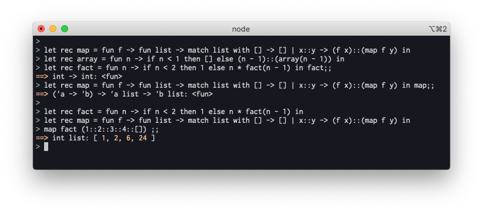

# 「プログラミング言語の基礎概念」を読んだ

この本を購入したのは一年以上前のことだったのだけど、読みかけのまま放ったらかしにしてしまっていた。最近、あらためて最後まで読んでみて、良書だなと思ったので、今日はその紹介を書いていく。

https://www.amazon.co.jp/%E3%83%97%E3%83%AD%E3%82%B0%E3%83%A9%E3%83%9F%E3%83%B3%E3%82%B0%E8%A8%80%E8%AA%9E%E3%81%AE%E5%9F%BA%E7%A4%8E%E6%A6%82%E5%BF%B5-%E3%83%A9%E3%82%A4%E3%83%96%E3%83%A9%E3%83%AA%E6%83%85%E5%A0%B1%E5%AD%A6%E3%82%B3%E3%82%A2%E3%83%BB%E3%83%86%E3%82%AD%E3%82%B9%E3%83%88-%E4%BA%94%E5%8D%81%E5%B5%90-%E6%B7%B3/dp/4781912850/ref=sr_1_1?adgrpid=58914745808&dchild=1&gclid=Cj0KCQjw9YWDBhDyARIsADt6sGbjRo4LO6Dvj-hhSLWkpXJSbOAsCzL_JLd5sXKt8Ytd4BXe8lIKE_oaAmrlEALw_wcB&hvadid=338538724753&hvdev=c&hvlocphy=1009280&hvnetw=g&hvqmt=b&hvrand=14700378759095454401&hvtargid=kwd-327673415039&hydadcr=27265_11561134&jp-ad-ap=0&keywords=%E3%83%97%E3%83%AD%E3%82%B0%E3%83%A9%E3%83%9F%E3%83%B3%E3%82%B0%E3%81%AE%E5%9F%BA%E7%A4%8E%E6%A6%82%E5%BF%B5&qid=1617024771&sr=8-1

ちなみにこの本は CoPL 本という通称で呼ばれることも多いので、このエントリでもそう呼ぶこととする。

## どんな本？

書籍名に「基礎概念」とあるとおり、技術書というよりは教科書に近い。著者の五十嵐先生も京都大学情報学研究科の教授なので、多分ご自身の授業などで副読本として使ってるんじゃなかろうか。
大学の教科書、と書くと難解そうなイメージを持たれるかもしれないけど、高校レベルの数学 + なにかしらのプログラミングの経験があれば十分読み進められる内容と思う。

本の構成としては、文中でプログラミング言語を定義していき、その言語にすこしずつ機能を拡張しながら下記を学べるようになっている。

- 式の値を求める
- 式が型付け可能か判断する
- 式の型を求める（型推論）

もう少し堅苦しい言い方をするのであれば、「プログラミング言語によって式の値が求まるとはどういうことか？」「その言語を実行することなく、エラーを検知するにはどうすればよいか？」というテーマについて知ることができる。

題材として扱われるプログラミング言語は、OCaml のサブセット語。整数の加算・減算・比較 から始まり、 `if` 式や `let` 式、関数定義と関数適用、list とパターンマッチングが言語機能として追加されていく。

書籍内でも言及されているが、OCaml や ML 系言語が未経験でも問題ない。実際、僕自身も OCaml なんて書くことも読むこともなかったけど、本書を読み進める上では何の支障もなかった。

## 学べたこと

### 今まで何気なく使っていた概念のおさらい

普段 JavaScript や TypeScript を書いていることが多い身として、「クロージャーが〜」のような言葉を使うことは頻繁にある。クロージャーだったり、それに紐づく環境と呼ばれているものについて、ふわっとした理解程度だったため、これらの概念を復習する良い機会となった。

### 型推論についての理解

これも普段自分がメインでやっている言語が TypeScript に寄っているせいもあるが、「一切の型注釈なく関数が定義できる言語」というのがそもそも新鮮だった。
「最低限関数引数には注釈しろよ」というのが身に染み付いていている。

TypeScript の場合、下記のように書くと、関数 `f` については、引数にアノテーションが無いため、 暗黙的に any にされてしまう。 `--noImplicitAny` が有効であれば、暗黙的な any が出現した時点でエラーとなる。

```ts
const f = x => x * 2;
//        ~
//        これが any 扱い

f(false); // この関数呼び出しはcompile errorにならない
```

似た意味のコードを、本書に登場する ML 言語で書くと下記のようになる（OCaml でも同じ）。

```ocaml
let f = fun x -> x * 2 in
f false
```

上記のコードは、「関数 `f` は `int -> int` という型でなくてはならない」ということが型推論機構によって判断される。

「`x * 2` という式が成立するためには `x` は数値でなくてはならない」という制約を解いていくと、関数 `f` についての型の制約が求まる、ということだ。一方 `f false` という関数呼び出しは「 `f` は `bool -> 'a` という型でなくてはならない」という制約を作るので、これらの制約をすべて同時にみたす解は存在しないため、型検査エラーとなる。

このように、制約を解いていくことで未知の型についても注釈無しで推論していく、という部分については自分にとっては初めて触れる内容だったこともあって、よい勉強になったなと感じる。CoPL 本の 10 章では書籍中で取り上げるミニ ML 言語について、「型の制約条件から未知の型を解く」部分のアルゴリズムが丁寧に解説されている。最終的には、一種のパラメトリック多相である let 多相についても解説されていて、この章が一番読み応えがあった。

余談になるけど、少し手前で、「型注釈の無い関数定義が新鮮」と書いたのだけど、実は仕事でも触れていることがあったことを思い出した。

何かというと、 Flow type。先の例を Flow で書くと次のようになり、コメントの箇所で警告される。

```js
/* @flow */
const f = x => x * 2;
//             ~
//            ここでエラー

f(false);
```

これは OCaml の型推論と同じように、「`x * 2` という式が成立するためには `x` は数値でなくてはならない」という制約に対して、関数呼び出しの `f(false)` が違反してしまうからだ。

Flow 自体が OCaml で書かれているくらい、Flow は ML の影響を強く受けている言語なだけあって、型推論の機構にも強く影響を受けていることを今更ながらに思い知った。

この点だけを取ると、仮引数に注釈が必要となる TypeScript よりも 注釈無しで推論が効く Flow の方が賢いと言って良いと思うんだけど、Flow よりも TypeScript の方が世間で流行っているのは面白い。Flow の方が後発なのにも関わらず、だ。

## 実装について

> 題材として扱われるミニプログラミング言語は、OCaml のサブセットのような言語。整数の加算・減算・比較 から始まり、 `if` 式や `let` 式、関数定義と関数適用、list とパターンマッチングが言語機能として追加されていく。

と書いたが、この本の中では、この言語（書籍中では ML5 という名前）をどう実装するかについては一切教えてくれない。

写経できるような解答が無いというのは、裏を返せば自分で考えながら好きなように実装するしかない、ということだけど、遊びとしてはこれがとても楽しい。自分がちゃんと書籍の内容を理解してないと当然実装もできないため、それを計る良い試金石にもなる。

折角なので、僕も Node.js + TypeScript で REPL を組んでみた。



https://github.com/Quramy/copl-ts

日頃のお仕事だと構文解析器を書くことなんて中々ないので、そういう意味でも新鮮だったので楽しめたと思う。

折角実装したので、本で触れられている機能以外にももうちょっと色々追加していけたら良いなー、という気持ち。Lang Service風の何かとか。

## おわりに

「プログラミング言語の操作的な意味論について知りたい」「型推論の基礎を学びたい」という人は是非読んでみるといいと思う。
