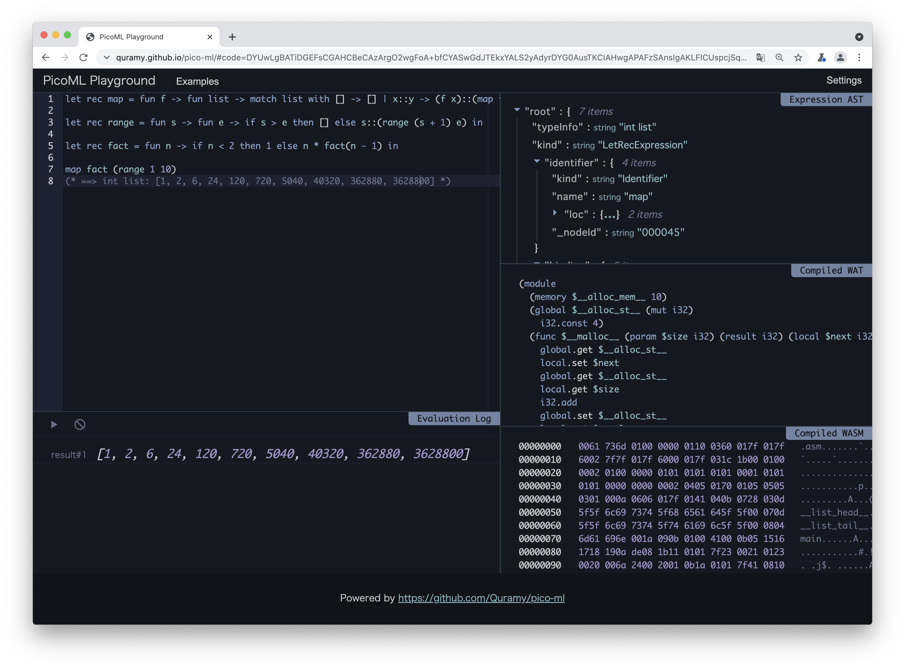
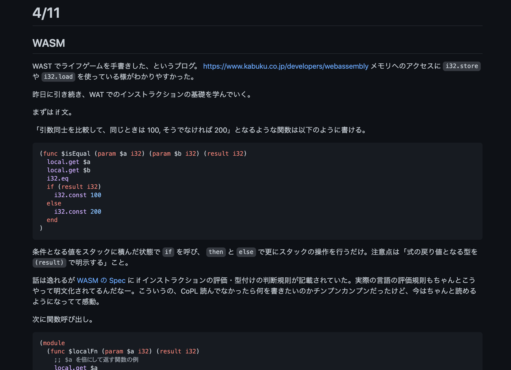
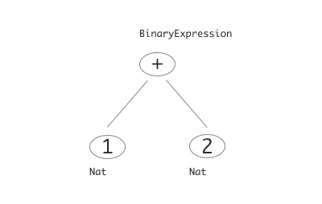
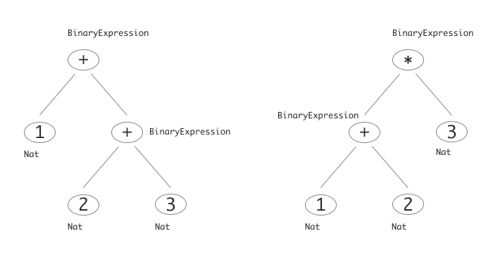
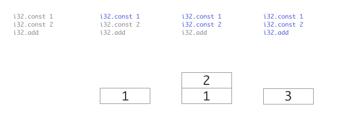
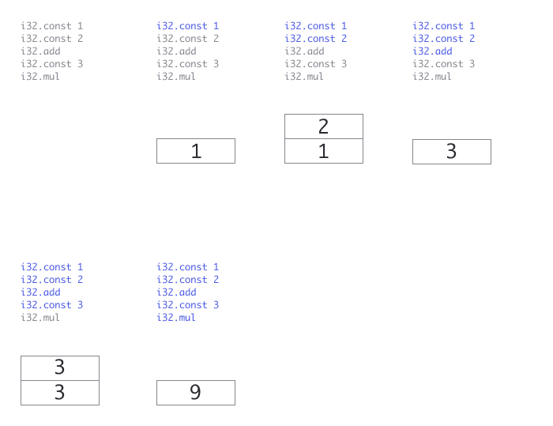
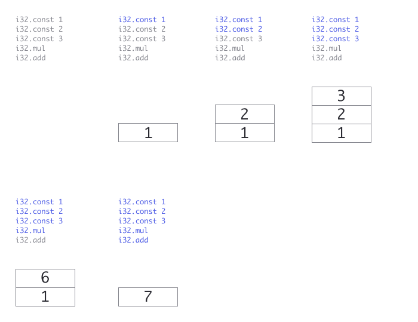

# 自作プログラミング言語と WebAssembly コンパイラ

## はじめに

このエントリでは、僕が趣味で作っている PicoML という自作プログラミング言語の話を書こうと思う。

作ってから半年くらい経っているのだけれど、如何せん自作言語という無用の長物であり、登壇などでコイツの話をすることもないため、ある種の供養みたいなものだと思ってもらって構わない。

## PicoML の概要

まずは実装した言語の紹介から。ざっくり以下の特徴を備えた言語である。

- ML ベースの文法による関数型言語
- 単純 let 多相型推論による型チェック
- CLI として、Node.js 上での即時評価器（REPL）と WebAssembly をターゲットにしたコンパイラの双方を提供

REPL やコンパイラの実装は TypeScript で行っている。自分の勉強が主目的であったため、REPL やコンパイラの CLI を動作させるのに一切の依存 npm パッケージを必要としないようにしている。トークナイザや.wasm バイナリファイルの出力に至るまですべてフルスクラッチで記述した。気づいたら 13,000 行程度（本体 10,000 行/テストコード 3,000 行くらい）に育っている。

言語としての書き味は以下のようなイメージ。

```ocaml
let x = 10 in
let y = 20 in
x + y
```

```ocaml
let twice = fun x -> x * 2 in
twice 10

(* 以下でも可 *)

let twice x = x * 2 in
twice 10
```

もうちょっと込み入った例として、1 から 10 までの整数の階乗の計算式を書くとこんな感じ。

```ocaml
let rec map f list = match list with [] -> [] | x::y -> (f x)::(map f y) in

let rec range s e = if s > e then [] else s::(range (s + 1) e) in

let rec fact n = if n < 2 then 1 else n * fact(n - 1) in

map fact (range 1 10)
```

`npm -g install pico-ml` から REPL とコンパイラをインストールできるようにしてあるが、Web Playground も用意している。Web Playground 版は、ブラウザの JavaScript で PicoML のコンパイラを動的に動かして WASM を生成し、それを実行するようにしている。画面の左下に表示されているのが、コンパイルされた WASM のバイトコードだ。



[Web Playground](https://quramy.github.io/pico-ml/#code=DYUwLgBATiDGEFsCGAHCAzCwCWBnSAvIkmLABZZ6QDu2YFA2gLoQC0AfBMxAD4QAeALkEBPNpwAUmfgEphE5GkwiZEbADsAUJtCQY8KEnUBzEBFwQzRbJgucz9EOq4sQwXGdzzDJsxIsA1BAAjKogqhrautBwGEiwkM7WmM4APBAATBCOzsGW7mbOAFRxCRLOrCERWpqKpZASPqYhIQAMMkA) からどうぞ。

上述の例のとおり、if 式や再帰関数定義、cons リストとパターンマッチなどをできるようにしている。基本的に OCaml のサブセットとなっている。

逆にできないことは山のようにある。

- 扱えるデータ構造は整数・浮動小数・真偽値・関数・リストのみ。タプルとかない
- 評価・コンパイルできるのは式は一つまで。 utop のように「トップレベルに様々な変数を束縛して、後続の式から参照する」みたいなことはできない
- 標準関数のようなものは何も提供していない。`List.map` とかも自分で書く必要があるし、 `print` 関数もない
- etc,,,

## PicoML を作った理由

全体で 13,000 loc というと、僕にとってはまぁまぁなボリュームだ。

どれくらいのボリューム感なのか、他と比較してみると、例えば [TypeScript で GraphQL Client を便利に開発するためのツールを作っている話](https://quramy.medium.com/typescript-%E3%81%A7-graphql-client-%E3%82%92%E4%BE%BF%E5%88%A9%E3%81%AB%E9%96%8B%E7%99%BA%E3%81%99%E3%82%8B%E3%81%9F%E3%82%81%E3%81%AE%E3%83%84%E3%83%BC%E3%83%AB%E3%82%92%E4%BD%9C%E3%81%A3%E3%81%A6%E3%81%84%E3%82%8B%E8%A9%B1-b66dd2fc1579?p=b66dd2fc1579) で紹介した ts-graphql-plugin という、やはり TypeScript 製のツールがある。ts-graphql-plugin は、僕が真面目に作っている OSS 類としてはコードが多い部類なんだけど、試しに先程測ってみたら 9,000 loc 程度だったので、PicoML はその 1.5 倍近くあることになる。

そこまでの手間をかけてまで何がしたかったのか、と問われたとしても明確な答えが返せなくて「一回くらいはプログラミング言語を実装する」という経験を積んでおきたかったから、と言うしかない。

日頃、Web フロントエンド関連の仕事をしている中で、抽象構文木を扱ってちょっとしたツールのようなものを用意することは割と多いのだけれど、業務の中では全体のツールチェインの隙間を埋めるためのグルーコードになる。最初から最後まで自分だけで実装するという機会は、自分で作らない限り巡り会えないと考えていたからかもしれない。

## 製作時系列

およそ 2 ヶ月半くらいで一通りを作っている。その後はたまに機能を足したりしていた。

- Phase 1. 2021/03/08 - 2021/04/03: 構文解析, 評価, 型推論部分
- Phase 2. 2021/04/03 - 2021/05/07: WebAssembly へのコンパイラ
- Phase 3. 2021/05/12 - 2021/05/21: Web Playground UI

以前に [「プログラミング言語の基礎概念」を読んだ](https://quramy.medium.com/%E3%83%97%E3%83%AD%E3%82%B0%E3%83%A9%E3%83%9F%E3%83%B3%E3%82%B0%E8%A8%80%E8%AA%9E%E3%81%AE%E5%9F%BA%E7%A4%8E%E6%A6%82%E5%BF%B5-%E3%82%92%E8%AA%AD%E3%82%93%E3%81%A0-9d9d568968f0)
というエントリを書いたのだけれど、これが上記の Phase 1 に相当する部分。

その時点のコードベースから fork して、演算子などを追加しつつコンパイラ部分を追加したのが Phase 2 だ。この時期は最初の 10 日間ほどは実装は一切せずに、WebAssembly の勉強をしていた。以下は当時の勉強メモ。



Phase 3 の Web Playground については、おまけみたいなものだ。CLI 側は気合入れて依存パッケージゼロで組んだけど、Playground 側は普通に React / Ace Editor でサクッと終わらせた。どうせ webpack でバンドルしてしまうので、zero dependencies の意味もフロントだとボヤけるし。

## 得たもの

冒頭で「無用の長物」と書いたが、フルスクラッチで PicoML というプログラミング言語の実装をしてみたからこそ得たものもあったと思う。

- プログラムを書くことそのものの楽しさ
- 新しい言語の知識
- 既に持っていた知識の再確認

コンパイラを実装するというのを言い換えると「プログラムを書くプログラムを書く」という意味になるけど、そんなの楽しいに決まっている。

PicoML の場合、やっていることは「TypeScript で OCaml を WebAssembly に生成する」ことになる。実装前の段階での僕とって勝手知ったる言語は TypeScript だけだったので、WebAssembly や OCaml は仕様書や入門者向けのドキュメントを読み漁りながら 1 から身につけていく作業だった。

特に [WebAssembly Specifications](https://webassembly.github.io/spec/core/) は実装期間中は毎日のように読んでいたので、その過程で WAT (WebAssembly Text Format) の読み書きも体得できたし、Interface Types や Module Linking などの [WebAssembly Spec Proposal](https://github.com/WebAssembly/proposals) を追いかけるモチベーションにもつながった。

一方で、既に自分自身の中に溜まっていた経験を再度引っ張りだすような部分も少なからずあった。抽象構文木関連の処理という意味では実装したことのある系統の処理も結構あって、たとえば「TypeScript で GraphQL から TypeScript の型定義を生成する」という機能が [ts-graphql-plugin](https://github.com/Quramy/ts-graphql-plugin) にあるのだけど、これもある種のコンパイラだ。[DIY GraphQL Codegen](https://speakerdeck.com/quramy/diy-graphql-codegen?slide=21) という資料に AST to AST の概念をまとめたんだけど、この経験のお陰で PicoML だろうと（多分他の言語だろうと）エッセンスを抑えておけば、再利用のできる知識だと認識できた。

繰り返しになるのだけど、言語実装というのは本当に楽しくて、[低レイヤを知りたい人のための C コンパイラ作成入門](https://www.sigbus.info/compilerbook#%E3%81%AF%E3%81%98%E3%82%81%E3%81%AB) がその楽しさを説明してくれている。

> コンパイラ作成は大変楽しい作業です。最初のころはバカバカしいくらい単純なことしかできなかった自作言語が、開発を続けていくとたちまちのうちに自分でも驚くくらい C 言語っぽく成長していって、まるで魔法のようにうまく動くようになります。実際に開発をしてみると、その時点でうまくコンパイルできるとは思えない大きめのテストコードがエラーなしにコンパイルできて、完全に正しく動くことに驚くことがよくあります。そういうコードはコンパイル結果のアセンブリを見ても自分ではすぐには理解できません。時折、自作のコンパイラが作者である自分を超える知性を持っているように感じることすらあります。コンパイラは仕組みがわかっていても、どことなく、なぜここまでうまく動くのか不思議な感じがするプログラムです。きっとあなたもその魅力に夢中になることでしょう。

プログラマ万人がやるべき、とは思わない。前述の通り、そこそこ可処分時間が持っていかれるのは間違いないし、作ったところでその成果物自体が直接何かの役に立つことはまぁないだろう。でも、それを補って余りある楽しさがあるので、興味をもってくれる人がいたら、是非何かしらの言語実装にトライしてみてほしいと思う。

## プログラミング言語をつくる流れ

以降では、PicoML の中身を説明するにあたって「どのような流れで言語が実装されていくか」の概略を解説していきたいと思う。

- Design
- Abstract Syntax Tree
- Evaluate expression immediately
- Separate Frontend and Backend
- Compile to WASM Stack machine
- Error reporting via type system

1. 言語機能・仕様の設計
1. 抽象構文木の設計と実装
1. 即時評価機能の実装
1. コンパイル機能の実装
1. 型チェック機能の実装

まずは「1. 言語機能・仕様の設計」から。

ここで考えることは、本来は山のようにある。関数型なのか手続き型なのか、変数をどのように取り扱わせるのか、評価戦略は正格なのか遅延なのか、etc...
とはいえ、本当にゼロから設計することはなく、自分が知っている何かしらの言語を参考にすすめる筈だ。PicoML の場合、最初から「関数型言語であり、文法は OCaml のサブセット」という制約を強いているため、「OCaml の仕様のうち、どこまでを取り込むか」という意味になる。

また、設計したすべての機能を最初から作り込むのは無理がある。

ここでは一旦、「0 ~ 127 までの整数の足算と掛算ができる言語」というものを考える。これだって OCaml のサブセットであることには変わりない。

```ocaml
1 + 2
```

```ocaml
1 + 2 * 3
```

```ocaml
(1 + 2) * (3 + 4)
```

言語機能のデザインが済んだら、続いては「2. 抽象構文木の設計と実装」だ。

プログラム言語と呼ばれるものは総じて抽象構文木（AST; Abstract Syntax Tree）というツリー構造に変換される（インタープリタ系言語だとそうじゃないこともあるけど）。

例えば `1 + 2` という足算は以下のようになる。



抽象構文木のデータは次のようなイメージで定めておく。

```ts
// 2つの項の計算を表すノード
type BinaryExpressionNode = {
  kind: "BinaryExpression";
  operator: "add" | "multiply"; // 計算の種類. ここでは加算と乗算だけ
  left: ExpressionNode; // 演算子の左側の式
  right: ExpressionNode; // 演算子の右側の式
};

// 自然数を表すノード
type NatNode = {
  kind: "Nat";
  value: number; // そのノードが保持している値
};

// 式
type ExpressionNode = BinaryExpressionNode | NatNode;
```

「抽象」というのは、「ソースコードの全情報が保持されるわけではない」ということだ。 `1+2*3` も `1 + 2 * 3` も `1 + (2) * 3` も同じ形のデータ構造になる。一方で `1 + 2 * 3` と `(1 + 2) * 3` が同じ結果の構造になってしまったら計算を正しく行えない。この 2 つの式は、以下のような抽象構文木に変換されないといけない。



プログラミング言語をソースコードから抽象構文木に変換する機能のことを「構文解析器」とか「パーサー」と呼んだりする。たとえば先程の `(1 + 2) * 3` の変換処理であれば、 `parse` という関数を用意した上で以下のようなテストコートを書くことになる。

```ts
test("'(1 + 2) * 3' がパースできること", () => {
  expect(parse("(1 + 2) * 3")).toStrictEqual({
    kind: "BinaryExpression",
    operator: "multiply",
    left: {
      kind: "BinaryExpression",
      operator: "add",
      left: {
        kind: "Nat",
        value: 1
      },
      right: {
        kind: "Nat",
        value: 2
      }
    },
    right: {
      kind: "Nat",
      value: 3
    }
  });
});
```

ここではパーサーの実装コードそのものには触れないでおくが（長くなってしまうので）、実装のやり方や考え方だけ簡単に触れておく。

パーサーを用意するには、たとえば [PGE.js](https://pegjs.org/) のような「パーサージェネレータ」と呼ばれるライブラリを利用する。

ただ、この程度の自作言語であれば自分で書くのもそれほど難しくない。再帰下降構文解析と呼ばれるテクニックが常套手段として用いられる。

パーサージェネレータにせよ、再帰下降構文解析にせよ、「そのプログラミング言語で表現可能なコードを表現するための生成規則」を定義することになる。生成規則は BNF や EBNF と呼ばれる記述方法で表現されることが多い。いまここで扱っている「自然数の加算・乗算ができる言語」は以下のように表現できる。

```
expr  ::= mul ("+" mul)*
mul   ::= group ("*" group)*
group ::= "(" expr ")" | nat
nat   ::= "0" | "1" | "2" | ... | "127"
```

一番目の規則の `expr ::= mul ("+" mul)*` は加算を表していて「式は `mul` という規則の結果 1 つに続いて『`+` という記号と `mul` という規則の結果』が 0 回以上繰り返される」という意味を表している。`"+"` のように引用符付きで表しているのは、実際に言語中で利用される終端記号であり `("+" mul)*` の括弧とアスタリスクは「当該部分の繰り返し」の意味だ。同じように `mul` の規則は `group` という規則から生成されていて、こちらは乗算を表している。

`group` の規則は式を括弧でグルーピングするための規則だ。 `group ::= "(" expr ")" | nat` の `|` は、パイプ記号で区切ったどちらか一方の生成規則が適用されるという意味なので、`group` という生成規則は「 `expr` 規則を括弧で囲んだものか、もしくは、 `nat` という規則のどちらか」ということになる。 `nat` 規則はただの自然数を生成
する規則だ。

再帰下降構文解析は、BNF で表現された生成規則それぞれにパーサーを実装していくことで言語全体のパーサーを組み立てる手法だ。ここで例示した BNF から構文木を生成するパーサーの例を TypeScript Playground に書き残しておく。

[再帰下降構文解析の実装例](https://tsplay.dev/mLLXZm)

次に「3. 即時評価機能の実装」だ。

即時評価機能、という呼び方があっているのかわからないが、後続のコンパイラと区別するためにそう呼ぶことにする。「パースした構文木の式をその場で計算する」という意味で使っている。

構文木が完成していれば、木構造を再帰的に評価していくだけなので簡単。

```ts
function evaluate(expr: ExpressionNode): number {
  switch (expr.kind) {
    // 自然数ノードの場合、そのまま値を返す
    case "Nat": {
      return expr.value;
    }

    // 二項演算子ノードの場合、オペランドの評価結果から演算結果を返す
    case "BinaryExpression": {
      switch (expr.operator) {
        case "add": {
          return evaluate(expr.left) + evaluate(expr.right);
        }
        case "multiply": {
          return evaluate(expr.left) * evaluate(expr.right);
        }
      }
    }
  }
}
```

コンパイラを作る上では即時評価の機能は実装する必要はないのだけど「設計した言語を動かせるようにする」という楽しみが割と簡単に味わえるので、そういう意味ではオススメである。

最後は「4. コンパイル機能の実装」について。

まずは「どのような環境で動作させたいか」に従って、出力対象を決める必要がある。PicoML は以下の理由で WebAssembly を選択している。

- Node.js でもブラウザでも動作する
- 仕様そのものを学びたかった

ということで、あとは WebAssembly のランタイムが読める形式、要するに WASM を生成するだけだ。

先程から例として使っている自然数の加算・乗算器に即していうのであれば、たとえば「`(1 + 2) * 3` を計算してその結果を返す WebAssembly モジュール」は以下の wasm となる。

```
00000000 | 0061  736d  0100  0000  0105  0160  0001  7f03
00000010 | 0201  0007  0801  046d  6169  6e00  000a  0c01
00000020 | 0a00  4101  4102  6a41  4103  6c0b
```

いきなりバイト値の列を例示しても流石にチンプンカンプンなので、ここもステップ・バイ・ステップで説明していく。

まずは「ただ自然数定数を返す」だけの関数を持ったプログラムから。

WebAssembly にはバイナリ表現の WASM だけでなく、テキスト表現の WAT(Web Assembly Text format)という形式がある。WebAssembly の実行エンジンがサポートするのは飽くまで WASM だけだが、人間が読み書きしやすいように用意されているフォーマットが WAT だ。

以下が WAT による「整数の 1 を返すプログラム」の例。

```wat
(module
  (func (export "main") (result i32)
    i32.const 1
  )
)
```

3 行目の `i32.const 1` が「32 bit 整数の `1`」という意味だ。 `(export "main")` というのは「`"main"` という名前でこの関数をモジュール外に公開するよ」という意味。したがって、この WAT に対応する WASM は次のように JavaScript から実行できる。

```ts
const instance = await WebAssembly.instatiateStreaming(fetch("test.wasm"));
const result = instance.exports["main"]();
console.log(result);
```

さて、WAT ではいくつかの Abbreviation(短縮記法)が定義されており、先程の例も短縮記法で表現していた。 Abbreviation に頼らずに書くと、以下のように書き下される。

```wat
(module
  (; 関数の型の定義 ;)
  (type $mainFnType (func (result i32)))

  (; 関数本体の定義 ;)
  (func $main (type $mainFnType)
    i32.const 1)

  (; 外部交換の定義 ;)
  (export "main" (func $main))
)
```

また、`$mainFnType` のような `$` 始まりの部分は名前を付けた対象の参照を意味しているが、実体は順番でしかない。たとえば `type $mainFnType` は「type 宣言の 0 番目」だし、 `func $main` は「関数定義の 0 番目」に対応することになる。 `$` ではなく、このインデックス値を使って WAT を書くこともできる。

```wat
(module
  (type (func (result i32)))
  (func (type 0)
    i32.const 1)
  (export "main" (func 0))
)
```

ここまで来ると大分 WASM 形式に近づいてきている。これをバイナリ表現（WASM）で表すと次のようになる。

```
00000000 | 0061  736d  0100  0000  0105  0160  0001  7f03
00000010 | 0201  0007  0801  046d  6169  6e00  000a  0601
00000020 | 0400  4101  0b
```

https://webassembly.github.io/wabt/demo/wat2wasm/ を使うと、WAT が WASM にどのように対応しているかのログを見ることができる。先程の例の WAT を変換すると次のログが得られる。

```
0000000: 0061 736d          ; WASM_BINARY_MAGIC
0000004: 0100 0000          ; WASM_BINARY_VERSION
; section "Type" (1)
0000008: 01                 ; section code
0000009: 00                 ; section size (guess)
000000a: 01                 ; num types
; func type 0
000000b: 60                 ; func
000000c: 00                 ; num params
000000d: 01                 ; num results
000000e: 7f                 ; i32
0000009: 05                 ; FIXUP section size
; section "Function" (3)
000000f: 03                 ; section code
0000010: 00                 ; section size (guess)
0000011: 01                 ; num functions
0000012: 00                 ; function 0 signature index
0000010: 02                 ; FIXUP section size
; section "Export" (7)
0000013: 07                 ; section code
0000014: 00                 ; section size (guess)
0000015: 01                 ; num exports
0000016: 04                 ; string length
0000017: 6d61 696e          ain  ; export name
000001b: 00                 ; export kind
000001c: 00                 ; export func index
0000014: 08                 ; FIXUP section size
; section "Code" (10)
000001d: 0a                 ; section code
000001e: 00                 ; section size (guess)
000001f: 01                 ; num functions
; function body 0
0000020: 00                 ; func body size (guess)
0000021: 00                 ; local decl count
0000022: 41                 ; i32.const
0000023: 01                 ; i32 literal
0000024: 0b                 ; end
0000020: 04                 ; FIXUP func body size
000001e: 06                 ; FIXUP section size
```

WASM のマジックナンバーから始まり、`type` に相当するセクション、`function` に相当するセクション、 `export` に相当するセクションと続いていくのが見て取れる。`export` セクションの後に `section "Code" (10)` と来ているが、これが関数の本体部分だ。

豆知識だが、WASM のマジックナンバーである `0061736d` は ASCII に直すと `asm` だ。Java の.class ファイルが `c0ffee` から始まるのと似ている。

WAT と WASM の関係が見えてきたところで、 `$main` 関数の中身を少しだけ書き換えてみよう。「`1` を返す」から「`1 + 2` を返す」に変更してみる。

```wat
(module
  (type (func (result i32)))
  (func (type 0)
    i32.const 1
    i32.const 2
    i32.add)
  (export "main" (func 0))
)
```

`i32.add` というのが足算の命令だ。後述するが、WebAssembly の命令はシンプルなスタックマシンなので、実行する命令が後置されていく。

先ほどと同じ様に wat2wasm で変換ログを眺めてみると、最後の Code Section までは何も変わらないことがわかるはずだ（関数の中身しか書き換えてないから当たり前かもしれないが）。

```
// (中略)
; section "Code" (10)
000001d: 0a                 ; section code
000001e: 00                 ; section size (guess)
000001f: 01                 ; num functions
; function body 0
0000020: 00                 ; func body size (guess)
0000021: 00                 ; local decl count
0000022: 41                 ; i32.const
0000023: 01                 ; i32 literal
0000024: 41                 ; i32.const
0000025: 02                 ; i32 literal
0000026: 6a                 ; i32.add
0000027: 0b                 ; end
0000020: 07                 ; FIXUP func body size
000001e: 09                 ; FIXUP section size
```

最後の 2 行に `FIXUP *** size` とあるのは、Code Section 全体のサイズと、0 番目の関数コード（= `$main` 関数のこと）のサイズがセクションのヘッダ側になるため。

```
0000020: 07                 ; FIXUP func body size
000001e: 09                 ; FIXUP section size
```

この例では、関数コードが以下に示す 7 バイトの列からなっているので、 `func body size` が 7 であり、関数の個数が 1 個 7 + 1 (関数個数) + 1(func body size の分) = 9 となって、Code Section 全体のサイズが 9 バイトとというわけだ。

```
0000021: 00                 ; local decl count
0000022: 41                 ; i32.const
0000023: 01                 ; i32 literal
0000024: 41                 ; i32.const
0000025: 02                 ; i32 literal
0000026: 6a                 ; i32.add
0000027: 0b                 ; end
```

逆に、上記の関数コードのバイト列部分さえ生成すれば、後はその長さを数えて固定値のバイト列と組み合わせれば WASM になる、ということだ。

さて、今は自然数の加算と乗算のみからなるプログラムを見てきているわけだが、32 ビット整数の演算は WebAssembly 仕様の [Binary Format / Numeric Instructions](https://webassembly.github.io/spec/core/binary/instructions.html#numeric-instructions) に記載されている。

| WAT Instruction | WASM コード値 | 意味                                                      |
| :-------------- | ------------: | :-------------------------------------------------------- |
| `i32.const x`   |          0x41 | 定数 `x` をスタックに積む                                 |
| `i32.add`       |          0x6a | スタックから値 2 つを消費し、その加算結果をスタックに積む |
| `i32.mul`       |          0x6c | スタックから値 2 つを消費し、その乗算結果をスタックに積む |

ここでスタックマシンの説明をするため、`1 + 2` を実行する関数の WAT 例に戻ろう。

```wat
(func (export "main") (result i32)
  i32.const 1
  i32.const 2
  i32.add
)
```

WebAssembly の関数はスタックマシンベースの計算モデルに従っている。次の図は上の WAT における `main` 関数の開始から修了までの 3 命令でスタックがどのように変化していくかを表している。



さらに WAT に `i32.const 3` `i32.mul` を追加してみる。

```wat
(func (export "main") (result i32)
  i32.const 1
  i32.const 2
  i32.add
  i32.const 3
  i32.mul
)
```

スタックマシンは次のように動く。要するに `(1 + 2) * 3` を実行したわけだ。



逆に次のように `i32.add` の位置を少しだけ変更すれば、これは `1 + 2 * 3` の例だ。



抽象構文木を思い出してほしい。抽象構文木によって中置演算子 `+` や `*` を構造的に表すことができた。


「左右のノード（オペランド）がスタックに積まれている状態で、演算を実行する」というルールで加算も乗算も表現できてしまう。コードで表現すると、以下の関数 `compileToInstructions` を実行すればよいということだ。

```ts
function compileToInstructions(
  expr: ExpressionNode,
  instructions: number[] = []
): number[] {
  switch (expr.kind) {
    case "Nat": {
      return [...instructions, 0x41, expr.value]; // "i32.const ${value}"
    }
    case "BinaryExpression": {
      switch (expr.operator) {
        case "add": {
          return [
            ...instructions,
            ...compileToInstructions(expr.left, instructions),
            ...compileToInstructions(expr.right, instructions),
            0x6a // "i32.add"
          ];
        }
        case "multiply": {
          return [
            ...instructions,
            ...compileToInstructions(expr.left, instructions),
            ...compileToInstructions(expr.right, instructions),
            0x6c // "i32.mul"
          ];
        }
      }
    }
  }
}
```

上記が加算乗算を実行する WASM プログラム出力コンパイラの中核となるコードとなるのだが、「3. 即時評価機能の実装」で記述した「加算乗算を即時評価する機能」のコード（下記）と見比べてみてほしい。どちらのコードの場合も「左右のノード（オペランド）に再帰的に作用させた結果を使って、親ノード結果とする」という構造は全く一緒だ。

```ts
function evaluate(expr: ExpressionNode): number {
  switch (expr.kind) {
    case "Nat": {
      return expr.value;
    }
    case "BinaryExpression": {
      switch (expr.operator) {
        case "add": {
          return evaluate(expr.left) + evaluate(expr.right);
        }
        case "multiply": {
          return evaluate(expr.left) * evaluate(expr.right);
        }
      }
    }
  }
}
```

大雑把且つ非常に簡単ではあるが、自作のプログラミング言語が WebAssembly にコンパイルされて動作するまでの流れは以上となる。ここまでで取り扱った、自然数の加算・乗算言語のコンパイラについて、 TypeScript Playground のリンクを貼っておく。

[加算乗算プログラムの WASM コンパイラ実装例](https://tsplay.dev/mZbJ4m)

たかだか 200 行にも満たない程度のプログラムだが、「言語の生成規則から抽象構文木を作る」「構文木を探索し、ノード種別毎の処理を再帰的に呼び出していく」というエッセンスは詰まっている。 PicoML にしたって、最初はこの例のようなコードからスタートして、徐々に変数定義や関数適用のような複雑な機能を追加する形で実装を進めていた。

## Intermediate Representation

ここからは もう少し具体的なテクニックの話を書いていく。

「プログラミング言語をつくる流れ」の節では、以下の流れで実装を説明していた。

```
Source code
  |
  | (parse)
  v
Abstact Syntax Tree
  |
  | (compile)
  v
WebAssembly Binary Format(wasm)
```

PicoML の実装にあたっては、このフローはもう少し細分化している。

```
Source code
  |
  | (parse)
  v
ML Abstact Syntax Tree
  |
  | (compile)
  v
WAT Abstact Syntax Tree
  |
  | (convert)
  v
WebAssembly Strutual Object
  |
  | (unparse)
  v
WebAssembly Binary Format(wasm)
```

ポイントは ML の AST は WebAssembly Text Format の AST に変換するようにしていることだ。

WASM は [WebAssembly Structure](https://webassembly.github.io/spec/core/syntax/index.html) をバイナリ表現に落とし込んだものなのだけど、コンパイルロジックの中間構造として扱うには悩ましい点が多いのだ。

具体例で説明した方が伝わりやすいかもしれない。次のコードは WAT としては正しいコード例だ。
WebAssembly に明るくなくても、なんとなく読めるのではないだろうか。

```wat
(module
  (func $twice (param $x i32) (result i32)
    local.get $x
    i32.const 2
    i32.mul)
  (func (export "main") (result i32)
    i32.const 2
    call $twice))
```

しかし、 `$twice` のような名前の部分や、関数シグネチャを関数名の直後に記述できているのは飽くまで Abbreviation という略記法に依るもので、WebAssembly Structure の世界には、それらの概念が存在しない。

名前でなく、順番のインデックス値だけだし、関数のシグネチャも `func` ではなく、 `type` という構造に分けて表現しなくてはならない。

Abbreviation を一切使わずに先程の WAT を書き直すと、すなわちこれが Structure に近い姿ということになるのだけど、次のようになってしまう。

```wat
(module
  (type (func (result i32)))
  (type (func (param i32) (result i32)))
  (func (type 1)
    local.get 0
    i32.const 2
    i32.mul)
  (func (type 0)
    i32.const 2
    call 0)
  (export "main" (func 1)))
```

WebAssembly Structure を中間表現に用いることもできなくはないが、`call $twice` に相当する ML ノードを処理する際に Structure に `$main` という名前は保持されないので、結局 ML AST の探索中は常に「`$twice` は `func 0` である」というインデックス管理を別にしておくことになってしまう。

別途自前でインデックスの管理をするくらいであれば、ML AST をコンパイルするときは一定の Abbreviation を許容した WAT AST をそのまま中間表現としておき、一通り ML -> WAT のコンパイルが済んだ後で Abbreviation を正規化してバイナリ表現に落とした方が断然見通しが良い。

また、このように ML AST -> WAT AST -> WebAssembly Structure -> WASM として、変換を多段階にしておくことによって、「整数定数をセットするには `0x41`」のようなことを、ML 部分のコンパイル時に考えなくて済むようになり、コード全体の可読性が向上するという利点もあった。

## WAT Parser / Unparser / Template

最終的に WASM を出力する必要があるので、 WAT AST -> WASM の変換処理を実装が生じるのは上述の通りだ。

これとは別に、PicoML には以下の実装も含まれている。

- WAT のソースコード文字列から WAT AST を得るための parser
- WAT AST から WAT ソースコード文字列を出力するための unparser

両方とも ML ソースコードから WASM を得る目的のみであれば不要だったのだけれど、副次的な理由があって実装することになった。
