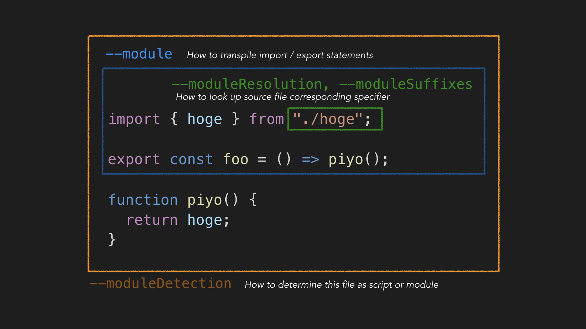

TypeScript 4.7 で "module" という名前で始まる Compiler Option がさらに追加されて、さすがに何が何やら感あるので、役割を軽く整理。

それぞれの詳細な値は本家の Reference を読みに行ってください。

## 早見表



## 重要なこと

**どのオプションをいじっても、import 対象の識別子がコンパイル持に書き換えられることはない。**

これが頭に入っていれば、.mts, .cts といった TypeScript のファイルで `import "./foo.cjs"` と書くことや、 `--moduleSuffixes` がソースコードの探索にしか影響しないことに得心できるはず。

## `--module`

TypeScript のソースにおける `import` / `export` のステートメントをどのようにコンパイルするかを設定する。

例えば `--module commonjs` とすれば `require` / `module.exports=` に変換される。

## `--moduleResolution`

「Import 対象のソースコード・型定義ファイルをどのように検索するか」を決めている。

`--module` によってデフォルト値が決まる。

たとえば `--module commonjs` であれば、 `--moduleResolution node` であったし、`--module node16` であれば `--moduleResolution node16` となる。

`import { Button } from "./Button"` のような、拡張子を省略した相対パス探索が行われるのは `--moduleResolution node` の設定が反映されているため。

`--moduleResolution node16` とすると、このような拡張子省略が許容されなくなる。`import from "./foo.mjs"` であれば、./foo.mts や ./foo.d.mts を探して型定義情報を参照する。

## `--moduleSuffixes`

TypeScript 4.7 で追加されたオプション。

これもソースコード・型定義ファイルの探索方法をカスタマイズするという意味においては `--moduleResolution` と同じ系統。

ソースコード中の Import 指定子に、`--moduleSuffixes` で指定したサフィックスを付け足した対象のソースコードも探索対象に含められるようになる。

```json
{
  "compilerOptions": {
    "module": "esnext",
    "moduleResolution": "node",
    "moduleSuffixes": [".ios", ".native", ""]
  }
}
```

上記のように設定すれば、 index.ts に `import "./foo"` と書くと、`foo.ios.ts`, `foo.native.ts`, `foo.ts` の順番で探索が行われる（React Native 向けのユースケース）。

実行時にどのモジュールをリンクするかを決定するのは飽くまでモジュールバンドラやモジュールローダーの仕事であって、 TypeScript は関与しないことに注意。
たとえば上記の例における .ios や .native は Metro Bundler 側にも同様の Module Resolution 機能が存在している。

## `--moduleDetection`

これも TypeScript 4.7 で追加されたオプションだが、よほどのことが無い限りこのオプションを気にする必要はない。

「ある TypeScript のソースコードがモジュールなのかスクリプトなのか」に関係するオプションなのだけど、ここでいう「スクリプト」については、以下のように、 `type="module"` でない script 要素を使って JavaScript をブラウザに読み込ませた場合のことを想像してもらうといいかもしれない。

```html
<script src="hoge.js" />
<script src="foo.js" />
```

この場合、hoge.js と foo.js は同じグローバルスコープに展開されることになる。

もともと、 TypeScript は「import も export もなければそれはスクリプトでしょ」というロジックでスクリプト or モジュールを決定していたのだが、このロジックが Node.js の Native ESM を考慮すると都合が悪いために導入されたという経緯。
