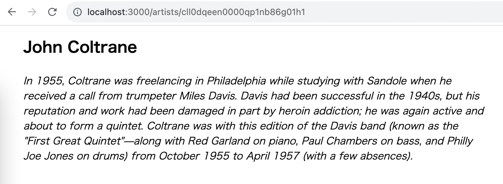
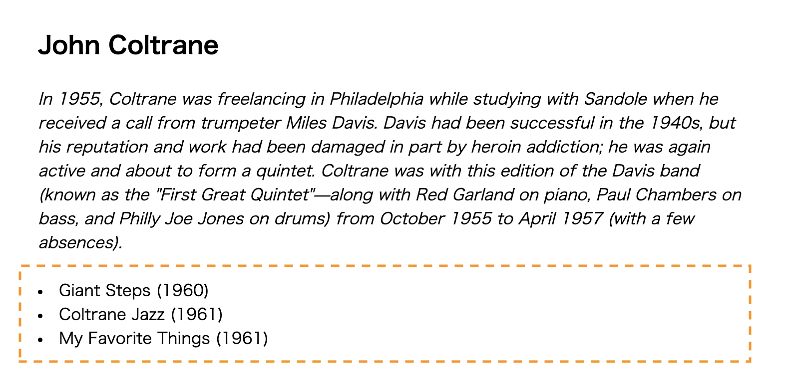
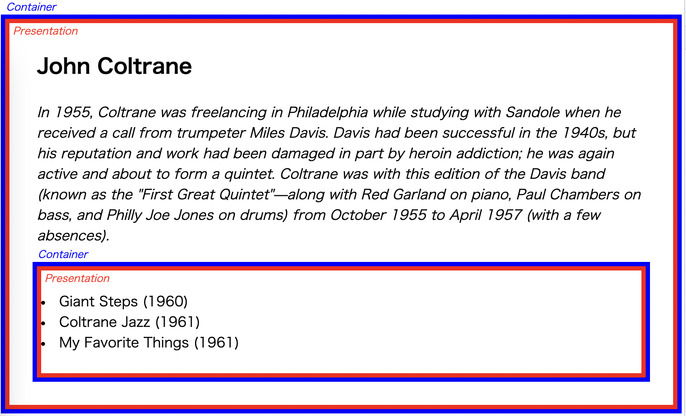
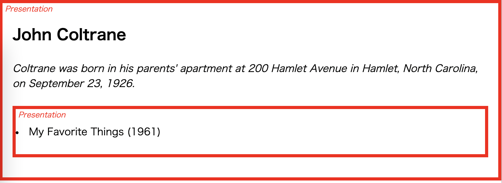

# React Server Component のテストと Container / Presentation Separation

## はじめに

先日 @takepepe さんと [フロントエンドのテストについてパネルディスカッションする機会](https://findy.connpass.com/event/290730/) があり、その際に一瞬だけ Next.js App Router のテストの話題になりました。

僕自身、最近 Next.js App Router と格闘する日々を送っておりタイムリーな話題であったのですが、イベントの場では時間の都合もありほとんど語らず仕舞いとなってしまいました。

そこで、今回の記事は App Router、特に React Server Component のテストについて、最近考えていたことを吐き出していこうと思います。

## 要旨

この記事では「2023 年 8 月現在で利用可能なツール群で、どのように React Server Component (以下 RSC) をテストしていくのが妥当か」を書いていきます。

ここで、ツール群とは主に下記を指します。

- `@testing-library/react`
- `@storybook/react`

以降で詳細を記載していきますが、先んじて要約を書いておくと以下のとおりです。

- Server Component を動作させて、結果の DOM やインタラクションを一気通貫でインテグレーションテストすることは現状では難しい
- サーバー側の処理の妥当性と、DOM 描画・操作の妥当性は、それぞれ別のユニットテストとして分離する
- 「分離」には、Container / Presentation パターンを用いる

### この記事で書かないこと

- RSC や Next.js App Router の概要
- Jest や Testing Library, Storybook などのセットアップ方法や API 利用方法

## 出発点

まずは、このエントリで以降テストの題材として以下の `ArtistPage` コンポーネントを考えていきましょう。

```tsx
/* src/app/artists/[artistId]/page.tsx */

import { notFound } from "next/navigation";
import { prisma } from "@/prismaClient";

type Props = {
  readonly params: {
    readonly artistId: string;
  };
};

export async function ArtistPage({ params: { artistId } }: Props) {
  const artist = await prisma.artist.findUnique({ where: { id: artistId } });

  if (!artist) {
    return notFound();
  }

  return (
    <>
      <h1>{artist.name}</h1>
      <blockquote>{artist.biography}</blockquote>
    </>
  );
}

export default ArtistPage;
```



URL から取得できる ID に紐づいたアーティストの詳細を表示するページです。

`ArtistPage` コンポーネントは、サーバー上での非同期処理を含む Server Component (SC) であり、このサンプルでは、データベースからの主キー検索を行うだけの簡単な実装です。

## テストの問題

### `@testing-library/react` の場合

続いて、上記の `ArtistPage` コンポーネントのテストについて考えてみます。

「SC の描画結果として、対象アーティストの名前が含まれること」というケースを仮定すると以下のような感じでしょうか。

```tsx
/* src/app/artists/[artistId]/page.test.tsx */

/**
 *
 * @jest-environment jest-environment-jsdom
 *
 */
import "@testing-library/jest-dom";
import { screen, render } from "@testing-library/react";

import { ArtistPage } from "./page";

describe(ArtistPage, () => {
  it("renders artist's name", async () => {
    await render(<ArtistPage params={{ artistId: "absdefg" }} />);
    expect(screen.getByText("John Coltrane")).toBeInTheDocument();
  });
});
```

このコードは残念なことに動作しません。現状の `@testing-library/react` (※ v14.0.0 を利用しています) では非同期コンポーネントを `render` 関数に与えることができません。

https://github.com/testing-library/react-testing-library/issues/1209

### `@storybook/react` の場合

「画面の描画結果を確認したい」という文脈では Storybook も非同期コンポーネントを描画することはできません。

https://github.com/storybookjs/storybook/issues/21540

もっとも、今回のような DB にアクセスするような SC をブラウザで直接動かせるようにしろ、というのが大分無理な話な気もしますが。。

## 解決策: Presentation と Container の分離

testing-library (jsdom) にせよ、Storybook にせよ、DOM が動作する環境を利用する前提でのツールであることを考えると、「サーバー側で動作する」非同期コンポーネントが動作しないのは、それはそう、という気がしてくるものです。

そこで、テスト対象たる `ArtistPage` コンポーネントから、「サーバー側でないと動作しない部分」と「サーバーでなくても動作する部分」に分離させていきます。ご存知 Container / Presentation Separation というやつです。

```tsx
/* src/app/artists/[artistId]/page.tsx */

import { notFound } from "next/navigation";
import { prisma } from "@/prismaClient";

type PresentationProps = {
  readonly artist: {
    readonly name: string;
    readonly biography: string;
  };
};

// ここが Presentational なコンポーネント
export function ArtistPagePresentation({
  artist: { name, biography },
}: PresentationProps) {
  return (
    <>
      <h1>{name}</h1>
      <blockquote>{biography}</blockquote>
    </>
  );
}

type Props = {
  readonly params: {
    readonly artistId: string;
  };
};

// ここが Container コンポーネント
export async function ArtistPage({ params: { artistId } }: Props) {
  const artist = await prisma.artist.findUnique({ where: { id: artistId } });

  if (!artist) {
    return notFound();
  }

  // SC は Presentational なコンポーネントにデータを渡すだけ
  return <ArtistPagePresentation artist={artist} />;
}

export default ArtistPage;
```

上記の `ArtistPagePresentation` が Presentational なコンポーネントに相当します。この `ArtistPagePresentation` は、Next.js のランタイムで動作する際は SC として動作しますが、もはや非同期関数ではなく Props を受け取って JSX Element を返すだけの関数です。SC からも CC からも利用可能なコンポーネントです (余談ですが、この「SC からも CC からも利用可能なコンポーネント」というのを何と呼べば良いのか悩んでいます。 Shared Component とか Universal Component とか...) 。

CC からも利用可能なコンポーネントであるのであれば、それは jsdom や Storybook などの、CC の描画を確認できるツールの上に載せることができます。

`@testing-library/react` であれば以下です:

```tsx
/* src/app/artists/[artistId]/page.test.tsx */

/**
 *
 * @jest-environment jest-environment-jsdom
 *
 */
import "@testing-library/jest-dom";
import { screen, render } from "@testing-library/react";

import { ArtistPagePresentation } from "./page";

describe(ArtistPagePresentation, () => {
  it("renders artist's name", () => {
    render(
      <ArtistPagePresentation
        artist={{ name: "John Coltrane", biography: "" }}
      />
    );
    expect(screen.getByText("John Coltrane")).toBeInTheDocument();
  });
});
```

`@storybook/react` も以下のようになりますね:

```tsx
/* src/app/artists/[artistId]/page.stories.tsx */

import type { Meta, StoryObj } from '@storybook/react'

import { ArtistPagePresentation as ArtistPage } from './page'

export default {
  title: 'ArtistPage',
  component: ArtistPage,
} satisfies Meta

type Story = StoryObj<typeof ArtistPage>

export const Default = {
  args: {
    artist: {
      name: 'John Coltrane',
      biography:
        "Coltrane was born in his parents' apartment at 200 Hamlet Avenue in Hamlet, North Carolina, on September 23, 1926.",
    },
  },
} satisfies Story
```

## サーバー側のテスト

続いて、Container として分離したサーバー側の処理のテストについて考えていきます。

```tsx
/* src/app/artists/[artistId]/page.tsx */

/* 中略 */

type Props = {
  readonly params: {
    readonly artistId: string;
  };
};

// ここが Container コンポーネント
export async function ArtistPage({ params: { artistId } }: Props) {
  const artist = await prisma.artist.findUnique({ where: { id: artistId } });

  if (!artist) {
    return notFound();
  }

  return <ArtistPagePresentation artist={artist} />;
}
```

ここで `ArtistPage` コンポーネントは次の処理を行っています。これらを (React Component としてではなく) 通常の非同期関数のテストとして捉えればテストを記述するのはさして難しくありません。

- アーティスト ID が DB に存在しなければ `notFound` を実行して 404 ページを描画
- アーティスト ID が DB に存在していれば、アーティストデータを `ArtistPagePresentation` に受け渡す

```tsx
/* src/app/artists/[artistId]/page.server.test.tsx */

/**
 *
 * @jest-environment @quramy/jest-prisma-node/environment
 *
 */
import { notFound } from 'next/navigation'
import { initialize } from '@quramy/prisma-fabbrica'

import { ArtistFactory } from '@/factories'

import { ArtistPage, ArtistPagePresentation } from './page'

jest.mock('next/navigation', () => ({ notFound: jest.fn() }))
jest.mock('@/prismaClient', () => ({ prisma: jestPrisma.client }))

describe(ArtistPage, () => {
  beforeEach(() => initialize({ prisma: jestPrisma.client }))

  it('redirects to 404 for not existing artist id', async () => {
    await ArtistPage({ params: { artistId: 'NOT_EXISTING_ID' } })

    expect(notFound).toBeCalledTimes(1)
  })

  it('passes fetched data to presentational component for existing id', async () => {
    const created = await ArtistFactory.create()

    const { type, props } = await ArtistPage({ params: { artistId: created.id } })

    expect(type).toBe(ArtistPagePresentation)
    expect(props).toMatchObject({
      artist: {
        name: created.name,
        biography: created.biography,
      },
    } satisfies React.ComponentProps<typeof ArtistPagePresentation>)
  })
})
```

ここで、`ArtistPage` コンポーネントの実行環境が jsdom ではないことを明示したかったため、テスト Suite のファイルを `page.server.test.tsx` として別のファイルにしています。

なお、 `@quramy/jest-prisma-node` や `@quramy/prisma-fabbrica` など怪しげな import 文が登場していますが、これは DB と繋いだテストを記述するためのもので、やはり React とは本質的に無関係です。詳細は [Integrated testing with Prisma](https://quramy.medium.com/integrated-testing-with-prisma-4bc73404d027) を読んでください。これはダイレクトマーケティングというやつです。

さて、本題の `ArtistPage` コンポーネントのテストに戻りましょう。

まず、`notFound` など Next.js が用意している関数が呼び出されることを確認するには `jest.fn()` でモックすればよいです。

また、正常系のアーティスト情報の描画については、 `ArtistPage` が行っている `return <ArtistPagePresentation artist={artist} />` の部分が JSX における `createElement` 関数の呼び出しであることを思い出せば、こちらもさして難しくありません。以下のオブジェクトが Jest のテストケースに返却されるため、このオブジェクトをそのまま検証すれば、モックを用意するまでもなく「 `ArtistPagePresentation` に取得したアーティストデータが Props として渡されていること」を確認できます。

```js
{
  type: ArtistPagePresentation,
  props: {
    artist: {...}
  },
}
```

## ネストされた非同期コンポーネントのパターン

ここまでは、シンプルな非同期コンポーネントの扱いについて見てきました。

ここからは、ある非同期コンポーネントがさらに別の非同期コンポーネントを内包しているパターンについて考えていきます。

例として、ここまで見てきた `ArtistPage` コンポーネントに以下の機能を追加してみます。

- `<ArtistPage />` には、当該アーティストがリリースしたアルバム情報が表示される
- アーティストのアルバム情報は、アーティスト詳細情報が取得されてからでないと取得できないものとする

```tsx
/* src/app/artists/[artistId]/page.tsx */

/* 中略 */

export function ArtistPagePresentation({
  artist: { id, name, biography },
}: PresentationProps) {
  return (
    <>
      <h1>{name}</h1>
      <blockquote>{biography}</blockquote>
      <Albums artistId={id} /> {/* ここに追加 */}
    </>
  );
}
```

下図が実行イメージです。



追加する `Albums` コンポーネントも非同期コンポーネントであるため、`ArtistPage` コンポーネントで行ったのと同じ様に、Presentation / Container に分離して作成します。

```tsx
/* src/app/artists/[artistId]/Albums.tsx */

import type { Album } from "@prisma/client";
import { prisma } from "@/prismaClient";

type PresentationProps = {
  readonly albums: readonly Pick<Album, "id" | "name" | "releaseYear">[];
};

export function AlbumsPresentation({ albums }: PresentationProps) {
  return (
    <ul>
      {albums.map(({ id, name, releaseYear }) => (
        <li key={id}>
          {name}&nbsp;({releaseYear})
        </li>
      ))}
    </ul>
  );
}

type Props = {
  readonly artistId: string;
};

export async function Albums({ artistId }: Props) {
  const albums = await prisma.album.findMany({
    where: { artistId },
    orderBy: { releaseYear: "asc" },
  });
  return <AlbumsPresentation albums={albums} />;
}
```

さて、お察しの通り `Albums` という非同期コンポーネントを組み込んでしまったが最後、`ArtistPagePresentation` は再び「テストできないコンポーネント」になってしまいます。

Next.js で `ArtistPage` を動作させる場合、下図のように Container コンポーネントが多段階となるわけですが、中間に Presentation -> Container(非同期) -> Presentation という React のコンポーネント階層が含まれてしまうためです。



逆に、これが Presentation -> Presentation であれば Storybook や testing-library での描画は可能となるため、中間の Container (非同期) 呼び出しをすっ飛ばせるようにしてみましょう。

`ArtistPagePresentation` がどのようにアルバム情報を描画するかについて、コンポーネントの外側から React Node (JSX Element) として受け取れるように改修します。
また、このとき、デフォルトでは アルバム情報の Presentation である `AlbumsPresentation` を利用するようにしておきます。

```tsx
/* src/app/artists/[artistId]/page.tsx */

import { Albums, AlbumsPresentation } from "./Albums";

type PresentationProps = {
  readonly artist: {
    readonly name: string;
    readonly biography: string;
  };
  readonly albumsProps?: React.ComponentProps<typeof AlbumsPresentation>;
  readonly albumsNode?: React.ReactNode;
};

export function ArtistPagePresentation({
  artist: { name, biography },
  albumsProps,
  albumsNode = albumsProps && <AlbumsPresentation {...albumsProps} />,
}: PresentationProps) {
  return (
    <>
      <h1>{name}</h1>
      <blockquote>{biography}</blockquote>
      {albumsNode}
    </>
  );
}

/* 以下略 */
```

アルバム情報の Container コンポーネントを受け渡す処理は、親である `ArtistPage` の Container コンポーネントでやらせるようにしておきます。

```tsx
/* src/app/artists/[artistId]/page.tsx */

/* 中略 */

type Props = {
  readonly params: {
    readonly artistId: string;
  };
};

export async function ArtistPage({ params: { artistId } }: Props) {
  const artist = await prisma.artist.findUnique({ where: { id: artistId } });

  if (!artist) {
    return notFound();
  }

  return (
    <ArtistPagePresentation
      artist={artist}
      albumsNode={<Albums artistId={artist.id} />}
    />
  );
}
```

これで、アーティスト詳細の画面の React Component 階層について、以下を実現できたことになります。

- Next.js で実際に動作させる場合: Container -> Presentation -> Container -> Presentation
- Storybook や testing-library で描画を検証する場合: Presentation -> Presentation

例えば Storybook で「アルバム情報まで描画されている画面を確認したい」となれば、以下のようにすれば良いでしょう。

```tsx
/* src/app/artists/[artistId]/page.stories.tsx */

/* 中略 */

export const Default = {
  args: {
    artist: {
      name: 'John Coltrane',
      biography:
        "Coltrane was born in his parents' apartment at 200 Hamlet Avenue in Hamlet, North Carolina, on September 23, 1926.",
    },
    // ここに アルバム情報を追記する
    albumsProps: {
      albums: [{ id: '001', name: 'My Favorite Things', releaseYear: '1961' }],
    },
  },
} satisfies Story
```



コルトレーンは名盤揃いですが、僕はやっぱり My Favorite Things が一番好きです。

## まとめ

再掲となりますが、この記事の要約は以下の通りです。

- Server Component を動作させて、結果の DOM やインタラクションを一気通貫でインテグレーションテストすることは現状では難しい
- サーバー側の処理の妥当性と、DOM 描画・操作の妥当性は、それぞれ別のユニットテストとして分離する
- 「分離」には、Container / Presentation パターンを用いる

Container / Presentation パターンそのものは、特に目新しい話では無いと思います。今回は SC の文脈で紹介していますが、CC 時代からも有効なテクニックです。

例えば TanStack Query の `useQuery` や Relay や Apollo Client における `useFragment` であったとしても、次のように分離は効率的なテストの文脈において有効です。

- データ取得に関わる Hooks を実行して、下層の Presentation に処理を移譲するだけの Container コンポーネント
- Hooks から受け取ったデータを描画する Presentational なコンポーネント

実際、この記事で紹介したネストされた Container コンポーネントと Storybook の関係については、同僚が `useFragment` が多段階となっている Relay アプリケーションを効率的に確認するために利用していたテクニックを拝借させてもらいました。

`@testing-library/react` や `@storybook/react` が今後どのように RSC を扱っていくかは、この記事を書いている時点では割と不透明ではありますが、現状の武器だけでもそこそこには戦える、という所感です。

なお、この記事で用いたサンプルコードは以下のレポジトリに格納してあります。

https://github.com/Quramy/server-components-with-container-presentation

## おまけ: Streaming

今回例に挙げた `ArtistPage` コンポーネントでは、以下 2 つの非同期処理が逐次的に行われる、いわゆるウォーターフォールになっています。

1. アーティスト詳細を取得する非同期処理
1. アーティストのアルバム情報を取得する非同期処理

このようなウォーターフォールが含まれるときは、先頭の非同期処理が完了した時点でユーザーに描画結果を返すようなアプリケーションにすることも可能です。

```tsx
/* src/app/artists/[artistId]/page.tsx */

export function ArtistPagePresentation({
  artist: { name, biography },
  albumsProps,
  albumsNode = albumsProps && <AlbumsPresentation {...albumsProps} />,
}: PresentationProps) {
  return (
    <>
      <h1>{name}</h1>
      <blockquote>{biography}</blockquote>
      <Suspense
        fallback={
          <div role="alert" aria-busy="true">
            Loading...
          </div>
        }
      >
        {albumsNode}
      </Suspense>
    </>
  );
}
```

`ArtistPagePresentation` が アルバム情報を描画する部分を `React.Suspense` で囲むだけです。

この改修に対して、テストで「アルバム情報取得の非同期処理が完了していない場合にローディングが表示されること」をテストしたくなりますよね？（テストしたくなってください）

すでに `albumsNode` として、`ArtistPagePresentation` の外側から「どのようにアルバム情報を描画するのか」を注入できるようにしてあるため、ここに「完了していない状態」を突っ込むだけで、このようなテストも記述できます。

```tsx
/* src/app/artists/[artistId]/page.test.tsx */

/* 中略 */

function Suspended() {
  throw new Promise(() => null);
  return null;
}

describe(ArtistPagePresentation, () => {
  it("indicates loading status", () => {
    render(
      <ArtistPagePresentation
        artist={{ name: "John Coltrane", biography: "" }}
        albumsNode={<Suspended />}
      />
    );
    expect(screen.getByRole("alert", { busy: true })).toBeInTheDocument();
  });
});
```
