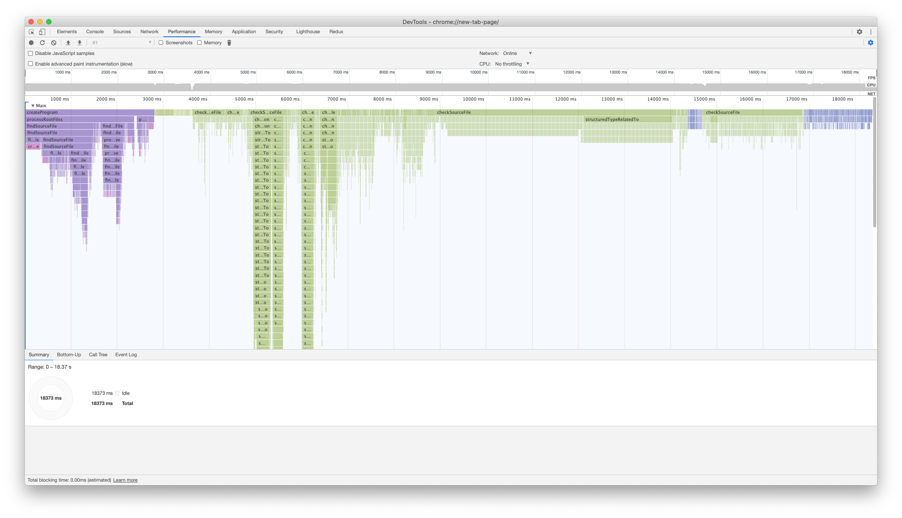
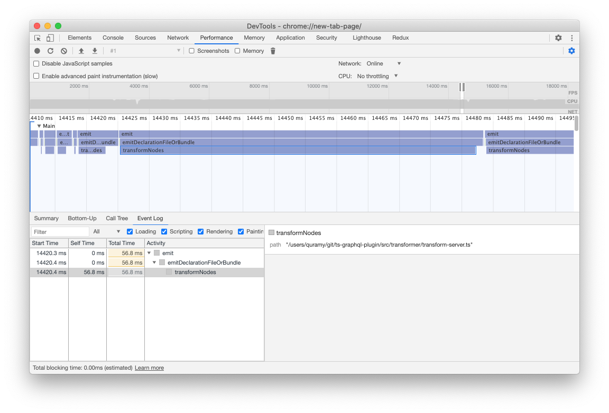
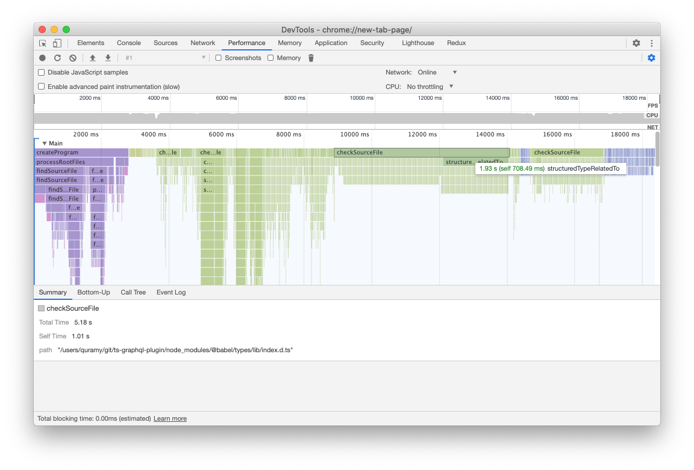
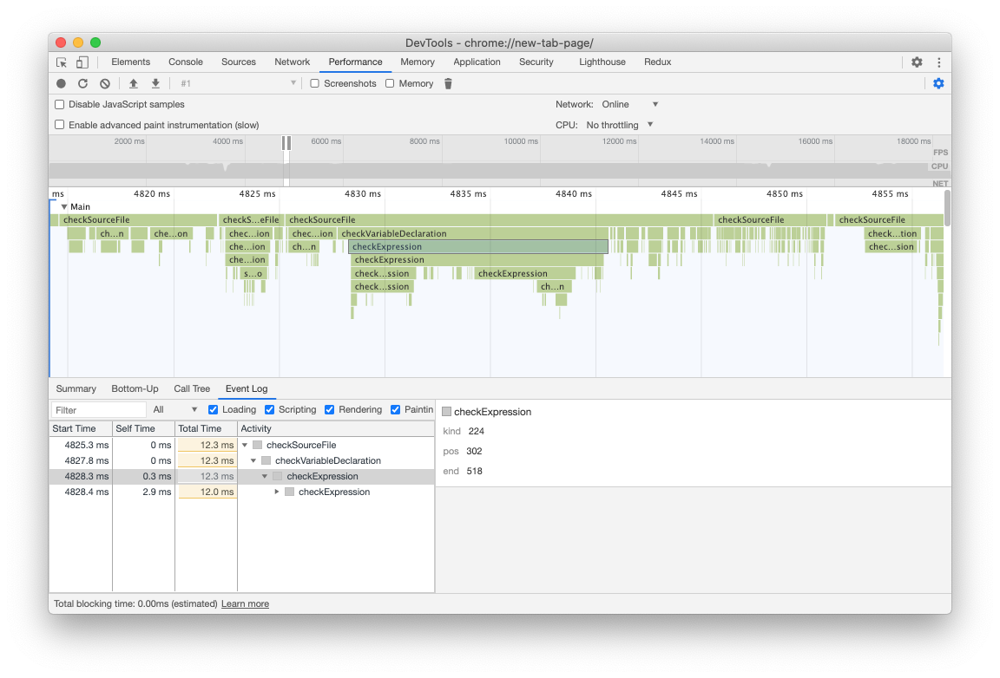
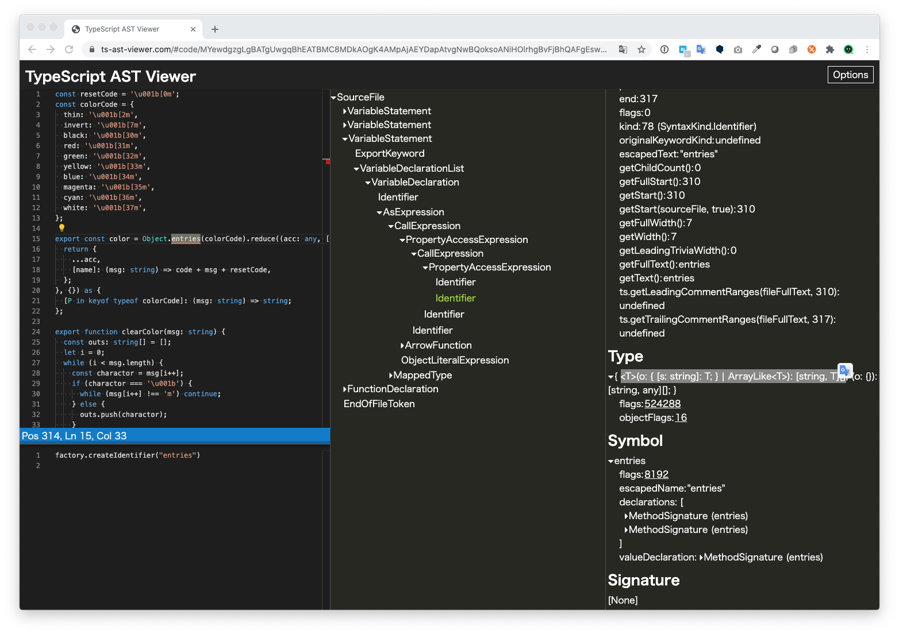
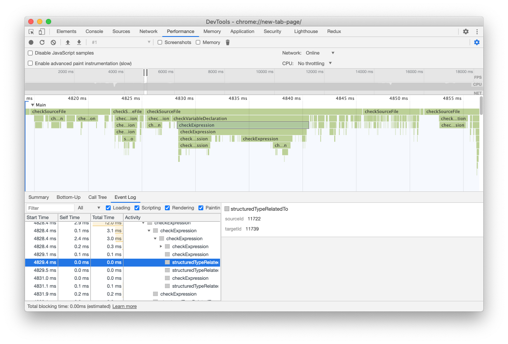

# Tracing TypeScript Compiler

## はじめに

TypeScript 4.1 で新しく増えた `--generateTrace` というオプションについて。

[TypeScript 4.1 beta](https://devblogs.microsoft.com/typescript/announcing-typescript-4-1-beta/) でもすっ飛ばされていたネタなので、多分あまり注目されていないだろうし、
僕もたまたま PRs を眺めていたら見つけた程度だし、他の feature と比べるとかなりニッチなのだけど、個人的に面白かったのでエントリに残しておく。

なぜ僕が今回のオプションに惹かれたかとういうと、 3 ヶ月くらい前に、仕事でやっている TypeScript のプロジェクトについて「ローカルでの tsc が遅い！なんでだ！」って感じで憤ってた時期があって、
どこにボトルネックがあるか調べようと思ったことがあったのだけど、このときは深く調べることができずに挫折したという経緯があるため。

ちなみに、「ローカルで遅い！」という現象自体は、`--incremental` と `--noEmit` を同時に使っても.tsbuildinfo が利用されるようになったお陰で大分改善されたので、今はあまり困っていない。
このテクニック自体は、webpack や babel など、ファイルの emit は別のツールにまかせている人でも活用できるし、特に損するようなこともないので、これはこれでお勧めしておきたい。

## tsc のオプション色々

とはいえ、「どこにボトルネックがあるのか」を調べられるようになっておいても（個人的には）損しないと思うので、ここからは計測方法に話を絞って書いていく。

4.0 までの TypeScript でパフォーマンス測定系のオプションというと、下記が挙げられる。

1. `--traceResolution` : モジュールの解決過程を出力する。モジュール解決の深さを追うことができる
1. `--extendedDiagnostics` : 内部処理で利用したリソースの情報を出力する
1. `--generateCpuProfile` : 有効にすると V8 の cpu profile を取得する

tsc 全体で Module Resolution が支配的、ということはそうそう無いため、1. はまぁ役に立たない。

2. の `--extendedDiagnostics` の具体例は下記のようになる。なお、さすがに業務のレポジトリで試した結果を貼るわけにもいかないため、このエントリでは https://github.com/Quramy/ts-graphql-plugin を測定対象にしている。

```
Files:                         422
Lines:                      103924
Nodes:                      456095
Identifiers:                161782
Symbols:                    158416
Types:                       66335
Instantiations:              66581
Memory used:               299706K
Assignability cache size:   174466
Identity cache size:           200
Subtype cache size:           2193
Strict subtype cache size:    1838
Tracing time:                8.21s
I/O Read time:               0.71s
Parse time:                  1.34s
ResolveModule time:          0.37s
ResolveTypeReference time:   0.03s
Program time:                2.82s
Bind time:                   0.75s
Check time:                 17.43s
transformTime time:          0.56s
commentTime time:            0.38s
printTime time:              3.26s
Emit time:                   3.27s
Source Map time:             0.24s
I/O Write time:              0.43s
Dump types time:             3.27s
Total time:                 24.27s
```

上記の出力結果でも、支配項が "Check time" であることは十分にわかると思う。ちなみに、このレポジトリだと 350 ファイルくらいは `@types` や `node_modules` 内の.d.ts ファイルになっているはずなんだけど、それでも "ResolveModule time" は 1sec もかかっていないことからも、1.が Performance の意味ではあまり見るポイントにならないことが伝わると思う。

逆に、 `--extendedDiagnostics` でわかるのはここまでで、もっと細かいことが知りたければ 3. の `--generateCpuProfile` を使って V8 の profile を追いかけるしかなかった。
以前に一度だけこのオプションも試したことあるけど、「TypeChecker の再起呼び出しが多い」以上の情報は手に入らない。

## generateTrace

今回取り上げたい `--generateTrace` も、「Chrome devtool の performance タブで開くことができる」という点では、旧来の `--generateCpuProfile` と似ているかもしれない。

`--generateCpuProfile` が生の V8 情報を吐くのに対して、 `--generateTrace` は tsc 側が Tarce Event の format に沿って色々と見やすくしてくれている点が異なる。

`--generateTrace <ディレクトリ名>` として tsc を走らせると、指定したディレクトリ配下に trace.json と types.json の 2 つのファイルが生成される。 trace.json は Chrome devtool で load するためのファイル。

実際に取得して表示する下記のような感じになる。



全景だと、V8 の profile を見る場合と殆ど一緒に見えるかもしれない。
最初の薄紫色の部分は `createProgram` の時間だ。主に fs の read や parse 処理がこの辺。 `--extendedDiagnostics` で "Program time" という項があるけど、そこに該当する部分。

反対に、最後の方にでてくる青っぽい部分はトランスパイル処理の部分。transformer による AST 返還と fs の write だ。解像度を上げて適当な event の箱を選択すると、以下のように、その event が「どの sourceFile に対して transformer を作用させたのか」がちゃんと表示されている。



このように、tracing event に対して、適切に付加情報が与えられているため、「どのファイル対する処理で時間を要しているのか」がわかるようになったのが `--generateTrace` の特徴。

## Type Check と AST

trace 全体のうち、殆どの部分を占めている緑色の部分が Type Cheker の処理だ。これも、最上段の "checkSourceFile" という event から、該当の sourceFile がわかるようになっている。
測定対象のレポジトリでは、 `@types/babel/index.d.ts` に 5 sec 以上持っていかれてることがわかる。ちなみに、直接 babel の型定義を install した記憶がないので、何かの推移依存に引っ張られてるんだろうな。。。



ところで、trace の全体を眺めていると、前半の方が stack が深く、後半になればなるほど stack が浅いファイルが増えていくのがわかると思う。
おそらくだけど、これは Type Checker が一度 check した type を cache していくことで、後半になればなるほど check に cache が効いているのだと思う。

逆に言うと、ある程度後ろで登場しているのにも関わらず、やたら時間食っているファイルがあれば、本当にそれは遅い、という意味のはず。前術の babel の型定義はその典型ですね。

さて、Type Checker の trace event をもう少し深く見てみよう。

最上段が sourceFile を示す、というのは上述のとおりだが、2 段目以降は「そのファイルのどの部分の check か」を示すことになる。
例えば下記は、"checkExpression" という event だが、Expression という suffix からも察しがつく通り、AST(抽象構文木)における Expression Node を指している。



付随情報として、kind, pos, end というのが並んでいるけど、これは AST Node が保持している生情報。
ts の Utility API に position を line / col 形式に変換するメソッドがあるけど、tracing でこれを呼ぶ訳にはいかないんだろう。そのインベントリが余計な時間を追加してしまうことになるだろうし。

さすがに、この生情報だけだと「どこのことだよ！」ってなるので、こういうときは別の tool の力を借りよう。

https://ts-ast-viewer.com を開いて、対象の source file の中身を貼り付ける。別に他の ast explorer でも構わないけど、 TypeScript の AST に限定するのであれば、ts-ast-viewer が一番見やすい。

対象の AST Node(ここでは Expression Node)がどの辺にあるかは、まぁある程度当たりをつけて、適当にポチポチ押していく（慣れると、何番目の statement か、とか trace の深さから木の深さを推測できる）。
下図のように、trace event に出力されていた pos, end, kind と同じ値持つ AST Node があるはずだ。



このケースだと、`as { ... }` で type assertion している箇所なので AsExpression という Node、ということ。

## Type Check と Structured Type

このように AST を掘っていくと、上図での `Object.entries(colorCode)` という Call Expression に相当する trace event の配下に、"structuredTypeRelatedTo" という種別の event が登場する。



これは check で必要となる型を他の型から合成するときに出てくる。
event の付随情報に "sourceId", "targetId" という数値、この id に対応する内容がどこに書いてあるかというと、 `--generateTrace` で一緒に出力されていた types.json というファイル（どうでもいいけど、厳密には json じゃない）。
基本的に id がそのまま行と一致しているけど、素直に id で検索する。例えば、上図の `sourceId: 11722` というのが何を表しているかを見てみる。

```json
{
  "id": 11722,
  "symbolName": "__object",
  "recursionId": 2859,
  "firstDeclaration": {
    "path": "/users/quramy/git/ts-graphql-plugin/src/string-util/color.ts",
    "start": {
      "line": 2,
      "character": 18
    },
    "end": {
      "line": 13,
      "character": 2
    }
  },
  "flags": ["524288"],
  "display": "{ thin: string; invert: string; black: string; red: string; green: string; yellow: string; blue: string; magenta: string; cyan: string; white: string; }"
}
```

type の定義情報や display string からも分かる通り、以下コードの型情報だ。

```ts
const colorCode = {
  thin: "\u001b[2m",
  invert: "\u001b[7m",
  black: "\u001b[30m",
  red: "\u001b[31m",
  green: "\u001b[32m",
  yellow: "\u001b[33m",
  blue: "\u001b[34m",
  magenta: "\u001b[35m",
  cyan: "\u001b[36m",
  white: "\u001b[37m"
};
```

もともと `Object.entries(colorCode)` という Call Expression の trace event を見ていたことを思い出してほしい。この呼び出しの検証とは、次の整合性を確認することに他ならない。

- `colorCode` という Identifier が示す値の型
- `object.entries` 関数の引数が受け付ける型

`colorCode` の型をに対して、 `entries<T>(o: { [s: string]: T } | ArrayLike<T>): [string, T][];` の第一引数の型である `{ [s: string]: T }` に当てはめるわけだ。

実際、先程の event の `targetId: 11739` の方も見てみると次のようになっていて、これはまさに `Object.entries` の型定義箇所。

```json
{
  "id": 11739,
  "symbolName": "__type",
  "recursionId": 2863,
  "firstDeclaration": {
    "path": "/users/quramy/git/ts-graphql-plugin/node_modules/typescript/lib/lib.es2017.object.d.ts",
    "start": {
      "line": 38,
      "character": 18
    },
    "end": {
      "line": 38,
      "character": 37
    }
  },
  "flags": ["524288"],
  "display": "{ [s: string]: T; }"
}
```

「Type Checker は型情報を cache する」というのを上の方でも書いたけど、この cache をファイルとして dump したものが types.json だと思って差し支えない。

もちろんこのファイルの行が増えれば増えるほど、多くの型情報を tsc が扱っていた、ということになるし、また、"structuredTypeRelatedTo" の event が多ければその分 Type Cheker が型合成に時間を使っている、という意味になる。

## おわりに

今回は tsc の`--generateTrace` オプションの出力をどう見るか、ということを書いてきたわけだけど、個人的な肌感としては、Structured Type のことまで考えて tsc チューニングしたろ！みたいなケースはまぁ多分無いんじゃないかな、と思う。冒頭で書いたように、とりあえず速くしたいのであれば、Incremental Build の方がよっぽど効果高いだろうし。
4.1 の Recursive Conditional Type や Template Literal Type のように、どう考えても遅くなりそうな言語機能は増えてきてるから、計測の道具を持ってる事自体は悪くないだろうけど、「この type の書き方をちょっと変えるだけで爆速に！」なんて無いんじゃないかなー。取った情報とレポジトリをセットにして TS 本家の issue に投げつけることを検討した方が良いだろうね。

どちらかというと、Type Checker の過程が可視化されること自体の方がありがたいような気もする。Compiler API の中でも Type Checker は取っつきにくい部類だと思うけど、その Type Checker がどういう動きしながら Source File を検証してるかが理解できるというのは、Compiler API 触ったりするのが好きな人にとっては嬉しいんじゃないかな。
