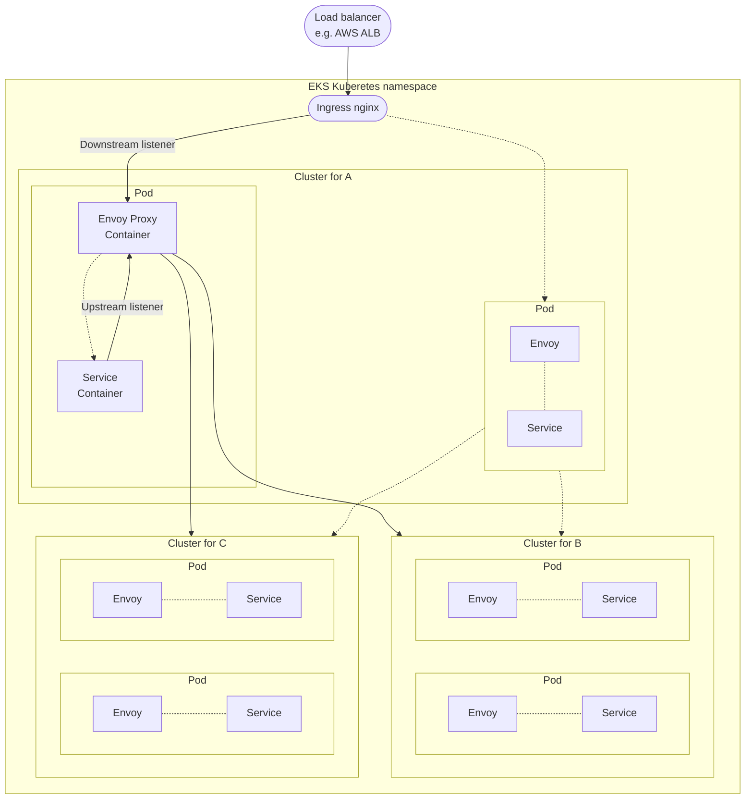

# 9/1

## Unix

仕事で BigQuery から CSV を引っこ抜いてきて、別の CSV と突き合わせて諸々調査する、というのをやっていたのだが、最終的なスクリプトに食わせる中間的な操作はコマンドだけで済ませたいく、頻繁に使えそうなものをピックアップしてみた。

ヘッダ行の退避:

```sh
head -n 1 raw.csv > header.csv
```

データ部分の取り出し:

```sh
tail -n +2 raw.csv > data.csv
```

処理したデータとヘッダ行の結合

```sh
cat processed_data.csv | cat header.csv -
```

2 列目を辞書順でソート:

```sh
sort -t, -k2 data.csv
```

3 列目を数値順でソート:

```sh
sort -t, -k3n data.csv
```

2 列目を辞書順、さらにその中で 3 列目を数値順でソート:

```sh
sort -t, -k2,2 -k3n,3 data.csv
```

4 列目のみを取り出し:

```sh
cut -d, -f 4 raw.csv
```

1 列目と 3 列目を取り出し:

```sh
cut -d, -f 1,3 raw.csv
```

4 列目を重複排除して表示:

```sh
sort -t, -k4 raw.csv | cut -d, -f 4 | uniq | cat -n
```

4 列目を重複排除した数を取得:

```sh
sort -t, -k4 raw.csv | cut -d, -f 4 | grep -v "^$" | uniq | wc -l
```

---

# 9/5

## Jest

SuperTest / msw を初めて併用した。

Node.js + Express な Service の Integration Test パターン。

msw 側が SuperTest の対象の request について「それ、mock handler すり抜けるけど大丈夫？」的な Warning を jest に履いてきて地味に鬱陶しい。 https://github.com/mswjs/msw/issues/191 でも言及されているが、解決策部分は Outdated。

```text
  console.warn
    [MSW] Warning: captured a request without a matching request handler:

      • POST http://127.0.0.1:36489/api/foo/

    If you still wish to intercept this unhandled request, please create a request handler for it.
    Read more: https://mswjs.io/docs/getting-started/mocks
```

msw の `onUnhandledRequest` を使って解決できたので、Medium に tips 記事を残しておいた。

https://quramy.medium.com/supertest-%E3%81%A8-msw-%E4%BD%B5%E7%94%A8%E6%99%82%E3%81%AB-warning-log-%E3%82%92%E6%8A%91%E6%AD%A2%E3%81%99%E3%82%8B-430709dab48c

---

# 9/6

## AWS

久しぶりに CloudWatch Logs Insight を使う機会があったので、改めてクエリの構文を見直し。

Syntax レベルの話であれば、 https://docs.aws.amazon.com/ja_jp/AmazonCloudWatch/latest/logs/CWL_QuerySyntax.html を見れば大体思い出せそう。

CWLogs の場合、Query 本体の中には対象のロググループの識別子が含まれないので、よく使うロググループとクエリのペアについては Saved Query に突っ込んでおくのが吉。

---

# 9/7

## GitHub

GHA で AWS や GCP などに連携するときに、CI 用の Secret (SA json) を直接焼き込むのではなく、OIDC で発行されたユーザーに対してロールを割り当てることができる。

https://zenn.dev/mryhryki/articles/2021-09-19-access-aws-by-github-actions の解説が詳しい。

GHA が OIDC プロバイダになっていて、GitHub 側が認証したユーザーに対して、AWS などの側で認可する形式になる。

---

# 9/9

## Next.js

https://nextjs.org/blog/next-12-3

`swcMinify` が安定化したらしい。

社内で会話したところ、 `swyMinify` は トランスパイラとしての `@swc/core` とは直接的な関係はなく、 SWC Organization で作られている minifier の名称。

SWC 的には `swcpack` というバンドラ層のツールもあるみたい。

https://swc.rs/docs/usage/bundling

Next.js がすべての build chain を `@swc` に寄せることはあるんだろうか？というのは興味がある。

---

# 9/13

## TypeScript

雑な変性の説明サンプル。

```ts
type Foo<out T> = () => T;

type Foo1 = Foo<string>;
type Foo2 = Foo<"nyaan">;

const foo2: Foo2 = () => "nyaan";
const foo1: Foo1 = foo2;

type Hoge<in T> = (opt: T) => void;

type Hoge1 = Hoge<string>;
type Hoge2 = Hoge<"nyaan">;

const hoge1: Hoge1 = (a: string) => undefined;
const hoge2: Hoge2 = hoge1;

type Piyo<in out T> = {
  foo: Foo<T>;
  hoge: Hoge<T>;
};
```

「S が T の sub type であれば、 `Foo<S>` が `Foo<T>` の sub type である」 すなわち、`Foo<T>` は T に対して共変(covariant)
「S が T の sub type であれば、 `Hoge<T>` が `Hoge<S>` の sub type である」 すなわち、`Hoge<T>` は T に対して反変(contravariant)

ある型 T があった場合に、`Piyo<T>` を満たすような、T とは別の型 S を作れる？
foo は共変, hoge が 反変であるため、 `Piyo<T>` に Assignable な `Piyo<S>` は T===S となってしまうはず

## CSS

Container Query について

https://developer.mozilla.org/en-US/docs/Web/CSS/CSS_Container_Queries

ちょうど Safari 16 がリリースされて対応が入ったために存在を知る。

Chromium 系でも最近(106~)ようやくサポートが入ったくらいの機能なので、GA にはまだ遠いが、レスポンシブじゃ面倒なときに便利そうではある.

```css
@container (min-width: 700px) {
  .card {
    display: grid;
    grid-template-columns: 2fr 1fr;
  }
}
```

---

# 9/14

## graphql-code-generator

`apolloReactHooksImportFrom` というオプションで、typescript-react-apollo における 各種 hook (e.g. `useQuery` など)の import specifier を差し替えられる

https://www.the-guild.dev/graphql/codegen/plugins/typescript/typescript-react-apollo#apolloReactHooksImportFrom

---

# 9/15

## Rails

https://github.com/flyerhzm/bullet

Active Record の呼び出しを検査して DB N + 1 っぽいものが検知された場合に warning log を出してくれるツールっぽい。

## Node.js

https://oisham.hatenablog.com/entry/2022/09/14/210857

https://github.com/ecyrbe/zodios

## Developer Experience

SPACE という Productivity を評価するためのフレームワークについて。

https://queue.acm.org/detail.cfm?id=3454124

GitHub blog https://github.blog/jp/2022-09-15-research-quantifying-github-copilots-impact-on-developer-productivity-and-happiness/ を読んでいて 存在を知る。

- Satisfaction and well-being
- Performance
- Activity
- Communication and collaboration
- Efficiency and flow

の頭文字をとって、SPACE ということ。

飽くまでフレームワークだが、斜め読みした感じでいうと、MS / GitHub の著者の主張として、以下がある。

> A number of myths about developer productivity have accumulated over the years. Awareness of these misconceptions leads to a better understanding of measuring productivity.
>
> Myth: Productivity is all about developer activity
> Myth: Productivity is only about individual performance
> Myth: One productivity metric can tell us everything
> Myth: Productivity Measures ARE useful only for managers
> Myth: Productivity is only about engineering systems and developer tools

これはいわゆる DX の話と近いものがある。たまたま昨日に DX Criteria を社内で眺める会があったが、どちらも複数の軸で環境の良し悪しをアセスメントできることを主眼としていそう。

https://dxcriteria.cto-a.org/660d6573b45645bcb431c7c29c5431f8

SPACE はそれ自体が即利用できるチェックリストというよりも、飽くまでフレームワーク程度なので、実運用するには大変そうではある。Copilot の例にしても、Copilot の使い勝手のアンケート項目を決める際のフレームワークとして利用した、という話であって SPACE そのものがアンケート項目ではないし。

---

# 9/21

## Vim

GitHub に mermaid diagram を添付したいケースが結構あるのだけど、書くのが億劫なせいかいつまで経っても記法が馴染まないので環境整備。具体的には Vim 上で mmd を編集しつつ、`@mermaid/mermaid-cli` でプレビューする環境を作成した。

mermaid の syntax には以下を利用:

https://github.com/chazmcgarvey/vim-mermaid

Vim script 自体はすごく久しぶりだったので、すっかりコマンドや関数を忘れていた。

「スクラッチバッファにエラーを連携する」のような機能が必要なわけだが、以下の blog に懇切丁寧に解説があった。

https://knowledge.sakura.ad.jp/23436/#i-31

最初は mermaid-cli を使って、svg ファイルを吐くだけにしていたのだが、watch & auto-reload も欲しくなってきたので追加してみる。 https://www.npmjs.com/package/live-server を使いつつ、process は Vim の `job_start` に任せるようにしてみた。なんだかんだ初めて触ったが、やはりメチャクチャ便利では。。。

できあがった関数部分を抜粋すると以下のような感じ。

```vim
"#### live server util
let s:live_server_job_dict = {}
function! s:live_server_start(key) abort
  let cwd = fnamemodify(a:key, ":p:h")
  let command = "npx --yes live-server"
  if !has_key(s:live_server_job_dict, a:key)
    let job = job_start(command, {
          \"cwd": cwd,
          \"in_io": "null",
          \"out_io": "null",
          \"err_io": "null"
          \})
    let s:live_server_job_dict[a:key] = job
  else
    let job = s:live_server_job_dict[a:key]
  endif
  return job
endfunction
function! s:live_server_end(key) abort
  if has_key(s:live_server_job_dict, a:key)
    let job = s:live_server_job_dict[a:key]
    job->job_stop("kill")
  endif
endfunction

function! s:mermaid_exec() abort
  let input_path = expand('%:p')
  if !exists('b:mmd_temp_filepath')
    let b:mmd_temp_filepath = tempname().expand('%:t').'.svg'
  endif
  let b:mmdc_error_buf_name = 'mmdc_errors_'.bufname()

  let options = [
        \'-i', input_path,
        \'-o', b:mmd_temp_filepath
        \]
  let result = systemlist('npx mmdc '.join(options))

  if v:shell_error > 0
    if bufexists(b:mmdc_error_buf_name)
      let winid = bufwinid(b:mmdc_error_buf_name)
      if winid isnot# -1
        call win_gotoid(winid)
      else
        execute 'sbuffer' b:mmdc_error_buf_name
      endif
    else
      execute 'new' b:mmdc_error_buf_name
      set buftype=nofile
      nnoremap <silent> <buffer> q :<C-u>bwipeout!<CR>
    endif

    %delete _
    call setline(1, result[2:])

  else
    return [v:shell_error, b:mmd_temp_filepath, b:mmdc_error_buf_name]
  endif
endfunction

function! s:mermaid_write() abort
  let result = s:mermaid_exec()
  if result[0] < 1
    if bufexists(result[2])
      execute 'bwipeout!' result[2]
    endif
  endif
endfunction

function! s:mermaid_open() abort
  let result = s:mermaid_exec()
  if result[0] < 1
    call s:live_server_start(result[1])
    if bufexists(result[2])
      execute 'bwipeout!' result[2]
    endif
  endif
endfunction
```

---

# 9/22

## Envoy

Envoy Proxy 関連の Metrics を Datadog で見たくなったときに、何をとっかかりに探せばいいのかわからなかったのだけど、以下のページに主要な統計情報の解説が記載されていた。

https://www.envoyproxy.io/docs/envoy/latest/configuration/upstream/cluster_manager/cluster_stats#circuit-breakers-statistics

具体でいうと「サーキットブレーカーが発動したかどうか」のような内容。この例であれば、`circuit_breakers` `cx_open` や `rq_open` にあることが分かる。

また、このドキュメントを眺めている過程で「そもそも "cluster" ってなんだ？」という割と根本的な疑問が湧いてきたのだが、これについては AWS App Mesh の解説が完結でわかりやすい。

https://docs.aws.amazon.com/ja_jp/app-mesh/latest/userguide/envoy-metrics.html

> クラスター - プロキシが接続してトラフィックをルーティングするアップストリームエンドポイントの名前付きグループです

要するに DNS における論理名みたいなもの、という理解。



---

# 9/23

## npm

https://docs.npmjs.com/cli/v8/configuring-npm/package-json#peerdependenciesmeta

`peerDependenciesMeta` に書いておくと、「install しなくても警告を出さなくなる」らしい。

```json
{
  "name": "tea-latte",
  "version": "1.3.5",
  "peerDependencies": {
    "tea": "2.x",
    "soy-milk": "1.2"
  },
  "peerDependenciesMeta": {
    "soy-milk": {
      "optional": true
    }
  }
}
```

yarn も同じ。 https://yarnpkg.com/configuration/manifest#peerDependenciesMeta

ぱっと探した感じ、pnpm には用意されていなさそう。

---

# 9/26

## Apollo Client

少し前からやろうやろうと思っていた Apollo Client Links のテスト方法解説用の Repository 作成に着手

https://github.com/Quramy/how-to-create-your-apollo-link

msw の GraphQL を使ってみたが、なかなかよいな、これ。

特に HttpLink ごと test 書きたいときに、通常の GraphQL レスポンスも、ServerError や ServerParseError のような Network Error 型のレスポンスも `rest` / `graphql` を使い分ければ簡単にスタブできるのは便利だ。

---

# 9/27

## TypeScript

もう 4.9 beta 出てた。やたら早く感じるのは気のせいか...?

https://devblogs.microsoft.com/typescript/announcing-typescript-4-9-beta/

## GraphQL

https://github.com/graphql/graphql-js/releases/tag/v17.0.0-alpha.2 で色々な機能が実装されていた。PR タイトルで気になったのは以下.

- [[RFC] Client Controlled Nullability experiment implementation w/o execution](https://github.com/graphql/graphql-js/pull/3418)
- [Reference implementation of defer and stream spec](https://github.com/graphql/graphql-js/pull/3659)
- [deploy full ESM with "type": "module" in "latest-esm" npm tag](https://github.com/graphql/graphql-js/pull/3361)

とくに `@defer` / `@stream` については、https://github.com/graphql/graphql-js/pull/2757 の PR が一旦 merge されていてややこしく見えるが、どうも graphql-js としては、`execute` を Async Generator にするつもりはないらしい。

以下の PR Comment で @yaacovCR が言及している。

- https://github.com/graphql/graphql-js/pull/2757#issuecomment-1154155622
- https://github.com/graphql/graphql-js/pull/3659#issuecomment-1224810302

> We've hit a few concurrency bugs already (#2975, #3710) with the "raw" async generator objects currently used within incremental delivery.

詳細は不明だが、Async Generator で `execute` を実装した場合によからぬ bug に遭遇した、とのこと。

https://repeater.js.org://repeater.js.org/ を使った Async Iterator を据えようとしている？

https://github.com/graphql/graphql-js/pull/3694#issuecomment-1227396666

気持ちとしてはほぼ Async Generator と同じ、ということでいいんかな、これ。

## graphql-code-generator

GraphQL Code Generator の v3 関連 ( @takashimamorino さんの発表 :memo: )

- 特定の GraphQL クライアントに依存しない preset
  - `client` という built-in preset ( `gql-tag-operation-preset` )
  - https://zenn.dev/takashima/articles/4c284439135a0c
- 設定ファイル自体が TS ファーストになる

---

# 9/28

## GitHub Actions

GH Action を publish した

https://github.com/Quramy/simple-coverage-diff-action

https://www.npmjs.com/package/coverage-diff をラップして、Istanbul の json-summary reporter 2 つを比較して PR にコメントする君.

最初は https://github.com/GreatWizard/coverage-diff-action という Action を使えばいいかと思ったのだが、いざ自分の Prj で動かしてみたらそう簡単ではなかったことがわかり(不必要に `git clone` などしている箇所があったりする)、最終的に自作することにした形。

Action の作成方法や、そもそもの Workflow Step (`uses` など) で何が使えるの？といった基本的な知識について、以下のドキュメントなど見ながら再確認することになった。

- https://docs.github.com/en/actions/creating-actions/about-custom-actions
- https://docs.github.com/en/actions/learn-github-actions/contexts

やっぱり自分で plugin 的なものを作るというのは、その基盤を理解する上でかなり効果的だ。

## ncc

https://github.com/vercel/ncc

久々に名前を思い出した vercel の npm 用 bundler。

上記の自前 GH Action を作る上で、依存関係を事前にまとめた JavaScript が必要になるのだが、最初は愚直に rollup でやろうとしたが、思ったよりも設定が面倒なため、こちらを使うように変更。

---

# 9/29

## GraphQL

graphql-js v17 の Async Generator 周りの疑問について「Raw Async Generator をなぜ避けたほうがいいのか」については https://repeater.js.org/docs/safety/ を読めばよさそう。

コードまでは細かく見れていないが、このページでの非安全性は以下 2 点に集約されていそうに読めた

- callback の解除が漏れて、memory leak するコードになりがち
- yield する頻度 >> next される頻度 のようなパターンで性能劣化する懸念がある
