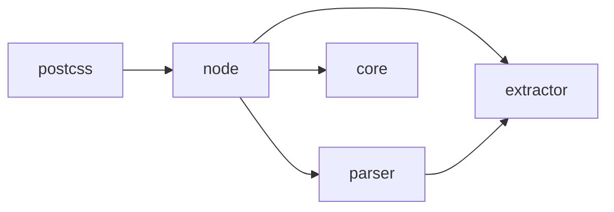

# 11/1

## Panda CSS

以前から少し気になっていた Panda CSS 調べてみた。

### Getting Started

基本的な書き味は以下のようになる。Tagged Template Literal ではなく、Style Props ライクなオブジェクトで記述していく類。
CSS Property を camel にする程度の違いであるので、Tailwind CSS よりは馴染みやすいというのが第一印象。

```tsx
import { css } from "../../styled-system/css";

export default function Home() {
  return (
    <main
      className={css({
        display: "flex",
        flexDirection: "column",
        alignItems: "center",
        justifyContent: "center",
        minHeight: "100dvh",
        gap: 16,
      })}
    >
      <h1 className={css({ fontSize: 48, fontWeight: 600 })}>Hello Panda</h1>
      <p className={css({ fontSize: 32, fontWeight: 600 })}>Styling example</p>
    </main>
  );
}
```

例えば、以下の行に着目すると、

```tsx
<h1 className={css({ fontSize: 48, fontWeight: 600 })}>Hello Panda</h1>
```

上記の JSX 部分は、最終的に次の DOM に展開される。

```html
<h1 class="fs_48 font_600">Hello Panda</h1>
```

`fs_48` や `font_600` の部分は Tailwind と同じような、Utility First な CSS Class であり、Panda CSS は Utility 部分を CSS Layer として出力する。

以下が Panda が上記の Home Component から出力した CSS Layer:

```css
@layer utilities {
  .gap_16 {
    gap: var(--spacing-16);
  }

  .d_flex {
    display: flex;
  }

  .items_center {
    align-items: center;
  }

  .justify_center {
    justify-content: center;
  }

  .flex_column {
    flex-direction: column;
  }

  .min-h_100dvh {
    min-height: 100dvh;
  }

  .mt_16 {
    margin-top: var(--spacing-16);
  }

  .fs_48px {
    font-size: 48px;
  }

  .fs_32px {
    font-size: 32px;
  }

  .font_bold {
    font-weight: var(--font-weights-bold);
  }

  .fs_48 {
    font-size: 48px;
  }

  .fs_32 {
    font-size: 32px;
  }

  .font_600 {
    font-weight: 600;
  }
}
```

複数のタグで `fontWeight: 600` と記載しているが、Utility Layer 上は単一のセレクタである `.font_600` でしか無いので、格段に CSS の量が削減される、というのは Tailwind と同じ理屈。

Panda CSS の肝は、`css({ fontSize: 48, fontWeight: 600 })` のような部分から、実際にアプリケーションで必要となる最小の Utility Selector のセットを抽出する部分となる。

### Ahead of Time v.s. Just in Time

Panda CSS の Docs にもある通り、Next.js と組み合わせる文脈においては、PostCSS Plugin を利用することになる。
ビルドに関係するのが `postcss.config.cjs` に記述するプラグインの設定のみという点について、かなり違和感を覚えた。

```js
module.exports = {
  plugins: {
    "@pandacss/dev/postcss": {},
  },
};
```

Next.js に限らず、React のアプリケーションにおいて CSS in JS を Ahead of Time に実現するのであれば、それは.jsx や.tsx ファイルを処理するトランスパイラであったり、それらトランスパイラと接合する webpack-loader のレイヤの仕事になるはずで、.css ファイルを process するのが責務である PostCSS 単独で JSX をハンドルできるというのが直感に反している。

実際に動かしてみて気づいたが、Panda CSS は.js のバンドル作成という意味においては、以下の JSX を何一つ書き換えない。

```jsx
import { css } from "../../styled-system/css";

export const Hoge = () => <div className={css({ fontWeight: 600 })} />;
```

`css` 関数は build された結果に残り続けるし、SC であっても CC であっても、バンドルの結果に残り続ける。基本的に Object から Utility Class Name を決定するだけの関数であるため、実行箇所(ブラウザ or Node.js or エッジ) を問わないし、サーバー用とクライアント用でバンドルが別れても問題はない作りになっている。
上記のようなパターンであれば、AoT で Utility Class に変換することは論理的に可能なので、てっきりそういうビルドだと思いこんでいたのだけど、この意味においては Panda CSS は "not zero runtime" である。

[When not to use Panda?](https://panda-css.com/docs/overview/why-panda#when-not-to-use-panda) に以下のように書いてあるので、自分が勝手に誤解していた、というだけの話ではあるが。

> You're looking for an absolute zero JS solution.

### Code Reading

一方で、「.tsx なり.jsx なりを parse しないと Utility Layer の最小化はできっこない」という疑問は相変わらず解決されておらず、ここはここで気になって仕方がないため、ここから先は Panda CSS のコードリーディング.

Panda CSS の主たるパッケージの依存関係はおよそ以下のようになっていた。



名前を見た瞬間に察しがついたし、extractor や parser の依存に ts-morph がいることからも明白だけど、PostCSS Plugin を起点にして、ts-morph を通じて tsx や jsx(他にも Vue.js のファイルとかも)を静的解析して、extract している。

`<div className={css({ fontWeight: 600 })} />` のようなパターンがどう処理されているのかを追えるのは、以下のテストコード部分。

https://github.com/chakra-ui/panda/blob/b840e4694f8d5f3adf64e9bd1a8891bce13b6243/packages/extractor/__tests__/extract.test.ts#L5111-L5182

`extractor` package がコード抽出の本体部分ではあるが、ts-morph(要するに TypeScript Compiler API が提供する `ts.Node` 形式) の AST をそのまま扱うのではなく、Panda CSS で独自に定義し直した node に `extractor` package で変換している模様。

https://github.com/chakra-ui/panda/blob/main/packages/extractor/src/types.ts

Extract された node 情報が Parser に渡されていて、その結果を core package の optimizer で Utilize する流れ。

X にポストしながら Working Out Loud 気味にコードリーディングしていたら、Panda CSS の開発者である @astahmer_dev に補足されたのか、Panda CSS CLI の flowchart を教えてもらった。

https://twitter.com/astahmer_dev/status/1674438685406765056

### Build Performance

Panda CSS の 動作の流れを追うと、webpack や Turbopack, Vite, esbuild のようなバンドラレイヤとは完全に切り離された実装(おそらく意図的な設計) であることに気づく。
extract した CSS を optimize する処理にしても、おそらく webpack の Plugin として作ってしまえば、もっと少ないコード量で実現できた可能性があるが、そうはしていない。
これは Turbo や Vite に置き換えても同じ話が成り立つのだろう。

裏を返すと、Meta Framework が用意しているチューニングされた build プロセスとは別の処理として Panda が動いているということを意味している。
Next.js の文脈で書くのであれば、webpack だろうと `--turbo` だろうと、Panda は独立した機構で CSS を emit することになるし、Production ビルド時においても、swc の parser とは別に Panda CSS は tsx を parse することになる。

次世代のバンドラの生き残りがどうなるかわからない時世としては正しい戦略であるとは思うけど、一方で build performance を求めるのであれば、最適解ではないのだろうな。

---

# 11/2

## Ark UI

Chakra UI family ということで、 https://ark-ui.com を少し触ってみる。

https://www.adebayosegun.com/blog/chakra-panda-ark-whats-the-plan#recommendations を読むと、Chakura v3 は依然 Emotion 依存のままだが、さらにその次のメジャーバージョンアップでは内部構成を Panda CSS + Ark UI に差し替える可能性について示唆されているため。

とはいえ、Next.js で Ark UI を import してみたものの、SC からでは import することすら難しかった。

---

# 11/8

## typed-css-modules

先日、v0.8 に上げたときに dependency の glob を bump していたため、Windows OS で動作しなくなっていたとのこと。

https://github.com/Quramy/typed-css-modules/issues/239

Windows 環境での CI も追加しつつ、fixed

---

# 11/9

## CSS

Media 系(video, audio) の要素で、再生状況が疑似クラスで取れるというやつ。

https://developer.mozilla.org/en-US/docs/Web/CSS/:playing

Safari でしか実装されていないので、あんまり役には立たないが、「iOS のときだけでもどうしても！」という系統の要件であれば、ワンチャン使えるかも。

---

# 11/13

## Next.js

おしごとで使っている Next.js を v13.5.x から v14.0.2 に Upgrade する際にやらかしかけた :memo:

https://nextjs.org/blog/security-nextjs-server-components-actions#csrf をよくよく読むと書いてあるんだけど、

> As an additional protection Server Actions in Next.js 14 also compares the Origin header to the Host header (or X-Forwarded-Host). If they don't match, the Action will be rejected. In other words, Server Actions can only be invoked on the same host as the page that hosts it. Very old unsupported and outdated browsers that don't support the Origin header could be at risk.

とあるように、 Server Action の実行時に `Host`(または `X-Forwarded-Host`) と `Origin` ヘッダが一致するかどうかの突合チェックが追加されていた。

ソースコードでいうと、↓ の辺り:

https://github.com/vercel/next.js/blob/v14.0.2/packages/next/src/server/app-render/action-handler.ts#L291-L337

`next start` で立ち上げた Server を直接ブラウザで叩いてる分には問題ないが、手前の Reverse Proxy の設定をミスっていると、Next.js に CSRF 扱いされる。

上記のコードからもわかる通り、 `experimental.serverActions.allowedOrigin` に whitelist として自ドメインの Origin を列挙しておけば回避可能。

https://github.com/vercel/next.js/pull/58023

---

# 11/16

## Playwright

前々から、いつかはやっておかないと、と思っていたこともあり、業務で触っているプロジェクトに突っ込んでみた。

ローカルへのセットアップ自体はhttps://playwright.dev/docs/intro#installing-playwright 通りにやれば済むのだが、少し悩んだのは Playwright の資材を含んだ npm プロジェクトを、フロントエンドの package.json と分離するか同居させるか、という点について。

前提として、非 npm なバックエンド api と npm な frontend がモノレポ内にフラットに配置されているプロジェクトである。

分離・同居のディレクトリ構成案は以下のようなイメージ:

```
# 同居
<Repository Root>/
  - api/
    - Gemfile
  - frontend/
    - tests/
      - example.spec.ts
    - package.json # <---- ここの devDependencies に Playwright を書く
    - playwright.config.ts
    - tsconfig.json
  - docker-compose.yaml
```

```
# 分離 A
<Repository Root>/
  - api/
    - Gemfile
  - frontend/
    - package.json
    - tsconfig.json
    - e2e/
      - tests/
        - example.spec.ts
      - playwright.config.ts
      - package.json
  - docker-compose.yaml
```

```
# 分離 B
<Repository Root>/
  - api/
    - Gemfile
  - frontend/
    - package.json
    - tsconfig.json
  - e2e/
    - tests/
      - example.spec.ts
    - playwright.config.ts
    - package.json
  - docker-compose.yaml
```

最終的に消去法的に分離 A 案を選択したのだが、同居にせよ分離にせよ、何かしらの負が出てくる感。

- 同居パターンのデメリット:
  - `tests` が ぱっと見で jest 関係なのか、Playwright 関係なのかわからない. E2E の独立性を表せてもいない
  - Docker Compose で Playwright 用の service を用意する際に、npm i する範囲がでかくなりすぎる
- 分離 B パターンのデメリット:
  - Prettier や ESLint, tsconfig などの設定を frontend と共有できない
  - tsconfig が分離されることによって、tsserver の process も分離されてしまう

分離 A パターンについても、`frontend/tsconfig.json` の TypeScript Project に Playwright の Spec を認識させるには `includes` に `./e2e/**/*.ts` を含めることになるが、これをやると CI で `frontend` ディレクトリに対して `tsc --noEmit` や `next build` を行った際に、 `frontend/package.json` に `@playwright/test` が存在しないために Module not found error となる。

致し方なく、tsc を通すためだけに、`frontend/package.json` にも Playwright の依存を書いてお茶を濁したが、どうするのが正解だったのだろう？

一方で、CI 含めた E2E 環境の構築はかなり楽だった。

```yaml
version: "3.4"

services:
  database:
    container_name: postgres
    image: postgres:14.10-alpine
    volumes:
      - postgres-store:/var/lib/postgres/data
    environment:
      POSTGRES_USER: admin123
      POSTGRES_PASSWORD: admin123
    networks:
      - app-network

  api:
    build:
      context: api
    networks:
      - app-network

  frontend:
    build:
      context: frontend
    ports:
      - "3000:3000"
    networks:
      - app-network

  e2e:
    image: mcr.microsoft.com/playwright:v1.39.0-jammy
    ipc: host
    working_dir: /workdir
    command: sh -c 'npm ci && npx playwright test'
    environment:
      - CI=TRUE
    volumes:
      - ./frontend/e2e:/workdir
    networks:
      - app-network

volumes:
  postgres-store:
networks:
  app-network:
```

上記のように Microsoft 公式の Image をもとに `e2e` service を追加しておき、CI 側で以下を実行すればよい。

```sh
docker compose up -d database
docker compose build api frontend
docker compose up -d api frontend

docker compose run e2e
```

もちろん、CI 上で compose したくない場合は、別途 GHA の Service Container 定義のような側に書かねばならない可能性もあるが。。
